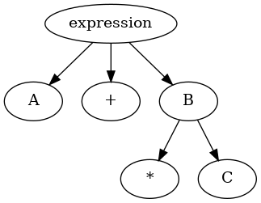

# 3. Hafta

### Sözdizimi Tanımlamanın Genel Problemi

**Tanım:**

- Bir dil, belirli bir alfabeden oluşan karakter dizilerinin kümesidir.
- **Cümle (Sentence):** Bir dildeki karakter dizileri.
- **Sözcükbirim (Lexeme):** Bir dilin en alt düzeydeki sözdizimsel birimi (örneğin, ``, `sum`, `begin`).

**Lexemler:**

- Programlar, karakter dizileri yerine lexeme dizilerinden oluşur.
- Lexemler gruplara ayrılır:
    - **Tanımlayıcılar (Identifiers):** Değişkenlerin, yöntemlerin, sınıfların ve benzerlerinin adlarını içerir.
    - Her lexeme grubu, bir isim veya simge (token) ile temsil edilir.
    - **Simge (Token):** Lexemelerin ne tür bir ifade olduğunu gösterir. Örneğin:
        - Bir tanımlayıcı (identifier) `sum` ve `total` gibi lexemelere sahip olabilir.
        - Aritmetik işlemci sembolü `+`, yalnızca bir lexemeye sahiptir.

### Dillerin Biçimsel Tanımları

**Dil Tanıyıcıları (Recognizers):**

- Bir tanıma aygıtı, alınan karakter dizisinin dile ait olup olmadığını belirler.
- **Uzun ve Etkisiz Süreç:** En kullanışlı dillerin sonsuz olması nedeniyle, bu süreç pratikte uzun ve etkisiz görünebilir.
- Derleyicinin sözdizim analiz kısmı, bu tanıma işlemini gerçekleştirir.

**Dil Üreticileri (Generators):**

- Bir dilin cümlelerini oluşturmak için kullanılan bir aygıttır.
- **Kestirilemezlik:** Üretilen özel cümlenin kestirilememesi nedeniyle, bir üretici dil tanımlayıcısı olarak sınırlı kullanışlılıkta bir araç gibi görünür.
- Belirli bir cümlenin sözdiziminin doğru olup olmadığı, üreticinin yapısıyla karşılaştırılarak anlaşılabilir.

### Tanıyıcı ve Üretici Arasındaki Bağlantı

- Tanıyıcılar ve üreticiler arasında yakın bir bağlantı bulunmaktadır.
- Bu gelişmeler, biçimsel diller ve derleyici tasarım teorisi hakkında daha fazla bilgi edinilmesine yol açmıştır.

### Sonuç

Sözdizimi tanımlama, dillerin yapılarını ve kurallarını anlamak için kritik bir alandır. Lexemler, simgeler ve dil tanıyıcıları ile üreticileri arasındaki etkileşim, yazılım geliştirme ve derleyici tasarımının temelini oluşturur.

---

### Dil Tanıyıcıları (Recognizers) ve Üreticileri (Generators)

**Dil Tanıyıcıları (Recognizers):**

- **Tanım:** Bir dil tanıyıcısı, belirli bir dilde üretilmiş geçerli dizeleri kabul eden bir aygıttır.
- **Makine Olarak Tanım:** Tanıyıcılar makineler olarak düşünülebilir; bu makineler, bir dizeyi girdi olarak alır.
- **Kabul Durumu:** Makineler, çalıştırıldıklarında kabul durumuna ulaşırsa girişi kabul eder. Aksi takdirde, girdi reddedilir.
- **Kabul Durumu Örneği:** Eğer bir makine M, dil L'deki tüm dizeleri tanıyorsa ve belirli bir dize S tarafından sağlanan girişi kabul ediyorsa, M’nin S’yi kabul ettiği söylenir. Aksi durumda, M S’yi reddetmiştir.

**Dil Üreticileri (Generators):**

- **Tanım:** Bir dil üreticisi, bir dilin dizelerini oluşturan bir aygıttır.
- **İşleyiş:** Bir başlangıç sinyali verildiğinde, üretici bir dize oluşturmaya başlar.
- **Dize Yapıcısı:** Üreticiler, dize oluşturma tanımını sağlar.
- **Dil ile İlişki:** Eğer bir üretici, dil L'deki tüm dizeleri oluşturabiliyorsa ve bu üretici tarafından oluşturulan her dize S L'deyse, bu üretici L dilinin bir üreticisi olarak kabul edilir. Eğer bir dize S üreticiden oluşturulamıyorsa, bu dize L'de yer almaz.

### Önemli Noktalar:

- **Örnek Aygıtlar:**
    - **Dil Üreticileri:** Contex Free Grammar (CFG) ve düzenli ifadeler (Regular Expressions) yaygın dil üreticileridir.
    - **Dil Tanıyıcıları:** Sonlu durum otomatları (Finite State Automata, FSA) ve itme-altı otomatlar (Push Down Automata, PDA) yaygın dil tanıyıcılarıdır.
- **Bağlantı:** CFG’ler, PDA'lar tarafından tanınan dillerin aynı sınıfını üretir.

### Sonuç

Dil tanıyıcıları ve üreticileri, biçimsel dillerin analizinde ve işlenmesinde temel bileşenlerdir. Tanıyıcılar, bir dilin geçerli dizelerini kabul ederken, üreticiler bu dizeleri oluşturan mekanizmalardır. Her iki yapı da yazılım geliştirme ve derleyici tasarımında kritik öneme sahiptir.

---

### Dil Tanıyıcıları

Bir programlama dili, belirli bir alfabeyi (örneğin A alfabesi) kullanan karakter dizilerinin bir kümesidir. Eğer bilgisayarın bu dili otomatik olarak anlamasını ve komutları gerçekleştirmesini istiyorsak, bu dilin karakter dizilerini otomatik olarak tanımlayan bir sözdizim mekanizmasına (T) ihtiyacımız vardır. Bu mekanizma, verilen cümlelerin D dili içinde anlamlı olup olmadığını belirleyecektir.

### Karakter Dizileri ve Filtreleme

- **Filtreleme:** Karakter dizilerini kurallara uygun (legal) ve olmayan şekilde ayıran mekanizmalara filtre denir. Dildeki tüm olası ihtimallerin göz önüne alınması, derleyici için zorlayıcı bir uygulama olsa da, sözdizim çözümleyicileri (syntax analyzers) bu tür filtreleme mekanizmalarından oluşur.

---

### Sözdizim Tanımlamanın Biçimsel Yöntemleri

Dilbilgisi (grammar), programlama dillerinin sözdizimini tanımlamak için yaygın olarak kullanılan resmi dil oluşturma mekanizmalarıdır. Aşağıda bu yöntemlerin bazıları ve temel kavramları sıralanmıştır:

- **Backus-Naur Form (BNF):** Programlama dillerinin sözdizimini tanımlamak için kullanılan bir notasyon.
- **Context-Free Grammars (CFG):** Serbest içerik gramerleri, belirli bir dilin yapısını tanımlamak için kullanılır.

### Temel Kavramlar:

- **Tanımlama Listeleri:** Dildeki değişken ve simgelerin listesi.
- **Gramerler ve Türetmeler:** Dildeki cümlelerin nasıl oluşturulduğunu gösterir.
- **Ayrıştırma Ağaçları (Parse Trees):** Bir cümlenin sözdizimini gösteren ağaç yapısı.
- **Belirsizlik:** Gramerlerin birden fazla cümle üretme kapasitesi.
- **Operatör Önceliği:** Farklı operatörlerin öncelik sıralaması.
- **Operatörlerin Birleşmesi:** Operatörlerin nasıl bir araya geldiğini tanımlar.
- **if-then-else için Tam Gramer:** Koşullu ifadeler için tam bir gramer tanımı.

---

### Context-Free Grammars (CFG)

1950'lerin ortalarında Noam Chomsky, dilleri tanımlamak için dört gramer sınıfı önerdi. Bunlardan iki tanesi:

- **Regular Grammars:** Programlama dillerinin simgelerinin oluşumunu tanımlar.
- **Context-Free Grammars:** Tüm programlama dillerinin sözdizimini tanımlar (küçük istisnalar hariç).

Chomsky, doğal dillerin teorik yapısı ile ilgili önemli katkılarda bulunmuştur.

### Örnek Context-Free Grammar:

- **Terminals (son elemanlar):** b, e
- **Nonterminals (üst elemanlar):** S, A
- **Üretim Kuralları:**
    - S→SAS \to SAS→SA
    - S→AS \to AS→A
    - A→bSeA \to bSeA→bSe
    - A→beA \to beA→be
- **Başlangıç Sembolü:** S

### Ayrıştırma Ağaçları ve Türetme

- **Ayrıştırma Ağaçları:** Verilen bir dizenin gramer kurallarına göre nasıl oluşturulduğunu gösterir. Örneğin, dizenin "bbebee" olarak türetilmesi aşağıdaki gibi olabilir:
1. S→AbSeS \to A b S eS→AbSe
2. S→AS \to AS→A
3. A→beA \to b eA→be

Sonuç olarak:

- **Eşleşme Örneği:** Dizelerde b ve e eşleşir.
- **Ayrıştırma Ağacı:** Yapı, karakter dizisinin gramer kurallarına göre nasıl düzenlendiğini gösterir.

---

### Backus-Naur Form'un Doğuşu

Chomsky’nin çalışmalarından kısa bir süre sonra, ACM-GAMM grubu ALGOL 58 programlama dilini tasarlamaya başladı. Bu grubun önde gelen isimlerinden biri olan **John Backus**, bir konferansta ALGOL 58’in sözdizimini belirtmek için yeni bir resmi notasyon tanıttı. Bu yeni gösterim, daha sonra **Peter Naur** tarafından ALGOL 60’ın tanımlanmasında biraz değiştirilerek kullanılmaya başlandı. Revize edilmiş sözdizimi tanımlama yöntemi **Backus-Naur Formu (BNF)** olarak bilinir.

BNF, bilgisayar kullanıcıları tarafından hemen kabul edilmese de, kısa bir süre sonra programlama dili sözdizimini açık bir şekilde tanımlamak için en popüler yöntem haline geldi. BNF, Chomsky’nin **context-free gramer** sınıfı ile neredeyse eşdeğerdir.

### Not:

Bölümün geri kalanında, **context-free grammars** (bağlamdan bağımsız gramerler) terimini yalnızca **gramer** olarak anacağız. Ayrıca, **BNF** ve **gramer** terimleri birbirinin yerine kullanılacaktır.

---

### Esaslar

**Metadil:**

- Bir metadil, başka bir dili tanımlamak için kullanılan bir dildir. BNF, programlama dilleri için bir metadildir.

**Soyutlama:**

- BNF, sözdizimsel yapılar için soyutlamalar kullanır.
    - **Left-Hand Side (LHS):** Sol taraf, genellikle bir kuralın veya üretimin tanımını içerir.
    - **Right-Hand Side (RHS):** Sağ taraf, o kuralın nasıl oluşturulacağını gösterir.
- Tamamen, bu tanımlamalar bir **kural** veya **üretim** olarak adlandırılır.
- Örnek kuralda, **<var>** ve **<expression>** gibi ifadeler açık bir şekilde tanımlanmalıdır, aksi takdirde **<assign>** tanımının yararlı olması mümkün olmayacaktır.

**BNF’deki Soyutlamalar:**

- **Non-terminal semboller:** Kuralların oluşturulmasında kullanılan ve kendi başlarına tam bir anlam ifade etmeyen sembollerdir.
- **Terminal semboller:** Kuralların lexemeleri ve tokenlarıdır. Bunlar, dildeki gerçek karakter veya simgelerdir.
- **BNF açıklaması veya gramer:** Kuralların bir bütünüdür.

### BNF’nin Gücü

BNF basit olmasına rağmen, programlama dillerinin neredeyse tüm sözdizimini tanımlamak için yeterince güçlüdür. Özellikle:

- Benzer yapıların listelerini tanımlayabilir.
- Farklı yapıların görünme sırasını belirtebilir.
- Herhangi bir derinlikte yuvalanmış yapıları tanımlayabilir.
- Operatör önceliğini ve operatör birleşimini ima edebilir.

---

### Tanımlama Listeleri

Matematikte, değişken uzunluktaki listeler genellikle üç nokta kullanılarak (örneğin, 1,2,3,…1, 2, 3, \ldots1,2,3,…) gösterilir. Ancak **Backus-Naur Formu (BNF)** bu tür bir üç nokta sembolü içermez. Bu nedenle, sözdizimsel elemanların listelerini tanımlamak için bir yöntem gereklidir. Bunun için en yaygın kullanılan yöntemlerden biri **tekrarlama** ve  özyineleme (recursion) dır.

- **Tekrarlama:** Bir kuralın sol tarafı (LHS) kendi sağ tarafında (RHS) tekrar görünüyorsa, bu kural tekrarlayıcıdır.

### Gramerler ve Türetmeler

Bir **dilbilgisi (gramer)**, dilleri tanımlamak için bir üretim aracıdır. Bir dilin cümleleri, başlangıç sembolü olarak adlandırılan gramerin özel bir nonterminaliyle başlayan kuralların bir dizi uygulamasıyla üretilir. Bu kural uygulama dizisine **türetme** denir.

- **Başlangıç sembolü:** Tam bir programlama dili için bir dilbilgisinde, başlangıç sembolü tam bir programı temsil eder ve genellikle **<program>** olarak adlandırılır.

Yanda gösterilen basit gramer, türetmeleri göstermek için kullanılır. Bu gramer, sadece bir ifade (statement) türünü, yani **ATAMA** ifadesini temsil eder.

### Basit Gramer Örneği

```
«program» ::= begin «stmt_list» end
«stmt_list» ::= «stmt»
               | «stmt» ; «stmt_list»
«stmt» ::= «var» «expression»
«expression» ::= «var» + «var»
                | «var» - «var»
                | «var»
```

### Açıklamalar:

- **«program»**: Bir programın başlangıç noktasını temsil eder ve **begin** ile **end** arasında bir dizi ifade içerir.
- **«stmt_list»**: Bir ya da daha fazla ifade içeren bir listeyi temsil eder. İfadeler, noktalı virgül ile ayrılır.
- **«stmt»**: Bir değişken ile bir ifadeyi temsil eder.
- **«expression»**: İfadelerdeki değişkenlerin işlemlerini gösterir. Örneğin, toplama (+) veya iki değişkenin yan yana gelmesi durumunu içerir.

Bu gramer, belirli bir programlama dilinin sözdizimini tanımlamak için basit ama etkili bir yöntem sunar. Özellikle, bir dilin ifadelerinin ve yapıların nasıl oluşturulacağını ve birbirleriyle nasıl etkileşime gireceğini belirtmek için kullanılabilir.

---

**Gramerler ve Türetmeler**

- Değiştirilen nonterminal her zaman önceki cümle formunda en soldaki nonterminaldir.
    - Bu değiştirme sırasını kullanan türetmelere **en soldaki (leftmost) türetmeler** denir.
    - **Rightmost** türetmeler de mümkündür, ancak bu durumda nonterminal en sağda bulunur.
    - Türetme sırasının bir dilbilgisi tarafından oluşturulan dil üzerinde etkisi yoktur.
- Türetme formu, hiçbir nonterminal içermeyene kadar devam eder.
    - Oluşturulan cümle, yalnızca terminallerden veya sözlüklerden oluşan bir formdur.
- Türetme işlemi **başlangıç sembolü** ile başlar.
    - Örneğin, `<program>` sembolü ile başlayabilir.
- Her satırda:
    - Nonterminallerden birini, nonterminalin tanımlarından biriyle değiştirerek önceki dizeden türetilir.
- `<program>` dahil olmak üzere, türetmedeki satırların her birine **cümle (sentential) formu** denir.

### Örnek Türetme

Aşağıda basit bir türetme örneği gösterilmektedir:

1. **Başlangıç Sembolü:**
    
    ```php
    <program>
    ```
    
2. **Türetme:**
    
    ```arduino
    <program> ::= begin <stmt_list> end
    ```
    
3. **Devam Eden Türetmeler:**
    
    ```php
    begin <stmt_list> end
    <stmt_list> ::= <stmt>
    <stmt> ::= <var> <expression>
    ```
    
4. **Sonuç:**
    
    ```arduino
    begin var1 + var2 end
    ```
    

Bu şekilde türetmeler aracılığıyla gramer yapısında belirtilen kurallar doğrultusunda cümleler oluşturulabilir.

---

### Gramerler ve Türetmeler

- Tüm seçenek kombinasyonlarını kapsamlı bir şekilde belirleyerek, tam bir dil oluşturulabilir.
    - Bu dil, çoğu diller gibi, **sonsuz** bir dil olacaktır.
    - Bu dildeki tüm cümleler, sonlu zamanda üretilemez.

### Ayrıştırma Ağaçları (Parse Trees)

- Dillerin cümlelerinin hiyerarşik sözdizimsel yapısını tanımlamak için **Ayrıştırma Ağaçları** kullanılır.
- Hiyerarşik yapılar, ayrıştırma ağacında gösterilir.
- Ayrıştırma ağacının:
    - Her iç düğümü, bir **nonterminal** sembol ile etiketlenir.
    - Her yaprak, bir **terminal** sembol ile etiketlenir.
- Bir ayrıştırma ağacının her alt ağacı, cümledeki bir soyutlama örneğini tanımlar.

### Belirsizlik (Ambiguity)

- **Belirsizlik**, bir cümle formu için iki veya daha fazla ayrı ayrıştırma ağacının bulunduğu durumda ortaya çıkar; bu tür bir dilbilgisi **belirsiz** olarak adlandırılır.

### Belirsizliğin Neden Olduğu Sorunlar:

- Derleyiciler genellikle bu yapıların **semaniklerini** sözdizimsel biçimlerine dayanarak belirlerler.
    - Özellikle, derleyici, ayrıştırma ağacını inceleyerek bir ifade için oluşturulacak kodu seçer.
    - Bir dil yapısında birden fazla ayrıştırma ağacı varsa, yapının anlamı **benzersiz** olarak belirlenemez.

### Bir Dilbilgisinin Belirsiz Olup Olmadığının Anlaşılması:

- Matematiksel olarak, herhangi bir dilbilgisinin belirsiz olup olmadığını belirlemek imkânsızdır:
    1. Eğer dilbilgisi bir cümle üretirse ve bu cümle için birden fazla **en soldaki türetme** varsa.
    2. Eğer dilbilgisi bir cümle üretirse ve bu cümle için birden fazla **en sağdaki türetme** varsa.
- Bazı ayrıştırma algoritmaları belirsiz gramerlere dayanabilir.
    - Böyle bir ayrıştırıcı, belirsiz bir yapıyla karşılaştığında, doğru ayrıştırma ağacını oluşturmak için tasarımcı tarafından sağlanan biçimsel olmayan bilgileri kullanır.
- Çoğu durumda, belirsiz bir dilbilgisi, açık bir şekilde yeniden yazılabilir, ancak yine de istenen dili oluşturur.

---

```jsx
<program> -> begin <stmt_list> end
<stmt_list>  -> <stmt>
              | <stmt> ; <stmt_list>
              
<stmt>  -> <var> = <expression>
<var> -> A | B | C
<expression> -> <var> + <var>
              | <var> - <var>
              | <var>
```

### 1. Gramer Tanımı

```
<program> -> begin <stmt_list> end
```

- **<program>**: Bu, dilin başlangıç sembolüdür ve bir programın temel yapısını temsil eder.
- **>**: Bu, "üzerine" veya "şu şekilde tanımlanır" anlamında kullanılır. Yani, soldaki sembolün sağdaki sembollerle değiştirileceğini belirtir.
- **begin** ve **end**: Bu, programın başlangıcını ve sonunu belirtir. Bu anahtar kelimeler arasında yer alan ifadeler programın içeriğini oluşturur.

### 2. İfade Listesi

```
<stmt_list> -> <stmt>
                      | <stmt> ; <stmt_list>
```

- **<stmt_list>**: Programda bir veya daha fazla ifadeyi temsil eder.
- **<stmt>**: Bir ifade (statement) temsil eder.
- **|**: "veya" anlamında kullanılır; yani, bu iki durumdan birisi gerçekleşebilir.
- Bu tanım iki durumu içerir:
    - **Tek bir ifade**: Eğer sadece bir ifade varsa, bu durumda **<stmt>** tek başına yeterlidir.
    - **Birden fazla ifade**: Eğer birden fazla ifade varsa, ilk ifadeden sonra noktalı virgül (;) ile devam eden bir başka **<stmt_list>** ile bir araya gelir. Bu durumda, ifadeler arasında noktalı virgül kullanılarak birden fazla ifade sıralanabilir.

### 3. İfade Tanımı

```
<stmt> -> <var> = <expression>
```

- **<stmt>**: Burada bir ifade, bir değişkenin bir değere atanması şeklinde tanımlanmıştır.
- **<var>**: Bu, bir değişkeni temsil eder (A, B veya C gibi).
- **=**: Atama işlemi; soldaki değişkene sağdaki ifadenin değerini atar.
- **<expression>**: Bu, değişkene atanacak olan matematiksel bir ifadeyi temsil eder.

### 4. Değişken Tanımı

```
<var> -> A | B | C
```

- **<var>**: Bu, değişkenin isimlerini belirtir. Bu dilde yalnızca A, B ve C gibi üç değişken kullanılabilir.

### 5. İfade Türleri

```
<expression> -> <var> + <var>
                      | <var> - <var>
                      | <var>
```

- **<expression>**: Burada üç farklı türde matematiksel ifade tanımlanmıştır:
    - **<var> + <var>**: İki değişkenin toplamını temsil eder.
    - **<var> - <var>**: İki değişkenin farkını temsil eder.
    - **<var>**: Tek başına bir değişken; bu durumda ifade, yalnızca bir değişkenin değerini temsil eder.

### Örnek Kullanım

Bu dilbilgisi ile tanımlanan küçük dilde aşağıdaki gibi programlar yazabilirsiniz:

```
begin
  A = B + C;
  B = A - C;
  C = A;
end
```

### Çalışma Şekli

1. Program **begin** anahtar kelimesi ile başlar ve **end** ile biter.
2. **<stmt_list>** içinde bir veya daha fazla ifade bulunur. Her ifade, bir değişkene atama yapar.
3. İfadeler arasında noktalı virgül ile ayrım yapılır.
4. Her ifade, bir değişkenin değeri ile matematiksel işlemler gerçekleştirebilir.

### Sonuç

Bu dilbilgisi, basit atama işlemlerini ve matematiksel ifadeleri ifade eden bir dizi komut yazmanıza olanak tanır. Bu tür bir gramer, dilin kurallarını belirleyerek derleyiciler veya yorumlayıcılar için önemli bir temel sağlar.

---

### 1. **Dil Tanımı**

- **Amaç**: Bu dil, basit matematiksel ifadeleri ve değişken atamalarını ifade etmek için kullanılmaktadır. Özellikle, bu dilin amacı bir tür hesaplama yapmak veya basit programlar yazmaktır.

### 2. **Özellikler**

- **Değişkenler**: Dilde yalnızca üç değişken (A, B, C) bulunmaktadır. Bu, dilin basitliğini vurgular.
- **İfadeler**: Dilde, değişkenlerin toplama ve çıkarma gibi temel matematiksel işlemlerle birleştirilmesi mümkündür. Bu işlemler, programın mantığını oluşturur.
- **Yapısal Temel**: Programlar, `begin` ve `end` anahtar kelimeleri ile başlar ve biter. Bu yapı, programların organizasyonunu ve akışını belirler.

### 3. **Kullanım Alanları**

- **Eğitim**: Bu tür basit bir dil, dilbilgisi ve temel programlama kavramlarını öğretmek için eğitim amaçlı olarak kullanılabilir. Öğrenciler, dilbilgisi kurallarını ve dilin yapı taşlarını öğrenebilirler.
- **Temel Hesaplama**: Basit matematiksel hesaplamalar yapmak isteyen uygulamalar veya prototipler için kullanılabilir.
- **Araç Geliştirme**: Derleyicilerin veya yorumlayıcıların geliştirilmesi için bir temel olarak kullanılabilir. Bu gramer, daha karmaşık dillerin oluşturulmasında başlangıç noktası olabilir.

### 4. **Örnek Program**

Yukarıda tanımlanan dil kullanılarak aşağıdaki gibi basit bir program yazılabilir:

```
begin
  A = B + C;  // B ve C'nin toplamını A'ya atar
  B = A - C;  // A'dan C'yi çıkarıp B'ye atar
  C = A;      // A'nın değerini C'ye atar
end
```

Bu örnek program, değişkenler arasında matematiksel işlemler gerçekleştiren bir hesaplama yapar.

### Sonuç

Bu gramer, temel bir programlama dilinin nasıl tanımlanabileceğini ve bu dilin nasıl kullanılabileceğini göstermektedir. Özellikle dilbilgisi, programlama dillerinin yapı taşlarını ve kurallarını anlamak için önemlidir.

---

## Peki bununla A+B*C işlemi yapılabilir mi

Hayır, tanımlanan gramerle `A + B * C` ifadesi doğrudan yapılamaz. Tanımlanan dilin gramerine göre, matematiksel ifadeler yalnızca toplama ve çıkarma işlemleri ile sınırlıdır. Dildeki tanım, sadece iki değişken arasında toplama veya çıkarma yapabilmeyi sağlar. Yani, çarpma işlemi bu gramerde tanımlanmış değildir.

### Gramerin İncelenmesi

- **İfadeler**:Yukarıdaki gramer kuralında, `+` ve `` işlemleri ile yalnızca iki değişken (`<var>`) arasında işlem yapılabileceği görülmektedir. Bu durumda `A + B * C` gibi bir ifade geçerli değildir.
    
    ```
    <expression> -> <var> + <var>
                   | <var> - <var>
                   | <var>
    ```
    

### Genişletme Önerisi

Eğer çarpma işlemini de eklemek istiyorsanız, grameri aşağıdaki gibi güncelleyebilirsiniz:

```
<expression> -> <var> + <expression>
              | <var> - <expression>
              | <var> * <expression>
              | <var>
```

### Güncellenmiş Örnek

Bu güncelleme ile `A + B * C` ifadesi aşağıdaki gibi türetilebilir:

1. `<expression>` → `<var> + <expression>`
2. `<expression>` → `A + <expression>`
3. `<expression>` → `<var> * <expression>`
4. `<expression>` → `B * <expression>`
5. `<expression>` → `C`

Sonuç olarak, çarpma işlemi de gramerin bir parçası haline geldiğinde, `A + B * C` ifadesi artık tanımlanmış olur. Bu tür genişletmeler, dilin ifade gücünü artırır.

---

Parse Tree:



---

```jsx
<assign>  ->  <id> = <expr>
<id> -> A | B | C
<expr> -> <id> + <expr>
        | <id> * <expr>
        | ( <expr> )
        | <id>
```

Bu kod parçası, basit atama ifadelerini tanımlayan bir dilbilgisi (grammar) örneğidir. Şimdi adım adım analiz edelim:

### Dilbilgisi Tanımı

1. **Üretim Kuralları**:
    - `<assign> -> <id> = <expr>`:
        - Bu kural, bir atama ifadesinin (`assign`) nasıl oluşturulacağını tanımlar. Burada `<id>` (kimlik veya değişken adı) bir eşittir (`=`) işareti ile bir ifadeye (`<expr>`) atanır.
    - `<id> -> A | B | C`:
        - Bu kural, `<id>`'nin mümkün olan değerlerini tanımlar. Yani bir değişken adı olarak A, B veya C kullanılabilir.
    - `<expr> -> <id> + <expr>`:
        - Bu kural, bir ifade (`expr`) içerisinde bir kimlik ile başka bir ifadeyi toplama işlemi ile birleştirmeyi tanımlar.
    - `<expr> -> <id> * <expr>`:
        - Bu kural, bir ifade içerisinde bir kimliği çarpma işlemi ile başka bir ifadeye eklemeyi tanımlar.
    - `<expr> -> ( <expr> )`:
        - Bu kural, ifadelerin parantezler içinde gruplandırılmasına izin verir. Parantez içindeki ifade başka bir ifade olarak değerlendirilebilir.
    - `<expr> -> <id>`:
        - Bu kural, bir ifade olarak sadece bir kimlik (değişken adı) olabileceğini belirtir.

### Örnek Kullanım

Bu dilbilgisi ile, aşağıdaki gibi basit atama ifadeleri oluşturulabilir:

- `A = B + C`
- `B = A * (C + A)`
- `C = A`

### Ayrıştırma Ağacı (Parse Tree)

`A = B + C` ifadesinin ayrıştırma ağacı aşağıdaki gibi olacaktır:

```php
          <assign>
            /   \
        <id>    <expr>
         |        /   \
         A     <id>   <expr>
                |       |
                B      <id>
                        |
                        C
```

### Açıklama

- **Atama**: `<assign>` kuralı, bir değişken (id) ile bir ifade arasındaki ilişkiyi tanımlar.
- **İfade Yapıları**: `<expr>` kuralı, ifadenin toplama ve çarpma gibi işlemleri nasıl gerçekleştirdiğini belirtir.
- **Kimlikler**: `<id>` kuralı, kullanılan değişken adlarının sınırlarını belirler.

### Kullanım Alanları

Bu dilbilgisi, temel programlama dillerinde atama ifadelerinin analizinde kullanılabilir. Örneğin, bir derleyici veya yorumlayıcı, bu dilbilgisini kullanarak basit matematiksel ifadeleri ve atama işlemlerini anlayabilir ve bunları yürütmek için gerekli olan kodu oluşturabilir.

Sonuç olarak, bu dilbilgisi, basit değişken atama ve aritmetik işlemlerini tanımlamak için uygun bir çerçeve sağlar.

---

İki dilbilgisi arasında bazı temel farklar ve gelişmeler vardır. Şimdi, "A Grammar for a Small Language" ile "A Grammar for Simple Assignment Statements" arasındaki farkları ve gelişmeleri inceleyelim:

### 1. **Yapı ve Kapsam**

- **A Grammar for a Small Language**:
    - **Kapsam**: Bu dilbilgisi, basit bir programın yapısını tanımlar ve yalnızca atama işlemleri ile sınırlı değildir. Yani `begin` ve `end` ifadeleri arasında birden fazla ifade tanımlanabilir.
    - **İfadeler**: İfadeler sadece basit atama işlemleri değil, aynı zamanda daha karmaşık ifadeleri de içerebilir.
- **A Grammar for Simple Assignment Statements**:
    - **Kapsam**: Bu dilbilgisi, sadece basit atama ifadelerini tanımlar. Yani bir değişkenin başka bir değişkene veya ifadeye atanması ile sınırlıdır.
    - **İfadeler**: İfadeler, değişkenlerin toplama (`+`) ve çarpma (``) gibi işlemlerini içerebilir, ancak yalnızca bu işlemlerle sınırlıdır.

### 2. **İfade Tanımlamaları**

- **İfade Yapıları**:
    - **Küçük Dil Bilgisi**:
        - `A` ve `B` gibi kimliklerin atanmasının yanı sıra, ifadeler arasında birden fazla ifade tanımlanmasına olanak tanır (`<stmt_list>`).
        - İfadeler arasında noktalı virgüller ile ayrılmış bir liste oluşturabilir.
    - **Basit Atama Bilgisi**:
        - Sadece bir atama işlemi ve ifade yapısı vardır.
        - İfadeler daha karmaşık hale getirilebilir (örneğin, parantez içi ifadeler), ancak bir başlangıç ve bitiş sembolü yoktur.

### 3. **Yapısal Gelişmeler**

- **Fonksiyonel Gelişme**:
    - **Küçük Dil Bilgisi**: Programın bir bütün olarak yapısını ele alır ve birden fazla ifadeyi destekler. Bu, programın kontrol akışını ve yapısını daha iyi modellemek için önemlidir.
    - **Basit Atama Bilgisi**: Tek bir atama ifadesine odaklanarak, dilbilgisi daha basit bir yapı sunar. Bu, belirli bir işlevselliği hedefler ve belirli bir konunun derinlemesine incelenmesine olanak tanır.

### 4. **Eşitlik ve İşlemler**

- **Küçük Dil Bilgisi**:
    - İfadelerde sadece atama işlemleri değil, aynı zamanda daha karmaşık ifadeler (örneğin `A + B * C`) için daha esnek bir yapı sunar.
- **Basit Atama Bilgisi**:
    - Çarpma ve toplama işlemleri ile birlikte basit değişken atama işlemlerine odaklanır, ancak parantez içindeki ifadeleri destekler.

### Sonuç

Bu iki dilbilgisi arasındaki temel fark, yapı ve kapsam genişliğidir. "A Grammar for a Small Language", bir programın genel yapısını ve kontrol akışını daha geniş bir şekilde ele alırken, "A Grammar for Simple Assignment Statements" daha spesifik bir alan olan atama ifadelerine odaklanır. İlk dilbilgisi, bir programın daha karmaşık yapılarını modellemek için kullanılabilirken, ikincisi daha temel ve belirli bir dilbilgisi türü üzerinde yoğunlaşarak, derleyici veya yorumlayıcıların belirli işlemleri daha kolay anlamasını sağlar.

---