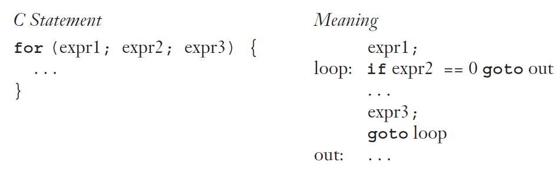
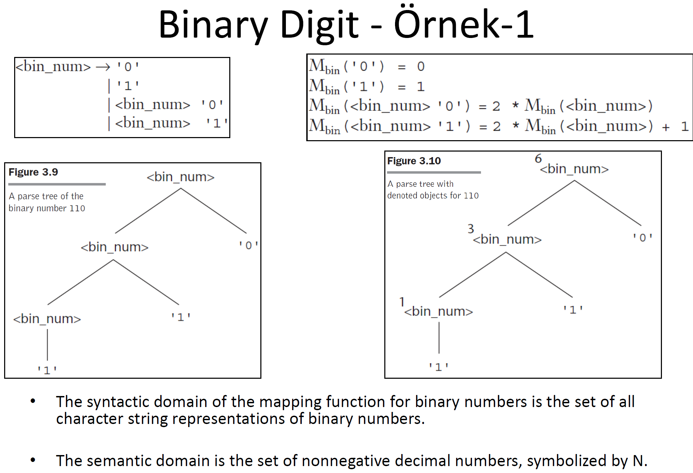

# 7. Hafta

### **Dinamik Semantiklerin Tanımı ve Önemi**

- **Evrensel Bir Yaklaşımın Eksikliği**: Dinamik semantikler için herkes tarafından kabul edilen bir notasyon veya yaklaşım bulunmamaktadır. Bu, farklı topluluklar ve araştırmacılar arasında tutarsızlıklara neden olabilir.
- **Dinamik Semantikleri Tanımlama İhtiyacı**:
    - **Programcılar İçin**: İfadelerin tam olarak ne yaptığını bilmek, programcıların dili etkili ve doğru bir şekilde kullanmalarını sağlar.
    - **Derleyici Yazarları İçin**: Dil yapılarının anlamını kesin olarak bilmek, derleyicilerin doğru ve optimize edilmiş kod üretmelerine yardımcı olur.
    - **Doğrulama ve İspat**: Kesin bir semantiğe sahip olmak, programların test edilmeden önce doğruluğunun ispatlanmasına olanak tanır.
    - **Tutarlılık**: Derleyicilerin, dil tanımında belirtilen davranışı tam olarak sergilemesi için net bir semantik gereklidir.
- **Dil Kılavuzlarının Yetersizliği**: Programlama dillerinin kullanım kılavuzları genellikle kesin ve tam değildir. Bu, dilin semantiğini anlamaya çalışanlar için yetersiz kalır.
- **Anlamsal Özelliklerin Eksikliği**:
    - **Program Doğrulaması**: Tam bir anlamsal tanım olmadan, programların test edilmeden doğru olduğu nadiren ispatlanabilir.
    - **Derleyici Üretimi**: Ticari derleyiciler, dil açıklamalarından otomatik olarak üretilemez. Bu, manuel müdahaleye ve potansiyel hatalara yol açar.

### **Dinamik Semantik Türleri**

1. **İşlemsel Semantik (Operational Semantics)**:
    - Programların anlamını, yürütme adımlarının tanımlanmasıyla ifade eder.
    - Bir programın nasıl çalıştığını adım adım gösterir.
    - **Örnek**: Bir ifadeyi değerlendirirken her bir değişkenin ve işlemin nasıl etkileşime girdiğini gösterir.
2. **Denotasyonel Semantik (Denotational Semantics)**:
    - Programların anlamını matematiksel fonksiyonlar ve yapılar aracılığıyla tanımlar.
    - Her program parçasını bir matematiksel nesneye veya fonksiyona eşler.
    - **Örnek**: Bir ifadenin sonucunu, girdileriyle ilişkili bir fonksiyon olarak ifade eder.
3. **Aksiyomatik Semantik (Axiomatic Semantics)**:
    - Programların anlamını, mantıksal önermeler ve ispatlar yoluyla tanımlar.
    - Programların doğru olup olmadığını belirlemek için ön koşullar ve son koşullar kullanır.
    - **Örnek**: Bir döngünün doğru çalıştığını göstermek için döngü değişmezleri kullanır.

### **Sonuç ve Özet**

Dinamik semantiklerin kesin bir şekilde tanımlanması, programlama dillerinin anlaşılması ve uygulanması için kritiktir. Bu tanımlar:

- **Programcıların** dili etkili ve doğru kullanmalarına yardımcı olur.
- **Derleyici yazarlarının** dilin özelliklerini tam olarak uygulamalarını sağlar.
- **Programların** test edilmeden önce doğruluğunun ispatlanmasına olanak tanır.
- **Derleyicilerin** tutarlı ve beklenen davranışı sergilemesini garanti eder.

Ancak, evrensel bir yaklaşımın olmaması ve dil kılavuzlarının yetersizliği bu süreci zorlaştırmaktadır. Bu nedenle, farklı semantik tanımlama yöntemleri geliştirilmiştir ve her biri farklı amaçlar için kullanılmaktadır.

### **Eklemek İstediklerim**

- **Neden Farklı Semantik Türleri Var?**
    - Her yaklaşımın kendi avantajları ve kullanım alanları vardır. Örneğin, işlemsel semantik eğitim ve öğretim için daha uygundur, çünkü programın adım adım nasıl çalıştığını gösterir. Denotasyonel semantik, dil tasarımı ve teorik çalışmalar için idealdir. Aksiyomatik semantik ise program doğrulama ve güvenlik kritik uygulamalar için kullanılır.
- **Gerçek Dünya Uygulamaları**
    - **Program Doğrulama**: Güvenlik ve emniyetin kritik olduğu alanlarda (örneğin havacılık veya tıp cihazları), programların doğru çalıştığından emin olmak için aksiyomatik semantik kullanılır.
    - **Dil Tasarımı ve Derleyiciler**: Yeni bir programlama dili tasarlarken veya bir derleyici yazarken, denotasyonel ve işlemsel semantik yaklaşımları dilin davranışını netleştirmek için kullanılır.

---

### İşlemsel Semantik (Operational Semantics)

1. **Programın Anlamının Tanımlanması**:
    - **İşlemsel semantik**, bir programın anlamını, programın ifadelerinin bir makine üzerinde, gerçek veya simüle edilmiş, çalıştırılmasıyla tanımlar. Bu yaklaşım, programın ne yaptığını gözlemleyerek, yani programın adımlarını takip ederek anlamını çıkarır.
2. **Makinenin Durumundaki Değişiklik**:
    - Makinenin (bellek, kayıtlar, vb.) durumundaki değişiklikler, bir ifadenin anlamını tanımlar. Örneğin, bir değişkenin değerinin değiştirilmesi veya bir işlemin sonucu olarak kayıtların güncellenmesi gibi.
3. **Yüksek Seviye Diller için Sanal Makine Kullanımı**:
    - Yüksek seviyeli bir dilde işlemsel semantik kullanmak için genellikle bir sanal makine gereklidir. Bu sanal makine, dilin yapı taşlarını daha düşük seviye bir makine diline veya ara dile çevirerek, yüksek seviye dilde yazılmış programların çalıştırılmasını sağlar.
4. **Ara Dil (Intermediate Language)**:
    - İşlemsel semantik sürecinin temel bir parçası olan ara dil, yüksek seviye dilde yazılan programları, sanal makinenin anlayabileceği bir forma dönüştürmek için kullanılır. Bu dil, genellikle daha düşük seviyeli ve daha az karmaşıktır, bu sayede sanal makine tarafından kolaylıkla işlenebilir.
5. **Yaygın Kullanım ve Örnekler**:
    - İşlemsel semantik kavramı, programlama dilleri ders kitaplarında ve dil referans kılavuzlarında sıklıkla kullanılır. Bu kavram, özellikle yeni başlayan programcılara dilin temel yapılarını ve bu yapıların bir makine üzerinde nasıl işlediğini göstermek için değerlidir.
    - **Örnek**: C dilindeki `for` döngüsü, daha basit ifadeler cinsinden açıklanabilir. Bu, `for` döngüsünün işlemsel semantiği kullanılarak, döngünün nasıl çalıştığını ve hangi adımlardan oluştuğunu gösterir.

İşlemsel semantik, programlama dillerinin nasıl çalıştığını anlamak için güçlü ve sezgisel bir yöntem sunar. Programın her adımında makinenin nasıl tepki verdiğini gözlemlemek, programcılara kodun neden ve nasıl belirli sonuçlar ürettiğini anlamalarında yardımcı olur.

---



Resimde gösterilen C dilindeki `for` döngüsü, işlemsel semantiğin bir örneğini gösteriyor. Bu örnek, döngünün nasıl çalıştığını daha basit yapı taşlarına ayırarak açıklıyor. İşte bu işlemin detaylı açıklaması:

### C Dilinde For Döngüsünün İşlemsel Semantiği

C dilindeki bir `for` döngüsü genelde üç bölümden oluşur: başlangıç ifadesi (`expr1`), koşul ifadesi (`expr2`) ve döngü her tekrarlandığında çalıştırılan ifade (`expr3`). Döngünün işleyişini adım adım inceleyelim:

1. **Başlangıç İfadesi (`expr1`)**:
    - Döngü başlamadan hemen önce, bu ifade bir kez değerlendirilir. Örneğin, bir sayaç olan `i`'nin başlangıç değerini ayarlamak için kullanılabilir.
2. **Koşul İfadesi (`expr2`)**:
    - Bu ifade, döngünün devam edip etmeyeceğini kontrol eder. Eğer ifade `0` (yanlış) değerini döndürürse, döngü sona erer.
3. **Döngü İçeriği (`...`)**:
    - Koşul doğruysa (yani, `expr2` sıfır değilse), döngü içerisindeki kod bloğu çalıştırılır.
4. **Sonraki İfade (`expr3`)**:
    - Döngü içeriği çalıştırıldıktan sonra, bu ifade her döngü tekrarından sonra değerlendirilir. Genellikle, sayaç artırma veya azaltma işlemleri için kullanılır.
5. **Döngüye Dönüş**:
    - `expr3` çalıştırıldıktan sonra, işlem `expr2` koşul ifadesine dönerek koşulun tekrar kontrol edilmesini sağlar.
6. **Döngüden Çıkış**:
    - Koşul ifadesi (`expr2`) `0` değerini döndürürse, `goto out` komutu ile döngüden çıkılır ve `out:` etiketiyle işaretlenen koda geçilir.

Bu, `for` döngüsünün işlemsel semantik olarak nasıl modellenebileceğine dair bir örnektir. İşlemsel semantik kullanılarak, programın her adımında makinenin durumu (bellek, kayıtlar, vs.) değişir ve bu değişimler ifadenin anlamını tanımlar. Bu yaklaşım, özellikle sanal makineler ve ara diller kullanılarak yüksek seviye diller için de uygulanabilir. Bu semantikler, programcılara döngülerin ve diğer kontrol yapılarının nasıl çalıştığını anlamada yardımcı olur, bu da hata ayıklama ve optimizasyon süreçlerini kolaylaştırır.

---

### Test Programları ve Operasyonel Anlambilim

- **Test Programları**: Programcılar, belirli bir programlama dili yapısının anlamını belirlemek için küçük test programları yazabilir. Bu programlar, yapının işlevini ve etkisini gözlemlemeye yarar.
- **Operasyonel Anlambilim**: Bu yaklaşım, programın her adımında makinenin durum değişikliklerini göz önünde bulundurarak programın anlamını belirler. Bu, programın nasıl çalıştığını adım adım gözlemlemeyi içerir.

### Operasyonel Anlambilimin Sınırlamaları

- **Makine Dilinin Karmaşıklığı**: Makine dilindeki bireysel adımların ve durum değişikliklerinin çok küçük ve çok fazla olması, bu yaklaşımın eksiksiz resmi anlamsal tanımlamalar için kullanılmasını zorlaştırır.
- **Gerçek Bilgisayarların Karmaşıklığı**: Gerçek bir bilgisayarın hafızası çok büyük ve karmaşık olduğu için, tüm bu detayları modellemek pratik değildir. Ayrıca, farklı seviyelerdeki bellek aygıtları ve ağ bağlantıları gibi faktörler işleri daha da karmaşıklaştırır.
- **Resmi İşlemsel Semantik Kullanımı**: Bu nedenlerden dolayı, gerçek makine dilleri ve bilgisayarlar genellikle resmi işlemsel semantik tanımlamalar için kullanılmaz.

### Uygulama ve Değerlendirme

- **Orta Seviye Diller ve Yorumlayıcılar**: İdeal seviyede çalışan bilgisayarlar için orta seviye diller ve yorumlayıcılar, işlemsel semantikleri daha yönetilebilir ve anlaşılır kılmak adına özel olarak tasarlanmıştır.
- **Değerlendirme**:
    - **Resmi Olmayan Kullanım**: İşlemsel semantikler, dil ek kitabı gibi resmi olmayan kaynaklarda kullanıldığında faydalıdır.
    - **Resmi Kullanım**: Resmi bir şekilde kullanıldığında, işlemsel semantikler oldukça karmaşık hale gelebilir.
    - **Vienna Definition Language (VDL)**: Örneğin, VDL, PL/I dilinin semantiklerini tanımlamak için kullanılmıştır. Ancak bu kadar karmaşık bir tanım, pratikte pek bir işe yaramaz hale gelebilir.

---

### Denotasyonel Semantik (Denotational Semantics) Nedir?

1. **Tanım ve Gelişim**:
    - Denotasyonel semantik, en titiz ve resmi semantik tanımlama yöntemlerinden biri olarak kabul edilir. Bu yaklaşım, programlama dilinin yapılarını matematiksel nesnelerle ilişkilendirerek çalışır.
    - 1970'lerde Dana Scott ve Christopher Strachey tarafından geliştirilmiştir. Bu yaklaşım, özellikle özyinelemeli fonksiyon teorisine dayanır ve dil yapılarının anlamını matematiksel olarak modellemek için kullanılır.
2. **Gösterimsel Tanımlama Süreci**:
    - **Matematiksel Nesne Tanımlama**: Her programlama dili varlığı (değişkenler, ifadeler, fonksiyonlar vb.) için bir matematiksel nesne tanımlanır. Bu nesneler genellikle kümeler, fonksiyonlar veya diğer matematiksel yapılar olabilir.
    - **Haritalama Fonksiyonu**: Daha sonra, dil varlıklarının her bir örneğini bu matematiksel nesnelerin örnekleriyle eşleyen bir fonksiyon tanımlanır. Bu fonksiyon, dil yapılarının matematiksel nesnelerle olan ilişkisini formalize eder.
3. **Anlamın Tanımlanması**:
    - Denotasyonel semantikte, dil yapılarının anlamı yalnızca program değişkenlerinin değerleri ile tanımlanır. Programın çalışma zamanı davranışını adım adım izlemek yerine, her yapı için soyut bir matematiksel ifade oluşturulur.

### İşlemsel Semantik ile İlişkisi

- **İşlemsel ve Gösterimsel Semantik Karşılaştırması**:
    - İşlemsel semantik, programlama dili yapılarını daha basit dil yapılarına çevirerek bunların nasıl çalıştığını modellemeye odaklanır. Temelde, programın nasıl çalıştığını adım adım izler.
    - Gösterimsel semantik ise, adım adım hesaplamaları modellemez. Bunun yerine, programlama dili yapılarını matematiksel nesnelerle eşler ve bu nesnelerin matematiksel tanımları üzerinden programın anlamını tanımlar.

### Denotasyonel Semantiğin Avantajları

1. **Matematiksel Kesinlik**: Bu yaklaşım, programın davranışını matematiksel olarak kesin bir şekilde tanımlar, bu da özellikle teorik analizler ve formal doğrulama için yararlıdır.
2. **Modülerlik**: Programın farklı parçaları bağımsız olarak tanımlanabilir ve birleştirilebilir, bu sayede daha büyük ve karmaşık programların anlamları kolaylıkla inşa edilebilir.
3. **Soyutlama**: Programın davranışını yüksek seviyede soyutlar, böylece dikkat çekici detaylardan uzaklaşılır ve asıl odak noktası programın yapısının genel özelliklerine yöneltilir.

Denotasyonel semantik, özellikle matematiksel ve teorik temelli bir anlayış gerektiren durumlarda, programlama dillerinin anlamını derinlemesine anlamamıza olanak tanır.

---



Bu örnekte, **binary sayıların** (ikili sayıların) hem sentaktik (yapısal) hem de semantik (anlamsal) tarafları ele alınmış.

1. **Sentaktik Alan (Syntactic Domain)**:
    - Sentaktik alan, ikili sayıların karakter dizisi temsillerinden oluşur. Örneğin: `"0"`, `"1"`, `"10"`, `"110"`, vb.
    - Bu karakter dizileri, `<bin_num>` adı verilen bir gramer ile tanımlanır. Gramer:Bu gramer, her ikili sayının nasıl yapılandırıldığını tanımlar.
        
        ```rust
        <bin_num> -> '0'
                  | '1'
                  | <bin_num> '0'
                  | <bin_num> '1'
        ```
        
2. **Semantik Alan (Semantic Domain)**:
    - Semantik alan, pozitif olmayan ondalık (decimal) sayılardan oluşur. Örneğin: `{0, 1, 2, 3, ...}`. Bu, ikili bir sayının anlamının ondalık bir sayıya dönüştürülmesiyle ilgili olduğu anlamına gelir.

### Görselin Detaylı Açıklaması

### 1. **Gramerin Yapısı (Parse Tree - Figure 3.9)**:

- Soldaki ağaç, `"110"` sayısının gramer tarafından nasıl üretildiğini gösteriyor.
- Örneğin:Bu ağaç yapısı, `"110"` ikili sayısını `<bin_num>` üzerinden inşa ediyor. Her dal bir üretim kuralını temsil ediyor.
    
    ```rust
    <bin_num> -> <bin_num> '1' -> <bin_num> '0' -> '1'
    ```
    

### 2. **Anlamsal Tanımlama (Semantic Tree - Figure 3.10)**:

- Sağdaki ağaç, `"110"` ikili sayısının **denotasyonel semantik** aracılığıyla anlamını (decimal karşılığını) nasıl hesapladığını gösteriyor.
- Burada:
    - `"1"` → Decimal değeri `1`
    - `"10"` → `2 * 1 = 2`
    - `"110"` → `2 * 3 + 0 = 6`

### 3. **Anlam Haritalama Fonksiyonu**:

- Görselin sağ üst köşesindeki formüller, `M_bin` adı verilen bir anlam fonksiyonunu tanımlar. Bu fonksiyon, ikili sayıların semantik (decimal) anlamını hesaplar:
    - `M_bin('0') = 0`
    - `M_bin('1') = 1`
    - `M_bin(<bin_num> '0') = 2 * M_bin(<bin_num>)`
    - `M_bin(<bin_num> '1') = 2 * M_bin(<bin_num>) + 1`
- Bu fonksiyon, her gramer kuralına karşılık gelen bir matematiksel işlem tanımlar.

### Denotasyonel Semantik ile İlişkisi

Bu örnek, **denotasyonel semantiğin** temel özelliklerini somutlaştırır:

1. **Matematiksel Nesneler**:
    - Sentaktik alan (karakter dizileri) ve semantik alan (ondalık sayılar) açıkça tanımlanmıştır.
    - Matematiksel nesneler (örneğin, kümeler ve fonksiyonlar) bu iki alanı birbirine bağlar.
2. **Haritalama Fonksiyonu**:
    - `M_bin` fonksiyonu, sentaktik ifadeleri (ikili sayılar) semantik nesnelere (ondalık sayılar) dönüştürür. Bu, denotasyonel semantiğin temel amacını gerçekleştirir.
3. **Soyutlama**:
    - Denotasyonel semantik, adım adım işlem yapmaz (işlemsel semantik gibi). Bunun yerine, doğrudan bir ikili sayıdan anlamını (decimal değerini) matematiksel olarak tanımlar.

### Örnek Üzerinde Çalışma

Eğer `"101"` ikili sayısını ele alacak olursak:

1. Parse Tree:
    
    ```rust
    <bin_num> -> <bin_num> '1' -> <bin_num> '0' -> '1'
    ```
    
2. Anlam Hesabı:
    - `"1"` → `1`
    - `"10"` → `2 * 1 = 2`
    - `"101"` → `2 * 2 + 1 = 5`

### Sonuç

Bu örnek, denotasyonel semantik kullanılarak bir programlama dili yapısının (ikili sayıların) anlamının nasıl tanımlandığını gösteriyor. Matematiksel bir fonksiyon ile sentaktik bir ifadeyi anlamına eşler. Bu tür bir yaklaşım, dilin soyut tanımını yapmak ve dil yapılarının doğruluğunu analiz etmek için oldukça güçlüdür.

---


Bu örnek, **ondalık sayılar** için denotasyonel semantik yaklaşımını açıklıyor. Bu bağlamda, ondalık sayılar karakter dizileri olarak tanımlanıyor ve bu karakter dizileri matematiksel değerlerine (ondalık anlamlarına) eşleniyor.

### **Örnek 2'nin Detaylı Açıklaması**

### 1. **Sentaktik Alan (Syntactic Domain)**

- **Gramer Kuralı**:
    
    ```rust
    <dec_num> -> '0' | '1' | '2' | '3' | '4' | '5' | '6' | '7' | '8' | '9'
              | <dec_num> ('0' | '1' | '2' | '3' | '4' | '5' | '6' | '7' | '8' | '9')
    ```
    
    - İlk satır, tek basamaklı ondalık sayıları (karakter dizilerini) tanımlar. Örneğin, `'0'`, `'1'`, ... `'9'`.
    - İkinci satır, birden fazla basamaktan oluşan ondalık sayıları tanımlar. Örneğin, `"10"`, `"25"`, `"123"`.

### 2. **Semantik Alan (Semantic Domain)**

- Semantik alan, ondalık sayıların pozitif olmayan matematiksel karşılıklarını içerir: `{0, 1, 2, ...}`.
- Bu anlamlar, verilen karakter dizilerinin gerçek matematiksel değerlerini temsil eder.

### 3. **Anlam Haritalama Fonksiyonu (M_dec)**

- Haritalama fonksiyonu `M_dec`, her sentaktik ifade için bir anlam tanımlar. Bu fonksiyonun tanımları şu şekilde verilmiştir:
    - `M_dec('0') = 0`
    - `M_dec('1') = 1`
    - ...
    - `M_dec('9') = 9`

### 4. **Birden Fazla Basamaklı Sayılar için Haritalama**

- Birden fazla basamaklı sayılar için, haritalama fonksiyonu şu kurallarla genişletilir:
    - `M_dec(<dec_num> '0') = 10 * M_dec(<dec_num>)`
    - `M_dec(<dec_num> '1') = 10 * M_dec(<dec_num>) + 1`
    - ...
    - `M_dec(<dec_num> '9') = 10 * M_dec(<dec_num>) + 9`
- Bu, bir sayı dizisinin anlamını hesaplarken her yeni basamağın (karakterin) katkısını, önceki basamakların anlamıyla çarparak ve toplama ekleyerek açıklar.

---

### **Bir Örnek Üzerinde Hesaplama**

### `M_dec('123')` Nasıl Hesaplanır?

1. **Gramer Genişlemesi**:
    
    ```rust
    <dec_num> -> <dec_num> '3'
               -> <dec_num> '2'
               -> '1'
    ```
    
2. **Matematiksel Hesaplama**:
    - `M_dec('1') = 1` (en küçük birim)
    - `M_dec('12') = 10 * M_dec('1') + 2 = 10 * 1 + 2 = 12`
    - `M_dec('123') = 10 * M_dec('12') + 3 = 10 * 12 + 3 = 123`

Bu şekilde, `"123"` karakter dizisinin matematiksel anlamı `123` olarak hesaplanır.

---

### **Denotasyonel Semantik ile İlişkisi**

1. **Matematiksel Nesneler**:
    - Sentaktik alan, ondalık sayıların karakter dizilerini ifade eder.
    - Semantik alan, bu dizilerin ondalık matematiksel değerleridir.
2. **Anlam Haritalama Fonksiyonu**:
    - `M_dec` fonksiyonu, sentaktik ifadeleri (karakter dizileri) semantik anlamlara (ondalık değerlere) dönüştürür.
3. **Soyutlama ve Kesinlik**:
    - Denotasyonel semantik, ondalık sayıların anlamını soyut bir şekilde tanımlar ve matematiksel olarak kesin bir model sunar.
    - Adım adım işlem yerine, birden fazla basamaklı sayılar için doğrudan bir matematiksel ifade (örneğin, `10 * ...`) oluşturulur.

---

### **Sonuç**

Bu örnek, **denotasyonel semantik** kullanılarak karakter dizilerinin (örneğin `"123"`) anlamlarının nasıl matematiksel değerlere dönüştürüldüğünü gösteriyor. Matematiksel fonksiyonlarla bu dönüşüm net bir şekilde tanımlanır. Bu tür bir yaklaşım, programlama dillerindeki dil yapılarını anlamlandırmak ve bu yapıların davranışını modellemek için güçlü bir araçtır.

---

### **1. Denotasyonel Semantik – Program State (Program Durumu)**

Bir programın **durumu**, o anki değişkenlerin değerleriyle ifade edilir. Durum, değişken adları ve bu adlara karşılık gelen değerlerden oluşan bir küme olarak modellenir.

### Örnek:

Bir programda şu an:

- Değişken `x = 5`
- Değişken `y = 10`
- Değişken `z = -3` olsun.

Bu durumda programın durumu şu şekilde ifade edilir:

```makefile
s = {<x, 5>, <y, 10>, <z, -3>}
```

### **VARMAP Fonksiyonu**:

`VARMAP`, bir **değişken ismini** (`ij`) ve mevcut **durumu** (`s`) alır ve bu değişkenin o durumdaki değerini döndürür.

Örneğin:

- Eğer `VARMAP(x, s)` sorulursa, bu `x` değişkeninin durum `s` içindeki değerini verir.
    
    ```scss
    VARMAP(x, s) = 5
    ```
    
- Benzer şekilde, `VARMAP(y, s)` için:
    
    ```scss
    VARMAP(y, s) = 10
    ```
    

Bu fonksiyon, bir değişkenin bir program durumu içinde sahip olduğu değeri sorgulamak için matematiksel bir araçtır.

---

### **2. Denotasyonel Semantik – Expressions (İfadeler)**

İfadeler, bir programın değişkenleri ve matematiksel işlemlerle hesaplanabilecek kısımlarıdır. Bu bölümde basit ifadelerin tanımlanması ele alınmış.

### İfadelerin Tanımları:

- **İşleçler (Operators)**:
    - Sadece toplama (`+`) ve çarpma (``) operatörleri kullanılabilir.
- **Operandlar**:
    - İfadeler yalnızca **skaler tamsayı değişkenlerinden** (örneğin `x`, `y`) veya **tamsayı sabitlerden** (örneğin `5`, `10`) oluşur.
- **Basitlik**:
    - Her ifade yalnızca bir operatör içerebilir.
    - Parantezler yoktur. (Bu, işlemlerin soldan sağa sırayla değerlendirileceği anlamına gelir.)
- **Sonuç**:
    - Bir ifadenin sonucu her zaman bir tamsayıdır.

### Örnekler:

1. Eğer ifade `x + 5` ise:
    - `x` değişkeni program durumunda `VARMAP(x, s)` ile sorgulanır.
    - Örneğin, `s = {<x, 3>}` durumunda:
        
        ```
        x + 5 = 3 + 5 = 8
        ```
        
2. Eğer ifade `y * 2` ise:
    - `y` değişkeninin değeri durumdan alınır.
    - Örneğin, `s = {<y, 4>}` durumunda:
        
        ```
        y * 2 = 4 * 2 = 8
        ```
        

---

### **Program State ve Expressions İlişkisi**

- Program **durumu**, değişkenlerin mevcut değerlerini içerir.
- Bu durum, **ifadelerin değerlendirilmesinde** kritik rol oynar. Çünkü ifadeler, değişkenlerin o anki değerlerine dayanır.

### Adım Adım İşleyiş:

1. İlk olarak, programın durumu tanımlanır (değişkenler ve değerleri belirlenir).
2. Bir ifade, bu durumdaki değişken değerlerini alarak hesaplanır.
3. Sonuç olarak, ifade bir tamsayı değeri döndürür.

---

### **Özet**

1. **Program State (Durum)**:
    - Bir programın durumunu, değişken isimleri ile değerlerinin oluşturduğu bir küme olarak ifade ederiz.
    - `VARMAP` fonksiyonu, bir değişkenin o durumdaki değerini bulmamızı sağlar.
2. **Expressions (İfadeler)**:
    - Basit toplama ve çarpma işlemleriyle, değişkenler ve sabitlerden oluşan ifadeleri değerlendiririz.
    - İfadeler, yalnızca bir işlem içerir ve sonucu bir tamsayıdır.

---

[](https://files.oaiusercontent.com/file-xWwRvchZzo1hx3YrB7uGvAXb?se=2024-11-20T21%3A15%3A53Z&sp=r&sv=2024-08-04&sr=b&rscc=max-age%3D299%2C%20immutable%2C%20private&rscd=attachment%3B%20filename%3Dimage.png&sig=lSQxX%2BkQlSRhxVVKeO9IMgvrYgGWE%2BqwmowVCdXFe6s%3D)

Bu gramer tanımı, ifadelerin (expressions) nasıl yapılandırıldığını ve farklı bileşenlerinin nasıl bir araya geldiğini gösteriyor.

---

### **Gramer Kurallarının Açıklaması**

### 1. **<expr> (Expression - İfade)**

- Bir `<expr>` (ifade) şu şekillerde tanımlanabilir:
    - `<dec_num>`: Ondalık bir sayı (örneğin, `5`, `10`, `42`).
    - `<var>`: Bir değişken (örneğin, `x`, `y`, `z`).
    - `<binary_expr>`: İki ifade arasında bir işlem (örneğin, `x + 5` veya `10 * y`).

---

### 2. **<binary_expr> (Binary Expression - İkili İfade)**

- Bir `<binary_expr>` şu şekilde tanımlanır:
    - `<left_expr> <operator> <right_expr>`
- Bu, bir sol operand (`<left_expr>`), bir işlem operatörü (`<operator>`), ve bir sağ operanddan (`<right_expr>`) oluşur.

**Örnekler**:

- `x + 5` (Sol operand: `x`, Operatör: `+`, Sağ operand: `5`)
- `10 * y` (Sol operand: `10`, Operatör: ``, Sağ operand: `y`)

---

### 3. **<left_expr> ve <right_expr> (Operandlar)**

- Hem sol operand (`<left_expr>`) hem de sağ operand (`<right_expr>`) şu şekillerde tanımlanır:
    - `<dec_num>`: Ondalık bir sayı olabilir.
    - `<var>`: Bir değişken olabilir.

**Örnekler**:

- Sol operand: `x`, Sağ operand: `5` (ifade: `x + 5`)
- Sol operand: `10`, Sağ operand: `y` (ifade: `10 * y`)

---

### 4. **<operator> (Operatör)**

- Operatörler şunlardır:
    - `+`: Toplama işlemi.
    - ``: Çarpma işlemi.

**Örnekler**:

- `+` (toplama): `x + 5`
- `` (çarpma): `10 * y`

---

### **Genel Örneklerle Açıklama**

### Örnek 1: `x + 5`

1. `<expr>` → `<binary_expr>`
2. `<binary_expr>` → `<left_expr> <operator> <right_expr>`
3. `<left_expr>` → `<var>` → `x`
4. `<right_expr>` → `<dec_num>` → `5`
5. `<operator>` → `+`

Bu ifade, `x` değişkeni ve `5` sabiti arasında bir toplama işlemini temsil eder.

### Örnek 2: `10 * y`

1. `<expr>` → `<binary_expr>`
2. `<binary_expr>` → `<left_expr> <operator> <right_expr>`
3. `<left_expr>` → `<dec_num>` → `10`
4. `<right_expr>` → `<var>` → `y`
5. `<operator>` → ``

Bu ifade, `10` sabiti ile `y` değişkeni arasında bir çarpma işlemini temsil eder.

---

### **Gramerin Kullanımı ve Denotasyonel Semantik ile İlişkisi**

1. **Gramerin Tanımladığı Yapı**:
    - Bu gramer, ifadelerin sentaktik (yapısal) tarafını tanımlar. Yani, bir ifade hangi bileşenlerden oluşabilir ve bu bileşenler nasıl bir araya gelir, bunu açıklar.
2. **Denotasyonel Semantik ile İlişki**:
    - Gramer tarafından tanımlanan bu yapılar, denotasyonel semantik yardımıyla anlamlandırılır. Örneğin:
        - `x + 5` ifadesinin anlamı, program durumundaki `x` değişkeninin değerini alıp buna `5` eklenerek hesaplanır.
        - `10 * y` ifadesinin anlamı, program durumundaki `y` değişkeninin değerini alıp `10` ile çarpılarak hesaplanır.
3. **Anlam Haritalama Fonksiyonu**:
    - `M_expr` adlı bir haritalama fonksiyonu, bu ifadelerin anlamını (değerlerini) tanımlar. Örneğin:
        
        ```scss
        M_expr(x + 5, s) = VARMAP(x, s) + 5
        M_expr(10 * y, s) = 10 * VARMAP(y, s)
        ```
        
    - Burada `s`, programın durumunu (değişkenlerin değerlerini) temsil eder.

---

### **Sonuç**

Bu gramer, ifadelerin nasıl yapılandırıldığını açıklarken, denotasyonel semantik bu yapıların anlamlarını tanımlar. İfadeler, programın durumuna bağlı olarak değerlendirilir ve bu yapı, programlama dillerinin temel özelliklerini anlamamızı sağlar.

---


### **1. M_e (<expr>, s) Fonksiyonu Nedir?**

`M_e` fonksiyonu, ifadelerin (`<expr>`) anlamını programın durumuna (`s`) göre tanımlar. Programdaki bir ifade, bir **ondalık sayı** (`<dec_num>`), bir **değişken** (`<var>`) veya bir **binary ifade** (`<binary_expr>`) olabilir.

Bu fonksiyon, verilen ifadenin durumdan aldığı değerini (ya da sonucunu) döndürür. Eğer ifade hatalıysa, örneğin tanımsız bir değişken varsa, bu durum da işlenir ve bir hata (`error`) döndürülür.

---

### **2. İfade Türlerine Göre Anlamlandırma**

### a. **<dec_num> (Ondalık Sayılar)**:

- Bir `<dec_num>` doğrudan `M_dec` fonksiyonuyla değerlendirilir. Bu, önceki örnekte verdiğimiz `M_dec` fonksiyonudur:
    
    ```scss
    M_dec('5') = 5
    M_dec('10') = 10
    ```
    
- Yani, `M_e` fonksiyonu bir sayıyı değerlendirdiğinde, bu sayıyı aynen döndürür.

### b. **<var> (Değişkenler)**:

- Eğer ifade bir değişkense (`<var>`), şu süreç izlenir:
    - `VARMAP(<var>, s)` ile değişkenin durumdaki (state `s`) değeri sorgulanır.
    - Eğer değişkenin değeri tanımsız (`undef`) ise:Bu, hatalı bir durum olduğunu belirtir.
        
        ```go
        then error
        ```
        
    - Eğer tanımlıysa:Değişkenin değeri döndürülür.
        
        ```csharp
        else VARMAP(<var>, s)
        ```
        

### Örnek:

- Varsayılan durum: `s = {<x, 5>, <y, 10>}`
    - `M_e(x, s)` = `VARMAP(x, s)` = `5`
    - `M_e(z, s)` = `VARMAP(z, s)` = `undef`, bu nedenle `error`

### c. **<binary_expr> (Binary İfadeler)**:

- Binary bir ifade bir işlem (`+` veya ``) içeren ifadeleri ifade eder.
- `M_e` fonksiyonu şu şekilde işler:
    1. **Hata Kontrolü**:
        - Sol (`<left_expr>`) ve sağ (`<right_expr>`) operandlar değerlendirilir.
        - Eğer bunlardan biri `undef` ise, bu bir hata (`error`) olarak döndürülür.
    2. **İşlem Türüne Göre Hesaplama**:
        - Eğer operatör `+` ise:
            
            ```scss
            M_e(<left_expr>, s) + M_e(<right_expr>, s)
            ```
            
        - Eğer operatör `` ise:
            
            ```scss
            M_e(<left_expr>, s) * M_e(<right_expr>, s)
            ```
            

### Örnek:

- Durum: `s = {<x, 2>, <y, 3>}`
    - İfade: `x + y`
        
        ```scss
        M_e(x + y, s) = M_e(x, s) + M_e(y, s) = 2 + 3 = 5
        ```
        
    - İfade: `z * y`
        
        ```scss
        M_e(z * y, s) = error (çünkü z tanımsız)
        ```
        

---

### **3. Hata Yönetimi**

- Bu tanımda dikkate alınan **tek hata**, bir değişkenin **tanımsız** (`undef`) olmasıdır.
- Eğer bir değişken duruma göre tanımsızsa, `error` döndürülür.
- Diğer hatalar (örneğin, aritmetik taşma gibi) bu tanımda değerlendirilmez; çünkü bunlar genellikle **makineye bağımlı** hatalardır.

### **Semantik Alan (Semantic Domain):**

- Semantik alan şu şekilde genişletilmiştir:
    
    ```go
    Z ∪ {error}
    ```
    
    - Burada `Z`, tüm tamsayıları temsil eder (örneğin, `{..., -1, 0, 1, ...}`).
    - `{error}`, hata durumunu temsil eder.

---

### **4. Sonuç Olarak**

### Adım Adım Süreç:

1. **Eğer ifade bir sayıysa**:
    - Doğrudan sayının değeri döndürülür.
2. **Eğer ifade bir değişkense**:
    - Durumda kontrol edilir.
    - Eğer tanımsızsa `error`, tanımlıysa değişkenin değeri döndürülür.
3. **Eğer ifade bir binary ifadeyse**:
    - Sol ve sağ operandlar değerlendirilir.
    - Eğer bir operand tanımsızsa `error`.
    - Değilse, operatöre (`+` veya ``) göre hesaplama yapılır.

Bu tanım, ifadelerin **denotasyonel semantik** ile nasıl modellenebileceğini ve hataların nasıl ele alındığını net bir şekilde açıklar.

---


### **Denotasyonel Semantik - Atama İfadeleri**

Bir **atama ifadesi**, şu işlemleri gerçekleştirir:

1. **Bir ifadenin değerlendirilmesi**:
    - Sağ taraftaki ifade (`E`) değerlendirilir. Bu, denotasyonel semantiğin `M_e` fonksiyonu tarafından yapılır.
    - Eğer ifade bir hata (`error`) döndürürse, atama işlemi gerçekleştirilemez ve hata döner.
2. **Hedef değişkenin güncellenmesi**:
    - Eğer hata yoksa, ifade (`E`) değerlendirilerek sonucunda bir değer bulunur ve bu değer hedef değişkenin (`x`) yeni değeri olarak atanır.

### **Atama İfadesi Anlamlandırma Fonksiyonu: MaM_aMa​**

Fonksiyonun tanımı şu şekildedir:

```vbnet
M_a (x = E, s) = if M_e (E, s) == error
                   then error
                 else s'
```

- Burada:
    - `x`: Atama yapılan hedef değişken.
    - `E`: Sağ taraftaki ifade.
    - `s`: Mevcut program durumu (state).
    - `s'`: Yeni program durumu, `x` değişkeninin yeni değerini içerir.

---

### **Adım Adım Süreç**

1. **İfadenin Değerlendirilmesi**:
    - İlk olarak, `M_e(E, s)` çağrılır ve ifade değerlendirilir.
    - Eğer hata (`error`) dönerse, `M_a` da hata döndürür.
    - Örneğin:
        - `x = y + 5`, eğer `y` tanımsızsa (`VARMAP(y, s) = undef`), `M_e(E, s)` bir hata döndürür ve atama işlemi gerçekleşmez.
2. **Yeni Durumun Oluşturulması**:
    - Eğer hata yoksa, yeni bir durum (`s'`) oluşturulur. Bu durumda:
        - Tüm mevcut değişkenler (`ij`) korunur.
        - Ancak, `x` değişkeninin değeri (`vj`) sağ taraftaki ifadenin (`E`) sonucu olarak güncellenir:
            
            ```scss
            vj' = M_e(E, s)
            ```
            
        - Diğer değişkenlerin (`ij ≠ x`) değerleri eski durumdaki değerleriyle aynı kalır:
            
            ```scss
            vj' = VARMAP(ij, s)
            ```
            
3. **Değişkenlerin Kontrolü**:
    - `ij == x` kontrolü **isimlerin** karşılaştırılmasıdır, değerlerin değil. Yani, `x` değişkeninin adı yeni değeri atamak için kullanılır.

---

### **Örnek**

### Durum:

- Mevcut durum: `s = {<x, 2>, <y, 3>}`
- İfade: `x = y + 5`

### Süreç:

1. `M_e(E, s)` hesaplanır:
    - `E = y + 5`
    - `M_e(E, s) = VARMAP(y, s) + 5 = 3 + 5 = 8`
2. Yeni durum (`s'`) oluşturulur:
    - `x` değişkeni `8` olarak güncellenir.
    - Diğer değişkenler aynı kalır.
    
    ```vbnet
    s' = {<x, 8>, <y, 3>}
    ```
    

### Sonuç:

- Yeni durum: `s' = {<x, 8>, <y, 3>}`.

---

### **Denotasyonel Semantik - Değerlendirme**

Denotasyonel semantiğin güçlü ve zayıf yönleri şu şekilde açıklanabilir:

### **Güçlü Yönler**:

1. **Program Doğrulama**:
    - Denotasyonel semantik, programların doğruluğunu matematiksel olarak kanıtlamaya olanak tanır. Örneğin, belirli bir girdiye karşılık bir çıktının garantilenmesi.
2. **Dil Tasarımı**:
    - Yeni bir programlama dili tasarlarken, dil yapılarını matematiksel olarak tanımlamak için kullanılabilir.
3. **Derleyici Üretimi**:
    - Bu semantik, derleyici üretim sistemlerinde, dilin resmi tanımını sağlam temellere oturtmak için kullanılmıştır.
4. **Titiz ve Kesin Yaklaşım**:
    - Denotasyonel semantik, programlama dillerini anlamak ve açıklamak için çok titiz bir yol sağlar. Matematiksel kesinlik, kavramların yanlış anlaşılmasını önler.

### **Zayıf Yönler**:

1. **Karmaşıklık**:
    - Denotasyonel semantik, oldukça soyut ve matematiksel bir yaklaşımdır. Bu nedenle, dil kullanıcıları (örneğin programcılar) için pratikte çok az kullanışlıdır.
    - Genellikle dil tasarımcıları, teorisyenler ve derleyici geliştiricileri tarafından kullanılır.
2. **Makineye Bağımlı Olmama**:
    - Çoğu hata (örneğin, taşma, bellek sınırları) makineye bağımlıdır ve bu semantik tarafından ele alınmaz.

---

### **Sonuç**

Bu örnek, atama ifadelerinin **denotasyonel semantik** ile nasıl anlamlandırıldığını gösteriyor:

- İfade (sağ taraf) önce değerlendirilir.
- Hedef değişkenin değeri bu sonuca göre güncellenir.
- Yeni bir program durumu (`s'`) oluşturulur.

Denotasyonel semantik, dilin matematiksel kesinliğini sağlamak ve dilin temelini tanımlamak için güçlü bir araçtır. Ancak karmaşıklığı, günlük programlama pratiği için sınırlı bir fayda sağlar.

---

### **Aksiyomatik Semantik (Axiomatic Semantics)**

Aksiyomatik semantik, programların doğruluğunu **mantıksal bir çerçevede** kanıtlamak için kullanılan biçimsel bir yöntemdir. Temeli, **mantık (predicate calculus)** ve program durumlarının ilişkilerini matematiksel olarak tanımlamaya dayanır. Bu yöntem, bir programın doğruluğunu formalize etmek ve garantilemek için önkoşul ve sonkoşul tanımları kullanır.

---

### **1. Aksiyomatik Semantiğin Temel Kavramları**

### **a. İddialar (Assertions)**

- **Mantık ifadeleri** programın belirli noktalarındaki durumunu ifade eder.
- İddialar iki türdedir:
    1. **Önkoşul (Precondition)**:
        - Programın bir ifadesinden önce doğru olması gereken durumları belirtir.
        - Örneğin: `{x > 0}` ifadesi, bir ifadenin çalıştırılmadan önce `x` değişkeninin `0`'dan büyük olması gerektiğini belirtir.
    2. **Sonkoşul (Postcondition)**:
        - Programın bir ifadesinden sonra doğru olması gereken durumları ifade eder.
        - Örneğin: `{y = x + 1}` ifadesi, bir ifadenin yürütülmesinden sonra `y` değişkeninin `x` değişkeninin bir fazlasına eşit olduğunu belirtir.

---

### **b. En Zayıf Önkoşul (Weakest Precondition)**

- En zayıf önkoşul, bir sonkoşulu (postcondition) garanti etmek için gereken **minimum gereksinimlerdir**.
- Örneğin:
    - İfade: `a = b + 1 {a > 1}`
    - Sonkoşul: `{a > 1}`. Bu, ifadenin yürütülmesinden sonra `a`'nın `1`'den büyük olması gerektiğini belirtir.
    - En zayıf önkoşul (weakest precondition): `{b > 0}`. Bu, ifadenin sonkoşulu garanti etmesi için `b`'nin başlangıçta `0`'dan büyük olması gerektiğini gösterir.

---

### **2. Mantıksal Form: {P} statement {Q}**

Bu mantıksal form, bir program ifadesinin önkoşulu ve sonkoşulunu şu şekilde ifade eder:

- **{P}**: Önkoşul (Precondition). İfade çalıştırılmadan önce doğru olan koşullar.
- **statement**: Programın bir ifadesi.
- **{Q}**: Sonkoşul (Postcondition). İfade çalıştırıldıktan sonra doğru olan koşullar.

---

### **3. Örnekler**

### **Örnek 1:**

```css
a = b + 1 {a > 1}
```

- **Sonkoşul (Postcondition)**: `{a > 1}`. Bu, `a`'nın `1`'den büyük olması gerektiğini belirtir.
- **Olası bir önkoşul**: `{b > 10}`. Eğer `b > 10` ise, `a = b + 1` ifadesinden sonra `a > 1` kesinlikle doğrudur.
- **En zayıf önkoşul (Weakest Precondition)**:Bu, `b`'nin başlangıçta sadece `0`'dan büyük olmasının yeterli olduğunu gösterir.
    
    ```css
    {b > 0}
    ```
    

---

### **Örnek 2:**

```bash
sum = 2 * x + 1 {sum > 1}
```

- **Sonkoşul (Postcondition)**: `{sum > 1}`. Bu, `sum` değişkeninin `1`'den büyük olması gerektiğini belirtir.
- **En zayıf önkoşul (Weakest Precondition)**:
    - `sum = 2 * x + 1` ifadesinden sonra `sum > 1` olması için:Bu ifadeden:bulunur.
        
        ```
        2 * x + 1 > 1
        ```
        
        ```
        x > 0
        ```
        
    - En zayıf önkoşul: `{x > 0}`.

---

### **4. Aksiyomatik Semantik - Değerlendirme**

### **Avantajlar:**

1. **Program Doğruluğu**:
    - Aksiyomatik semantik, bir programın belirli koşullar altında doğru çalışacağını formal olarak kanıtlamak için güçlü bir araçtır.
    - Örneğin, kritik sistemlerde (havacılık yazılımları gibi) bu yaklaşım kullanılabilir.
2. **Titiz Bir Analiz Yolu**:
    - Programların doğruluğunu ve mantığını anlamak için matematiksel ve sistematik bir çerçeve sunar.
3. **Dil Tasarımı ve Derleyiciler**:
    - Programlama dillerinin tasarımında veya derleyicilerin geliştirilmesinde kullanılabilir.

### **Dezavantajlar:**

1. **Karmaşıklık**:
    - Mantıksal ifadeler ve önkoşul/sonkoşul hesaplamaları genellikle oldukça karmaşıktır. Bu nedenle, programcılar için günlük kullanımda pek pratik değildir.
2. **Tüm Hataları Kapsamama**:
    - Aksiyomatik semantik, yalnızca mantıksal doğrulama sağlar. Çoğu zaman makineye bağımlı hataları (örneğin, bellek taşmaları veya zamanlama hataları) ele almaz.

---

### **Sonuç**

- Aksiyomatik semantik, program doğrulama ve güvenli program yazımı için çok güçlü bir araçtır.
- **En zayıf önkoşul** gibi kavramlar, bir programın belirli son koşulları sağlaması için minimum gereklilikleri belirler.
- Bu yöntem, özellikle dil tasarımı, derleyiciler ve güvenlik kritik sistemlerde kullanılırken, karmaşıklığı nedeniyle günlük programlama uygulamalarında sınırlı kullanıma sahiptir.

---

### **Aksiyomatik Semantik ve Çıkarım Kuralları**

Aksiyomatik semantik, **programların doğruluğunu matematiksel olarak kanıtlamak** için kullanılan bir yaklaşımdır. Bu yöntemde, bir programın başından sonuna kadar doğruluğu garanti etmek yerine, **son koşuldan (postcondition)** başlayarak geriye doğru çalışılır. Programın tüm ifadelerinin **mantıksal doğruluğu**, belirli kurallara göre analiz edilir.

---

### **1. Tüm Program İçin Son Koşul (Postcondition)**

- Bir programın **son koşulu**, programın çalışmasının ardından elde edilmesi beklenen nihai durumdur.
- Aksiyomatik semantik yaklaşımında:
    - **Son koşul** belirlenir.
    - Programın **son ifadesinden başlayarak ilk ifadeye doğru geriye doğru çalışılır**.
    - Her adımda, ifadenin ön koşulu hesaplanır.

### **Doğruluk Kontrolü**

- Eğer programın **ilk ifadesine ait ön koşul**, programın belirtilen başlangıç durumu (specification) ile aynıysa, program **doğru** kabul edilir.

---

### **2. Çıkarım Kuralları (Inference Rules)**

- Çıkarım kuralları, **bir iddianın doğruluğunu** diğer iddialardan hareketle kanıtlamak için kullanılır.
- Bir çıkarım kuralının genel formu şu şekildedir:
    
    ```markdown
    S1, S2, ..., Sn
    ---------------
          S
    ```
    
    - **S1, S2, ..., Sn**: **Öncüller (antecedents)**, doğru olduğu bilinen ifadeler.
    - **S**: **Sonuç (consequent)**, öncüllere dayanarak doğru olduğu çıkarılan ifade.

### **Anlamı**:

- Eğer **öncüller (S1, S2, ..., Sn)** doğruysa, **sonucun (S)** da doğru olduğu kabul edilir.

---

### **3. Aksiyomlar (Axioms)**

- **Aksiyomlar**, doğru olduğu **varsayılan** mantıksal ifadelerdir.
- Bir aksiyom, çıkarım kurallarının özel bir türüdür:
    - **Öncüle (antecedent)** sahip değildir.
    - **Sonuç (consequent)** doğrudan doğru kabul edilir.

### Örnek:

- **x = x** ifadesi bir aksiyomdur. Bu ifade doğrudan doğru kabul edilir ve doğruluğunu kanıtlamak için başka bir iddiaya gerek yoktur.

---

### **4. Aksiyomatik Semantiğin Çalışma Yöntemi**

### Adım Adım Süreç:

1. **Son Koşulu Belirleyin**:
    - Programın sonunda doğru olması gereken durumu (son koşul) tanımlayın.
    - Örneğin, `z = x + y` işlemi için `{z > 10}` gibi bir son koşul olabilir.
2. **Son Koşuldan Geriye Doğru Çalışın**:
    - Programın ifadelerini geriye doğru analiz ederek her adımda ön koşulları çıkarın.
    - Örneğin, `z = x + y {z > 10}` ifadesi için ön koşul `{x + y > 10}` olur.
3. **Başlangıç Durumunu Karşılaştırın**:
    - İlk ifadenin ön koşulunu programın belirtilen başlangıç durumu (specification) ile karşılaştırın.
    - Eğer eşleşiyorsa, program doğru kabul edilir.

---

### **5. Örneklerle Açıklama**

### **Örnek 1:**

```css
Program:
x = y + 1
{ x > 2 }

Son Koşul: { x > 2 }
```

1. **Son Koşuldan Geriye Çalışma**:
    - İfade: `x = y + 1`
    - Son koşul: `{x > 2}`
    - Ön koşul: `{y + 1 > 2}`
        
        ```
        y > 1
        ```
        
    - En zayıf ön koşul: `{y > 1}`.
2. **Sonuç**:
    - Eğer başlangıçta `{y > 1}` ön koşulu sağlanıyorsa, programın doğruluğu garanti edilir.

---

### **Örnek 2:**

```bash
Program:
sum = 2 * x + 1
{sum > 5}

Son Koşul: {sum > 5}
```

1. **Son Koşuldan Geriye Çalışma**:
    - İfade: `sum = 2 * x + 1`
    - Son koşul: `{sum > 5}`
    - Ön koşul: `{2 * x + 1 > 5}`
        
        ```
        2 * x > 4
        x > 2
        ```
        
    - En zayıf ön koşul: `{x > 2}`.
2. **Sonuç**:
    - Eğer başlangıçta `{x > 2}` ön koşulu sağlanıyorsa, programın doğruluğu garanti edilir.

---

### **6. Aksiyomatik Semantiğin Güçlü ve Zayıf Yönleri**

### **Güçlü Yönler**:

1. **Program Doğruluğunu Kanıtlar**:
    - Bir programın mantıksal olarak doğru çalışacağını matematiksel bir temele dayandırır.
    - Özellikle güvenlik ve kritik sistemlerde faydalıdır.
2. **Titiz ve Sistematik Yaklaşım**:
    - Mantıksal bir çerçeve sağlar ve program analizi için disiplinli bir yol sunar.
3. **Modüler Analiz**:
    - Programın her ifadesi bağımsız olarak analiz edilebilir.

### **Zayıf Yönler**:

1. **Karmaşıklık**:
    - Geriye doğru çalışmak ve en zayıf ön koşulları hesaplamak, büyük programlar için oldukça karmaşık hale gelebilir.
2. **Makineye Bağımlı Olmama**:
    - Makineye bağımlı hataları (örneğin, bellek taşmaları) ele almaz.

---

### **Sonuç**

Aksiyomatik semantik, bir programın doğruluğunu kanıtlamak için güçlü bir araçtır. **Son koşullardan geriye doğru çalışarak** programın başlangıç durumunu çıkarır. Bu süreçte:

- **Çıkarım kuralları**, iddialar arasında mantıksal bağlar kurar.
- **Aksiyomlar**, doğru olduğu varsayılan temel mantıksal ifadeler olarak kullanılır.

---

### **Aksiyomatik Programların İspatlanması - Örneklerle Açıklama**

Bu örnekler, aksiyomatik semantiği kullanarak programların doğruluğunu nasıl kanıtlayabileceğimizi gösteriyor. Şimdi her bir örneği adım adım inceleyelim.

---

### **Örnek 1:**

```css
a = b / 2 - 1  {a < 10}
```

- **Son Koşul (Postcondition)**: `{a < 10}`
- **İfadenin Analizi**:
    - `a = b / 2 - 1` ifadesinden, `a` son durumdaki değeridir. Son koşuldan `a` yerine `b` ile bir ön koşul çıkarılır.
    - `{b / 2 - 1 < 10}`
    - Buradan `b / 2 < 11` ve son olarak:
        
        ```css
        b < 22
        ```
        
    - **En Zayıf Ön Koşul (Weakest Precondition)**: `{b < 22}`. Bu, son koşulu garanti etmek için `b` değişkeninin başlangıçta `22`'den küçük olması gerektiğini gösterir.

---

### **Örnek 2:**

```makefile
x = 2 * y - 3  {x > 25}
```

- **Son Koşul (Postcondition)**: `{x > 25}`
- **İfadenin Analizi**:
    - `x = 2 * y - 3` ifadesinden son koşul:
        
        ```
        2 * y - 3 > 25
        ```
        
    - Bunu çözerek:
        
        ```
        2 * y > 28
        y > 14
        ```
        
    - **En Zayıf Ön Koşul**: `{y > 14}`. Bu, `y`'nin başlangıçta `14`'ten büyük olmasını gerektirir.

---

### **Örnek 3:**

```makefile
x = x + y - 3  {x > 10}
```

- **Son Koşul (Postcondition)**: `{x > 10}`
- **İfadenin Analizi**:
    - `x = x + y - 3` ifadesinden son koşul:
        
        ```
        x + y - 3 > 10
        ```
        
    - Bunu çözerek:
        
        ```
        x + y > 13
        y > 13 - x
        ```
        
    - **En Zayıf Ön Koşul**: `{y > 13 - x}`. Bu, `y`'nin `13 - x`'ten büyük olmasını gerektirir.

---

### **Örnek 4:**

```
{x > 3}  x = x - 3  {x > 0}
```

- **Ön Koşul (Precondition)**: `{x > 3}`
- **Son Koşul (Postcondition)**: `{x > 0}`
- **Doğrulama**:
    - `x = x - 3` ifadesine uygulandığında:
        
        ```
        x > 0, o halde x başlangıçta > 3 olmak zorunda.
        ```
        
    - Verilen ön koşul `{x > 3}`, son koşulu garanti ettiği için bu ifade mantıksal olarak doğrudur.

---

### **Rule of Consequence (Sonuç Kuralı)**

```
{x > 5}  x = x - 3  {x > 0}
```

- **Analiz**:
    - Eğer `{x > 5}` ön koşulu sağlanıyorsa, bu ön koşul `{x > 3}` olan orijinal ön koşulu da sağlar.
    - Bu nedenle, `{x > 5}` daha kısıtlayıcı bir ön koşul olsa da, mantıksal olarak doğru kabul edilir.

### **Sonuç Kuralı Mantığı:**

- **Form**:
    
    ```css
    {P} S {Q}
    P' => P ve Q => Q'
    --------------------
    {P'} S {Q'}
    ```
    
- Eğer:
    - Daha güçlü bir ön koşul (`P'`) orijinal ön koşulu (`P`) garanti ediyorsa.
    - Orijinal son koşul (`Q`) da daha zayıf bir son koşulu (`Q'`) garanti ediyorsa.
    - Program (`S`) hem `{P'} S {Q'}` hem de `{P} S {Q}` için doğrudur.

---

### **Genel Değerlendirme**

1. **En Zayıf Ön Koşul (Weakest Precondition)**:
    - Son koşuldan başlayarak ifadeyi analiz edip minimum gereksinimi belirleriz.
2. **Rule of Consequence (Sonuç Kuralı)**:
    - Daha güçlü ön koşullar ve daha zayıf son koşullarla programın doğruluğunu ispatlamak için kullanılır.
3. **Doğrulama Süreci**:
    - Programın son koşulu belirlenir.
    - Programın başına doğru geriye çalışılarak en zayıf ön koşul çıkarılır.
    - Eğer başlangıç durumu bu ön koşulu karşılıyorsa, program doğru kabul edilir.

---

### **Aksiyomatik Semantik – Değerlendirme**

Aksiyomatik semantik, programların doğruluğunu formal olarak kanıtlamak ve mantıksal analiz yapmak için güçlü bir çerçeve sunar. Ancak, hem avantajları hem de sınırlamaları vardır. Şimdi bu yöntemin değerlendirilmesini ele alalım:

---

### **1. Aksiyomatik Semantiğin Güçlü Yönleri**

### **a. Doğruluk Kanıtları İçin Güçlü Bir Araç**

- Aksiyomatik semantik, programların mantıksal doğruluğunu kanıtlamak için matematiksel bir temel sağlar.
- Özellikle **güvenlik kritik yazılımlar** (örneğin, havacılık, sağlık sistemleri gibi) için, programların her zaman doğru çalıştığını kanıtlamak gereklidir. Bu bağlamda aksiyomatik semantik çok faydalıdır.

### **b. Programlar Üzerinde Mantıksal Muhakeme**

- Programın **ön koşulları**, **son koşulları** ve **zayıf ön koşulları** üzerinde mantıksal çıkarımlar yapmak için mükemmel bir çerçeve sunar.
- Örneğin:
    - Eğer bir değişkenin belirli bir koşulu sağlamak zorunda olduğu biliniyorsa, bu bilgi tüm program boyunca takip edilebilir ve yanlış durumlar önlenebilir.

### **c. Matematiksel ve Titiz Yaklaşım**

- Denotasyonel ve işlemsel semantiğin aksine, aksiyomatik semantik **mantıksal bir çerçeve** sunar.
- Her dil yapısı için mantıksal aksiyomlar ve çıkarım kuralları tanımlanır. Bu, özellikle program doğrulama için büyük bir avantajdır.

---

### **2. Aksiyomatik Semantiğin Zayıf Yönleri**

### **a. Aksiyom ve Çıkarım Kuralları Geliştirmenin Zorluğu**

- Bir dildeki tüm ifadeler ve yapılar için aksiyomlar veya çıkarım kuralları geliştirmek oldukça karmaşıktır.
- Özellikle modern programlama dillerindeki zengin yapılar (örneğin, paralellik, hata yönetimi, dinamik bellek gibi) için aksiyomlar oluşturmak büyük bir zorluk teşkil eder.

### **b. Pratik Kullanım Alanının Sınırlılığı**

- **Dil kullanıcıları** (yani, sıradan programcılar) ve **derleyici yazarları** için aksiyomatik semantik doğrudan bir fayda sağlamaz. Çünkü:
    - Çoğu programcı, aksiyomatik semantiğin gerektirdiği matematiksel temellere ihtiyaç duymaz.
    - Derleyiciler, aksiyomlardan çok işlemsel semantik gibi daha pratik modelleri kullanır.

### **c. Anlam Açıklamada Sınırlı Kullanım**

- Bir dilin anlamını açıklamak için aksiyomatik semantik çok soyut bir yaklaşımdır.
- Denotasyonel veya işlemsel semantik, bir dilin çalışma prensiplerini açıklamak için daha pratiktir.

### **d. Karmaşıklık**

- Aksiyomatik semantik, büyük programlar ve karmaşık sistemler için oldukça karmaşık hale gelir.
- Her ifade ve durumun mantıksal analizini yapmak, gerçek dünya uygulamaları için genellikle maliyetlidir.

---

### **3. Değerlendirme**

### **Avantajları:**

1. **Program Doğrulama**:
    - Matematiksel olarak doğruluğu kanıtlanmış sistemler geliştirmek için idealdir.
    - Özellikle güvenlik kritik uygulamalarda yaygın olarak kullanılır.
2. **Titiz Bir Analiz Çerçevesi**:
    - Programların mantıksal olarak nasıl çalıştığını anlamak ve analiz etmek için titiz bir çerçeve sunar.
3. **Teorik Temel**:
    - Aksiyomatik semantik, programlama dilleri teorisi ve dil tasarımı için sağlam bir matematiksel temel sağlar.

### **Dezavantajları:**

1. **Geliştirme Zorluğu**:
    - Her dil yapısı için aksiyom ve çıkarım kuralları geliştirmek çok zordur.
2. **Pratik Olmayan Kullanım**:
    - Dil kullanıcıları (programcılar) ve derleyici yazarları için doğrudan bir faydası yoktur.
3. **Soyut ve Karmaşık**:
    - Aksiyomatik semantik, günlük programlama uygulamaları için fazla soyut ve karmaşıktır.

---

### **4. Sonuç**

Aksiyomatik semantik, program doğrulama ve formal analiz için güçlü bir araçtır, ancak günlük programlama ve derleyici geliştirme süreçlerinde pratik değildir. Bunun yerine, daha soyut matematiksel kanıtların ve formal doğrulamanın gerekli olduğu alanlarda kullanılır.

---