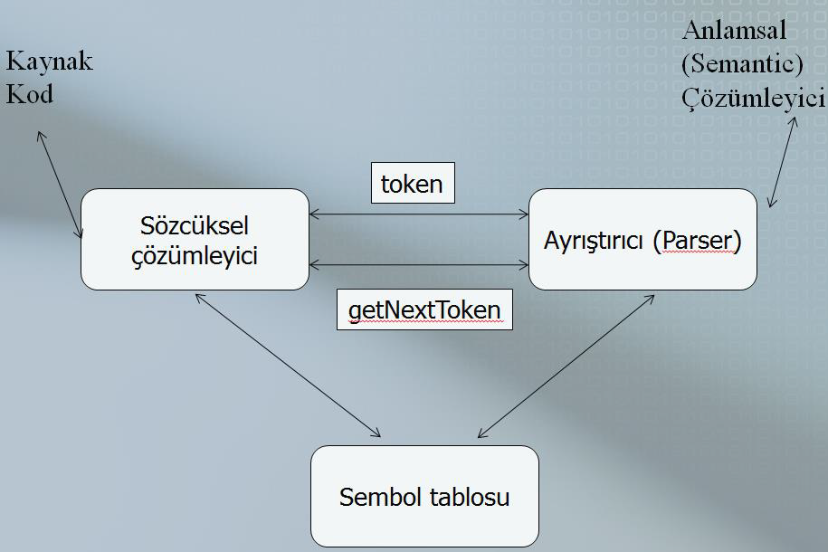

# 8. Hafta

### **Sözcüksel ve Sözdizim Çözümleyicilerinin Anlatılma Nedenleri**

1. **Sözdizim çözümleyicilerin temelinde dilbilgisi (gramer) bulunur:**
    - Sözdizim çözümleyiciler, bir programın dilbilgisi kurallarına uygunluğunu kontrol eder. Bu yüzden sözdizim çözümleme, dilbilgisi kurallarının pratikte nasıl uygulandığını anlamak açısından önemlidir.
2. **Çeşitli kullanım alanları:**
    - **Program listeleme formatlayıcıları:** Programın yapısını daha okunaklı bir formata dönüştürür.
    - **Program karmaşıklığı hesaplama:** Programın ne kadar karmaşık olduğunu analiz eden araçlar için kullanılır.
    - **Konfigürasyon dosyası analizi:** Bir sistemin çalışması için gerekli yapılandırma dosyalarını analiz ederek doğru çalışmasını sağlar.

---

### **Programlama Dillerinin Uygulanma Yaklaşımları**

Farklı programlama dilleri farklı uygulama yöntemleri kullanır. Bu yöntemlerin avantajları ve kullanım durumları:

1. **Derleme (Compilation):**
    - **Tanım:** Kaynak kod makine diline çevrilir.
    - **Örnek Kullanım:** C++ ve COBOL gibi büyük, performans odaklı uygulamalarda tercih edilir.
    - **Avantaj:** Kodun çalıştırma süresi çok hızlıdır, çünkü makine dilinde çalışır.
2. **Saf Yorumlama (Pure Interpretation):**
    - **Tanım:** Programlar hiçbir çeviri işlemine uğramadan, yorumlayıcı tarafından satır satır çalıştırılır.
    - **Örnek Kullanım:** JavaScript gibi küçük ve yürütme verimliliği gerektirmeyen diller.
    - **Avantaj:** Anında çalıştırılabilir; çeviri gerekmez.
3. **Hibrit Sistemler (Hybrid Systems):**
    - **Tanım:** Kaynak kod ara bir forma çevrilir ve bu form yorumlayıcı tarafından çalıştırılır.
    - **Örnek Kullanım:** Python gibi script dillerinde yaygındır.
    - **Dezavantaj:** Derlenmiş koddan daha yavaş çalışır.
4. **Just-in-Time (JIT) Derleme:**
    - **Tanım:** Ara kod (örneğin, Java Bytecode), çalışma zamanında makine diline çevrilir.
    - **Örnek Kullanım:** Java ve Microsoft .Net sistemleri.
    - **Avantaj:** Daha yüksek performans; kod yalnızca gerektiği zaman çevrilir.

---

### **Biçimsel Olmayan Bir Dil Yerine BNF Kullanmanın Avantajları**

**BNF (Backus-Naur Form):** Programlama dillerinin sözdizimini biçimsel olarak tanımlamak için kullanılan bir yöntemdir. Avantajları:

1. **Net ve kısa bir sözdizim tanımı sağlar:**
    - Dil kurallarını açık bir şekilde belirtir.
2. **Sözdizim çözümleyiciler BNF’ye dayanabilir:**
    - Bu sayede sözdizim analizinin temeli kolayca oluşturulabilir.
3. **Bakımı kolaydır:**
    - Dil kuralları veya gramerde bir değişiklik yapılması gerektiğinde, bu sistem kolayca güncellenebilir.

---

### **Dil İşleyicisinin Sözdizim Analiz Bölümü**

Bir dil işleyicisinin sözdizim analizi genellikle iki kısımdan oluşur:

1. **Düşük Seviyeli Bölüm: Sözcüksel Çözümleyici (Lexical Analyzer):**
    - Matematiksel olarak bir **sonlu otomat** (finite automaton) üzerinde çalışır.
    - Örnek: İsimler ve sayısal sabitler (numeric literals).
2. **Yüksek Seviyeli Bölüm: Sözdizim Çözümleyici (Syntax Analyzer veya Parser):**
    - Matematiksel olarak bir **yığın otomat** (push-down automaton) üzerinde çalışır.
    - Örnek: İfadeler, komutlar ve program birimleri.

---

### **Sözcüksel Analizin Sözdizim Analizinden Ayrılma Nedenleri**

1. **Basitlik:**
    - Sözcüksel çözümleyiciler, düşük seviyeli (örneğin karakter dizileri) detaylarla ilgilenir, bu nedenle daha basittir.
    - Sözdizim çözümleyicilerin karmaşıklığını azaltır çünkü sözcüksel çözümleyici tüm düşük seviyeli detayları işleyip yalnızca anlamlı birimler (token'lar) sağlar.
2. **Verimlilik:**
    - Derleme süresinin büyük bir kısmı sözcüksel çözümleme aşamasında harcanır.
    - Sözcüksel ve sözdizim çözümleme süreçlerinin ayrılması, her birini optimize etmeyi daha kolay hale getirir. Örneğin, sadece sözcüksel çözümleyici hızlandırılabilir.
3. **Taşınabilirlik:**
    - Sözcüksel çözümleyiciler, dosya okuma ve karakter giriş-çıkış işlemleriyle ilgilendiğinden platform bağımlı olabilir.
    - Sözdizim çözümleyiciler ise genellikle platformdan bağımsızdır. Bu ayrım, derleyicilerin farklı sistemlere taşınmasını kolaylaştırır.

---

### **Programlama Dillerinde Sözdizimin Tokenlar ile Belirlenmesi**

1. **Token ve Terminal Birimler:**
    - Sözdizim, token adı verilen birimlerle tanımlanır. Örneğin:
        - **Anahtar kelimeler:** `if`, `while`, `return` gibi.
        - **Semboller:** `>`, `<`, `=` gibi operatörler.
        - **Değişken isimleri (identifier):** Kullanıcı tarafından tanımlanan isimler.
2. **Metinsel Sözdizim ve Gramer:**
    - Yazılan programın metni, dilin gramerine uygun bir token dizisi haline getirilir.
    - Örneğin, iki karakterden oluşan `<=` sembolü, tek bir token olarak tanımlanır.
3. **Anahtar Kelimeler:**
    - Anahtar kelimeler, dil tarafından özel anlamlarla tanımlanır.
    - Bunlar, değişken isimleri gibi başka amaçlarla kullanılamaz. Örneğin, `while` anahtar kelimesi bir döngüyü başlatır ve değişken adı olamaz.
4. **Semboller:**
    - Programlama dillerindeki semboller (örneğin `+`, ``, `!`) anlamlı birimler olarak tanımlanır ve token’lara dönüştürülür.

---

### **Lexeme ve Token Kavramları**

1. **Lexeme Nedir?**
    - En küçük sözdizimsel birimlerdir. Örneğin, bir değişken adı `ortalama` veya bir operatör `+` birer lexeme’dir.
2. **Token Nedir?**
    - Lexeme’lerin gruplandırılarak kategorilere ayrılması sonucu oluşur. Örneğin:
        - `ortalama` lexeme’i bir `IDENT` (identifier) token’ı olabilir.
        - `+` lexeme’i bir `PLUS` token’ı olabilir.
3. **Lexeme ve Token Örnekleri:**
    - Bir **tanımlayıcı (identifier):** `ortalama` ve `kök` lexeme’leri bu token kategorisine girer.
    - **Çıkarma operatörü:** `` yalnızca bir lexeme’den oluşan bir token’dır.
4. **Boşluk ve Yeni Satır Karakterleri:**
    - Boşluk, ara veya yeni satır karakterleri programın anlamını değiştirmez. Bu karakterler, token’lar arasında görmezden gelinir.

---

### **Bu Kavramların Önemi**

- **Neden Lexeme ve Token Ayrımı?**
    - Programlar, insanlar için yazılan karakter dizileridir. Ancak, bir derleyici veya yorumlayıcı bu diziyi anlamlandırabilmek için daha düzenli bir yapı (token) oluşturmalıdır.
    - Lexeme ve token ayrımı, programların derlenmesi veya çalıştırılması sırasında hem verimlilik hem de basitlik sağlar.
- **Sözcüksel ve Sözdizim Çözümlemenin Ayrılması Neden Gerekli?**
    - Her biri farklı bir işlevi yerine getirir:
        - Sözcüksel çözümleme: Metni token'lara ayırır.
        - Sözdizim çözümleme: Bu token’ların dilin kurallarına uygun olup olmadığını kontrol eder.

---

### **Sözcüksel Çözümleyici Nedir?**

1. **Tanım:**
    - Sözcüksel çözümleyici (Lexical Analyzer), bir programın kaynak kodundaki karakter dizilerini analiz ederek anlamlı alt birimlere (lexeme) ayırır ve bunları kategorilere (token) dönüştürür.
2. **Görevleri:**
    - **Örüntü Eşleştirme (Pattern Matching):**
        - Karakter dizilerini analiz ederek, dilin kurallarına uygun lexeme’leri bulur.
        - Örneğin, `sum` bir lexeme’dir ve bu lexeme `IDENT` (identifier) kategorisine atanır.
    - **Token Üretimi:**
        - Bulunan lexeme’leri token’lara dönüştürür. Örneğin:
            - Lexeme: `oldsum` → Token: `IDENT`
            - Lexeme: `/` → Token: `DIV OP`
            - Lexeme: `100` → Token: `INT LIT`
3. **Hataları Tespit Etme:**
    - Sözcüksel çözümleyici, yanlış formatlanmış ifadeleri (örneğin, bozuk kayan nokta değişmezlerini) tespit eder ve kullanıcıyı bilgilendirir.
4. **Kullanıcı Tanımlı İsimler ve Sembol Tablosu:**
    - Kullanıcı tanımlı değişken isimleri, sembol tablosuna eklenir.
    - Bu tablo, derleme süreci boyunca güncellenir ve kullanılır.

---

### **Lexeme ve Token Örnekleri**

Bir ifadeyi analiz ederek lexeme ve token ayrımını anlamak için şu örneği inceleyelim:

### **Kod Örneği:**

```c
result = oldsum - value / 100;
```

**Lexeme ve Token Ayrımı:**

| **Lexeme** | **Token** |
| --- | --- |
| `result` | `IDENT` |
| `=` | `ASSIGN OP` |
| `oldsum` | `IDENT` |
| `-` | `SUB OP` |
| `value` | `IDENT` |
| `/` | `DIV OP` |
| `100` | `INT LIT` |
| `;` | `SEMICOLON` |

Bu ayrım, programın parçalarını daha küçük ve anlamlı birimlere böler. Sözcüksel çözümleme süreci bu yapıyı oluşturur.

---

### **Sözcüksel Çözümleyicinin Tarihsel Gelişimi**

1. **Eski Yöntemler:**
    - Sözcüksel çözümleyiciler, bir programın tümünü analiz eder ve tüm lexeme’leri ve karşılık gelen token’ları bir seferde oluştururdu.
2. **Günümüzde:**
    - Sözcüksel çözümleyiciler daha dinamik çalışır:
        - Girdi olarak verilen program kodundan bir lexeme çıkarır ve ilgili token’ı üretir.
        - Sözdizim çözümleyicisi (parser) her seferinde yalnızca bir token görür ve işlem bu şekilde devam eder.
    - Bu yöntem daha modüler ve verimlidir.

---

### **Sembol Tablosu (Symbol Table)**

Sembol tablosu, sözcüksel çözümleyicinin ve derleyicinin kritik bir parçasıdır.

1. **Tanım:**
    - Sembol tablosu, programdaki **tanımlayıcılar** (değişken, fonksiyon adı vb.) hakkında bilgi tutan bir yapıdır.
    - Her tanımlayıcı için bir eleman oluşturulur.
2. **Nasıl Kullanılır?**
    - **Tanımlayıcıların İlk Kez Görülmesi:**
        - Tanımlayıcı ilk kez görüldüğünde, sembol tablosuna bir giriş eklenir.
    - **Daha Sonraki Kullanımlar:**
        - Aynı tanımlayıcı tekrar kullanıldığında, sembol tablosundaki mevcut girişe referans verilir.
3. **Sembol Tablosunun Sonuçları:**
    - Programdaki tüm token’lar ve her token’ın özellikleri (örneğin, türü veya değeri) sembol tablosunda tutulur.

### **Örnek Sembol Tablosu:**

Bir ifade üzerinden sembol tablosunun nasıl kullanıldığını anlamak için şu örneği ele alalım:

```c
Ortalama = toplam / 10;
```

**Sembol Tablosu:**

| **Lexeme** | **Token** | **Bilgi** |
| --- | --- | --- |
| `Ortalama` | `IDENT` | Tanımlayıcı (variable) |
| `toplam` | `IDENT` | Tanımlayıcı (variable) |
| `/` | `DIV OP` | Bölme operatörü |
| `10` | `INT LIT` | Tamsayı sabiti (literal) |

Bu tablo, derleme sürecinde ve program çalıştırıldığında kullanılır.

---

### **Özet**

- Sözcüksel çözümleyici, programın karakter dizilerini anlamlı birimlere ayırır ve bunları token’lara dönüştürür.
- Sembol tablosu, tanımlayıcılar ve token’larla ilgili bilgilerin saklandığı kritik bir yapıdır.
- Bu süreç, derleme ve yorumlama aşamalarının temeli olup, programların hatasız ve verimli çalışmasını sağlar.

---



### **Şemadaki Süreçler**

1. **Kaynak Kod:**
    - İşlem, geliştiricinin yazdığı kaynak kodla başlar. Bu kod, karakter dizileri olarak derleyiciye iletilir.
2. **Sözcüksel Çözümleyici (Lexical Analyzer):**
    - Kaynak kodu alır ve bunu daha küçük, anlamlı birimlere (lexeme) ayırır.
    - Her lexeme, anlamına veya işlevine göre bir **token** ile eşleştirilir. Örneğin:
        - `int` → `KEYWORD`
        - `=` → `ASSIGN_OP`
        - `123` → `INT_LIT`
3. **Token Üretimi:**
    - Sözcüksel çözümleyici, **getNextToken** işlevi aracılığıyla bir token üretir ve bunu sözdizim çözümleyiciye gönderir.
4. **Sözdizim Çözümleyici (Parser):**
    - Sözdizim çözümleyici, sözcüksel çözümleyiciden aldığı token dizisini dilin gramerine göre analiz eder.
    - Hedef, programın dilbilgisi kurallarına uyup uymadığını kontrol etmektir.
5. **Sembol Tablosu (Symbol Table):**
    - Sözcüksel çözümleyici, programdaki tanımlayıcıları (örneğin değişken isimleri) sembol tablosuna ekler.
    - Sözdizim ve anlam çözümleyiciler, bu tabloyu değişken türleri, sabitler ve diğer program bilgileri için kullanır.
6. **Anlamsal Çözümleyici (Semantic Analyzer):**
    - Bu aşama, programın mantıksal doğruluğunu kontrol eder.
    - Örneğin, bir değişkene atanan değerin türü ile değişkenin tanımlı türü arasında uyumsuzluk olup olmadığını kontrol eder.

---

### **Sözcüksel Çözümleyici İçin Yaklaşımlar**

Sözcüksel çözümleyiciyi oluşturmak için kullanılan üç temel yöntem vardır:

1. **Tablo Tabanlı Araçlar (Tablo Üzerine Dayalı Araçlar):**
    - Token'ları biçimsel olarak tanımlarsınız (örneğin, bir gramer tanımı veya düzenli ifadeler kullanarak).
    - Bu tanımlamadan otomatik olarak bir sözcüksel çözümleyici oluşturacak bir yazılım aracı (örneğin, Flex gibi) kullanılır.
2. **Durum Diyagramına Dayalı Programlama:**
    - Token’ları tanımlayan bir **state diagram** (durum diyagramı) tasarlanır.
    - Daha sonra, bu diyagramı uygulayan bir program yazılır.
    - Örneğin:
        - Harf ve rakamları tanıyan bir otomata tasarlanır.
        - Her durumda hangi karakterlerin kabul edileceği belirlenir.
3. **Tablo Kontrollü Durum Diyagramları:**
    - Durum diyagramı tasarlanır ve bu diyagramın bir uygulaması, tablo kontrollü bir şekilde elle yapılandırılır.
    - Daha karmaşık diller için daha detaylı bir kontrol ve optimizasyon sağlar.

---

### **Şemada Öne Çıkan Akışın Önemi**

Bu şema, sözcüksel çözümleyicinin ve sembol tablosunun derleyici içerisindeki rolünü vurgular:

- **Sözcüksel çözümleyici:** Kaynak kodu temel birimlere ayırır ve sözdizim çözümleyiciye aktarır.
- **Sembol tablosu:** Tanımlayıcıların ve diğer program bilgilerinin depolandığı merkezi bir veri yapısıdır. Bu tablo, derleme sürecinin tüm aşamalarında (sözdizim, anlamsal analiz ve kod üretimi) kullanılır.

---

### **Durum Diyagramı (State Diagram) Açıklaması**

---

### **Durum Diyagramının Tanımı ve Özellikleri**

- **Durum Diyagramı (State Diagram):** Yönlendirilmiş bir grafiktir.
    - **Düğümler (Nodes):** Durumları temsil eder ve isimlendirilmiştir (örneğin, `id`, `int`, `unknown`).
    - **Kenarlar (Arcs):** Durumlar arasındaki geçişleri gösterir.
        - Üzerinde, geçişi sağlayan giriş karakteri veya durum belirleyiciler bulunur.
        - Örneğin, bir harf (letter) `id` durumuna geçiş yapar.
    - **Aksiyonlar (Actions):** Geçiş sırasında sözcüksel çözümleyicinin gerçekleştirmesi gereken işlemleri içerir (örneğin, `addChar`, `getChar`).

### **Matematiksel Temel**

- Durum diyagramları, **sonlu otomatalar** (finite automata) olarak bilinen matematiksel makineleri temsil eder.
- **Sonlu Otomatalar:**
    - Düzenli dilleri (regular languages) tanır.
    - Programlama dillerindeki token’lar, düzenli dillerin bir parçasıdır. Bu yüzden sözcüksel çözümleyiciler bir sonlu otomat olarak çalışır.

### **Basitlik İçin Optimizasyon**

- **Gereksiz Geçişlerin Azaltılması:**
    - Naif bir durum diyagramında, her durumdan her karakter için bir geçiş bulunur. Bu çok büyük bir diyagram oluşturabilir.
    - Bunun yerine:
        - Harfler için **LETTER** gibi bir karakter sınıfı tanımlanır (büyük/küçük harfler birleştirilir).
        - Rakamlar için **DIGIT** sınıfı kullanılır (tüm rakamlar eşit kabul edilir).
    - Bu yaklaşım, durum diyagramını basitleştirir.

### **Örnek: Aritmetik İfadeler**

- Sözcüksel çözümleyicinin yalnızca aritmetik ifadeleri tanıdığını varsayalım:
    - **Değişken İsimleri (Variable Names):**
        - Büyük/küçük harf ve rakamlardan oluşur, ancak ilk karakter bir harf olmalıdır.
        - Örneğin: `sum`, `value123`.
    - **Tamsayı Sabitler (Integer Literals):**
        - Sadece rakamlardan oluşur.
        - Örneğin: `123`, `45`.

### **Geçişlerin Kombinasyonu**

- **Harfler ve Rakamlar:**
    - Harfler (LETTER) bir sınıfa gruplandırılır ve hepsi `id` (identifier) durumuna geçiş sağlar.
    - Rakamlar (DIGIT) bir sınıfa gruplandırılır ve `int` (integer) durumuna geçiş sağlar.
- **Ayrılmış Kelimeler (Reserved Words):**
    - Değişken isimleri ve ayrılmış kelimeler aynı şekilde tanınır.
    - Ayrılmış kelime olup olmadığını kontrol etmek için bir tablo araması (`lookup`) yapılır.

### **Kullanışlı Alt Programlar**

1. **`getChar`:**
    - Bir sonraki karakteri alır ve onun sınıfını (`LETTER`, `DIGIT`, vb.) belirler.
2. **`addChar`:**
    - Mevcut karakteri bir lexeme’e ekler.
3. **`lookup`:**
    - Mevcut lexeme’in bir ayrılmış kelime (örneğin, `if`, `while`) olup olmadığını kontrol eder.

---


Bu diyagram, bir sözcüksel çözümleyicinin çalışma mantığını açıklar. Şimdi adım adım resmin işleyişini inceleyelim:

1. **Başlangıç (Start):**
    - Süreç, kaynak kodun ilk karakteriyle başlar.
    - İlk karakter bir **harf (Letter)** veya **rakam (Digit)** olabilir.
2. **Harf Durumu (`id`):**
    - Eğer giriş karakteri bir harfse, bu bir identifier (tanımlayıcı) olabilir.
    - **`addChar` ve `getChar`:** Mevcut karakter lexeme’e eklenir ve bir sonraki karakter alınır.
    - Tüm lexeme tamamlandığında, `lookup` çağrılır ve bu lexeme’in bir ayrılmış kelime olup olmadığı kontrol edilir.
3. **Rakam Durumu (`int`):**
    - Eğer giriş karakteri bir rakamsa, bu bir integer literal olabilir.
    - Rakamlar tamamlanınca, sonuç `Int_Lit` token’ı olarak döndürülür.
4. **Bilinmeyen Durum (`unknown`):**
    - Giriş karakteri beklenmedik bir değer olduğunda bu duruma geçilir.
    - Karakter sınıfı belirlenemezse, uygun bir hata veya token üretilir.
5. **Son (Done):**
    - İşlem tamamlanır ve uygun token döndürülür.

---

### **Sonuç**

Bu durum diyagramı, bir sözcüksel çözümleyicinin basit bir modelini temsil eder. Harfler, rakamlar ve diğer karakterler üzerinden lexeme ve token üretim süreci gösterilir. Diyagramdaki geçişlerin sadeleştirilmesi, token üretim sürecinin verimliliğini artırır.

---


### **1. Kodun Analiz Süreci**

```c
if (b == 0) a = b;
```

Bu kod, hem sözcüksel hem de sözdizim çözümleme süreçlerinden geçirilerek işlenir.

### **A. Sözcüksel Çözümleme (Lexical Analysis)**

- **Görev:** Kaynak koddaki karakter dizilerini lexeme’lere ayırır ve bu lexeme’leri token’lara dönüştürür.
- **Sonuç:** Aşağıdaki gibi bir token dizisi üretilir:
    - `if` → `KEYWORD`
    - `(` → `LEFT_PAREN`
    - `b` → `IDENTIFIER`
    - `==` → `EQUALITY_OP`
    - `0` → `INT_LIT`
    - `)` → `RIGHT_PAREN`
    - `a` → `IDENTIFIER`
    - `=` → `ASSIGN_OP`
    - `b` → `IDENTIFIER`
    - `;` → `SEMICOLON`

Bu aşamada kod, **lexeme’ler** ve **token’lar** olarak ayrıştırılır. Şemada gösterildiği gibi, her bir token sözdizim çözümleyiciye aktarılır.

### **B. Sözdizim Çözümleme (Syntax Analysis)**

- **Görev:** Sözcüksel çözümleyiciden alınan token dizisini kullanarak kodun dilbilgisi kurallarına uygun olup olmadığını kontrol eder.
- **Sonuç:** Token’ları kullanarak bir **ayrıştırma ağacı** (parse tree) oluşturur.

Bu kod için ayrıştırma ağacı şu şekilde oluşturulur:

- `if` ifadesi ağacın kökü olur.
- Koşul kısmı (`b == 0`) sol dala, atama kısmı (`a = b`) sağ dala yerleştirilir.
- Her bir alt ifade (örneğin, `b`, `==`, `0`, `a`, `=`) ayrıştırma ağacında alt düğümler olarak temsil edilir.

---

### **Ayrıştırma Problemi**

Ayrıştırma sırasında iki ana hedef vardır:

1. **Sözdizim Hatalarını Tespit Etme:**
    - Programın dilin gramerine uygun olup olmadığını kontrol eder.
    - Bir hata bulunursa, uygun bir hata mesajı üretir ve mümkün olduğunca hızlı bir şekilde toparlanarak işlemeye devam eder.
2. **Ayrıştırma Ağacı Üretme:**
    - Programın dil yapısına uygun bir ayrıştırma ağacı üretir.
    - Bu ağaç, derleme sürecinin sonraki aşamalarında (örneğin, anlamsal analiz veya kod üretimi) kullanılır.

---

### **Ayrıştırıcı Türleri**

Ayrıştırma algoritmaları genelde iki kategoriye ayrılır:

### **A. Top-Down Parsers (Yukarıdan Aşağıya Ayrıştırıcılar)**

- **Yapı:** Ayrıştırma ağacını kökten başlatarak oluşturur.
- **Sıra:** Soldan sağa ve en soldaki türetim sırasına göre çalışır.
- **Avantajları:**
    - Önce programın genel yapısını kontrol eder.
    - Preorder (kökten yapraklara doğru) sıralama kullanır.

### **B. Bottom-Up Parsers (Aşağıdan Yukarıya Ayrıştırıcılar)**

- **Yapı:** Ayrıştırma ağacını yapraklardan başlatarak oluşturur.
- **Sıra:** Sağdan sola ve en sağdaki türetim sırasına göre çalışır.
- **Avantajları:**
    - Daha karmaşık dillerde bile etkin bir şekilde çalışabilir.
    - Sadece bir token ileriyi görerek karar verebilir.

---

### **Ayrıştırma Ağacının Önemi**

- Ayrıştırma ağacı, kodun yapısal olarak nasıl çalışacağını anlamak için bir model sunar.
- Örneğin:
    - Koşul ifadeleri (`if`, `while`).
    - Atama işlemleri (`=`).
    - Operatörlerin öncelik sırası.

Bu görseldeki ayrıştırma ağacı, yukarıdaki kodun hem sözcüksel çözümlemeden geçtiğini hem de sözdizimsel olarak kurallara uygun şekilde analiz edildiğini gösterir.

Bu süreç, bir programın **kaynak kod** seviyesinden **dil yapısına uygun bir temsil** seviyesine nasıl getirildiğini açıklıyor. Bu ayrıştırma, bir programın doğru çalışıp çalışmayacağını anlamak ve daha sonra makine koduna dönüştürmek için kritik bir adımdır.

---

### **Top-Down Parsers (Yukarıdan Aşağıya Ayrıştırıcılar)**

### **Tanım:**

- **Top-Down Parsers**, ayrıştırma ağacını kökten başlayarak yapraklara doğru oluşturur.
- Ayrıştırma sırasında, türetilmesi gereken dilbilgisel kurallar (grammar rules) soldan sağa ve en soldaki türetim sırasına göre seçilir.

### **Nasıl Çalışır?**

- **Verilen bir dilbilgisel form:** `xAα`Burada:
    - `A`, genişletilmesi gereken bir dilbilgisel kuraldır.
    - Parser, yalnızca `A`'nın üretebileceği ilk token’ı dikkate alarak doğru kuralı seçer.
- **Hedef:** Doğru türetim kuralını seçerek, bir sonraki sentential form’a ulaşmaktır.

### **En Yaygın Algoritmalar:**

1. **Recursive Descent:**
    - Her dilbilgisel kural için bir alt program yazar.
    - Örneğin, bir `if` ifadesi için `if` alt programı gibi.
    - Kod tabanlı bir yaklaşımdır.
2. **LL Parsers:**
    - Tablo tabanlıdır ve soldan sağa ayrıştırma yapar.
    - **LL(k):** `k` sayıda token ileriye bakarak karar verir.

### **Avantaj ve Dezavantajlar:**

- **Avantajlar:**
    - Basittir ve genellikle anlaması kolaydır.
    - Küçük ve basit diller için uygundur.
- **Dezavantajlar:**
    - Sol özyinelemeli (left-recursive) dilbilgilerle çalışmaz.
    - Daha karmaşık dillerde yetersiz kalabilir.

---

### **Bottom-Up Parsers (Aşağıdan Yukarıya Ayrıştırıcılar)**

### **Tanım:**

- **Bottom-Up Parsers**, ayrıştırma ağacını yapraklardan başlayarak köke doğru oluşturur.
- Sağdan sola türetim sırasını (rightmost derivation) takip eder.

### **Nasıl Çalışır?**

- **Verilen bir dilbilgisel form:** `α`Burada:
    - Parser, `α` formundaki bir alt diziyi (substring) belirler.
    - Bu alt dizi, bir dilbilgisel kuralın sağ tarafına eşleşir.
    - Kural uygulanarak, önceki sentential form’a (left-hand side of the rule) geri dönülür.

### **En Yaygın Algoritmalar:**

1. **LR Parsers:**
    - Çok yaygın bir Bottom-Up Parser algoritmasıdır.
    - **L:** Soldan sağa ayrıştırma yapar.
    - **R:** Sağ türetimin tersini üretir.

### **Avantaj ve Dezavantajlar:**

- **Avantajlar:**
    - Sol özyinelemeli dilbilgilerle çalışabilir.
    - Daha karmaşık dilleri işleyebilir.
- **Dezavantajlar:**
    - Karmaşık bir yapıya sahiptir.
    - Tasarımı ve uygulanması zordur.

---

### **Ayrıştırma Sürecinin Karmaşıklığı**

### **Genel Ayrıştırma Karmaşıklığı:**

- **Herhangi bir belirsiz olmayan (unambiguous) dilbilgisi için çalışan ayrıştırıcılar:**
    - Karmaşıklıkları yüksektir (O(n³), burada `n` girdi uzunluğudur).
    - Bu, özellikle büyük programlar için verimsizdir.

### **Derleyicilerde Kullanılan Ayrıştırıcılar:**

- **Daha sınırlı dilbilgiler için çalışan ayrıştırıcılar:**
    - Karmaşıklıkları daha düşüktür (O(n)).
    - Bu ayrıştırıcılar, yalnızca belirli bir dilbilgisi alt kümesiyle çalışır ancak çok daha hızlıdır.

### **Neden Daha Basit Ayrıştırıcılar?**

- Gerçek dünya uygulamalarında, derleyicilerin büyük bir hızla çalışması gerekir. Bu nedenle:
    - Daha düşük karmaşıklığa sahip algoritmalar kullanılır.
    - Bu algoritmalar, tüm dilbilgisel kuralları değil, sadece belirli bir kısmını destekler.

---

### **Top-Down ve Bottom-Up Karşılaştırması**

| **Özellik** | **Top-Down** | **Bottom-Up** |
| --- | --- | --- |
| **Ayrıştırma Yönü** | Kökten yapraklara | Yapraklardan köke |
| **Türetim Sırası** | Soldan sağa (leftmost derivation) | Sağdan sola türetim (rightmost derivation) |
| **Desteklenen Dilbilgiler** | Daha basit dilbilgileri | Daha karmaşık dilbilgiler |
| **Algoritmalar** | Recursive Descent, LL | LR (SLR, LALR gibi alt türler) |
| **Avantaj** | Basit ve hızlı tasarım | Daha karmaşık yapılarla çalışabilir |
| **Dezavantaj** | Sol özyinelemeli kurallarla çalışmaz | Daha karmaşık uygulama gerektirir |

---

### **Sonuç**

- **Top-Down Parsers** basit ve hızlıdır, ancak dilbilgisi sınırlamaları vardır.
- **Bottom-Up Parsers** daha karmaşık yapılarla çalışabilir, ancak uygulanması daha zordur.
- Ayrıştırıcı seçimi, hedef dilin gramerine ve derleyicinin gereksinimlerine bağlıdır.

---

### **Recursive Descent Parsing (Özyinelemeli Ayrıştırma)**

### **Tanım ve Çalışma Prensibi**

- **Recursive Descent Parsing**, ayrıştırma sürecinde dilbilgisindeki (grammar) her bir **nonterminal** için bir alt program (subprogram) oluşturan bir **Top-Down Parsing** yöntemidir.
- Nonterminal’ler için oluşturulan bu alt programlar, o nonterminal’den türeyebilecek ifadeleri ayrıştırmakla sorumludur.
- Örneğin, bir `if` ifadesini ayrıştırmak için bir `if_subprogram()` fonksiyonu yazılır.

---

### **EBNF ile Uyum**

- **EBNF (Extended Backus-Naur Form)**, Recursive Descent Parsing için idealdir:
    - Çünkü EBNF, gereksiz nonterminal sayısını en aza indirir.
    - Bu da daha sade ve yönetilebilir ayrıştırma fonksiyonları oluşturulmasını sağlar.

---

### **Basit Bir İfade Grameri**

Örnek olarak basit bir ifade dilbilgisi düşünelim:

```bnf
expr → term { add_op term }
term → factor { mul_op factor }
factor → ( expr ) | number
```

Bu gramerde:

- `expr` bir ifade anlamına gelir (örneğin, `3 + 5`).
- `term` bir çarpım veya bölme terimini ifade eder (örneğin, `4 * 2`).
- `factor`, ya bir sayıyı (`number`) ya da parantezli bir ifadeyi ifade eder (örneğin, `(6 + 1)`).

---

### **Recursive Descent Parsing Fonksiyonları**

Recursive Descent yöntemiyle bu grameri ayrıştırmak için her bir nonterminal için bir alt program yazılır. İşleyiş şu şekilde özetlenebilir:

1. **`expr()` Fonksiyonu:**
    - `term()` çağrılır.
    - Ardından bir veya daha fazla `add_op` (örneğin, `+` veya ``) varsa yeni bir `term()` çağrılır.
2. **`term()` Fonksiyonu:**
    - `factor()` çağrılır.
    - Ardından bir veya daha fazla `mul_op` (örneğin, `` veya `/`) varsa yeni bir `factor()` çağrılır.
3. **`factor()` Fonksiyonu:**
    - Eğer açılış parantezi (`(`) varsa, `expr()` çağrılır ve kapanış parantezi (`)`) kontrol edilir.
    - Aksi takdirde, bir sayı (`number`) kontrol edilir.

---

### **Çalışma Süreci**

- **Terminal Semboller İçin Kontrol:**
    - Eğer dilbilgisindeki bir terminal sembol, mevcut token ile eşleşmiyorsa bir **syntax error** üretilir.
    - Örneğin, `(3 +` ifadesinde kapanış parantezi (`)`) eksikse, bir hata raporlanır.
- **Nonterminal Semboller İçin Çağrı:**
    - Nonterminal semboller için, o sembole karşılık gelen alt program çağrılır.
    - Örneğin, `expr` için `expr_subprogram()` çağrılır.
- **Lexical Analyzer ile Etkileşim:**
    - Bir token işlendiğinde, bir sonraki token’ı almak için sözcüksel çözümleyici (`lexical analyzer`) çağrılır.
    - Örneğin, `getNextToken()` işlevi, sıradaki token’ı global bir değişken (`nextToken`) içinde saklar.

---

### **Recursive Descent Parsing için Örnek Kod**

Bir gramerin `expr → term { + term }` gibi basit bir kuralı için Recursive Descent ayrıştırıcısı şu şekilde yazılabilir:

```python
def expr():
    term()
    while nextToken == '+':  # Eğer bir toplama operatörü varsa
        match('+')          # Token'ı eşleştir
        term()              # Yeni bir 'term' ayrıştır

def term():
    factor()
    while nextToken == '*':  # Eğer bir çarpma operatörü varsa
        match('*')           # Token'ı eşleştir
        factor()             # Yeni bir 'factor' ayrıştır

def factor():
    if nextToken == '(':
        match('(')           # Parantezi eşleştir
        expr()               # İçerideki ifadeyi ayrıştır
        match(')')           # Kapanış parantezini eşleştir
    elif nextToken.isdigit():  # Eğer token bir sayı ise
        match(nextToken)     # Sayıyı eşleştir
    else:
        error()              # Syntax error
```

---

### **Recursive Descent Parsing’in Avantaj ve Dezavantajları**

- **Avantajları:**
    - Uygulaması kolay ve anlaşılırdır.
    - Küçük ve basit diller için uygundur.
    - Her bir nonterminal için alt program, gramer kurallarıyla birebir eşleşir.
- **Dezavantajları:**
    - Sol özyinelemeli (left-recursive) kurallarla çalışmaz. Örneğin:Bu durum, sonsuz döngüye yol açar.
        
        ```bnf
        A → Aα | β
        ```
        
    - Karmaşık gramerlerde, genişletilmiş dilbilgisi kurallarını ele almak zor olabilir.

---

### **Sonuç**

- Recursive Descent Parsing, basit gramerler için ideal bir Top-Down Parsing yöntemidir.
- Gramer kurallarının doğru tanımlanması ve sol özyinelemenin ortadan kaldırılması, bu yöntemin başarılı bir şekilde uygulanmasında kritik öneme sahiptir.
- Daha karmaşık gramerler için **LL** veya **LR** gibi alternatif yöntemler kullanılabilir.

---


Verilen ayrıştırma ağacı, şu ifadeyi temsil eder:

```
(sum + 47) / total
```

Bu ifade, bir matematiksel işlemi temsil eder ve bir dilbilgisine uygun olarak sözdizimsel olarak ayrıştırılmıştır. Ağaç yapısı, gramer kurallarına dayanarak ifadenin bileşenlerini nasıl parçalara ayırdığımızı gösterir. Şimdi bu ağacı detaylı bir şekilde analiz edelim:

---

### **1. Gramer Kuralları**

Bu ağacın oluşturulması için kullanılan dilbilgisi (grammar) kuralları aşağıdaki gibi olabilir:

1. **`expr → term / term`**
    - Bir ifade (`expr`) iki terimin (`term`) bölünmesiyle oluşabilir.
2. **`term → factor + factor`**
    - Bir terim (`term`), iki faktörün (`factor`) toplanmasıyla oluşabilir.
3. **`factor → ( expr )`**
    - Bir faktör, parantez içinde bir ifade olabilir.
4. **`factor → identifier | number`**
    - Bir faktör, bir değişken ismi (`identifier`) ya da bir sayı (`number`) olabilir.

---

### **2. Ayrıştırma Ağaç Yapısı**

### **Kök Düğüm (`<expr>`):**

- En üstte `expr` yer alır. Bu, tüm ifadenin bir ifade olarak değerlendirildiğini gösterir.

### **Alt Düğüm 1 (`<term>`):**

- `expr` bir terim (`term`) olarak ayrıştırılmıştır.
- İlk terim, parantez içindeki ifade olan `(sum + 47)`'yi temsil eder.

### **Alt Düğüm 2 (`<factor>`):**

- İlk terim (`term`), bir faktör (`factor`) olarak ayrıştırılmıştır. Bu faktör, parantez içinde bir `expr` olduğu için `(sum + 47)`'yi temsil eder.

### **Alt Düğüm 3 (`<expr>` - İçerideki Parantezli İfade):**

- Parantez içindeki ifade, kendi başına bir ifade (`expr`) olarak ayrıştırılmıştır.
- Bu ifade, bir toplama işlemini (`sum + 47`) içerir.

### **Alt Düğüm 4 (`<term>` - Toplama İşlemi):**

- İçerideki `expr`, iki terimin (`term`) toplaması olarak ayrıştırılmıştır.
    - İlk terim: `sum` (bir değişken ismi).
    - İkinci terim: `47` (bir sabit sayı).

### **Alt Düğüm 5 (`/ total`):**

- Kökteki `expr`, ikinci bir terim (`term`) olan `total` ile bölme işlemi yapar.

---

### **3. Ağacın Adım Adım Açıklaması**

1. **Kök (Expression - `expr`):**
    - Genel ifade, bir terim (`<term>`) ile başlar ve bir `/` operatörü ile ikinci bir terime bağlanır.
    - İlk terim: `(sum + 47)`
    - İkinci terim: `total`
2. **İlk Terim (Term - `term`):**
    - İlk terim, bir faktör (`<factor>`) içerir. Bu faktör parantez içinde bir ifadeyi temsil eder.
3. **İlk Faktör (Factor - `(sum + 47)`):**
    - Faktör, parantez içinde bir ifade (`<expr>`) olarak ayrıştırılır.
4. **Parantez İçindeki İfade (Expression - `sum + 47`):**
    - Bu ifade, bir toplama işlemi içerir ve iki terime ayrıştırılır:
        - İlk terim: `sum` (bir identifier).
        - İkinci terim: `47` (bir integer literal).
5. **İkinci Terim (Term - `total`):**
    - Kökteki ifadenin bölünen kısmı `total` olarak bir faktördür (`<factor>`).

---

### **4. Matematiksel İfadenin Mantığı**

Bu ağaç, ifadenin işlemsel yapısını açıkça gösterir:

1. İlk olarak, `sum` ve `47` toplanır.
2. Bu toplama işleminin sonucu, `total` değerine bölünür.

Bu işlemler ayrıştırma ağacının sırasını ve yapısını takip eder.

---

### **5. Recursive Descent Parsing ile İlişki**

Bu ayrıştırma ağacı, bir **Recursive Descent Parser** tarafından nasıl işleneceğini gösterir:

1. Kök düğümde `expr()` çağrılır.
2. `expr()` bir `term()` çağırır.
3. `term()` bir `factor()` çağırır ve eğer bir parantez içeriyorsa `expr()` tekrar çağrılır.
4. Bu şekilde, tüm ifade ağaç yapısında alt dallara ayrılır.

---

### **6. Özet**

- Bu ayrıştırma ağacı, ifadenin dilbilgisel kurallarına uygun şekilde parçalanmasını ve işlem sırasını gösterir.
- Ağaçtaki her bir düğüm, dilbilgisel bir kuralın sonucunu temsil eder.
- Recursive Descent Parsing veya benzeri bir yöntemle, bu ağaç oluşturularak ifadelerin doğru şekilde ayrıştırılması sağlanır.

---

[ÖZET](https://www.notion.so/ZET-14ee67fac61d80fda522e09f5c4ded2b?pvs=21)