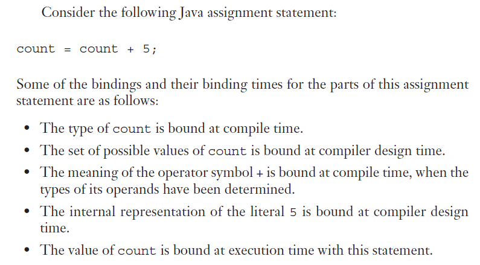

# 9. Hafta

### **Giriş ve Genel Bakış**

Bu bölüm, programlama dillerindeki **değişkenlerin, isimlerin ve bağlamaların** çalışma prensiplerini açıklamaktadır. Von Neumann mimarisine dayanan **emirsel (imperative)** programlama paradigmaları, bu prensiplerin temelini oluşturur. Şimdi bu kavramları detaylı bir şekilde açıklayalım.

---

### **1. Von Neumann Mimarisi ve Emirsel Programlama**

- **Von Neumann Mimarisi:**
    
    Bilgisayar sistemlerinin **bellek (memory)** ve **işlemci (processor)** birimleri üzerine kurulu olduğu bir yapıdır. Her bellek hücresi, özgün bir adresle tanımlanır.
    
- **Emirsel Programlama:**
    
    Von Neumann mimarisine uygun olarak, programlama dillerinin, değişkenlerin bellekteki değerlerini işlem deyimleri ile değiştirdiği bir modeldir. Örneğin:
    
    ```c
    x = 5;
    y = x + 3;
    ```
    

---

### **2. İsimler (Names)**

### **Tasarım Soruları:**

- **Büyük-küçük harfe duyarlılık:**İsimler büyük/küçük harfe duyarlı mı? (örneğin, `VAR` ve `var` aynı mı?)
- **Özel kelimeler:**Kullanılacak dilde ayrılmış kelimeler mi olacak yoksa anahtar kelimeler mi? (örneğin, `if`, `while` gibi).

### **İsimlerin Özellikleri:**

1. **Uzunluk:**
    - Çok kısa isimler, anlam ifade etmez (örneğin, `x`, `y`).
    - Örnekler:
        - **C99:** İlk 63 karakter anlamlıdır.
        - **C#, Java:** Limit yoktur, hepsi anlamlıdır.
2. **Özel Karakterler:**
    - **PHP:** Tüm değişkenler `$` işaretiyle başlar.
    - **Ruby:** Değişken türünü belirlemek için işaretler (`@`, `@@`) kullanılır.
3. **Büyük-küçük Harf Duyarlılığı:**
    - **Avantajlar:** Yazılım geliştirme esnekliği sağlar.
    - **Dezavantajlar:** Benzeyen isimlerin okunabilirliği zorlaşır (örneğin, `parseInt` ve `ParseInt`).
4. **Özel Kelimeler:**
    - **Anahtar Kelimeler (Keywords):** Belirli durumlarda özel anlam taşır.Örneğin, FORTRAN'da `REAL` kelimesi farklı bağlamlarda değişik anlamlar taşır.
    - **Ayrılmış Kelimeler (Reserved Words):** Bir isim olarak kullanılamaz.Örneğin, C++’daki `for`, `while` gibi.

---

### **3. Değişkenler (Variables)**

### **Tanım:**

Bir değişken, bir bellek hücresinin soyutlamasıdır. Değişkenler aşağıdaki özelliklerle karakterize edilir:

1. **İsim:**Değişkenin programcı tarafından verilen adı.
2. **Adres:**Değişkenin ilişkili olduğu bellek adresi.
    - **Takma Adlar (Alias):** Aynı bellek adresine erişen birden fazla değişken.
3. **Değer:**Değişkenin bellekte sakladığı içerik.
    - **L-value:** Adres değeri.
    - **R-value:** Gerçek değer.
4. **Tip (Type):**Değişkenin alabileceği değerlerin türü (örneğin, tamsayı, kayan nokta).
5. **Yaşam Süresi (Lifetime):**Değişkenin bellekte aktif olduğu süre.
6. **Kapsam (Scope):**Değişkenin programın hangi bölümlerinde erişilebilir olduğu.

---

### **4. Bağlama Kavramı (Binding)  burası önemli**

### **Bağlama Nedir?**

- **Tanım:** Program elemanları (örneğin, değişkenler, işlemler) ile belirli özellikler arasında ilişki kurulmasıdır. Örneğin, bir değişkenin bir tipe bağlanması.

### **Bağlama Zamanları:**

1. **Dil Tasarım Zamanı:** Operatörlerin anlamları belirlenir (örneğin, `+` toplama işlemi).
2. **Dil Uygulama Zamanı:** Kayan nokta sayıların temsili tanımlanır.
3. **Derleme Zamanı:** Değişkenler bir türe bağlanır (örneğin, C'de `int x`).
4. **Yükleme Zamanı:** Statik değişkenler bir bellek hücresine bağlanır.
5. **Çalışma Zamanı:** Yerel değişkenler çalışma sırasında bellek hücresine bağlanır.

---

### **5. İsimlerin Kullanımına İlişkin Örnekler**

### **Anahtar Kelime (Keyword):**

- Belirli bağlamlarda özel anlam taşır. Örneğin:
    - FORTRAN'da `REAL` bir deyimin başında kullanılırsa veri türü belirtir:
        
        ```fortran
        REAL apple
        ```
        
    - Ancak atama işlemcisi ile kullanılırsa değişken ismi olur:
        
        ```fortran
        REAL = 10.05
        ```
        

### **Ayrılmış Kelime (Reserved Word):**

- Hiçbir bağlamda isim olarak kullanılamaz.
- Örneğin:
    - C++: `do`, `for`, `while`
    - Pascal: `procedure`, `begin`, `end`

---

### **Sonuç**

Bu bölüm, programlama dillerindeki isimlerin ve değişkenlerin nasıl tanımlandığını, bağlamalarının nasıl yapıldığını ve bunların etkilerini açıklar. Değişkenlerin özelliklerini ve bağlama kavramını anlamak, programlama dillerinin çalışma mantığını derinlemesine kavramak için önemlidir.

---



### **Binding Times - Örnek Açıklaması**

Bu örnek, Java'da bir atama ifadesinin farklı bileşenlerinin **bağlama zamanları** ile nasıl ilişkilendirildiğini gösteriyor. Atama ifadesi şu şekilde:

```java
count = count + 5;
```

Her bir bileşenin bağlama zamanı ve bağlama türü şu şekilde analiz edilir:

---

### **1. `count` Değişkeninin Türü**

- **Bağlama Zamanı:** Derleme Zamanı (Compile Time)
- **Açıklama:**`count` değişkeninin türü (örneğin, `int`, `float`) derleyici tarafından tanımlanır. Derleme sırasında, bu bilgi dilin kurallarına göre belirlenir.

---

### **2. `count` Değişkeninin Alabileceği Olası Değerler**

- **Bağlama Zamanı:** Derleyici Tasarım Zamanı (Compiler Design Time)
- **Açıklama:**`count` değişkeninin alabileceği değerler kümesi, dilin tasarımında belirlenir. Örneğin:
    - `int` türü için değer aralığı genellikle `2,147,483,648` ile `2,147,483,647` arasında tanımlıdır.

---

### **3. `+` Operatörünün Anlamı**

- **Bağlama Zamanı:** Derleme Zamanı (Compile Time)
- **Açıklama:**`+` operatörünün anlamı, operandlarının türlerine bağlı olarak belirlenir. Örneğin:
    - Eğer operandlar `int` ise, `+` toplama anlamına gelir.
    - Eğer operandlar `String` ise, `+` birleştirme (concatenation) anlamına gelir.

---

### **4. `5` Sabitinin Dahili Temsili**

- **Bağlama Zamanı:** Derleyici Tasarım Zamanı (Compiler Design Time)
- **Açıklama:**`5` sabitinin (literal) bellekte nasıl temsil edileceği dilin derleyici tasarımı sırasında belirlenir. Örneğin:
    - Kayan nokta sayılar IEEE 754 standardına göre temsil edilir.
    - Tamsayılar ise genellikle ikili (binary) sistemde saklanır.

---

### **5. `count` Değişkeninin Değeri**

- **Bağlama Zamanı:** Çalışma Zamanı (Execution Time)
- **Açıklama:**`count` değişkeninin değeri, programın çalıştırılması sırasında atanır. Örneğin, önceki `count` değerine 5 eklenerek yeni bir değer oluşturulur ve bu değer bellek hücresine yazılır.

---

### **Genel Bağlama Zamanlarının Özeti**

| **Bileşen** | **Bağlama Zamanı** | **Açıklama** |
| --- | --- | --- |
| `count` değişkeninin türü | Derleme Zamanı (Compile Time) | Derleyici tarafından belirlenir. |
| `count` olası değer kümesi | Derleyici Tasarım Zamanı | Türün alabileceği değer aralığı, dilin tasarımında belirlenir. |
| `+` operatörünün anlamı | Derleme Zamanı (Compile Time) | Operandların türüne bağlı olarak belirlenir. |
| `5` sabitinin temsili | Derleyici Tasarım Zamanı | Literalin bellekteki fiziksel temsili belirlenir. |
| `count` değişkeninin değeri | Çalışma Zamanı (Runtime) | Program çalıştırıldığında atanır. |

---

### **Bağlamalar ve Değişkenlerle İlişkili Kavramlar**

Bu bölüm, değişkenlerin özelliklerinin nasıl bağlandığını, farklı türdeki bellek bağlamalarını ve değişkenlerin yaşam süresini (lifetime) açıklamaktadır. Değişkenlerin türü, adresi, değeri gibi özelliklerin bağlanma zamanları ve bellekte nasıl saklandığı programlama dillerinde önemli bir tasarım boyutudur.

---

### **1. Bağlama (Binding)**

### **Statik ve Dinamik Bağlama**

- **Statik Bağlama:**
    - Bağlama çalışma zamanından önce gerçekleşir ve program çalışırken değişmez.
    - Daha güvenlidir ve performans açısından avantajlıdır.
- **Dinamik Bağlama:**
    - İlk bağlama çalışma zamanında gerçekleşir.
    - Programın çalışması sırasında değişebilir.
    - Esneklik sağlar ancak güvenilirlik ve performans açısından dezavantajlıdır.

---

### **2. Tip Bağlama (Type Binding)**

### **Tip Bağlama Nedir?**

- Bir değişkenin bir veri tipi ile ilişkilendirilmesidir. Örneğin:
    
    ```c
    int x; // x bir tamsayıdır
    ```
    

### **Tip Bağlama Türleri**

1. **Statik Tip Bağlama:**
    - Tip bilgisi derleme zamanında belirlenir.
    - Değişken türleri explicit (açık) veya implicit (örtülü) olarak bildirilebilir:
        - **Explicit Declaration:** Programcı değişken türünü açıkça belirtir. Örneğin:
            
            ```c
            int x; // x bir tamsayı
            ```
            
        - **Implicit Declaration:** Dilin varsayılan kuralları ile değişken türü atanır. Örneğin:
            
            ```perl
            $x = 5; # Perl'de $x otomatik olarak bir tamsayı olur.
            ```
            
        - Avantaj: Yazılabilirlik artar.
        - Dezavantaj: Güvenilirlik azalır (yanlış tür bağlamaları oluşabilir).
2. **Dinamik Tip Bağlama:**
    - Değişkenin türü çalışma zamanında belirlenir.
    - Örneğin, Python’da:
        
        ```python
        x = 10    # x bir tamsayı
        x = "Merhaba"  # x bir dize
        ```
        
    - **Avantaj:** Esneklik sağlar.
    - **Dezavantaj:** Performans maliyeti yüksektir ve derleyici tip hatalarını tespit edemez.

---

### **3. Saklama Bağlamaları ve Yaşam Süresi (Storage Bindings and Lifetime)**

### **Saklama Bağlamaları**

- **Yer Tahsisi (Allocation):**
    - Bellek havuzundan bir bellek hücresi ayrılması.
- **Yeri Geri Verme (Deallocation):**
    - Kullanılmayan belleğin havuza geri verilmesi.
- **Yaşam Süresi (Lifetime):**
    - Değişkenin bir bellek hücresine bağlanması ile bu bağın koparılması arasında geçen süre.

### **Değişkenlerin Yaşam Süresi Türleri**

1. **Statik Değişkenler:**
    - Bellek çalışma zamanından önce ayrılır ve program boyunca kalır.
    - **Avantaj:** Verimlilik, geçmişe duyarlı alt program desteği.
    - **Dezavantaj:** Esneklik eksikliği (özyineleme yapılamaz).
2. **Yığıt-Dinamik Değişkenler (Stack-Dynamic Variables):**
    - Bellek, çalışma zamanında yığıttan ayrılır ve serbest bırakılır.
    - **Avantaj:** Özyinelemeyi destekler, bellek tasarrufu sağlar.
    - **Dezavantaj:** Tahsis/serbest bırakma maliyeti, geçmişe duyarlılık eksikliği.
3. **Dışsal Yığın-Dinamik Değişkenler (Explicit-Heap-Dynamic Variables):**
    - Bellek, çalışma zamanında gerek oldukça ayrılır ve serbest bırakılır.
    - Pointer veya referanslarla yönetilir.
    - **Avantaj:** Dinamik bellek yönetimi sağlar (örneğin, bağlı listeler ve ağaçlar).
    - **Dezavantaj:** Güvenilirlik eksikliği, maliyet yüksekliği.
4. **Örtülü Yığın-Dinamik Değişkenler (Implicit-Heap-Dynamic Variables):**
    - Tamamen çalışma zamanında atanır ve dinamik olarak değiştirilir.
    - Örneğin, JavaScript ve Python'da:
        
        ```jsx
        let x = 5;
        x = "Hello";
        ```
        
    - **Avantaj:** Esneklik.
    - **Dezavantaj:** Performans ve hata ayıklama zorlukları.

---

### **4. Bellek Yapısı**

Programın çalışması sırasında bellek çeşitli bölümlere ayrılır:

1. **Kod Bölgesi:** Derlenmiş program kodlarının bulunduğu yer.
2. **Global Değişkenler Bölgesi:** Programda kullanılan genel değişkenlerin tutulduğu yer.
3. **Yığın Bellek Bölgesi (Stack):**
    - Alt programlar için etkinlik kayıtları (activation record) tutulur.
    - Alt program çağrıldığında bellek ayrılır, tamamlandığında serbest bırakılır.
4. **Yığın (Heap):**
    - Pointer'larla erişilen dinamik bellek değerleri tutulur.
    - Bellek gerekince büyüyebilir ve serbest bırakıldığında yeniden kullanılabilir.
    - Bellek geri verme, programcı tarafından manuel veya otomatik olarak yapılabilir (örneğin, Java'da çöp toplayıcı).

---

### **5. Statik ve Dinamik Değişkenlerin Karşılaştırması**

| **Değişken Türü** | **Avantajlar** | **Dezavantajlar** |
| --- | --- | --- |
| **Statik Değişkenler** | Verimlilik, geçmişe duyarlılık | Esneklik eksikliği |
| **Stack-Dynamic** | Özyineleme desteği, bellek tasarrufu | Tahsis maliyeti, geçmişe duyarlılık eksikliği |
| **Explicit-Heap-Dynamic** | Dinamik veri yapıları için uygun | Güvenilirlik eksikliği, yönetim maliyeti |
| **Implicit-Heap-Dynamic** | Esneklik, yazılabilirlik | Performans düşüklüğü, hata tespiti zorluğu |

---

### **Örtülü Yığın-Dinamik Değişkenler (Implicit-Heap Dynamic Variables)**

### **Tanım ve Özellikler**

- Bu tür değişkenler, bir **değer atanması sırasında** yığın belleğe (heap) bağlanır ve belleğe atanır.
- **Atama (Allocation) ve Serbest Bırakma (Deallocation):** Atama ifadeleri tarafından tetiklenir.
    - Örneğin:
        - **APL:** Tüm değişkenler.
        - **Perl, JavaScript, PHP:** Diziler ve dizgeler.
- Değişkenlerin tip ve bellek özellikleri, her atama işleminde yeniden belirlenir.

### **Avantaj:**

- **Esneklik:** Genel amaçlı ve dinamik kod yazma imkanı sağlar. Örneğin, farklı türlerde değerleri aynı değişkene atamak mümkündür:
    
    ```jsx
    let x = 5;       // x tamsayı
    x = "Merhaba";   // x dize (string)
    ```
    

### **Dezavantajlar:**

1. **Verimsizlik:**
    - Tüm özelliklerin dinamik olarak belirlenmesi kaynak tüketimini artırır.
2. **Hata Tespiti Eksikliği:**
    - Derleme sırasında tip hataları tespit edilemez, bu da programın ileride hatalara açık olmasına yol açar.

---

### **Kapsam (Scope)**

### **Tanım:**

- Bir değişkenin **görünebildiği** ve **erişilebilir** olduğu kod bölgesidir.
- **Yerel Değişkenler (Local Variables):**
    - Bir alt programda (veya blokta) tanımlanır ve yalnızca o alt programın içinde erişilebilir.
- **Yerel Olmayan Değişkenler (Nonlocal Variables):**
    - Bir alt programda tanımlanmamış ancak o alt programın içinde erişilebilir olan değişkenlerdir.
    - Özel bir yerel olmayan değişken türü, **global değişkenlerdir**.

### **Kapsam Kuralları:**

- Programlama dilindeki kapsam kuralları, bir isim referansının hangi değişkenle eşleştirileceğini belirler.

---

### **Statik Kapsam (Static Scope)**

### **Tanım:**

- **Program metnine** dayalıdır; değişkenlerin tanımlandığı metin bloklarını takip eder.
- Bir isim referansını bir değişkenle ilişkilendirmek için derleyici, o ismin tanımını bulmalıdır:
    1. İlk olarak, yerel tanımlamalarda aranır.
    2. Bulunamazsa, giderek daha geniş kapsamlarda (enclosing scopes) aranır.

### **Terimler:**

- **Statik Atalar (Static Ancestors):** Bir kapsamın üst düzey kapsayıcılarıdır.
- **Statik Ebeveyn (Static Parent):** En yakın kapsayıcıdır.

### **Özellikler:**

- Bazı dillerde iç içe alt program tanımları desteklenir ve bu da iç içe statik kapsamlar oluşturur.
    - **Destekleyen Diller:** Ada, JavaScript, Common Lisp, Scheme, Fortran 2003+, F#, Python.

---

### **Bloklar ve Kapsam**

### **Blok Tanımı:**

- Bir araya getirilmiş ifadeler grubudur. Bu ifadelerin kendi yerel değişkenleri tanımlanabilir.
- Geçici tanımlamalar yapmak için bloklar kullanılır ve bu, programları daha modüler ve okunabilir hale getirir.

### **Özellikler:**

- Blok yapısına sahip bir program, yuvalanmış bloklar halinde organize edilir.
- Her blok, kendi kapsamını oluşturur.

---

### **Tanımlama Sırası ve Kapsam Kuralları**

### **C99, C++, Java ve C#'daki Kurallar:**

1. Değişken tanımlamaları herhangi bir yerde yapılabilir.
    - **C99, C++, Java:** Yerel değişkenler, tanımlandıkları noktadan itibaren bloğun sonuna kadar geçerlidir.
    - **C#:** Bir bloğun herhangi bir yerinde tanımlanan değişken, tüm blok boyunca geçerlidir.
2. Değişken kullanılmadan önce tanımlanmalıdır.

### **For Döngüsü İçindeki Tanımlamalar:**

- **C++, Java, C#:** For döngüsü içinde tanımlanan değişkenler, yalnızca döngü içinde geçerlidir:
    
    ```c
    for (int i = 0; i < 10; i++) {
        // i sadece bu blokta geçerli
    }
    ```
    

---

### **Kod Örnekleri ile Statik Kapsam**

### **Statik Kapsamda İç İçe Bloklar:**

```c
{
    int x = 10;
    {
        int x = 20;
        // İçteki bloktaki x = 20
    }
    // Dıştaki bloktaki x = 10
}
```

### **Kapsam Çakışmaları:**

- Eğer bir değişken aynı blokta birden fazla kez tanımlanırsa veya iç içe bloklarda çakışmalar olursa, kapsam kuralları uygulanır:
    
    ```c
    {
        int x = 5;
        {
            int x = 10; // Bu x, dış x'i gölgeler.
        }
        // Buradaki x = 5
    }
    ```
    

---

### **Özet**

1. **Örtülü Yığın-Dinamik Değişkenler:**
    - Bellek ve tip, her atamada yeniden belirlenir. Esneklik sağlar ancak verimsizdir.
2. **Kapsam:**
    - Bir değişkenin erişilebilir olduğu bölgeyi belirler.
    - Statik kapsam, metin tabanlıdır ve dillerde bloklar veya iç içe tanımlamalarla yönetilir.
3. **Tanımlama Sırası:**
    - Modern diller, değişkenlerin herhangi bir yerde tanımlanmasına izin verir ancak tanımlanma sırası kapsamı etkiler.

---

### **Küresel Kapsam (Global Scope) ve Örnekler**

---

### **Genel Kapsam Tanımı**

- **Global Scope**, bir değişkenin **tüm program boyunca** görünür ve erişilebilir olduğu kapsama işaret eder.
- Global değişkenler:
    - Fonksiyonların dışında tanımlanır.
    - Fonksiyonlardan ve programın herhangi bir yerinden erişilebilir.

---

### **Farklı Dillerde Global Kapsam ve Kurallar**

### **1. C, C++, PHP, Python**

- Bu dillerde, program yapısı genellikle bir dosyada sıralı fonksiyon tanımlamalarından oluşur.
- **Fonksiyonlar dışında tanımlanan değişkenler:**
    - **C ve C++:** Global değişkenler doğrudan erişilebilir. Ancak, bir yerel değişken aynı isimle tanımlanırsa, yerel değişken önceliklidir. Global değişkene `::` operatörüyle erişilebilir:
        
        ```cpp
        int x = 10; // Global değişken
        void func() {
            int x = 5; // Yerel değişken
            std::cout << ::x; // Global x'e erişim (10)
        }
        ```
        
    - **PHP:** Varsayılan olarak, bir fonksiyonda tanımlanan değişkenler yerel olarak ele alınır. Global değişkenlere erişim için:
        - `global` anahtar kelimesi.
        - `$GLOBALS` dizisi.
        
        ```php
        $globalVar = "Hello";
        function test() {
            global $globalVar;
            echo $globalVar; // "Hello"
        }
        ```
        
    - **Python:** Global değişkenler doğrudan okunabilir. Ancak, bir fonksiyon içinden global bir değişkeni değiştirmek için `global` anahtar kelimesi kullanılır.
        
        ```python
        x = 10
        def func():
            global x
            x = 20
        func()
        print(x) # 20
        ```
        

### **2. PHP Örneği (Yukarıdaki Kod ve Çıktı Analizi)**

```php
$day = "Monday";
$month = "January";

function calendar() {
    $day = "Tuesday";
    global $month;
    print "local day is $day <br />"; // Yerel $day
    $gday = $GLOBALS['day']; // Küresel $day
    print "global day is $gday <br />";
    print "global month is $month <br />";
}
calendar();
```

**Çıktı:**

```
local day is Tuesday
global day is Monday
global month is January
```

### **Kod Analizi:**

1. `$day` ve `$month` global değişkenlerdir.
2. `calendar()` fonksiyonu içinde:
    - `$day` yerel bir değişken olarak "Tuesday" değerini alır.
    - `global $month;` ifadesi, `$month` değişkeninin global versiyonuna erişim sağlar.
    - `$GLOBALS['day']`, global `$day` değişkenine erişimi sağlar.

---


### **Global Scope Görsellerinin Yorumu**

### **Birinci Görsel: Kod**

Bu görseldeki PHP kodu, global ve yerel değişkenlerin nasıl kullanıldığını gösteriyor. Aşağıdaki ana noktalar dikkat çekiyor:

- Global değişkenler `global` anahtar kelimesiyle veya `$GLOBALS` dizisiyle erişilebilir.
- Yerel değişkenler global olanlarla aynı isimde tanımlanabilir; bu durumda, yerel değişken önceliklidir.

### **İkinci Görsel: Çıktı**

- Yerel `$day` değişkeni "Tuesday" olarak atanmış ve bu nedenle "local day is Tuesday" çıktısı alınmıştır.
- Global `$day`, `$GLOBALS` dizisi üzerinden "Monday" olarak erişilmiş ve "global day is Monday" olarak çıktı üretilmiştir.
- `$month` değişkeni `global` anahtar kelimesiyle erişilmiş ve "global month is January" olarak çıktıda görünmüştür.

---

### **Sonuç**

Bu örnekler, global ve yerel değişkenler arasındaki ilişkiyi ve global değişkenlere nasıl erişileceğini net bir şekilde göstermektedir. PHP gibi dillerde `global` ve `$GLOBALS` gibi mekanizmalar, kapsam kontrolünü ve değişkenlerin görünürlüğünü yönetmek için güçlü araçlardır.

---

### **Statik ve Dinamik Kapsam ile Kapsam ve Yaşam Süresi Konuları**

Bu bölüm, statik ve dinamik kapsam (scoping), kapsam ve yaşam süresi (lifetime) arasındaki farklar ve bunların programlama dillerindeki etkilerini detaylı bir şekilde açıklar.

---

### **Statik Kapsam (Static Scoping) text e bakılır**

### **Değerlendirme:**

- **Avantajlar:**
    - **Okunabilirlik:** Kodun hangi değişkenlere erişebileceği, program metnine (kod yapısına) bakılarak kolayca anlaşılabilir.
    - **Tip Güvenliği:** Derleme sırasında değişkenlerin türü kontrol edilebilir.
- **Dezavantajlar:**
    1. **Fazla Erişim:** Tüm alt programlar, global olarak tanımlanan değişkenlere erişebilir. Bu, gerektiğinden fazla erişime neden olur ve güvenilirliği azaltır.
    2. **Evrim Sorunları:** Program geliştikçe, başlangıçtaki yapı bozulur. Yerel değişkenler global hale gelir, alt programlar da global hale gelme eğilimindedir.
    3. **Global Değişken Sorunu:** Global değişkenler, ihtiyaç olmasa bile tüm alt programlara görünür olur ve bu da programın karmaşıklığını artırır.

---

### **Dinamik Kapsam (Dynamic Scoping)**

### **Tanım:**

- Bir ismin kapsamı, alt programların çağrılma sırasına ve çalışma zamanındaki bağlamına göre belirlenir.
- Örneğin:
    - Dinamik kapsamda bir değişken, çağrı sırasında tanımlanan diğer değişkenlerle geçici olarak gölgelenebilir (overridden).

### **Uygulama:**

- **Örnek Diller:** APL, LISP'in ilk sürümleri.

### **Değerlendirme:**

- **Avantaj:**
    - **Kullanım Kolaylığı:** Değişkenlere dinamik olarak erişim sağlar. Alt programlar arası veri paylaşımı kolaylaşır.
- **Dezavantajlar:**
    1. **Tip Kontrolü Eksikliği:** Derleme sırasında değişkenlerin türünü statik olarak kontrol etmek imkansızdır.
    2. **Okunabilirlik Sorunu:** Hangi değişkenin hangi değerle ilişkili olduğunu koddan statik olarak anlamak zordur.
    3. **Güvenilirlik Eksikliği:** Bir alt program çalışırken, tüm çağrılan alt programlar bu değişkenlere erişebilir.

---

### **Kapsam (Scope) ve Yaşam Süresi (Lifetime)**

### **Farklılıklar:**

- **Kapsam (Scope):** Bir değişkenin **görünebildiği** kod bölgesidir.
    - Örneğin, yerel değişkenler yalnızca tanımlandıkları alt programda erişilebilir.
- **Yaşam Süresi (Lifetime):** Bir değişkenin bellek ile ilişkilendirildiği süredir.
    - Örneğin, statik değişkenler programın tamamı boyunca bellekte kalır.

### **Örnek: Statik Değişkenler**

```cpp
void func() {
    static int x = 0; // Statik değişken
    x++;
    std::cout << x << std::endl;
}

int main() {
    func(); // 1
    func(); // 2
    func(); // 3
}
```

- **Kapsam:** `x` yalnızca `func()` içinde görünür.
- **Yaşam Süresi:** `x` programın tamamı boyunca bellekte kalır.

---

### **Referans Ortamları (Referencing Environments)  41. slayttaki koda bak önemli. çok durdu üstünde**

### **Tanım:**

Bir ifadenin referans ortamı, ifade içinde **görünür olan tüm isimlerin** koleksiyonudur.

### **Statik ve Dinamik Ortamlar:**

- **Statik Kapsamlı Dillerde:**
    - Yerel değişkenler ve çevreleyen tüm statik kapsamlar referans ortamını oluşturur.
- **Dinamik Kapsamlı Dillerde:**
    - Yerel değişkenler ve tüm aktif alt programların değişkenleri referans ortamını oluşturur.

---

1. Slayt :


### **Referencing Environments - Dynamic Scope (Referans Ortamları - Dinamik Kapsam)**

### **Kod Yapısı:**

Bu kod parçası, bir programın dinamik kapsam kuralları altında nasıl çalıştığını ve referans ortamlarının nasıl değiştiğini göstermektedir. Kod üç farklı alt programdan (`sub1`, `sub2`, `main`) oluşmaktadır.

---

### **Kodun İşleyişi:**

1. **`main` Fonksiyonu:**
    - `c` ve `d` isimli iki yerel değişken tanımlar.
    - `sub2()` fonksiyonunu çağırır.
2. **`sub2` Fonksiyonu:**
    - `b` ve `c` isimli iki yerel değişken tanımlar.
    - `sub1()` fonksiyonunu çağırır.
3. **`sub1` Fonksiyonu:**
    - `a` ve `b` isimli iki yerel değişken tanımlar.
    - Çağrıldığı noktada yerel değişkenlerine erişir ve çalışır.

---

### **Dinamik Kapsam ve Referans Ortamı:**

Dinamik kapsamda, bir değişkenin referans ortamı, çalışma zamanındaki çağrı sırasına göre belirlenir. Her çağrı sırası, aktif alt programların değişkenlerini referans ortamına ekler.

| **Nokta** | **Referans Ortamı** |
| --- | --- |
| **1** | `a` ve `b` (`sub1`), `c` (`sub2`), `d` (`main`). `sub2`'nin `b` ve `main`'in `c` değişkenleri gizlenir. |
| **2** | `b` ve `c` (`sub2`), `d` (`main`). `main`'in `c` değişkeni gizlenir. |
| **3** | `c` ve `d` (`main`). |

---

### **Kod Akışında Referans Ortamlarının Değişimi:**

1. **Başlangıç (Point 3):**
    - `main` fonksiyonu çalışır ve sadece `c` ile `d` değişkenlerine erişim vardır. Referans ortamı: `c, d`.
2. **`sub2` Çağrısı (Point 2):**
    - `sub2`, `b` ve `c` isimli yerel değişkenleri tanımlar.
    - `main`'in `c` değişkeni gizlenir. Referans ortamı: `b, c, d`.
3. **`sub1` Çağrısı (Point 1):**
    - `sub1`, `a` ve `b` isimli yerel değişkenleri tanımlar.
    - `sub2`'nin `b` ve `main`'in `c` değişkenleri gizlenir. Referans ortamı: `a, b, c, d`.

---

### **Dinamik Kapsamın Değerlendirilmesi:**

**Avantajlar:**

1. **Kullanım Kolaylığı:** Alt programlar arasında değişken paylaşımını dinamik olarak sağlar.
2. **Esneklik:** Çalışma zamanında değişken bağlamalarını belirler.

**Dezavantajlar:**

1. **Okunabilirlik Sorunu:** Bir değişkenin hangi değerle ilişkilendirildiğini anlamak, çağrı sırasına bağlıdır ve bu statik olarak belirlenemez.
2. **Tip Güvenliği Eksikliği:** Dinamik kapsamda, tip hataları derleme sırasında tespit edilemez.
3. **Hatalara Açıklık:** Alt programların değişkenlere erişim kolaylığı, beklenmeyen yan etkiler doğurabilir.

---

### **Örnek Kodun Analizi:**

Bu kod parçası, dinamik kapsamın etkilerini açıkça göstermektedir:

- Her alt program çağrısı, kendi yerel değişkenlerini referans ortamına ekler.
- Üst düzey değişkenler, aynı isimli yerel değişkenlerle gizlenebilir.

---

### **Sonuç:**

Dinamik kapsam, programlama dillerinde esneklik sağlar ancak okunabilirlik ve güvenilirlik açısından zorluklar yaratır. Bu nedenle, günümüzde çoğu modern dil, statik kapsamı tercih etmektedir.

---

### **İsimlendirilmiş Sabitler (Named Constants)**

### **Tanım:**

Bir isimlendirilmiş sabit, yalnızca bir kez bir değere bağlanan değişkenlerdir. Değer, sabit belleğe bağlandığında atanır.

### **Avantajlar:**

- **Okunabilirlik:** Sabitler, kodun anlaşılabilirliğini artırır.
- **Değiştirilebilirlik:** Sabit parametreler ile programın farklı ortamlara uyarlanması kolaylaşır.

### **Bağlama Türleri:**

1. **Statik Bağlama (Manifest Constants):**
    - Sabitin değeri derleme sırasında belirlenir.
    - Örnek: C'deki `const` anahtar kelimesi.
        
        ```c
        const int MAX = 100;
        ```
        
2. **Dinamik Bağlama:**
    - Sabitin değeri çalışma sırasında belirlenir.
    - Örnek: Java'daki ifadelerle atanan sabitler.
        
        ```java
        final int MAX = calculateMax();
        ```
        

### **Diller ve Sabit Türleri:**

- **C++ ve Java:** Herhangi bir ifade türü ile dinamik olarak bağlanabilir.
- **C#:**
    - **`const`:** Derleme zamanı sabitleri.
    - **`readonly`:** Çalışma zamanında bağlanan sabitler.

---

### **Sonuç**

1. **Statik ve Dinamik Kapsam:**
    - Statik kapsam, okunabilirlik ve güvenilirlik açısından avantajlıdır.
    - Dinamik kapsam, kullanım kolaylığı sağlasa da tip güvenliği ve okunabilirlik açısından sorunludur.
2. **Kapsam ve Yaşam Süresi:**
    - Kapsam, değişkenlerin erişilebilir olduğu bölgeyi ifade ederken, yaşam süresi bellekte bağlı olduğu zamanı ifade eder.
3. **İsimlendirilmiş Sabitler:**
    - Sabitler, kodun parametrize edilebilirliğini ve güvenilirliğini artırır.

---