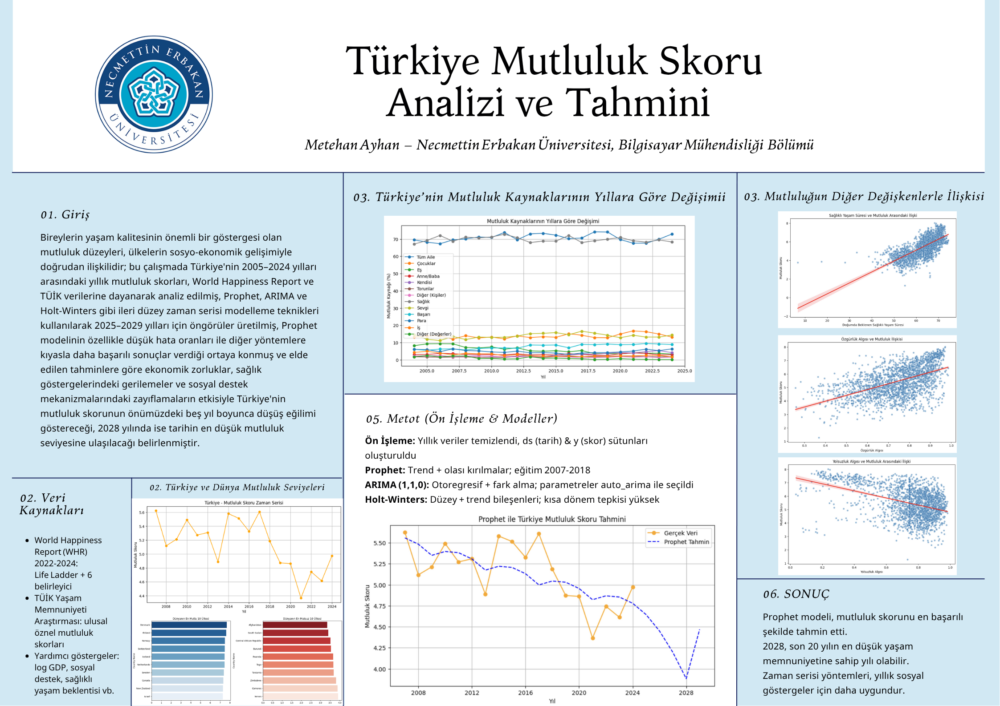

# Türkiye Mutluluk Skoru Üzerine Veri Analizi ve Tahminleme

### Bir Zaman Serisi Yaklaşımı

## Projenin Kısa Tanımı

Bu proje, Türkiye’nin 2005–2024 yılları arasındaki mutluluk skorlarını istatistiksel zaman serisi yöntemleriyle analiz ederek, 2025–2029 dönemine dair öngörüsel tahminler üretmeyi amaçlamaktadır. Projede Prophet, ARIMA ve Holt-Winters modelleri detaylı şekilde karşılaştırılmış; modellerin başarı düzeyleri hem geçmiş yıllar üzerindeki doğruluklarıyla hem de ileri projeksiyonlarıyla değerlendirilmiştir. Geleneksel makine öğrenmesi modelleriyle de kıyaslamalar yapılarak zaman serisi yöntemlerinin sosyal göstergelere uygulanabilirliği ortaya konmuştur.

---

---

## Kullanılan Veri Setleri

### 1. World Happiness Report (2005–2024)

- Life Ladder (Mutluluk Skoru)
- Log GDP per Capita
- Social Support
- Healthy Life Expectancy
- Freedom to Make Life Choices
- Generosity
- Perceptions of Corruption

### 2. TÜİK Yaşam Memnuniyeti Araştırması (2005–2023)

- Türkiye’nin öznel yaşam memnuniyeti, kamu hizmetlerinden memnuniyet oranları ve toplumsal göstergeler.

---

## Kullanılan Yöntemler ve Modeller

### Prophet Modeli (Facebook tarafından geliştirilmiştir)

- Trend + yapısal kırılmalar + sezonsallık.
- 2007–2018 arası eğitim; 2025–2029 için tahmin.
- MAPE: %9.49 – En düşük hata oranı.

### ARIMA(1,1,0)

- Otoregresif yapı + fark alma.
- Auto_arima ile parametre seçimi.
- Yatay, durağan tahminler.

### Holt-Winters

- Düzey ve eğilim bileşenleri.
- Daha yumuşak tahminler; dışsal şoklara duyarsız.

### Karşılaştırmalı Metrikler (2019–2024 Test Dönemi)

| Model | MAE | RMSE | MAPE |
| --- | --- | --- | --- |
| **Prophet** | 0.447 | 0.500 | 9.49% |
| ARIMA | 0.608 | 0.640 | 13.04% |
| Holt-Winters | 0.637 | 0.668 | 13.65% |

---

## Geleneksel Makine Öğrenmesi Karşılaştırması

Test Edilen Modeller:

- Linear Regression
- Ridge / Lasso
- Random Forest
- Gradient Boosting
- SVR (RBF Kernel)

 Sonuç: Verinin azlığı ve zaman bağımlılığı nedeniyle ML modelleri başarısız oldu. R² negatif çıktı. Prophet ve ARIMA gibi yapılar daha başarılı tahminler sundu.

---

##  Teknik Altyapı

Bu proje aşağıdaki Python kütüphaneleri ile yürütülmüştür:

- pandas
numpy
matplotlib
seaborn
prophet
statsmodels
pmdarima
scikit-learn

---

## Sonuçlar

- Prophet modeli, geleceğe yönelik düşüş trendini en net biçimde yakalayan yöntem olmuştur.
- 2028 yılında Türkiye’nin son 20 yılın en düşük yaşam memnuniyetine ulaşabileceği öngörülmüştür.

---

## Literatüre Katkı

Bu çalışma, zaman serisi modelleme yaklaşımlarının öznel sosyal değişkenlerde de uygulanabileceğini ortaya koyarak:

- Türkiye bağlamında nadir görülen ileriye dönük mutluluk tahmini sunar.
- Prophet, ARIMA ve Holt-Winters modellerinin kıyaslandığı sistematik bir çerçeve sağlar.
- Veri bilimi ile sosyal bilimler arasında köprü kurar.

---