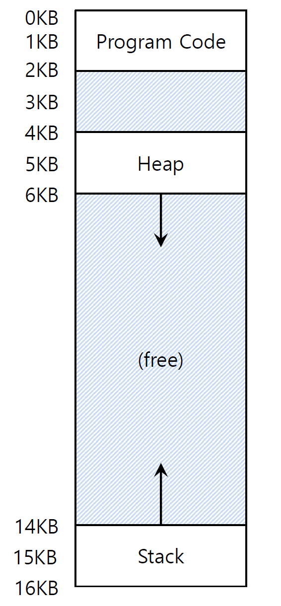

# 10. Hafta

## Address Translation Slaytı

### Bellek Sanallaştırma (Memory Virtualizing) ile Verimlilik ve Kontrol

Bellek sanallaştırma, **verimlilik** ve **kontrol** sağlamak için kullanılan bir tekniktir. Bu süreçte **Sınırlı Doğrudan Yürütme (Limited Direct Execution - LDE)** stratejisine benzer bir yöntem izlenir. Ancak burada donanımın desteği, kritik bir rol oynar.

---

### 1. **Bellek Sanallaştırmada Verimlilik ve Kontrol**

- **Verimlilik**: İşlemlerin hızlı ve kesintisiz yürütülmesini sağlamak.
- **Kontrol**: İşletim sisteminin (Operating System - OS), bellek yönetimini ve güvenliğini denetleyebilmesi.

Bu iki hedef, aşağıdaki donanım bileşenleri ile sağlanır:

- **Kayıtlar (Registers)**: İşlemcide veri saklama ve işlem yapma alanları.
- **TLB (Translation Look-aside Buffer)**: Sanal adresleri fiziksel adreslere hızlı şekilde dönüştüren bir önbellek.
- **Sayfa Tablosu (Page Table)**: Bellek haritalaması için kullanılan bir yapı.

---

### 2. **Adres Çevirimi (Address Translation)**

Donanım, bir **sanal adresi** (virtual address) **fiziksel adrese** (physical address) dönüştürür.

- **Sanal adres**: Programın kullandığı bellek adresidir.
- **Fiziksel adres**: Gerçek donanım üzerindeki bellek konumudur.

### Süreç:

1. **Donanım Adresi Çevirir**: Bir talimatı (instruction) yürütmek için sanal adresi fiziksel adrese dönüştürür.
2. **Bilgiye Ulaşır**: İstenilen veri, fiziksel adreste depolanmıştır.
3. **İşletim Sistemi Devreye Girer**:
    - Donanımı ayarlamak (örn. sayfa tablolarını yüklemek).
    - Belleği yönetmek (örn. fiziksel bellek tahsisi).

---

### 3. **Bir Örnek: Adres Çevirimi**

### Kodun Yürütülmesi:

Bir C dilinde yazılmış basit bir kod parçasını ele alalım:

```c
void func() {
    int x = 3000;
    ...
    x = x + 3; // ilgilendiğimiz kod satırı
}
```

Yukarıdaki kodda, `x` değişkenine +3 eklenmesi işlemi bellek sanallaştırması ile nasıl yürütülür?

### Assembly Seviyesinde Karşılığı:

- `x` değişkeninin adresi bir kayıtta (örn. `ebx`) saklanır.
- İşlemler:
    1. Adresin içerdiği değer `eax` kaydına yüklenir.
        
        ```perl
        movl 0x0(%ebx), %eax  ; ebx adresindeki değeri eax'e yükle
        ```
        
    2. `eax` kaydına 3 eklenir.
        
        ```perl
        addl $0x03, %eax      ; eax'e 3 ekle
        ```
        
    3. Güncellenen değer tekrar belleğe yazılır.
        
        ```perl
        movl %eax, 0x0(%ebx)  ; eax değerini ebx adresine kaydet
        ```
        

### İşlem Adımları:

1. **128. adresteki talimat alınır**: `movl` komutu.
2. **15KB bellekten yükleme yapılır**.
3. **132. adresteki talimat alınır**: `addl`.
4. **Hiç bellek erişimi yapılmadan işlem gerçekleştirilir**.
5. **135. adresteki talimat alınır**: `movl`.
6. **15KB belleğe yazma işlemi yapılır**.

---


### **Dinamik Yer Değiştirme: Temel ve Sınır Kayıtları (Dynamic Relocation: Base and Bounds Register)**

- **Neden Gereklidir?**:
    - İşletim sistemi, bir süreci fiziksel bellekte farklı bir yere yerleştirebilir.
    - Sanal adresler **0’dan başlayarak** sürecin adres uzayını ifade eder.
    - Donanım, bu sanal adresleri fiziksel adreslere çevirmek için **temel (base)** ve **sınır (bounds)** kayıtlarını kullanır.

### **Donanım Tarafında Dinamik Yer Değiştirme**

- **Fiziksel Adres Hesabı:**
    
    $$
    \text{Fiziksel Adres} = \text{Sanal Adres} + \text{Temel Kayıt Değeri}
    $$
    
- **Koşullar:**
    
    $$
    0 \leq \text{Sanal Adres} < \text{Sınır Kayıt Değeri}
    $$
    

### **Örnek:**

Bir işlem bellekte `32KB` adresinden başlatılmış olsun.

- **Base:** `32KB`
- **Bounds:** `16KB`
- Adres çevrimi sırasında `128` adresindeki bir talimat `32896` fiziksel adresine çevrilir:
    
    $$
    32896 = 128 + 32 \text{KB (Base)}
    $$
    

---

### **Taşınabilirlik ve Adres Çevirisi: Açıklama**

Taşınabilirlik ve adres çevirisi, bir programın **mantıksal adreslerini** (program tarafından kullanılan) doğru bir şekilde **fiziksel adreslere** (donanımın bellek alanındaki adresler) eşler. Bu kavramları adım adım açıklayalım, verilen örnek üzerinden:

---

### **1. Adres Taşınabilirliği (Relocation)**

Taşınabilirlik, programın bellek referanslarını, programın yüklendiği fiziksel bellek konumuna uygun hale getirmek için yapılan işlemdir.

- **Temel Adres (Base Address)**: Programın fiziksel bellek içinde başladığı adres.
- **Taşınabilirlik Formülü**:
    
    $$
    \text{Fiziksel Adres} = \text{Mantıksal Adres} + \text{Temel Adres}
    $$
    

---

### **2. Adres Çevirisi Örneği**

**Senaryo**:

- **Mantıksal Adres**: 128 (talimat getirme)
- **Temel Adres**: 32KB (program, fiziksel bellekte bu adrese taşınmış durumda).

**Adım Adım Çeviri**:

1. **Mantıksal Adres 128**'deki talimatı al.
    - Taşınmış Fiziksel Adres:
        
        $$
        \text{Fiziksel Adres} = 128 + 32\text{KB} = 32896 \text{ byte}
        $$
        
2. Bu talimatı çalıştır:
    - `movl 0x0(%ebx), %eax` talimatı, `%ebx`'deki adresi kullanarak bellekten veri yükler ve bunu `%eax`'a aktarır.
3. **Bellek Erişimi**:
    - Talimat, **mantıksal adres 15KB**'den veri yükler.
    - Taşınmış Fiziksel Adres:
        
        $$
        \text{Fiziksel Adres} = 15\text{KB} + 32\text{KB} = 47\text{KB} \text{ (veya 48128 byte)}
        $$
        

---

### **3. Bellek Düzeni**

Aşağıda verilen adresler ve açıklamalar doğrultusunda bellek düzeni açıklanmıştır:

| **Bölüm** | **Mantıksal Adres Aralığı** | **Açıklama** |
| --- | --- | --- |
| Program Kodu | 0KB–14KB | Yürütülebilir kodu içerir. |
| Heap (Yığın) | 14KB–15KB | Dinamik olarak ayrılan bellek. |
| Stack (Yığın) | 15KB–16KB | Yerel değişkenler, fonksiyon çağrıları vs. |

**Örnek Bellek Erişimleri**:

- **Mantıksal Adres 128'deki Talimat**: **Program Kodu**'ndan veri yüklenir.
- **Mantıksal Adres 15KB'den Veri Yüklenmesi**: **Stack (Yığın)**'dan veri yüklenir.

---

### **4. Adres Çevirisi Süreci**

1. **Talimat Getirme**:
    - CPU, **talimat işaretçisi (IP)** kullanarak talimatları alır.
    - Mantıksal adres `128`, temel adres (`32KB`) ile toplanarak fiziksel adres (`32896 byte`) elde edilir.
2. **Veri Getirme**:
    - Talimat, veriye eriştiğinde (örneğin, `15KB` adresinden veri almak), mantıksal adres yine temel adresle toplanarak fiziksel adres elde edilir:
        
        $$
        \text{Fiziksel Adres} = \text{Mantıksal Adres} + \text{Temel Adres}
        $$
        
    
    İnternal fragmantation problemini arastır.. belleğe yerlestirirken çıkan bir problem.. free içinde free olması durumu. base and bound un hatası
    

Base ve bound 

Segmentation

Paging

---

### **5. Taşınabilirliğin Yararları**

1. **Esneklik**: Aynı program, farklı bellek konumlarında çalışabilir, bu nedenle programda değişiklik yapmaya gerek kalmaz.
2. **Koruma**: Süreçler birbirinden izole edilir çünkü bellek erişimleri taşınmış adreslerle sınırlıdır.
3. **Verimli Bellek Kullanımı**: İşletim sistemi, bellek bölgelerini dinamik olarak ayarlayabilir ve yeniden yerleştirebilir.

---

### **6. Pratik Notlar**

- **Dinamik Taşınabilirlik**: Adreslerin gerçek zamanlı olarak, yani program çalışırken taşındığı yöntemdir. Donanım (temel ve limit register'ları) bu tür adres çevirisini sağlar.
- **Statik Taşınabilirlik**: Adresler yükleme zamanında ayarlanır.

Bu örnek, **dinamik taşınabilirlik** kullanarak mantıksal adreslerin gerçek zamanlı olarak fiziksel adreslere dönüştürülmesini ve taşınmasını gösteriyor.

---

### **Donanım Gereksinimleri: Adres Çevirisi ve Güvenlik**

Bellek sanallaştırması ve güvenlik mekanizmaları, doğru çalışma ve korunma için belirli donanım gereksinimlerini yerine getirmelidir. Bu gereksinimler, hem kullanıcı uygulamaları hem de işletim sistemi arasındaki sınırları belirler ve bu sınırlara uymayan işlemleri engeller. Aşağıda, bu gereksinimleri açıklayalım:

---

### **1. Ayrıcalıklı Mod (Privileged Mode)**

- **Ayrıcalıklı Mod** (Privileged Mode), sadece işletim sistemi çekirdeği (kernel) tarafından kullanılabilen bir çalışma modudur. Bu mod, kullanıcı uygulamalarının belirli bellek alanlarına veya donanım kaynaklarına erişimini kısıtlar.
- **Kullanıcı Modu (User Mode)**, kullanıcı uygulamalarının çalıştığı, sınırlı erişim sağlanan bir moddur. Bu modda, kullanıcı uygulamaları yalnızca belirli bellek alanlarına ve donanım kaynaklarına erişebilir.
- **Amaç**: Kullanıcı modundaki işlemlerin, ayrıcalıklı modda çalışan işletim sistemi işlemleri üzerinde doğrudan kontrol sahibi olmaması sağlanır. Bu, güvenlik ve sistem kararlılığı açısından kritik öneme sahiptir.

---

### **2. Temel/Sınır Kayıtları (Base/Bounds Registers)**

- Bellek sanallaştırması için **temel** (base) ve **sınır** (bounds) kayıtları, her CPU'da her süreç için çift olarak bulunmalıdır.
- **Temel Kayıt (Base Register)**, bir programın veya işlemin çalışmaya başladığı fiziksel bellek adresini belirtir.
- **Sınır Kayıt (Bounds Register)**, bir işlemin veya programın erişebileceği en yüksek bellek adresini belirler.

**Kullanım**:

- İşlemci, her bellek erişimi sırasında, mantıksal (sanal) adresi bu kayıtlarla karşılaştırarak erişimin sınır içinde olup olmadığını kontrol eder.

---

### **3. Adres Çevirisi ve Sınır Kontrolü**

- İşlemci, sanal adresleri fiziksel adreslere çevirebilmek için donanım desteğine sahip olmalıdır.
- **Adres Çevirisi**: Sanal adresler, fiziksel adreslere çevrilir. Bu, işletim sistemi veya donanım tarafından yapılan bir işlemdir.
- **Sınır Kontrolü**: Bir işlem, yalnızca kendisine tahsis edilen bellek alanına erişebilir. İşlemci, her bellek erişimini temel ve sınır kayıtlarıyla karşılaştırarak kontrol eder.
- **Amaç**: İşlemci, bir programın bellek sınırlarının dışına çıkmasını engeller. Eğer bir işlem bellek sınırlarının dışına çıkmaya çalışırsa, **istisna (exception)** tetiklenir.

---

### **4. Temel/Sınır Kayıtlarının Güncellenmesi İçin Ayrıcalıklı Talimatlar**

- **İşletim Sistemi (OS)**, temel ve sınır kayıtlarını programın çalışmaya başlamasından önce ayarlamalıdır.
- **Ayrıcalıklı Talimatlar**: Bu talimatlar, yalnızca işletim sistemi tarafından kullanılabilir. Kullanıcı uygulamaları, bu kayıtları değiştiremez.
- **Amaç**: İşletim sistemi, kullanıcı programlarını kontrol etmek için bu kayıtları ayarlayarak, bellek erişimini güvenli hale getirir.

---

### **5. İstisna İşlemcileri ve Ayrıcalıklı Talimatlar**

- **İstisna (Exception) Yöneticisi**: İşletim sistemi, istisna meydana geldiğinde hangi kodun çalışacağını belirten **istimlak (exception handler)** kodlarını ayarlamak için donanım ile iletişim kurmalıdır.
- **Ayrıcalıklı Talimatlar**: İşletim sistemi, istisna meydana geldiğinde çalışacak kodu belirtmek için ayrıcalıklı talimatlar kullanabilir. Bu talimatlar, kullanıcı uygulamaları tarafından çalıştırılamaz.

---

### **6. İstisnaların Yükseltilmesi**

- **Ayrıcalıklı Talimatlar veya Bellek Erişimi Hataları**: Bir işlem, ayrıcalıklı talimatları çalıştırmaya veya kendi bellek sınırlarını aşmaya çalıştığında, işlemci bir istisna yükseltir.
- **İstisna Yükseltme**: Bu, işlemcinin kullanıcı uygulamasının yanlış davranışlarını veya güvenlik ihlallerini algılayarak işletim sistemine bildirmesidir. İşletim sistemi bu durumda müdahale eder ve işlemi yönetir.

---

### **Donanım Gereksinimlerinin Özeti:**

| **Gereksinim** | **Açıklama** |
| --- | --- |
| **Ayrıcalıklı Mod** | Kullanıcı uygulamalarının, işletim sistemi işlemleri üzerinde tam kontrol sahibi olmasını engeller. |
| **Temel/Sınır Kayıtları** | Her süreç için temel (base) ve sınır (bounds) kayıtları gereklidir. Bu kayıtlar, adres çevirisi ve bellek sınırı kontrolü için kullanılır. |
| **Adres Çevirisi ve Sınır Kontrolü** | Sanal adreslerin fiziksel adreslere çevrilmesi ve bellek erişiminin sınırlarla kontrol edilmesi gerekir. |
| **Ayrıcalıklı Talimatlar** | İşletim sistemi, temel/sınır kayıtlarını ayarlamak için ayrıcalıklı talimatları kullanmalıdır. |
| **İstisna Yöneticisi** | İşletim sistemi, istisna meydana geldiğinde hangi kodun çalışacağını belirtmek için donanım ile iletişim kurmalıdır. |
| **İstisna Yükseltme** | Ayrıcalıklı talimatlar veya sınır dışı bellek erişimleri istisna yükseltir ve işletim sistemi müdahale eder. |

Bu gereksinimler, işletim sisteminin güvenli ve verimli bir şekilde çalışmasını sağlamak için kritik öneme sahiptir.

---

### **İşletim Sistemi Sorunları: Bellek Sanallaştırması**

Bellek sanallaştırmasının etkin bir şekilde çalışabilmesi için işletim sisteminin belirli işlemleri doğru şekilde gerçekleştirmesi gerekmektedir. Bu işlemler, sürecin başlatılması, sonlandırılması ve bağlam değişikliği (context switch) gibi kritik anlarda gerçekleşir.

---

### **1. Süreç Başladığında İşletim Sistemi Sorunları**

Bir süreç çalışmaya başladığında, işletim sistemi sanal adres alanını fiziksel bellekte uygun bir yere yerleştirmek zorundadır. Bu, bellek tahsisi ile ilgilidir ve işletim sisteminin fiziksel bellek üzerinde yönetim yapabilmesi için belli yöntemlere ihtiyacı vardır.

### **Bellek Alanı Bulma**

- **Free List (Boş Liste)**: Bellek, kullanılmayan alanları göstermek için işletim sistemi tarafından takip edilen bir listeye sahiptir. Bu liste, fiziksel bellek içinde boş kalan bölümleri belirler.
- İşletim sistemi, bir süreç çalışmaya başladığında bu listeyi kontrol eder ve boş alanı bulup o alanı o süreç için tahsis eder.

**Örnek**:

Bir süreç çalışmaya başladığında, işletim sistemi fiziksel belleği şöyle düzenleyebilir:

```markdown
0KB    | 16KB   | 32KB   | 48KB   | 64KB
-------------------------------
Stack  | Code   | (Free) | Heap   | (Free)
```

Burada, boş (free) bellek alanları, süreçlere tahsis edilmeden önce kullanılmayan alanlardır. İşletim sistemi, boş alanlardan uygun olanı alıp, sürecin ihtiyaçlarına göre adres alanını yerleştirir.

---

### **2. Süreç Sonlandığında İşletim Sistemi Sorunları**

Bir süreç sonlandırıldığında, işletim sistemi bu süreç tarafından kullanılan belleği geri almak zorundadır. Bu işlem, bellek yönetiminin en önemli bölümlerinden biridir çünkü belleğin verimli bir şekilde kullanılabilmesi için tahsis edilen alanların tekrar kullanılabilir olması gerekmektedir.

### **Belleği Serbest Bırakma (Freeing Memory)**

- İşletim sistemi, sürecin kullandığı fiziksel bellek alanını tekrar **free list**e ekler.
- Bu işlem, bellek alanının serbest bırakılması ve yeniden kullanılabilmesi için gereklidir.

**Örnek**:

Bir süreç sonlandırıldığında bellek şu şekilde serbest bırakılabilir:

```markdown
0KB    | 16KB   | 32KB   | 48KB   | 64KB
-------------------------------
Stack  | Code   | (Free) | Heap   | (Free)
```

Burada, Heap alanı ve diğer kullanılmayan alanlar **free list**e eklenir, yani tekrar kullanılabilir hale gelir.

---

### **3. Bağlam Değişikliği (Context Switch) Durumunda İşletim Sistemi Sorunları**

Bağlam değişikliği sırasında, işletim sistemi iki önemli işlemi yönetmek zorundadır:

1. **Base ve Bounds Kayıtlarını Saklama ve Yükleme**:
    - **Base (temel)** ve **bounds (sınır)** kayıtları, sanal adresleri fiziksel adreslere çevirmek için kullanılır.
    - Bağlam değişikliği sırasında bu kayıtlar kaydedilir ve yeniden yüklenir.
2. **Adres Alanlarının Tutulması**:
    - Her bir süreç için adres alanlarının doğru şekilde saklanması ve yeni süreç için yeniden yüklenmesi gerekir. İşletim sistemi, bu işlemleri doğru şekilde yaparak, bellek alanlarının çakışmamasını sağlar.

**Örnek**:

Bağlam değişikliği sırasında işletim sistemi, sürecin önceki **base ve bounds** kayıtlarını saklar ve yeni sürece ait olanları yükler.

---

### **Özet: İşletim Sistemi Sorunlarının Önemli Aşamaları**

| **Aşama** | **İşlem** | **Açıklama** |
| --- | --- | --- |
| **Süreç Başlangıcı** | Bellek Tahsisi | İşletim sistemi, boş listeden uygun bir alan bulur ve bu alanı sürece tahsis eder. |
| **Süreç Sonlanması** | Bellek Geri Alımı | İşletim sistemi, sürecin kullandığı bellek alanlarını **free list**e ekler, böylece yeniden kullanılabilir hale gelir. |
| **Bağlam Değişikliği** | Base/Bounds Kayıtlarının Saklanması ve Yüklenmesi | İşletim sistemi, mevcut base ve bounds değerlerini saklar ve yeni süreç için yükler. |

İşletim sistemi, bu işlemleri doğru şekilde yöneterek bellek alanlarının verimli kullanımını sağlar ve sistemin stabil çalışmasını garanti eder.

---

### **İşletim Sistemi Sorunları: Bağlam Değişikliği Durumunda**

Bellek sanallaştırması ve işlem yönetimi açısından bağlam değişikliği (context switch) sırasında işletim sisteminin yapması gereken bazı önemli işlemler bulunmaktadır. Bu işlemler, sanal adreslerin fiziksel adreslere çevrilmesi, bellek koruması sağlanması ve sistemin doğru şekilde çalışmaya devam etmesi için gereklidir.

---

### **1. Bağlam Değişikliği (Context Switch) Durumunda İşletim Sistemi Sorunları**

Bağlam değişikliği sırasında, işletim sistemi **base (temel)** ve **bounds (sınır)** çiftini saklamak ve geri yüklemek zorundadır. Bu, süreçlerin sanal bellek adreslerinin doğru bir şekilde fiziksel bellekteki alanlara eşlenmesini sağlamak için kritik öneme sahiptir.

### **Base ve Bounds Kayıtlarının Saklanması ve Yüklenmesi**

- **Base (Temel) ve Bounds (Sınır)** değerleri, her bir sürecin sanal bellek adres alanının fiziksel bellek ile nasıl eşlendiğini gösterir. Bu kayıtlar, bağlam değişikliği sırasında kaydedilir ve yeni bir süreç çalıştırılmadan önce yüklenir.
- Bu bilgiler, her süreç için **Process Control Block (PCB)** adı verilen yapılar içinde saklanır. PCB, bir sürecin çalışmasını izlemek için gerekli olan tüm bilgileri içerir, örneğin:
    - **Base (Temel)**: Sürecin sanal bellek alanının başlangıç adresi.
    - **Bounds (Sınır)**: Sürecin sanal bellek alanının bitiş adresi.

### **Örnek: Bağlam Değişikliği Sırasında Bellek Durumu**

1. **Başlangıç Durumu**:
    - Fiziksel bellek üzerinde şu şekilde bir dağılım olabilir:
    
    ```markdown
    0KB    | 16KB   | 32KB   | 48KB   | 64KB
    -------------------------------
    Process A (Currently Running)
    Process B
    (Free)
    ```
    
2. **Bağlam Değişikliği Yapıldığında**:
    - İşletim sistemi, **Process A**'nın base ve bounds değerlerini kaydeder ve **Process B**'yi çalıştırmak için gerekli olan base ve bounds değerlerini yükler.
    - Bu işlem şu şekilde olabilir:
    
    ```markdown
    0KB    | 16KB   | 32KB   | 48KB   | 64KB
    -------------------------------
    Process A
    Process B (Currently Running)
    ```
    
    PCB içinde **Process A**'nın base ve bounds değerleri saklanır:
    
    ```yaml
    Process A PCB:
    base: 32KB
    bounds: 48KB
    ```
    

---

### **2. İstisna (Exception) İşleyicileri Sağlama**

Bellek sanallaştırması ile birlikte, işletim sisteminin çeşitli hata durumları için **istimna işleyicileri** (exception handlers) sağlaması gerekmektedir. Bu işleyiciler, süreçlerin bellekte erişim hataları (segmentation fault gibi) gibi durumlarla karşılaştığında devreye girer.

### **İstisna İşleyicilerinin Kurulması**

- İşletim sistemi, **boot (açılış) zamanında** istisna işleyicilerini yükler. Bu işleyiciler, süreçlerin erişim hataları, geçersiz bellek erişimi gibi durumlarda devreye girer ve sistemin güvenli bir şekilde devam etmesini sağlar.
- Örneğin, **segmentation fault** (bölüm hatası) meydana geldiğinde, işletim sistemi bu tür hataları yakalayacak ve doğru işlem yapacak bir istisna işleyicisi kurar.

---

### **Özet: Bellek Sanallaştırması ve İşletim Sistemi Desteği**

- **Adres Çevirisi**: Hem donanım hem de işletim sistemi desteği ile gerçekleştirilir.
- **Temel ve Sınır**: Sanal bellek adreslerinin fiziksel bellekle eşlenmesini sağlayan temel yöntemdir.
- **Fragmantasyon Sorunu**: Bellek sanallaştırması, fiziksel bellek alanlarının verimli kullanımını zorlaştırabilir ve bu da **fragmentasyon** sorunlarına yol açabilir.

Bellek sanallaştırması, işletim sistemlerinin verimli çalışabilmesi için önemli bir bileşendir ve doğru yönetilen bağlam değişiklikleri ile bellek erişim hatalarının önüne geçilebilir.

---

## Segmentation Slaytı

[Dosyadan Okunan Not](https://www.notion.so/Dosyadan-Okunan-Not-15ee67fac61d809abc60d67acb23fc62?pvs=21)



**Bu slaytta Base and Bound yaklaşımının neden verimsiz olduğu anlatılmış.**

### Bellek Şeması Açıklaması

Bellek yapısı 0KB'den 16KB'ye kadar olan bir adres uzayını gösteriyor:

1. **Program Code (0KB - 2KB):**Programın çalıştırılabilir kodunun yer aldığı bölgedir.
2. **Heap (2KB - 6KB):**Dinamik bellek tahsisi için kullanılan bölümdür. Heap yukarı doğru büyür.
3. **Boş Alan (6KB - 14KB):**Heap ile Stack arasında **kullanılmayan** bir alan. Ancak bu boş alan fiziksel bellekte ayrılmış gibi davranır.
4. **Stack (14KB - 16KB):**Fonksiyon çağrıları ve yerel değişkenlerin tutulduğu alandır. Stack aşağı doğru büyür.

---

### Verimsizlik Nereden Kaynaklanıyor?

Base and Bound yaklaşımı, programın tüm adres uzayını başlangıçta fiziksel bellekte tahsis eder. Bu tahsis sırasında Heap ve Stack arasında **kullanılmayan boş alanlar** oluşabilir.

- **Boş Alan Gerçekte Kullanılmıyor:** Heap ile Stack arasında büyük bir boş alan olabilir, ancak bu alan fiziksel bellekte yer kaplar.
- **Statik Tahsis:** Tüm programın adres uzayı bir bütün olarak ayrılır. Boş alanlar dahil olmak üzere sistem belleğinde bu alan kullanılmış kabul edilir.

---

### Örnekle Açıklama

- **Düşük Seviye Örnek:**
    
    Bir programın kodu 2KB, Stack 2KB boyutunda olsun. Heap ve Stack arasında 8KB'lik bir boş alan var. Bu boş alan kullanılmaz ama fiziksel bellekte tahsis edilir.
    
- **Orta Seviye Örnek:**
    
    Programın adres uzayı 16KB olarak ayrılmış olsun. Sistemde yalnızca 10KB fiziksel bellek varsa program çalıştırılamaz. Çünkü boş alanlar bile fiziksel bellekte rezerve edilmiş sayılır.
    
- **Yüksek Seviye Örnek:**
    
    Daha büyük programlarda örneğin 64KB’lik adres uzayı olan bir programı, yalnızca 32KB fiziksel bellekte çalıştırmak mümkün değildir. Statik tahsis yöntemi bu gibi durumlarda çok verimsiz hale gelir.
    

---

### Sonuç: Neden Verimsiz?

1. **Büyük Boş Alanlar:** Heap ve Stack büyüme yönlerinden dolayı ortada büyük boş alanlar kalır.
2. **Bellek İsrafı:** Bu boş alanlar sistemin fiziksel belleğinde yer kaplar ve kullanılmaz.
3. **Adres Uzayı Uyum Problemi:** Programın adres uzayı fiziksel belleğe sığmadığında çalıştırılması zorlaşır ya da imkânsız hale gelir.

---

### Çözüm

Base and Bound yönteminin bu verimsizliğini çözmek için **sayfalama (paging)** veya **segmentasyon (segmentation)** gibi bellek yönetimi teknikleri kullanılabilir. Bu teknikler belleği daha küçük parçalar halinde tahsis ederek boş alan israfını önler ve belleği daha verimli kullanır.

---


Bu sunumlar **Segmentasyon** konusunu açıklıyor. Segmentasyon, bir programın adres uzayını mantıksal olarak **bölümlere ayırarak** bellekte yerleştirmeye dayalı bir bellek yönetim tekniğidir. Her segment, programın farklı bölümlerini (örneğin kod, heap, stack) temsil eder ve fiziksel belleğin farklı bölgelerine yerleştirilebilir.

---

### **1. Segmentasyonun Temel Kavramı**

Segment, adres uzayının belli bir **uzunluğa sahip ardışık bir parçasıdır**.

- Programın farklı bölümleri **farklı segmentler** olarak ele alınır: **Code, Heap ve Stack**.
- Her segment fiziksel bellekte farklı bir **base (taban adresi)** ile tanımlanır ve belirli bir **boyutu (size)** vardır.

### **Base ve Bound:**

- **Base:** Segmentin fiziksel bellekte başladığı adres.
- **Bound:** Segmentin boyutunu belirler. Bu sayede segmentin sınırları aşılmaz.

---

### **2. Segment Yerleştirme: İlk Slayt**

Fiziksel bellek, **64KB**'lik bir alan olarak verilmiş:

- **Operating System (0KB - 16KB):** Fiziksel belleğin ilk kısmı işletim sistemi tarafından kullanılıyor.
- **Program Segmentleri:**
    - **Code Segment:** Base = **32KB**, Boyut = **2KB**
    - **Heap Segment:** Base = **34KB**, Boyut = **2KB**
    - **Stack Segment:** Base = **28KB**, Boyut = **2KB**

Bu yapıda dikkat edilmesi gereken nokta, segmentlerin fiziksel bellekte **dağınık yerleştirilmiş olmasıdır**. Mantıksal adres uzayı birleşik gibi görünse de, fiziksel bellek farklı bölgelere tahsis edilmiştir.

---

### **3. Adres Çevirme: Code Segment (İkinci Slayt)**

**Adres çevirme (Address Translation)**, sanal adresin fiziksel bellekteki karşılığını bulma işlemidir.

**Formül:**

$$
\text{Physical Address} = \text{Base} + \text{Offset}
$$

- **Virtual Address:** 100 (Program kodu içindeki bir talimat)
- **Code Segment Base:** 32KB

**Çözüm:**

100 + 32K = **32868**.

Bu işlem sonucunda, fiziksel adres **32,868** olarak bulunur. Burada **offset**, verilen sanal adresin segment içindeki konumunu temsil eder.

---

### **4. Adres Çevirme: Heap Segment (Üçüncü Slayt)**

Heap segmenti özel bir durumu gösteriyor:

- **Heap’in Başlangıç Virtual Address’i:** 4096
- **Verilen Virtual Address:** 4200
- **Heap Segment Base:** 34KB

Öncelikle **offset** hesaplanır:

4200 - 4096 = **104**

Sonra fiziksel adres bulunur:

104 + 34K = **34920**.

**Fiziksel Adres:** 34,920 olarak bulunur. Burada önemli olan sanal adresin segment başlangıç adresinden hesaplanmasıdır.

---

### **5. Segmentasyon Hatası (Son Slayt)**

Bir **Segmentation Fault**, program bir segmentin sınırlarını aştığında (out of bounds) oluşur.

- Örneğin, Heap segmentinin sınırları 4KB ile 6KB arasında olmasına rağmen **7KB** adresine erişim yapılırsa, bu durum **illegal (geçersiz) adres** referansı olur.
- Donanım, bu hatayı tespit eder ve işletim sistemi **segmentation fault** hatası fırlatır.

---

### **Sonuç: Segmentasyonun Önemi**

1. Programın mantıksal bölümleri (Code, Heap, Stack) fiziksel bellekte farklı yerlere yerleştirilebilir.
2. Sanal adreslerin fiziksel adreslere çevrilmesi **base + offset** formülü ile yapılır.
3. Bellek sınırlarının korunması için **segment sınırları (bounds)** kontrol edilir.
4. Segment sınırları aşıldığında **segmentation fault** oluşur.

Bu yapı sayesinde bellek yönetimi esnek hale gelir ve programların fiziksel bellekte verimli bir şekilde çalışması sağlanır.

---


Bu slayt **segmentasyon** sisteminde sanal adreslerin nasıl yorumlandığını ve fiziksel adreslerin nasıl hesaplandığını açıklıyor. Segment seçimi ve adres çevirme sürecini ayrıntılı olarak ele alalım:

---

### **1. Sanal Adresin Yapısı**

Sanal adres (Virtual Address) **2 parçaya bölünür**:

- **Segment**: Sanal adresin **üst bitleri** segmenti belirtir.
- **Offset**: Sanal adresin **alt bitleri** segment içerisindeki konumu ifade eder.

Sanal adres **14 bit** olarak verilmiş:

- İlk **2 bit** segmenti gösterir.
- Geriye kalan **12 bit** ise segment içindeki offset’i gösterir.

---

### **2. Segmentlerin Bit Değerleri**

Segment seçiminde sanal adresin ilk 2 biti kullanılır:

- **00:** Code segment
- **01:** Heap segment
- **10:** Stack segment
- **11:** Geçersiz segment (sistemde tanımlı olmayan bir segment).

Örneğin:

**Sanal Adres 4200 (01000001101000):**

- İlk 2 bit: **01** → Heap segmentini işaret eder.
- Kalan 12 bit: **00001101000** → Offset = 104 (decimal).

---

### **3. Segment Seçimi ve Adres Hesaplama**

Kodun mantığına bakalım:

1. **Segment’i Seç:**
    
    ```c
    Segment = (VirtualAddress & SEG_MASK) >> SEG_SHIFT
    ```
    
    - **SEG_MASK = 0x3000 (11000000000000):** Sanal adresin ilk 2 bitini ayırır.
    - **SEG_SHIFT = 12:** Bitleri sağa kaydırarak segment değerini bulur.
2. **Offset’i Hesapla:**
    
    ```c
    Offset = VirtualAddress & OFFSET_MASK
    ```
    
    - **OFFSET_MASK = 0xFFF (00111111111111):** Sanal adresin son 12 bitini alır.
3. **Sınır Kontrolü:**
    
    ```c
    if (Offset >= Bounds[Segment])
        RaiseException(PROTECTION_FAULT)
    ```
    
    - **Bounds[Segment]:** Segmentin boyutunu belirler.
    - Eğer offset, segmentin sınırını aşarsa **PROTECTION FAULT** oluşur.
4. **Fiziksel Adresi Hesapla:**
    
    ```c
    PhysAddr = Base[Segment] + Offset
    ```
    
    - **Base[Segment]:** Segmentin fiziksel bellekteki başlangıç adresi.
    - **Offset:** Segment içindeki konum.
    - Bu iki değer toplanarak fiziksel adres elde edilir.

---

### **4. Örnek: Sanal Adres 4200**

- **Sanal Adres:** 4200 (Binary: 01000001101000)
    - İlk 2 bit: **01** → Heap segmenti.
    - Son 12 bit: **1101000 (Decimal = 104)** → Offset = 104.

**Base[Heap] = 34KB** (Başlangıç adresi).

Fiziksel Adres:

$$
\text{PhysAddr} = \text{Base[Heap]} + \text{Offset} = 34K + 104 = 34920
$$

---

### **5. Koruma Hatası (Protection Fault)**

Segment sınırları aşılırsa (Offset, segment boyutundan büyükse) **PROTECTION FAULT** hatası oluşur.

Örneğin:

- Heap segmentinin boyutu **2KB (2048 byte)**.
- Offset = **3000** olursa (segment sınırını aşar), sistem **hata** verir.

---

### **Özet**

1. Sanal adres, **segment** ve **offset** olmak üzere 2 kısımdan oluşur.
2. **Segment** adresin üst bitleri ile belirlenir.
3. **Offset**, segment içindeki konumu gösterir.
4. Fiziksel adres: **Base[Segment] + Offset** formülüyle hesaplanır.
5. Sınır aşılırsa **Protection Fault** oluşur.

---


Bu slayt **Stack segmentinin büyüme yönü** ve bunun donanım tarafından nasıl desteklendiği hakkında bilgi veriyor. Şimdi detaylı bir şekilde açıklayalım.

---

### **1. Stack Segmentinin Özelliği**

Stack, bellekte **geriye doğru (backward)** büyür:

- Stack segmenti, program çalışırken **yeni veri ekledikçe aşağı (negatif yönde)** genişler.
- Bu durum **negatif büyüme** (negative growth) olarak adlandırılır.

---

### **2. Donanım Desteği (Hardware Support)**

Stack’in geriye doğru büyümesi için **donanımın ekstra kontrol** yapması gerekir:

- Donanım, segmentin hangi yönde büyüdüğünü kontrol eder.
- **Grows Positive:**
    - **1:** Segment **ileri yönde** (pozitif) büyür.
    - **0:** Segment **geri yönde** (negatif) büyür.

---

### **3. Segment Kayıtları (Segment Register)**

Tabloya göre segmentlerin özellikleri:

| Segment | Base | Size | Grows Positive? |
| --- | --- | --- | --- |
| **Code** | 32K | 2K | 1 |
| **Heap** | 34K | 2K | 1 |
| **Stack** | 28K | 2K | 0 |
- **Code Segment:** Pozitif yönde büyüyor. Program kodu eklenirken ilerleyen bir alan.
- **Heap Segment:** Pozitif yönde büyüyor. Dinamik bellek tahsisi (malloc gibi) heap’i yukarı doğru genişletir.
- **Stack Segment:** Negatif yönde büyüyor. Stack’e veri eklendikçe geriye doğru genişler.

---

### **4. Stack Segmentinin Bellekteki Konumu**

- **Base Adresi:** 28KB
- **Boyut:** 2KB
- Stack segmenti 28KB adresinden başlıyor ve **geriye doğru** 26KB’ye kadar genişliyor.

Slayttaki diyagram:

- Stack 28KB’den başlayıp negatif yönde (yukarı doğru ok ile gösterilmiş) büyüyor.
- **26KB - 28KB arası:** Stack segmenti.
- **26KB’nin üstü ve 28KB’nin altı:** Kullanılmayan (not in use) alan.

---

### **5. Neden Donanım Kontrolü Gerekir?**

Stack segmentinin geriye doğru büyümesi özel bir durumdur ve:

- Donanım, segmentin sınırlarını kontrol eder (bounds checking).
- Eğer Stack segmenti büyüme yönünde sınırını aşarsa **segmentation fault** oluşur.
- Donanım ayrıca büyüme yönünü belirlemek için segment kaydını kontrol eder.

---

### **Özet**

- Stack segmenti **negatif yönde büyür**.
- Donanım, segmentin büyüme yönünü kontrol eder:
    - **1:** Pozitif büyüme (Heap ve Code segmentleri).
    - **0:** Negatif büyüme (Stack segmenti).
- Segment sınırları donanım tarafından korunur, bu da hataları önler.

Bu özellik, özellikle **Stack’in dinamik veri yapısını** korumak ve güvenli bellek yönetimi sağlamak için kullanılır.

---

Bu slayt, **Fine-Grained (ince taneli)** ve **Coarse-Grained (kalın taneli)** segmentasyon kavramlarını ve segmentasyonun yarattığı **dışsal parçalanma (external fragmentation)** problemini anlatıyor. Aynı zamanda **compaction (birleştirme)** çözümüne de değinilmiş. Şimdi detaylı bir şekilde ele alalım:

---

### **1. Fine-Grained ve Coarse-Grained Segmentasyon**

### **Coarse-Grained (Kalın Taneli) Segmentasyon:**

- **Tanım:** Segment sayısının **az** olduğu segmentasyon türüdür.
- **Örnek:** Bellek üç ana bölüme ayrılır:
    - **Code Segment**
    - **Heap Segment**
    - **Stack Segment**
- **Avantaj:** Basit ve donanım desteği açısından daha az maliyetlidir.
- **Dezavantaj:** Esneklik düşüktür. Adres alanı **büyük ve sınırlı segmentlerle** tanımlandığından, küçük ve özel segmentler oluşturmak zordur.

### **Fine-Grained (İnce Taneli) Segmentasyon:**

- **Tanım:** Daha fazla segment oluşturmaya izin verir, bu da adres uzayında **esneklik sağlar**.
- **Özellik:**
    - Programın bölümleri (örneğin her fonksiyon, veri yapısı vb.) kendi segmentine yerleştirilebilir.
    - Segment sayısı artar.
- **Gereksinim:** Donanım desteği ile bir **segment tablosu** kullanılmalıdır.
- **Dezavantaj:** Daha fazla segment kullanıldığı için **segment tablosu yönetim maliyeti** artar.

---

### **2. Dışsal Parçalanma (External Fragmentation)**

**Dışsal Parçalanma**, fiziksel bellekte **küçük boş alanların (holes)** oluşması durumudur:

- Bu boş alanlar birbirinden ayrı olduğu için, yeterince büyük bir segmentin yerleştirilmesini engeller.
- **Örnek:**
    - Bellekte toplam **24KB** boş alan var, ancak bu alan **birbirinden kopuk küçük parçalara** yayılmış.
    - OS, **20KB büyüklüğündeki bir segment** isteğini karşılayamaz çünkü bellek **bir bütün olarak** 20KB’lik boş alan sunamaz.

---

### **3. Çözüm: Compaction (Birleştirme)**

**Compaction**, fiziksel bellekteki parçalanmış segmentleri **yeniden düzenleyerek** boş alanları birleştirme işlemidir.

- **Amaç:** Dışsal parçalanmayı önlemek ve büyük segmentlerin yerleştirilebilmesini sağlamak.

### **Compaction Süreci:**

1. **Çalışan Süreçleri Durdur:**
    - Tüm işlemler geçici olarak durdurulur.
2. **Segmentleri Taşı:**
    - Mevcut segmentler bellek içinde taşınarak bir araya getirilir.
3. **Segment Taban Adreslerini Güncelle:**
    - Segmentlerin yeni başlangıç adresleri (Base) segment tablolarında güncellenir.

### **Dezavantaj:**

- **Çok Maliyetlidir:** Compaction süreci zaman alır ve sistem performansını düşürür.
- **Kesinti Oluşturur:** Çalışan süreçler durdurulduğu için sistem geçici olarak çalışamaz.

---

### **4. Özet**

1. **Coarse-Grained Segmentasyon:**
    - Daha az segment → Basit ama esnek değil.
2. **Fine-Grained Segmentasyon:**
    - Daha fazla segment → Esnek ama donanım maliyeti artar.
3. **Dışsal Parçalanma:**
    - Küçük boşluklar yüzünden büyük segmentler yerleştirilemez.
    - Toplam boş alan yeterli olsa bile **birleştirilmemiş** olduğunda işe yaramaz.
4. **Compaction:**
    - Segmentleri taşır ve boş alanları birleştirir.
    - **Maliyeti yüksek** bir çözüm.

---

Bu slayt, segmentasyonun esneklik sağlarken **dışsal parçalanma** gibi sorunları beraberinde getirdiğini ve bunun çözümü olarak **compaction** yöntemini sunduğunu gösteriyor.

---


Bu slayt **Memory Compaction (Bellek Birleştirme)** işlemini açıklıyor. **Dışsal parçalanmayı** çözmek için kullanılan **compaction** tekniği, bellekteki segmentleri yeniden düzenleyerek boş alanları birleştirir. Şimdi görseldeki iki durumu inceleyelim:

---

### **1. Sol Taraftaki Şema: Not Compacted (Birleştirilmemiş Bellek)**

Bellekte **parçalanmış boş alanlar** görülüyor:

- **Operating System (0KB - 8KB):** Belleğin başında yer alıyor.
- **Allocated (24KB, 40KB, 56KB):** Kullanılmış (tahsis edilmiş) alanlar.
- **Not in Use (16KB, 32KB, 48KB):** Boş olan alanlar farklı yerlerde, yani parçalanmış durumda.

**Sorun:**

- Toplamda boş alan mevcut olmasına rağmen (16KB + 8KB + 8KB = 32KB), bu boş alan **birbirinden ayrı** parçalara yayılmış.
- Eğer bir süreç **32KB'lik bir segment** tahsis etmek isterse, OS bu isteği karşılayamaz çünkü bellekte **bitişik olarak 32KB boş alan yoktur**.

---

### **2. Sağ Taraftaki Şema: Compacted (Birleştirilmiş Bellek)**

Compaction (birleştirme) işlemi sonrası bellek yeniden düzenlenmiştir:

- **Operating System (0KB - 8KB):** Yerinde duruyor.
- **Allocated (16KB - 48KB):** Kullanılan segmentler belleğin başına taşınmış.
- **Not in Use (48KB - 64KB):** Bitişik bir boş alan oluşturulmuş.

**Avantaj:**

- Boş alanlar birleştirilmiş ve **16KB'lik bitişik bir alan** oluşturulmuştur.
- Büyük bir segment isteği (örneğin 32KB) karşılanabilir hale gelmiştir.

---

### **3. Compaction Sürecinin Adımları**

1. **Çalışan Süreçleri Durdur:**
    - Bellek yeniden düzenlenirken tüm süreçler durdurulur.
2. **Segmentleri Taşı:**
    - Bellekte tahsis edilmiş segmentler, boşluk bırakmadan üst üste taşınır.
3. **Segment Adreslerini Güncelle:**
    - Taşınan segmentlerin yeni başlangıç adresleri (Base) segment tablolarında güncellenir.

---

### **4. Compaction’ın Dezavantajı**

- **Yüksek Maliyet:** Segmentlerin bellekte taşınması zaman alır ve CPU kaynaklarını tüketir.
- **Kesinti:** Tüm çalışan süreçler durdurulduğu için sistem geçici olarak durur.

---

### **5. Özet**

- **Not Compacted:** Bellek **parçalanmış durumda** ve büyük segmentler yerleştirilemiyor.
- **Compacted:** Bellek yeniden düzenlenerek **bitişik boş alan** oluşturuluyor.
- **Çözümün Bedeli:** Compaction işlemi maliyetlidir ve sistem performansını olumsuz etkileyebilir.

Bu slayt, dışsal parçalanma problemini ve **compaction** yönteminin bu sorunu nasıl çözdüğünü net bir şekilde gösteriyor.

---

### **1. Segmentasyonun Tarihçesi**

Segmentasyon, işletim sistemlerinin ilk dönemlerinde yaygın olarak kullanılmıştır. Bu dönemde sanal bellek ve segment tabanlı bellek yönetimi teknolojileri ortaya çıkmıştır.

### **Önemli Sistemler ve Donanımlar:**

1. **Burroughs B5000:**
    - İlk ticari makine olarak sanal bellek kullanan bir sistemdir.
    - Segmentasyon tabanlı bir bellek yönetimi sistemi sunmuştur.
2. **IBM AS/400:**
    - IBM'in segmentasyon tabanlı sistemlerinden biridir.
3. **Intel 8086 ve 80286:**
    - Intel'in erken CPU mimarilerinde segmentasyon donanım desteği sağlanmıştır.
    - Programların kod, veri ve yığın segmentleri kullanılarak belleğe erişim sağlanmıştır.

### **Gelişim: Paging’e Geçiş**

- **Intel 80386 ve Sonrası:**
    - Intel CPU'ları, segmentasyonun yanı sıra **paging (sayfalama)** desteği sunmaya başlamıştır.
    - Paging, bellek yönetimini daha esnek ve verimli hale getirmiştir.

### **X86-64 (64-Bit Mod):**

- 64-bit modda segmentasyon artık **kullanılmamaktadır**.
- Segment kayıtları (**CS, SS, DS, ES**) zorunlu olarak **0** değerine ayarlanır ve segment tabanlı adresleme devre dışı bırakılır.
- Bu değişim, 64-bit modda bellek erişiminin tamamen **düz adresleme (flat addressing)** ile sağlanmasına yol açmıştır.

---

### **2. Segmentasyonun Avantajları**

1. **Seyrek Adres Uzaylarını Destekler:**
    - Programların bellek alanı parçalı (seyrek) olabilir. Segmentasyon, bu parçalı yapıyı verimli bir şekilde yönetir.
2. **Çeviri Overhead'i Düşüktür:**
    - Segment tabanlı adres çevirimi hızlıdır çünkü her segment için yalnızca bir başlangıç adresi (base) ve sınır (bound) bilgisi gerekir.
3. **Paylaşımı Kolaylaştırır:**
    - Kod paylaşımı gibi senaryolarda aynı kod segmenti birden fazla süreç tarafından kullanılabilir.
    - Bu, bellek kullanımını optimize eder.

---

### **3. Segmentasyonun Sorunları**

1. **Dışsal Parçalanma (External Fragmentation):**
    - Segmentler bellek içerisinde dağınık yerleştirildiği için zamanla küçük boşluklar oluşur.
    - Bellek alanı toplamda yeterli olsa bile büyük bir segment için yer tahsis edilemeyebilir.
2. **Seyrek Segmentler (Sparse Segments):**
    - Segmentlerin çok seyrek olması, bellek alanının verimsiz kullanılmasına yol açabilir.
    - Daha küçük ve fazla sayıda segment kullanıldığında donanım üzerindeki yük artar.

---

### **4. Özet**

- **Tarihçe:** Segmentasyon, erken dönem bilgisayar sistemlerinde yaygın olarak kullanılmıştır (Burroughs B5000, IBM AS/400, Intel 8086).
- **Modern Sistemler:** Intel 80386 ile **paging** kullanılmaya başlanmıştır; X86-64 mimarilerinde segmentasyon devre dışı bırakılmıştır.
- **Avantajları:** Seyrek adres alanı desteği, hızlı adres çevirme ve paylaşım kolaylığı sağlar.
- **Sorunları:** Dışsal parçalanma ve seyrek segmentler nedeniyle verimlilik düşebilir.

Bu açıklamalar segmentasyonun neden zamanla yerini **paging** gibi daha modern tekniklere bıraktığını ve günümüz 64-bit sistemlerinde neden kullanılmadığını ortaya koyuyor.

---