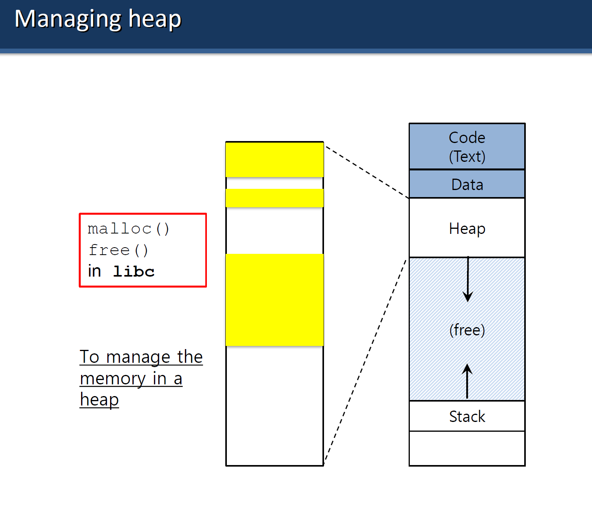

# 11. Hafta

## FREE SPACE



Bu slayt, **Heap Yönetimi** konusunu açıklıyor. Heap, programların çalışması sırasında **dinamik bellek tahsisi** yapılan bir bellek bölgesidir. Şimdi bu slaydı detaylı bir şekilde ele alalım:

---

### **1. Heap Bellek Bölgesi Nedir?**

- **Heap**, bir programın çalışması sırasında dinamik olarak bellek tahsis etmek için kullanılır.
- Heap bölgesi, **Code (Text)**, **Data**, **Stack** bölgeleri arasında bulunur ve **aşağı doğru genişler**.
- Bellek tahsis edilirken **malloc()** ve boşaltılırken **free()** işlevleri kullanılır.

---

### **2. Dinamik Bellek Yönetimi**

- **malloc() (Memory Allocation):**
    - Bellek tahsis eder.
    - Bu işlev, C kütüphanesinde (**libc**) bulunur.
    - Kullanıcı, ihtiyacına göre **belirli bir boyutta** bellek bloğu ayırır.
- **free():**
    - Tahsis edilmiş bellek alanını **geri serbest bırakır**.
    - Belleğin serbest bırakılması, daha sonra başka süreçler veya işler tarafından kullanılmasını sağlar.

---

### **3. Heap Yönetiminde Serbest (Free) Alan**

Slayttaki şemada gösterilen **Heap bölgesi**, şu şekilde düzenlenmiştir:

- **Code (Text) Bölgesi:** Programın çalıştırılabilir kodunu içerir. Statik bir alandır.
- **Data Bölgesi:** Global ve statik değişkenleri içerir.
- **Heap Bölgesi:** Dinamik bellek tahsis edilen alandır. Heap, **aşağı doğru büyür**.
- **Free (Boş) Alan:** Heap ile Stack arasında kalan boş alan. Dinamik bellek tahsisi buradan yapılır.
- **Stack Bölgesi:** Fonksiyon çağrıları ve yerel değişkenlerin tutulduğu bölge. Stack, **yukarı doğru büyür**.

---

### **4. Heap Alanı Yönetiminin Önemi**

- **Dinamik Bellek Kullanımı:**
    - Program çalışırken bellek ihtiyacı **öngörülemeyebilir**. Heap, bu belirsiz bellek taleplerini karşılar.
    - Örneğin: Bir dizi (array) boyutunun çalışma zamanında belirlendiği durumlarda `malloc()` kullanılır.
- **Serbest Bellek (Free Space):**
    - Heap ile Stack arasında geniş bir boş alan (free space) tutulur.
    - Bu boş alan, bellek taleplerinin karşılanabilmesi için kullanılır.
- **Bellek Sızıntıları (Memory Leaks):**
    - Eğer tahsis edilen bellek **free()** ile geri serbest bırakılmazsa, heap alanı zamanla dolar ve program çöker.
    - Bu durum, özellikle büyük ve uzun süre çalışan programlarda önemli bir sorundur.

---

### **5. Özet**

- Heap, **dinamik bellek tahsisi** için kullanılır.
- **malloc():** Bellek tahsis eder, **free():** Tahsis edilen belleği serbest bırakır.
- Heap, aşağı doğru büyüyerek boş alanı kullanır. Stack ise yukarı doğru büyür.
- Heap yönetiminde **boş alanların verimli kullanılması** ve bellek sızıntılarının önlenmesi kritik öneme sahiptir.

Bu açıklamalar, heap bölgesinin nasıl çalıştığını ve neden önemli olduğunu net bir şekilde gösteriyor.

---


Bu slayt, **Heap Bellek Yönetiminde Bölme (Splitting)** konusunu açıklıyor. Bölme, bir bellek tahsis isteğini karşılamak için büyük bir boş alanı **parçalara ayırarak** verimli bir şekilde kullanmayı sağlar.

---

### **1. 30-Byte Heap Görseli**

Heap, toplamda **30 byte**'lık bir alan olarak gösterilmiş ve şu şekilde bölümlendirilmiştir:

- **0-10 byte (free):** Boş alan.
- **10-20 byte (used):** Kullanılmış alan.
- **20-30 byte (free):** Boş alan.

Heap'teki boş alanlar, **free list** ile takip edilir.

---

### **2. Free List Yapısı**

Free list, boş bellek bloklarını (free chunks) takip eden bir **linked list** yapısıdır.

- **Head:** Free list’in başlangıç noktası.
- **addr:** Bellek bloğunun başlangıç adresi.
- **len:** Boş bellek bloğunun uzunluğu.
- **NULL:** Listenin sonunu belirtir.

Bu örnekte:

1. İlk boş blok: **addr: 0, len: 10** (başlangıç adresi 0, boyutu 10 byte).
2. İkinci boş blok: **addr: 20, len: 10** (başlangıç adresi 20, boyutu 10 byte).

---

### **3. Bölme (Splitting) Nedir?**

Bellek tahsis edilirken, bir isteği karşılamak için uygun bir boş blok bulunur. Ancak boş blok, isteğin boyutundan büyükse, bu blok **iki parçaya bölünür**:

1. **Birinci parça:** İstek boyutunu karşılayan parça tahsis edilir.
2. **İkinci parça:** Geriye kalan boş alan, free list'e geri eklenir.

---

### **4. Örnek Senaryo**

Diyelim ki bir program **5 byte**'lık bir bellek tahsis isteğinde bulunuyor:

1. Free list’ten ilk boş blok seçilir:
    - **addr: 0, len: 10**
2. Bu blok, 5 byte tahsis edildikten sonra **bölünür**:
    - İlk parça: **addr: 0, len: 5** → Tahsis edilen alan.
    - İkinci parça: **addr: 5, len: 5** → Kalan boş alan, free list'e geri eklenir.
3. Free list şu şekilde güncellenir:
    - İlk düğüm: **addr: 5, len: 5**
    - İkinci düğüm: **addr: 20, len: 10**

---

### **5. Avantajı ve Dezavantajı**

- **Avantaj:** Büyük boş blokların **bölünmesi**, belleği daha verimli kullanmayı sağlar. Küçük talepler hızlıca karşılanabilir.
- **Dezavantaj:** Küçük parçalar halinde kalan boş alanlar, zamanla **dışsal parçalanmaya** (external fragmentation) yol açabilir.

---

### **Özet**

- **Bölme (Splitting):** Büyük boş blokların, bellek tahsis isteğine göre ikiye bölünmesidir.
- Free list, boş alanları takip eden bir linked list yapısıdır.
- Bölme, bellek kullanımını artırır ancak küçük parçaların oluşmasına ve parçalanmaya sebep olabilir.

Bu işlem, heap yönetiminin önemli bir parçasıdır ve özellikle **dinamik bellek tahsisinde** verimliliği sağlar.

---


Bu slayt, **Heap Bellek Yönetiminde Bölme (Splitting)** konusuna devam ediyor ve **1 byte bellek tahsis isteği** senaryosunu örnek üzerinden açıklıyor. Şimdi detaylı bir şekilde ele alalım:

---

### **1. Durumun Başlangıcı**

- **30-Byte Heap:**
    - Heap’te iki adet **10-byte’lık boş segment** var:
        - İlk boş blok: **addr: 0, len: 10**
        - İkinci boş blok: **addr: 20, len: 10**
    - Kullanılmış alan (used): **10-20 byte**.
- **Free List:**
    - Boş alanlar **linked list** yapısı ile takip ediliyor:
        - İlk düğüm: **addr: 0, len: 10**
        - İkinci düğüm: **addr: 20, len: 10**

---

### **2. 1-Byte Bellek Tahsis İsteği**

- Program, heap’ten **1 byte**’lık bellek tahsis etmek istiyor.
- İlk 10-byte’lık boş blok (addr: 0) tahsis isteğini karşılamak için seçilir.

---

### **3. Bölme İşlemi (Splitting)**

- **Tahsis (Allocation):**
    - 1 byte’lık bellek, boş bloktan tahsis edilir.
    - Geriye kalan boş alan, yeni bir blok olarak free list'e eklenir.
- **Yeni Durum:**
    - İlk boş blok **ikiye bölünür**:
        1. **Tahsis Edilen Blok:** addr: 0, len: 1 (kullanılmış).
        2. **Kalan Boş Blok:** addr: 1, len: 9 (free).

---

### **4. Güncellenmiş Heap ve Free List**

- **Heap:**
    - 0-1 byte → **kullanılmış (used)**.
    - 1-10 byte → **boş (free)**.
    - 20-30 byte → **boş (free)**.
- **Free List:**
    - İlk düğüm: **addr: 1, len: 9** (kalan boş blok).
    - İkinci düğüm: **addr: 20, len: 10** (ikinci boş blok).

---

### **5. Bölmenin Etkisi**

- **Avantaj:**
    - Küçük bellek talepleri büyük boş bloklardan karşılanabilir.
    - Bellek kullanımında esneklik sağlanır.
- **Dezavantaj:**
    - Küçük boş blokların oluşmasına yol açar. Bu, zamanla **dışsal parçalanma (external fragmentation)** problemine neden olabilir.

---

### **6. Özet**

- Bir bellek tahsis isteği, uygun boyutta bir boş bloktan karşılanır.
- Eğer boş blok, istekten büyükse bölme (splitting) yapılır:
    - İstek kadar alan tahsis edilir.
    - Geriye kalan boş alan, free list’e eklenir.
- **Sonuç:** Bellek kullanımı artar ancak küçük blokların oluşmasıyla dışsal parçalanma riski ortaya çıkar.

Bu örnek, bölme işleminin nasıl çalıştığını ve free list yapısının nasıl güncellendiğini net bir şekilde gösteriyor.

---


Bu slayt **Coalescing (Boş Bellek Bloklarını Birleştirme)** konusunu açıklıyor. Coalescing, bellekte bitişik olan serbest blokları birleştirerek **tek büyük bir boş alan** oluşturmayı sağlar. Şimdi detaylı bir şekilde ele alalım:

---

### **1. Problemin Tanımı**

Bir kullanıcı, tahsis isteği sırasında **mevcut boş bloklardan daha büyük bir bellek** talep edebilir:

- Free list'te bulunan küçük boş bloklar, isteği karşılayacak boyutta değildir.
- Örneğin: Kullanıcı 30 byte’lık bir alan talep ediyor, ancak free list'te 3 adet 10 byte’lık bitişik boş blok mevcut.

---

### **2. Coalescing (Birleştirme) Nedir?**

**Coalescing**, bitişik adreslerdeki boş blokları **tek bir büyük boş blok** haline getirir.

- Bellek yönetimi, serbest bırakılan blokların adreslerini kontrol eder.
- Eğer iki veya daha fazla blok **bitişik adreslerde** yer alıyorsa, bunlar **birleştirilir**.

---

### **3. Görselin Açıklaması**

### **Başlangıç Durumu (Üstteki Şema):**

- **Free List:**
    1. **addr: 10, len: 10** → 10 byte boş alan.
    2. **addr: 0, len: 10** → 10 byte boş alan.
    3. **addr: 20, len: 10** → 10 byte boş alan.
- Bu bloklar **bitişik adreslerde** yer alıyor ancak ayrı ayrı tutuluyor.

### **Coalescing Sonrası (Alttaki Şema):**

- **Birleştirme (Coalescing):**
    - Bitişik olan serbest bloklar birleştirildi.
    - 0’dan başlayan ve 30 byte’lık tek bir büyük boş blok oluşturuldu.
- **Yeni Free List:**
    - **addr: 0, len: 30** → Artık 30 byte’lık tek bir boş blok var.

---

### **4. Avantajları**

1. **Büyük Tahsis Taleplerinin Karşılanması:**
    - Coalescing, büyük boyutlu bellek isteklerini karşılamak için **tek bir büyük boş blok** oluşturur.
2. **Dışsal Parçalanmanın Azaltılması:**
    - Küçük boş blokların birleşmesiyle bellek alanı daha verimli kullanılır.

---

### **5. Özet**

- **Coalescing:** Bitişik serbest blokları tek bir büyük blok haline getirir.
- **Amaç:** Büyük bellek taleplerini karşılamak ve dışsal parçalanmayı azaltmak.
- **Görsel:**
    - Başlangıçta ayrı ayrı tutulan **10 byte’lık 3 blok**, coalescing ile **30 byte’lık tek bir blok** haline getirilmiştir.

Bu işlem, dinamik bellek yönetiminin önemli bir parçasıdır ve sistemin bellek verimliliğini artırır.

---

Bu slayt, **dinamik bellek yönetimi** ile ilgili **tahsis edilen alanların boyutunun nasıl takip edildiğini** ve **free()** işlevinin çalışma prensibini açıklıyor. Ayrıca **malloc()** tarafından kullanılan **header** yapısını ve **free list** yapısına nasıl gömüldüğünü gösteriyor. Şimdi detaylı bir şekilde ele alalım:

---

### **1. free() ve Bellek Boyutunu Takip Etme**

- *free(void ptr)* işlevine yalnızca bir pointer (adres) verilir.
- Ancak **malloc()** ile tahsis edilen belleğin boyutu **free()** tarafından bilinmelidir.
- Soru: **free() bu boyutu nasıl biliyor?**

**Çözüm:**

- **Header:** Bellek tahsis edilirken, malloc() işlevi tahsis edilen bölgenin başına bir **header** ekler.
- Header, **tahsis edilen alanın boyutunu** ve **kontrol için sihirli bir sayı (magic number)** içerir.

---

### **2. Header Yapısının Kullanımı**

**Header Yapısı:**

```c
typedef struct __header_t {
    int size;   // Tahsis edilen bellek bölgesinin boyutu
    int magic;  // Kontrol amaçlı sihirli sayı
} header_t;
```

### **Bellek Tahsisi Örneği:**

```c
ptr = malloc(20);
```

1. malloc() çalışırken:
    - Kullanıcıya **20 byte** tahsis eder.
    - Ek olarak **header** boyutunu da ekler.
    - Header’ın boyutu: **sizeof(header_t) = 8 byte** (2 adet `int` alanı).
    - **Toplam Tahsis Edilen Alan:** 20 byte (kullanıcı alanı) + 8 byte (header) = **28 byte**.
2. Header, tahsis edilen bölgenin **başına** eklenir ve kullanıcıya **20 byte**'lık alanın başlangıcı (**ptr**) döner.

---

### **3. free() ile Header’a Erişim**

**free(void *ptr)**, header’ı kullanarak tahsis edilen bölgenin boyutunu geri alır.

- **ptr:** Kullanıcıya döndürülen bellek adresi.
- **Header Pointer (hptr):**
    - **ptr**’nin başına giderek header adresini hesaplar:
    
    ```c
    header_t *hptr = (void *)ptr - sizeof(header_t);
    ```
    
    - **ptr’den header boyutu çıkarılır** ve header’ın başlangıcına gidilir.

### **Örnek Kod:**

```c
void free(void *ptr) {
    header_t *hptr = (void *)ptr - sizeof(header_t);  // Header’ın adresini hesapla
    assert(hptr->magic == 1234567);                  // Sihirli sayıyı kontrol et
    ...
}
```

- **Sihirli Sayı Kontrolü (Magic Number):**
    - Header’daki **magic** değeri kontrol edilir.
    - Eğer değer doğru değilse, bellek hatası (memory corruption) tespit edilir.

---

### **4. Free List Yapısının Gömülmesi**

Bellek geri verildiğinde boş alanlar **free list** adı verilen bir yapıda tutulur.

**Free List Yapısı:**

```c
typedef struct __node_t {
    int size;                // Boş alanın boyutu
    struct __node_t *next;   // Bir sonraki boş alan
} node_t;
```

- **Geri Dönen Bellek:** Free list’e bir düğüm olarak eklenir.
- **size:** Boş alanın boyutunu gösterir.
- **next:** Bir sonraki boş alanı işaret eder.

---

### **5. Özet**

1. **malloc() Kullanımı:**
    - Tahsis edilen bölgenin başına bir **header** eklenir.
    - Header, boyut bilgisi (**size**) ve kontrol amaçlı sihirli sayı (**magic**) içerir.
2. **free() Kullanımı:**
    - Pointer, header başlangıcını bulmak için geri gider.
    - Header’daki boyut ve kontrol bilgileri kullanılır.
3. **Free List Yapısı:**
    - Geri verilen bellek blokları, **free list** adlı bağlı liste yapısında tutulur.

Bu yapı sayesinde bellek tahsisi ve serbest bırakma işlemleri düzgün bir şekilde takip edilir ve hatalar (örneğin bellek taşmaları) tespit edilebilir.

---

Bu slayt, **Heap Başlatma (Heap Initialization)** ve **Free List Kullanımı ile Dinamik Bellek Tahsisi** konularını açıklıyor. **mmap()** kullanılarak bir bellek alanının nasıl başlatıldığı ve serbest blokların nasıl tahsis edildiği ele alınıyor.

---

### **1. Heap Başlatma (Heap Initialization)**

### **mmap() ile Bellek Ayırma**

`mmap()` sistem çağrısı, bir işlem için bellek tahsis etmek için kullanılır.

**Kod:**

```c
node_t *head = mmap(NULL, 4096, PROT_READ|PROT_WRITE, MAP_ANON|MAP_PRIVATE, -1, 0);
```

- **NULL:** Bellek adresinin otomatik olarak atanmasını sağlar.
- **4096:** **4KB**’lik bir bellek alanı tahsis edilir.
- **PROT_READ | PROT_WRITE:** Bellek **okuma** ve **yazma** izinleri ile kullanılır.
- **MAP_ANON | MAP_PRIVATE:**
    - **MAP_ANON:** İsimsiz (anonim) bellek tahsisi. Dosya ile ilişkili değildir.
    - **MAP_PRIVATE:** Bellek, bu işlem tarafından **özel** olarak kullanılır.
- **1, 0:** Dosya tanımlayıcısı gerekmeyen anonim bellek için kullanılır.

---

### **Free List Başlangıcı**

- **head:** Free list’in başlangıcını temsil eder.
- **Header Bilgisi:** İlk düğümün başına bir header eklenir.
    - **size:** 4KB'den header boyutu çıkarılarak hesaplanır:
        
        ```c
        head->size = 4096 - sizeof(node_t);  // 4088 byte
        ```
        
    - **next:** İlk düğümde bir sonraki boş alan olmadığı için NULL (0).

**Başlangıç Durumu:**

- Free List’in İlk Düğümü:
    - **size:** 4088 byte (kullanılabilir alan).
    - **next:** NULL.

---

### **2. Free List Kullanımı: Bellek Tahsisi**

Bellek isteği geldiğinde:

1. **Uygun Boyuttaki Boş Alan Bulunur:**
    - Free list’te istenilen boyutu karşılayacak kadar büyük bir blok aranır.
2. **Blok Bölünür (Splitting):**
    - Büyük bir boş blok ikiye bölünür:
        - **Birincisi:** Kullanıcının isteğini karşılamak için tahsis edilen alan.
        - **İkincisi:** Kalan boş alan (free chunk).
3. **Free List Güncellenir:**
    - Tahsis edilen alan, free list’ten çıkarılır.
    - Geriye kalan boş alan (free chunk) free list’e eklenir ve boyutu güncellenir.

---

### **3. Örnek Senaryo**

### **Başlangıç Durumu:**

- 4KB’lik bir alan başlatılır.
- İlk free list düğümü:
    - **size = 4088 byte**
    - **next = NULL**

### **1. Bellek Tahsis İsteği:**

Diyelim ki kullanıcı **500 byte**'lık bir bellek ister:

1. Free list'teki ilk düğüm (**4088 byte**) isteği karşılayacak kadar büyüktür.
2. Blok bölünür:
    - **500 byte** → Kullanıcıya tahsis edilir.
    - **3588 byte** → Geriye kalan boş alan olarak free list’te güncellenir.

### **Free List’in Güncellenmesi:**

- İlk düğümün **size** değeri 3588 olarak güncellenir.
- **next:** NULL olarak kalır.

---

### **4. Özet**

- **Heap Başlatma:** `mmap()` ile bellek tahsis edilir ve free list’in başlatılması sağlanır.
- **Free List Kullanımı:**
    - Bellek isteği geldiğinde büyük bir boş blok **bölünerek** kullanılır.
    - Free list güncellenir ve kalan boş alan takip edilir.
- **Avantajı:**
    - Bellek verimli şekilde kullanılır.
    - Büyük blokların bölünmesi, küçük taleplerin hızlıca karşılanmasını sağlar.

Bu yapı, dinamik bellek tahsisinin nasıl yönetildiğini ve free list'in nasıl kullanıldığını açıkça gösteriyor.

---

### **Bellek Tahsisi (Allocation)**

Dinamik bellek tahsisi sürecinde bir kullanıcı, belirli bir boyutta bellek alanı ister (örneğin `malloc(500)`):

1. **Free List Aranır:**
    - Bellek yöneticisi (malloc kütüphanesi), **free list**'te kullanıcının talep ettiği boyutu karşılayacak bir **boş blok** arar.
    - Free list, boş blokları adres ve boyut bilgisiyle tutan bir **linked list**'tir.
2. **Uygun Blok Bulunduğunda Bölme (Splitting) Yapılır:**
    - Eğer boş blok, isteğin boyutundan **büyükse**, blok **ikiye bölünür**:
        - İlk parça: Kullanıcının isteğini karşılar.
        - İkinci parça: Kalan boş alan, free list'e geri eklenir.
3. **Header Ekleme:**
    - Tahsis edilen bloğun başına bir **header** eklenir.
    - Header, tahsis edilen bölgenin **boyutunu** ve **kontrol amacıyla sihirli bir sayı (magic number)** içerir.
    - Kullanıcıya header'ın **hemen sonrasındaki adres** döndürülür.
4. **Free List Güncellenir:**
    - Tahsis edilen alan, free list’ten çıkarılır.
    - Kalan boş alan varsa (splitting sonrası), free list’te yeni bir düğüm olarak eklenir.

---

### **Kod Örneği:**

Bellek tahsisi sürecinde basit bir örnek:

```c
void *malloc(size_t size) {
    node_t *current = head;

    while (current) {
        if (current->size >= size) {      // Uygun boyutlu blok bulundu
            // Bölme işlemi
            int remaining = current->size - size - sizeof(node_t);
            if (remaining > 0) {
                node_t *new_node = (node_t *)((void *)current + sizeof(node_t) + size);
                new_node->size = remaining;
                new_node->next = current->next;
                current->next = new_node;
            }

            current->size = size;         // Tahsis edilen boyutu güncelle
            return (void *)((char *)current + sizeof(node_t)); // Kullanıcıya header sonrası alanı döndür
        }
        current = current->next;
    }
    return NULL; // Yeterli boş blok bulunamazsa NULL döner
}
```

---

### **Özet: Allocation Süreci**

1. Free list’te uygun bir blok aranır.
2. Büyük bir blok bulunursa **bölme (splitting)** yapılır.
3. Tahsis edilen alanın başına bir **header** eklenir.
4. Free list güncellenir, kalan boş alan takip edilir.

Allocation, belleği verimli kullanmayı sağlar ancak **dışsal parçalanma (external fragmentation)** gibi sorunlara yol açabilir.

---


Bu slayt, **free list kullanarak bellek tahsisi (allocation)** sürecinin nasıl gerçekleştiğini bir örnek üzerinden açıklıyor. Özellikle **malloc(100)** gibi bir isteğin **header** yapısıyla birlikte nasıl işlendiğini detaylandırıyor.

---

### **1. Başlangıç Durumu: 4KB Heap ile Tek Bir Boş Blok**

- **Başlangıç Heap:**
    - **Toplam Bellek:** 4KB (4096 byte).
    - **Free List:** Tek bir boş blok içerir:
        - **size:** 4088 byte (4KB - header boyutu olan 8 byte).
        - **next:** NULL (boş blok listesinde başka düğüm yok).
- Burada **4088 byte**, kullanıcı tarafından kullanılabilir bellek boyutudur.

---

### **2. malloc(100) İsteği**

Bir kullanıcı, **100 byte** bellek isteğinde bulunuyor:

- Header boyutu **8 byte** olduğundan, toplam tahsis edilen alan:
    
    $$
    100 \, \text{(istek)} + 8 \, \text{(header)} = 108 \, \text{byte}.
    $$
    

---

### **3. Bellek Tahsis İşlemi**

1. **Free Blok Bulma:**
    - Free list taranır ve 108 byte’ı karşılayabilecek ilk uygun blok bulunur.
    - Burada mevcut **4088 byte**'lık blok seçilir.
2. **Blok Bölünmesi (Splitting):**
    - Tahsis edilen alan, **100 byte** kullanıcı alanı + **8 byte header** içerir.
    - Geriye kalan boş alan hesaplanır:
        
        $$
        4088 \, \text{(mevcut)} - 108 \, \text{(tahsis edilen)} = 3980 \, \text{byte}.
        $$
        
3. **Free List Güncelleme:**
    - Tahsis edilen blok artık kullanılmaktadır.
    - Kalan boş alan (3980 byte), free list’te yeni bir düğüm olarak güncellenir.
    - **next:** NULL olarak kalır çünkü başka boş blok yoktur.

---

### **4. Sonuç: Heap ve Free List Durumu**

### **Tahsis Edilmiş Bölge:**

- **Header:**
    - **size:** 100 (kullanıcıya tahsis edilen alanın boyutu).
    - **magic:** 1234567 (kontrol amaçlı sihirli sayı).
- Kullanıcıya döndürülen adres (`ptr`), header’ın hemen sonrasını işaret eder.

### **Free List:**

- Geriye kalan **3980 byte**'lık boş blok, free list’te güncellenmiştir.

---

### **5. Özet**

- **malloc(100):** 108 byte tahsis edilir (header dahil).
- **Blok Bölünmesi:** Büyük boş blok iki parçaya ayrılır:
    - **Tahsis Edilen Alan:** 108 byte.
    - **Geri Kalan Boş Alan:** 3980 byte (free list’te güncellenir).
- Free list, kalan boş alanı takip ederek bellek yönetimini verimli hale getirir.

Bu örnek, **header kullanımı**, **blok bölünmesi** ve **free list güncellenmesi** süreçlerini net bir şekilde gösteriyor.

---


Bu slayt, **free space** (boş alan) üzerinde tahsis edilmiş (allocated) bellek parçalarını ve bir bellek bloğunun **serbest bırakılmaya hazırlandığını** gösteriyor. Şimdi bu durumu detaylı bir şekilde ele alalım.

---

### **1. Durumun Genel Görünümü**

- **Toplam Bellek:** 4KB heap alanı.
- Heap üzerinde **üç adet 100 byte’lık tahsis edilmiş bellek bloğu** var.
- Geriye kalan **3764 byte**'lık bir boş alan, free list tarafından takip ediliyor.

---

### **2. Bellek Yapısı: Header Kullanımı**

Her tahsis edilmiş blok, bir **header** içerir:

- **Header Boyutu:** 8 byte.
- **Header Alanları:**
    - **size:** Kullanıcıya tahsis edilen bellek alanının boyutu.
    - **magic:** Kontrol amaçlı sihirli sayı (örneğin `1234567`).

---

### **3. Bellek Tahsis Durumu**

- **Üstteki 3 Blok:**
    - Her biri **100 byte** tahsis edilmiş bellek alanıdır.
    - **Header:** Bu 100 byte'lık kullanıcı alanının hemen başında yer alır.
- **Özel Durum:**
    - **İkinci Blok:** `sPtr` işaretçisi bu bloğu işaret ediyor.
    - **Not:** Bu blok **serbest bırakılmak üzere (about to be freed)**.
- **En Alttaki Boş Blok:**
    - **size:** 3764 byte (kullanılabilir boş alan).
    - **next:** 0 (free list'in sonunda).
    - Bu blok, free list tarafından takip edilen tek boş alan.

---

### **4. Serbest Bırakma (Free) İşlemi**

Eğer `free(sPtr)` çağrılırsa:

1. **Header Adresi Bulunur:**
    - Kullanıcıya döndürülen `sPtr` işaretçisi, header’ın hemen sonrasını gösterir.
    - Header adresi:
        
        $$
        \text{header} = \text{sPtr} - \text{sizeof(header)}
        $$
        
2. **Blok Serbest Bırakılır:**
    - Blok, free list’e geri eklenir.
    - Serbest bırakılan bloğun boyutu (`size`) free list’e eklenir.
    - Eğer bitişik boş bloklar varsa **coalescing** (birleştirme) yapılır.

---

### **5. Özet**

- Heap üzerinde **üç adet tahsis edilmiş blok** var:
    - Her biri **100 byte** kullanıcı alanı içeriyor.
    - Header, her bloğun başında bulunur ve boyut/magic bilgisini tutar.
- Boş alan: **3764 byte**, free list tarafından takip ediliyor.
- **Serbest Bırakma İşlemi:**
    - Bir blok serbest bırakıldığında, free list'e eklenir ve gerekirse bitişik boş bloklarla birleştirilir (**coalescing**).

Bu yapı, **dinamik bellek tahsisinde** nasıl çalıştığını ve free list’in boş alanları nasıl takip ettiğini net bir şekilde gösteriyor

---

Bu slayt **Heap’in Büyümesi** ve **Serbest Alan Yönetimi Stratejileri** hakkında detaylı bilgi veriyor. Heap, dinamik bellek tahsisi sırasında OS’den ek bellek talep edilerek büyütülebilir ve serbest alan yönetimi için çeşitli stratejiler kullanılır. Şimdi tüm konuları detaylıca açıklayalım:

---

## **1. Heap’in Büyümesi (Growing the Heap)**

### **Küçük Heap ile Başlama**

- Bellek yöneticileri (allocator), heap’i başlangıçta **küçük bir boyutla** başlatır.
- Heap alanı yetersiz kaldığında, işletim sisteminden **ek bellek** isteğinde bulunur.

### **UNIX Sistemlerinde sbrk() ve brk() Kullanımı**

- **sbrk()** ve **brk():** Heap alanını büyütmek için kullanılan sistem çağrılarıdır.
    - **sbrk(increment):** Heap sınırını artırarak ek bellek sağlar.
    - **brk(address):** Heap sınırını doğrudan belirtilen adrese ayarlar.

**Örnek:**

```c
void *ptr = sbrk(0);  // Mevcut heap sınırını al
sbrk(4096);           // Heap’i 4KB büyüt
```

- Heap alanı **dinamik olarak genişletilir** ve bu ek alan serbest bellek listesine (free list) eklenir.

---

## **2. Serbest Alan Yönetimi Stratejileri**

Serbest bellek alanlarını verimli kullanmak için farklı stratejiler uygulanır:

### **a) Best Fit**

- **Tanım:** İstek boyutunu karşılayacak kadar büyük olan serbest bloklardan **en küçük olanı** seçilir.
- **Avantajı:** Bellek alanı daha verimli kullanılır, büyük bloklar daha sonra büyük tahsisler için korunur.
- **Dezavantajı:**
    - **Yavaş:** Tüm free list taranır ve en uygun blok aranır.
    - Küçük, kullanılmayan boşluklar oluşturabilir (**dışsal parçalanma**).

---

### **b) Worst Fit**

- **Tanım:** Serbest bloklardan **en büyüğü** seçilir ve isteğin boyutu kadar alan tahsis edilir.
- **Avantajı:** Büyük bloklar bölündüğü için kalan parçalar diğer isteklere tahsis edilebilir.
- **Dezavantajı:**
    - Parçalanma oluşabilir.
    - Büyük bloklar bölünerek küçük parçalar oluşturduğu için bellek etkinliği azalabilir.

---

### **c) First Fit**

- **Tanım:** Free list’te dolaşılarak isteği karşılayacak **ilk uygun serbest blok** seçilir.
- **Avantajı:**
    - **Hızlıdır:** İlk uygun blok bulunduğunda işlem sonlanır.
    - Basit bir algoritmadır.
- **Dezavantajı:**
    - Belleğin başlarında küçük boşluklar kalabilir, bu da parçalanmaya yol açar.

---

### **d) Next Fit**

- **Tanım:** First Fit’e benzer ancak arama **bir önceki bakılan yerden** başlar.
- **Avantajı:**
    - Önceki noktadan başlamak, aynı blokların sürekli taranmasını önler.
    - Büyük bellek listelerinde performansı artırabilir.
- **Dezavantajı:**
    - Belleğin başında daha büyük parçalar kalabilir, bu da parçalanmayı artırabilir.

---

## **3. Özet: Stratejilerin Karşılaştırması**

| **Strateji** | **Tanım** | **Avantajı** | **Dezavantajı** |
| --- | --- | --- | --- |
| **Best Fit** | En küçük uygun serbest blok seçilir | Bellek verimli kullanılır | Yavaştır, parçalanma oluşur |
| **Worst Fit** | En büyük serbest blok seçilir | Büyük bloklar korunur | Parçalanma riski vardır |
| **First Fit** | İlk uygun blok seçilir | Hızlı ve basittir | Küçük parçalanmalar olur |
| **Next Fit** | Önceki yerden devam eder | Performansı artırabilir | Büyük parçalar kalabilir |

---

Bu stratejiler, sistemin bellek kullanımına ve performansına göre seçilir. Eğer bir uygulama **hız** arıyorsa **First Fit** tercih edilirken, **parçalanmayı önlemek** için **Best Fit** seçilebilir.

---


Bu slayt, **Bellek Tahsisi Stratejileri** için **Best-Fit** ve **Worst-Fit** yaklaşımlarının nasıl çalıştığını bir örnek üzerinden açıklıyor. Verilen **15 byte’lık tahsis isteği** sonucunda iki farklı stratejinin davranışlarını ele alıyor. Şimdi detaylı bir şekilde inceleyelim:

---

### **1. Başlangıç Durumu**

- **Allocation Request (Tahsis İsteği):** 15 byte.
- **Free List (Serbest Blok Listesi):**
    - **10 → 30 → 20 → NULL**
    - Burada serbest blokların boyutları sırasıyla **10, 30 ve 20 byte**.

---

### **2. Best-Fit Stratejisi**

**Tanım:** Tahsis isteğini karşılayabilecek en küçük uygun serbest blok seçilir.

### **Adımlar:**

1. **15 byte** isteği için **10, 30 ve 20** byte’lık bloklar incelenir.
2. **30 byte** bloğu en küçük uygun bloktur (çünkü 20 byte’lık blok isteği karşılayamayacak kadar küçüktür).
3. **30 byte’lık blok bölünür:**
    - **15 byte** tahsis edilir.
    - Geriye kalan **5 byte** serbest blok olarak free list’e eklenir.

### **Sonuç:**

- Free List: **10 → 15 → 5 → NULL**

---

### **3. Worst-Fit Stratejisi**

**Tanım:** Tahsis isteği için **en büyük serbest blok** seçilir.

### **Adımlar:**

1. **15 byte** isteği için serbest bloklar incelenir.
2. **30 byte** en büyük serbest blok olarak seçilir.
3. **30 byte’lık blok bölünür:**
    - **15 byte** tahsis edilir.
    - Geriye kalan **15 byte** serbest blok olarak free list’e eklenir.

### **Sonuç:**

- Free List: **10 → 15 → 20 → NULL**

---

### **4. Karşılaştırma**

| **Strateji** | **Seçilen Blok** | **Geriye Kalan** | **Free List Sonucu** |
| --- | --- | --- | --- |
| **Best-Fit** | 30 byte | 5 byte | **10 → 15 → 5 → NULL** |
| **Worst-Fit** | 30 byte | 15 byte | **10 → 15 → 20 → NULL** |

---

### **5. Gözlemler**

1. **Best-Fit:**
    - En küçük uygun bloğu seçtiği için daha küçük bir serbest alan oluşturur (**5 byte**).
    - Bellek verimliliği sağlar ancak küçük parçalar zamanla **dışsal parçalanmaya** yol açabilir.
2. **Worst-Fit:**
    - En büyük bloğu seçtiği için geriye kalan serbest alan daha büyük olur (**15 byte**).
    - Büyük blokların bölünmesi, gelecekteki büyük tahsis isteklerini karşılamayı kolaylaştırır.

---

### **Sonuç**

- **Best-Fit:** Belleği daha verimli kullanır ancak küçük bloklar oluşturarak parçalanma riskini artırır.
- **Worst-Fit:** Büyük tahsisler için uygundur ancak serbest alanı daha az verimli kullanabilir.

Bu örnek, iki stratejinin farklı senaryolarda nasıl çalıştığını açıkça gösteriyor.

---

Bu slayt, **Segregated List** yapısını açıklıyor. Segregated list, bellek tahsisinde **popüler boyutlu istekleri hızlı ve verimli şekilde karşılamak** için kullanılan bir stratejidir. Şimdi detaylı bir şekilde ele alalım:

---

## **1. Segregated List Nedir?**

**Segregated List** stratejisinin temel fikri:

- **Aynı boyuttaki bellek istekleri için ayrı listeler (havuzlar) tutmak.**
- **Popüler boyuttaki talepler:** Uygulamanın sıkça yaptığı bellek tahsis istekleri, bu listelerde tutulur.
- **Diğer istekler:** Daha genel bir bellek tahsis mekanizmasına yönlendirilir (örneğin, malloc/free veya genel free list).

---

## **2. Segregated List’in Avantajları**

1. **Parçalanma (Fragmentation) Azalır:**
    - Belirli bir boyut için ayrılmış bellek blokları olduğundan, küçük parçalara bölünme veya büyük boşluklar oluşma sorunu azalır.
2. **Hızlı Tahsis ve Serbest Bırakma:**
    - Popüler boyuttaki istekler için özel listeler kullanıldığı için:
        - **Arama süresi** çok kısadır.
        - Serbest bırakma işlemi hızlıdır.
3. **Basit Yönetim:**
    - Aynı boyutta blokları tek bir listede tutmak, yönetimi kolaylaştırır.

---

## **3. Zorluklar (Yeni Komplikasyonlar)**

Bu yaklaşım bazı yeni sorunlar da doğurur:

1. **Bellek Havuzu Yönetimi:**
    - **Ne kadar bellek** belirli boyutlu istekler için ayrılmalı?
    - Bu havuz fazla büyük olursa, bellek israfı oluşur.
    - Fazla küçük olursa, istekleri karşılamak için genel tahsis mekanizmasına dönmek gerekebilir.
2. **Genel Havuz ile Özel Havuz Arasındaki Denge:**
    - Özel boyutlu istekler için ayrılan bellek havuzlarının boyutları **dinamik olarak ayarlanmalı**.
    - Genel tahsis sistemine fazla yük binmemesi sağlanmalı.

---

## **4. Slab Allocator: Segregated List’in Gelişmiş Versiyonu**

- **Slab Allocator** (Jeff Bonwick tarafından geliştirilmiştir):
    - **Solaris çekirdeğinde** kullanılmak üzere tasarlanmış bir bellek tahsis mekanizmasıdır.
    - **Slab:** Aynı tür ve aynı boyuttaki nesneler için ayrılmış bellek bloklarıdır.
    - **Avantajları:**
        - **Hızlı tahsis ve serbest bırakma** sağlar.
        - **Parçalanma** sorununu azaltır.
        - **Dinamik Havuz Yönetimi:** İhtiyaca göre slab boyutları ayarlanır.

---

## **5. Özet**

1. **Segregated List:**
    - Belirli boyuttaki bellek istekleri için **özel listeler** tutulur.
    - Bu yapı, hız ve parçalanma azaltma avantajı sağlar.
2. **Avantajları:**
    - Hızlı tahsis ve serbest bırakma.
    - Düşük parçalanma.
3. **Zorlukları:**
    - Bellek havuzu yönetimi (ne kadar bellek ayrılmalı?).
    - Genel ve özel tahsis havuzları arasında denge kurmak.
4. **Slab Allocator:**
    - Segregated list’in daha gelişmiş ve dinamik bir versiyonudur.
    - Büyük sistemlerde bellek yönetimi sorunlarını başarılı şekilde çözer.

Bu strateji, özellikle **kernel** seviyesinde hızlı ve verimli bellek tahsisi için yaygın olarak kullanılır.

---

**Buddy System**, bellek tahsisi için kullanılan bir algoritmadır. Büyük bellek bloklarını **ikiye bölerek** daha küçük bloklar elde eder ve ihtiyaca göre **birleştirerek (coalesce)** boş alanları yeniden kullanır. Şimdi Buddy System’i detaylı bir şekilde inceleyelim:

---

## **1. Buddy System Nedir?**

Buddy System’in temel çalışma prensibi şudur:

- **Büyük bir bellek bloğu** ile başlar (örneğin 64KB).
- Bellek isteğini karşılamak için bu bloklar **tekrar tekrar ikiye bölünür**.
- Her bölünmede oluşan iki parçadan biri, diğerinin **buddy'si (ikizi)** olarak adlandırılır.
- Minimum blok boyutu genellikle **32 byte** olarak kabul edilir.
- Kullanılan blokların ve boş alanların takibi için **bitmap** veya bir serbest liste kullanılır.

---

## **2. Detaylı Adımlar: Bellek Tahsisi Örneği**

### **Başlangıç:**

- **Toplam Bellek:** 512 byte (örnek olarak).
- **Minimum Blok Boyutu:** 32 byte.

---

### **Adım 1: 256 Byte Tahsis Etme**

1. **512 byte’lık blok** ikiye bölünür:
    - **A (256 byte)** ve **A’ (256 byte)**.
2. **A’** serbest listeye (free list) eklenir.
3. **A** tekrar ikiye bölünmez çünkü 256 byte istenmişti.
4. **B bloğu (256 byte)** kullanıcıya tahsis edilir.

**Durum:**

- Serbest Liste: **256 byte → A’**

---

### **Adım 2: 128 Byte Tahsis Etme**

1. **A’ (256 byte)** ikiye bölünür:
    - **B (128 byte)** ve **B’ (128 byte)**.
2. **B’** serbest listeye eklenir.
3. **C bloğu (128 byte)** kullanıcıya tahsis edilir.

**Durum:**

- Serbest Liste: **128 byte → B’**

---

### **Adım 3: 64 Byte Tahsis Etme**

1. **B’ (128 byte)** ikiye bölünür:
    - **C (64 byte)** ve **C’ (64 byte)**.
2. **C’** serbest listeye eklenir.
3. **D bloğu (64 byte)** kullanıcıya tahsis edilir.

**Durum:**

- Serbest Liste: **64 byte → C’**

---

### **Adım 4: 128 Byte Tahsis Etme**

1. **A’ (256 byte)** tekrar bölünür:
    - **E (128 byte)** ve **E’ (128 byte)**.
2. **E’** serbest listeye eklenir.
3. **E (128 byte)** ikiye bölünür:
    - **F (128 byte)** ve **F’ (128 byte)**.
4. **F bloğu kullanıcıya tahsis edilir.**

**Durum:**

- Serbest Liste: **128 byte → F’**

---

## **3. Bellek Serbest Bırakma ve Birleştirme (Coalescing)**

Buddy System’in en önemli özelliği, **bitişik boş blokların birleştirilmesi** (coalescing) yeteneğidir.

- Serbest bırakılan bir blok, **buddy’si** kontrol edilir.
- Eğer buddy de serbestse, bu iki blok birleştirilir ve daha büyük bir blok oluşturulur.
- Bu işlem, bloklar tekrar **en büyük boyuta** ulaşana kadar devam eder.

---

## **4. Buddy System’in Avantajları**

1. **Hızlı Tahsis ve Birleştirme:**
    - Bloklar yalnızca ikiye bölünerek veya birleştirilerek yönetildiği için algoritma hızlıdır.
2. **Dışsal Parçalanmanın Azalması:**
    - Boş bloklar sürekli birleştirildiği için büyük boşluklar kolayca oluşturulabilir.
3. **Takibin Kolaylığı:**
    - Bellek bloklarının takibi **bitmap** veya serbest listelerle kolayca yapılır.

---

## **5. Dezavantajları**

1. **İçsel Parçalanma:**
    - Bloklar yalnızca **ikiye bölünebildiği** için, isteğin boyutuna tam uymayan bloklarda kullanılmayan alan oluşabilir.
2. **Buddy Kontrolü:**
    - Birleştirme (coalescing) sırasında buddy’lerin takibi için ek kontrol gereklidir.

---

## **6. Özet**

- **Buddy System:** Büyük blokları ikiye bölerek küçük bloklar oluşturur ve bitişik boş blokları birleştirir.
- **Tahsis Süreci:** Bellek istekleri en küçük yeterli bloktan karşılanır.
- **Birleştirme:** Serbest bloklar birleştirilerek büyük boş alanlar elde edilir.
- **Avantaj:** Hızlı, parçalanma azdır.
- **Dezavantaj:** İçsel parçalanma ve ek kontrol maliyeti vardır.

Buddy System, özellikle **hızlı tahsis** ve **verimli bellek yönetimi** gereken sistemlerde sıkça kullanılır.

---

## PAGING

[Dosyadan Okunan Not](https://www.notion.so/Dosyadan-Okunan-Not-15ee67fac61d80c2adc5da0c0c1ef393?pvs=21)

### **Paging Kavramı**

**Paging**, bellek yönetimi için kullanılan bir tekniktir ve adres alanını **sabit boyutlu sayfalara** ayırarak çalışır. Bu yöntem, bellek tahsisinde esneklik ve yönetim kolaylığı sağlar. Şimdi detaylıca ele alalım:

---

## **1. Paging Nedir?**

### **Mantıksal ve Fiziksel Belleğin Bölünmesi**

- **Paging:** Mantıksal adres alanını **sabit boyutlu birimler** olan **sayfalara** (pages) böler.
- **Fiziksel Bellek:** Aynı şekilde sabit boyutlu birimler olan **sayfa çerçevelerine (page frames)** bölünür.
    - **Page (Sayfa):** Mantıksal bellek birimi.
    - **Page Frame (Sayfa Çerçevesi):** Fiziksel bellek birimi.

### **Segmentation ile Karşılaştırma**

- **Segmentation:** Değişken boyutlu mantıksal segmentler (code, heap, stack vb.).
- **Paging:** Sabit boyutlu sayfalar kullanır.

---

## **2. Sanal Adres ile Fiziksel Adres Dönüşümü**

Her işlem için **sayfa tablosu (page table)** kullanılır:

- **Sayfa Tablosu:** Mantıksal adres (sanal adres) ile fiziksel adres arasındaki dönüşümü sağlar.
- **Sanal Adres:**
    - **Sayfa Numarası (Page Number):** Sayfanın adres alanındaki konumunu belirtir.
    - **Ofset (Offset):** Sayfa içindeki belirli bir adresi belirtir.
- **Fiziksel Adres:** Sayfa çerçevesi numarası ve sayfa içi ofset kullanılarak hesaplanır.

---

## **3. Paging’in Avantajları**

### **a) Esneklik**

- **Adres Alanı Soyutlaması:** Mantıksal bellek (heap, stack vb.) kullanımı hakkında bir varsayımda bulunmaya gerek yoktur.
    - Heap’in yukarı, stack’in aşağı büyümesi gibi senaryoları yönetmek kolaylaşır.
- **Sanal Bellek Yönetimi:** Paging, **sanal bellek** kullanımı için güçlü bir altyapı sağlar.

### **b) Basitlik**

- **Boş Alan Yönetimi Kolaydır:**
    - Sayfalar ve sayfa çerçeveleri **aynı boyutta** olduğundan, serbest alan yönetimi kolaydır.
    - Fiziksel bellekteki sayfa çerçeveleri, serbest liste (free list) kullanılarak takip edilir.
- **Tahsis (Allocation) ve Serbest Bırakma (Deallocation):**
    - Sayfaların tahsisi, sabit boyutlu oldukları için hızlıdır.
    - Fiziksel bellekte uygun sayfa çerçevesi bulunduğunda sayfa tablosuna eklenir.

---

## **4. Özet**

- **Paging:** Mantıksal adres alanını sabit boyutlu sayfalara böler ve fiziksel bellekte aynı boyuttaki sayfa çerçeveleriyle eşleştirir.
- **Sanal Adres Dönüşümü:** Sayfa numarası ve ofset kullanılarak sayfa tablosu aracılığıyla fiziksel adres hesaplanır.
- **Avantajlar:**
    - **Esneklik:** Bellek büyümesi (heap, stack) hakkında endişe yoktur.
    - **Basitlik:** Sayfaların sabit boyutlu olması, bellek yönetimini kolaylaştırır.

Paging, **modern bellek yönetim sistemlerinde** yaygın olarak kullanılan bir tekniktir. Sanal bellek ve bellek koruması gibi ileri düzey konseptlerin temelini oluşturur.

---


Bu slayt **Paging** sistemini bir örnekle açıklıyor ve **64-byte adres alanının** **128-byte fiziksel bellek** üzerine nasıl yerleştirildiğini gösteriyor. Şimdi bu konsepti detaylı bir şekilde ele alalım:

---

## **1. Örnek Yapı: Sanal ve Fiziksel Bellek**

### **Verilen Bilgiler:**

- **Fiziksel Bellek:** 128 byte, **16-byte sayfa çerçeveleri** (page frames) kullanıyor.
- **Sanal Adres Alanı (Virtual Address Space):** 64 byte, **16-byte sayfalara** bölünmüş.

### **Bölünme:**

- Sanal adres alanı **4 sayfaya** bölünmüş:
    - **Page 0**: 0-15 byte.
    - **Page 1**: 16-31 byte.
    - **Page 2**: 32-47 byte.
    - **Page 3**: 48-63 byte.
- Fiziksel bellek ise **8 adet 16-byte sayfa çerçevesine (page frame)** bölünmüş:
    - Page Frame 0: OS için ayrılmış.
    - Page Frame 1, 4, 6: Boş (unused).
    - Page Frame 2, 3, 5, 7: Sayfalar yerleştirilmiş.

---

## **2. Sayfa Tablosu (Page Table)**

Sanal adres alanındaki sayfaların fiziksel belleğe yerleştirilmesi için **sayfa tablosu** kullanılır.

| **Sanal Sayfa (Page)** | **Fiziksel Sayfa Çerçevesi (Page Frame)** |
| --- | --- |
| **Page 0** | Page Frame 3 |
| **Page 1** | Page Frame 7 |
| **Page 2** | Page Frame 5 |
| **Page 3** | Page Frame 2 |

---

## **3. Fiziksel Belleğin Durumu**

Fiziksel bellekte sayfaların yerleşimi şu şekildedir:

- **Page Frame 0:** OS için ayrılmış.
- **Page Frame 1:** Boş (unused).
- **Page Frame 2:** **Page 3** (48-63 byte, sanal adres alanından).
- **Page Frame 3:** **Page 0** (0-15 byte, sanal adres alanından).
- **Page Frame 4:** Boş (unused).
- **Page Frame 5:** **Page 2** (32-47 byte, sanal adres alanından).
- **Page Frame 6:** Boş (unused).
- **Page Frame 7:** **Page 1** (16-31 byte, sanal adres alanından).

---

## **4. Sayfa Tablosu Kullanarak Adres Çevirme (Translation)**

**Sanal Adres → Fiziksel Adrese Dönüşüm:**

- **Sanal Adres:** Sayfa numarası ve ofset içerir:
    - **Sayfa Numarası:** Sanal adresi hangi sayfanın içerdiğini belirtir.
    - **Ofset:** Sayfa içindeki konumu belirtir.
- **Sayfa Tablosu:** Sanal sayfa numarasını fiziksel sayfa çerçevesine çevirir.
- **Fiziksel Adres:** Sayfa çerçevesinin başlangıç adresine ofset eklenerek hesaplanır.

---

## **5. Özet**

- Sanal adres alanı **64 byte** boyutunda olup **16-byte’lık sayfalara** bölünmüştür.
- Fiziksel bellek **128 byte** olup **8 adet sayfa çerçevesine** bölünmüştür.
- Sayfa tablosu, sanal sayfaların fiziksel sayfa çerçevelerine yerleşimini tanımlar.
- Bu yapı sayesinde bellek yönetimi:
    - **Esnek:** Fiziksel bellek rastgele sayfalara bölünebilir.
    - **Basit:** Sabit boyutlu sayfalarla çalışmak kolaydır.

Bu örnek, **paging sisteminin nasıl çalıştığını** ve sanal adres alanının fiziksel belleğe nasıl eşleştirildiğini net bir şekilde gösteriyor.

---


Bu slayt, **Adres Dönüşümü (Address Translation)** sürecini ve **sanal adresin bileşenlerini** net bir örnekle açıklıyor.

---

## **1. Sanal Adresin İki Temel Bileşeni**

Bir **sanal adres (virtual address)** şu iki bileşenden oluşur:

1. **VPN (Virtual Page Number):** Sanal adresin **hangi sayfada** olduğunu belirtir.
2. **Offset:** Sayfa içindeki **konumu** gösterir.

Sanal adresin bölümleri:

- **Va5, Va4, Va3:** VPN'yi (Sanal Sayfa Numarası) oluşturur.
- **Va2, Va1, Va0:** Sayfa içindeki offset'i belirtir.

---

## **2. Örnek: Sanal Adres 21 (64-Byte Adres Alanı)**

### **Adım 1: Sanal Adresi Binary’ye Dönüştürme**

- **Sanal Adres (21):**
    - Decimal: 21.
    - Binary:
        
        $$
        010101_2
        $$
        

Bu durumda:

- **VPN (Virtual Page Number):** İlk 2 bit → **01 (1)**
- **Offset:** Son 4 bit → 0**101 (5)**

---

### **Adım 2: Sanal Adres Bileşenleri**

Sanal adres: **010101**

| **Bitler** | **Anlamı** | **Değer** |
| --- | --- | --- |
| **Va5, Va4** | VPN (Sanal Sayfa Numarası) | **01 (1)** |
| **Va3 ,Va2, Va1, Va0** | Offset (Sayfa içi konum) | **0101 (5)** |

---

## **3. Adres Dönüşümünün Mantığı**

**Fiziksel Adresi Hesaplama:**

1. **VPN:** Sayfa tablosunda sanal sayfa numarasını fiziksel sayfa çerçevesine dönüştürür.
2. **Offset:** Fiziksel sayfa çerçevesinin başlangıç adresine eklenir.

**Örnekte:**

- VPN = 1
- Offset = 5

Bu değerler sayfa tablosu kullanılarak fiziksel adrese çevrilir.

---

## **4. Özet**

- Sanal adres iki bileşene ayrılır:
    - **VPN (Sanal Sayfa Numarası):** Sayfayı belirtir.
    - **Offset:** Sayfa içindeki adresi gösterir.
- Örnek:
    - Sanal adres 21 → **010101** (binary).
    - **VPN:** 01(1).
    - **Offset:** 0101(5).

Bu yapı, **paging sisteminde sanal adreslerin fiziksel adreslere dönüşümünü** açıklar.

---


Bu slayt, **Adres Dönüşümü** işlemini **sanal adresin** nasıl **fiziksel adrese** dönüştüğünü gösteren bir örnek üzerinden açıklıyor. Şimdi bu süreci detaylı bir şekilde inceleyelim:

---

## **1. Sanal Adres Bileşenleri**

Sanal adres **21** ve 64-byte adres alanı veriliyor. Sanal adres iki bileşenden oluşur:

1. **VPN (Virtual Page Number):** Sayfa numarası.
2. **Offset:** Sayfa içindeki konumu belirtir.

**Sanal Adres (21):**

- Binary Gösterim:
    
    $$
    010101_2
    $$
    
- Bileşenler:
    - **VPN:** İlk 3 bit → **010 (2)**
    - **Offset:** Son 3 bit → **101 (5)**

---

## **2. Adres Dönüşüm Mekanizması**

**Adres Dönüşümü (Address Translation):**

- **VPN** (Sanal Sayfa Numarası), **PFN** (Physical Frame Number) yani fiziksel sayfa çerçevesi numarasına dönüştürülür.
- Offset aynen korunur ve fiziksel sayfa çerçevesinin başlangıç adresine eklenir.

---

## **3. Örnekteki Adres Dönüşümü**

1. **Sanal Adres:** 0101012010101_20101012​.
    - **VPN:** 010 → **2**.
        
        010010
        
    - **Offset:** 101 → **5**.
        
        101101
        
2. **VPN → PFN Dönüşümü:**
    - Sayfa tablosu kullanılarak **VPN 2**, **PFN 3** olarak çevriliyor.
    - **PFN:** 011 (binary).
        
        011011
        
3. **Fiziksel Adresin Hesaplanması:**
    - **PFN:** 011 → Fiziksel sayfa çerçevesi numarası.
        
        011011
        
    - **Offset:** Aynen korunur → 101.
        
        101101
        
    - Birleştirilmiş Fiziksel Adres: **011101**

---

## **4. Fiziksel Adresin Bileşenleri**

| **Bileşen** | **Değer** | **Anlamı** |
| --- | --- | --- |
| **PFN (3 bit)** | 011011011 | Fiziksel sayfa çerçevesi numarası |
| **Offset (3 bit)** | 101101101 | Sayfa içi konum |
| **Fiziksel Adres** | 0111012011101_20111012​ | Toplam adres: **29** (decimal). |

---

## **5. Özet Süreç**

1. **Sanal Adres:** 0101012​ → VPN = 010, Offset = 101.
    
    0101012010101_2
    
    010010
    
    101101
    
2. **VPN → PFN:** Sayfa tablosu VPN 2’yi PFN 3 olarak çevirir.
    
    22
    
    33
    
3. **Fiziksel Adres:** PFN (011) + Offset (101) → **011101_2 = 29 (decimal)**.
    
    011011
    
    101101
    

---

Bu yapı, sanal adreslerin **sayfa tablosu** kullanarak nasıl fiziksel adreslere çevrildiğini gösteriyor.

---


Bu slayt, **sayfa tablolarının fiziksel bellekte nasıl saklandığını** ve boyutlarının nasıl büyük olabileceğini açıklıyor. Sayfa tabloları, **sanal adreslerin fiziksel adreslere çevrilmesi** için kullanılır ve her bir işlem (process) için ayrı bir sayfa tablosu tutulur. Şimdi detaylı olarak inceleyelim:

---

## **1. Sayfa Tabloları Nerede Saklanır?**

- **Sayfa tabloları**, fiziksel bellekte tutulur.
- Her işlem (process) için ayrı bir sayfa tablosu bulunur.
- **Kullanılan Bellek:** Sayfa tabloları, büyük adres alanlarında oldukça fazla bellek kullanabilir.

---

## **2. Sayfa Tablolarının Büyüklüğü**

### **Örnek: 32-bit Adres Alanı ve 4KB Sayfa Boyutu**

- **Sanal Adres Alanı:** 32 bit.
    - 4KB sayfa boyutu olduğunda, sayfa ofseti için **12 bit** kullanılır.
    - Geriye kalan **20 bit** sayfa numarasını (**VPN**) belirtir.
- **Toplam Sayfa Sayısı:**
    
    $$
    2^{20} = 1,048,576 \, \text{sayfa (1 milyon sayfa)}
    $$
    
- **Sayfa Tablo Girdisi Boyutu:** Her sayfa tablosu girdisi **4 byte** boyutundadır.
- **Sayfa Tablosunun Toplam Boyutu:**
    
    $$
    \text{Toplam Boyut} = 1,048,576 \, \text{girdi} \times 4 \, \text{byte} = 4 \, \text{MB}
    $$
    

> Sonuç: Her işlem için sayfa tablosu, 4 MB'lık bir alan kaplar.
> 

---

## **3. Fiziksel Bellekte Sayfa Tablosu Yerleşimi**

Slaytta gösterildiği gibi:

- **Page Table:** Fiziksel belleğin **page frame 0**’ında yer alır.
- Geri kalan sayfa çerçeveleri:
    - **Kullanılan Sayfa Çerçeveleri:**
        - Page 3 → Sayfa 0 (Sanal Alan)
        - Page 2 → Sayfa 3
        - Page 5 → Sayfa 2
        - Page 7 → Sayfa 1
    - **Boş Sayfa Çerçeveleri:** Page Frame 1, 4, ve 6.

---

## **4. Sayfa Tablolarının Yönetimi**

- **Her işlem (process) için bir sayfa tablosu:** Büyük bellek alanlarında sayfa tabloları çok büyük olabilir.
- **Çözüm Yolları:**
    1. **Çok Seviyeli Sayfa Tabloları (Multi-Level Page Tables):** Sayfa tabloları parçalanarak daha küçük hale getirilir.
    2. **TLB (Translation Lookaside Buffer):** Adres dönüşümünü hızlandırmak için donanım destekli bir önbellek kullanılır.

---

## **5. Özet**

- Sayfa tabloları, **fiziksel bellekte** saklanır.
- 32-bit adres alanı ve 4KB sayfa boyutunda her işlem için sayfa tablosu **4 MB** yer kaplar.
- Sayfa tablolarının yönetimi için **çok seviyeli sayfa tabloları** veya **TLB** gibi teknikler kullanılır.

Bu yapı, sanal bellekte sayfa yönetiminin nasıl yapıldığını ve sayfa tablolarının büyük adres alanlarında nasıl bir sorun oluşturabileceğini gösteriyor.

---

### **What Is In The Page Table?**

**Page Table** bir **veri yapısıdır** ve sanal adresi fiziksel adrese çevirmek için kullanılır. Sayfa tablosu, her bir sanal sayfaya karşılık gelen **sayfa çerçevesi** bilgisini tutar. Şimdi detaylı olarak inceleyelim:

---

## **1. Sayfa Tablosu Nedir?**

- Sayfa tablosu, **VPN (Virtual Page Number)**'ı fiziksel bellekteki **PFN (Physical Frame Number)**'a eşleyen bir **dizi (array)** ya da veri yapısıdır.
- **En Basit Form:** Lineer (tek seviyeli) bir dizidir.

---

## **2. Sayfa Tablolarının Çalışma Mekanizması**

1. **VPN (Virtual Page Number):**
    - Sanal adresin **sayfa numarası** kullanılarak sayfa tablosunda bir giriş bulunur.
2. **Sayfa Tablo Girdisi (Page Table Entry - PTE):**
    - Girişte **PFN (Physical Frame Number)** yani fiziksel sayfa çerçevesi numarası bulunur.
3. **Offset:**
    - Sayfa tablosu, **VPN → PFN** dönüşümünü yapar.
    - **Offset** sayfa içindeki konumu belirtir ve fiziksel adres hesaplamasında eklenir.

---

## **3. Page Table Entry (PTE): Sayfa Tablosunda Neler Var?**

Bir **Page Table Entry (PTE)** tipik olarak aşağıdaki bilgileri içerir:

| **Alan** | **Açıklama** |
| --- | --- |
| **PFN (Physical Frame Number)** | Sanal sayfanın fiziksel bellekteki çerçeve numarasıdır. |
| **Valid Bit** | Girişin geçerli olup olmadığını belirtir (1: geçerli, 0: geçersiz). |
| **Protection Bits** | Sayfa üzerinde izinler (Read/Write/Execute). |
| **Present/Absent Bit** | Sayfanın bellekte olup olmadığını gösterir. |
| **Dirty Bit** | Sayfanın değiştirilip değiştirilmediğini belirtir (diskteki kopyadan farklı). |
| **Reference Bit** | Sayfanın yakın zamanda kullanılıp kullanılmadığını belirtir. |

---

## **4. Lineer Sayfa Tablosu**

En basit sayfa tablosu yapısı **lineer (düz dizidir):**

- Sayfa tablosu, **VPN**'yi **dizi indeksi** olarak kullanır.
- VPN’ye karşılık gelen fiziksel sayfa çerçevesi numarasını (**PFN**) döner.

**Örnek:**

| **VPN (Index)** | **PTE (PFN)** |
| --- | --- |
| 0 | 3 |
| 1 | 7 |
| 2 | 5 |
| 3 | 2 |

**Sanal Adres:**

- VPN = 2 → **PFN = 5**
- Offset = 10 (sayfa içi konum).
- **Fiziksel Adres = PFN * Sayfa Boyutu + Offset**.

---

## **5. OS Sayfa Tablosunu Nasıl Kullanır?**

- **VPN kullanılarak:** Sayfa tablosu indekslenir.
- **Sayfa Tablosu Girdisi:** Sayfanın fiziksel çerçevesi bulunur.
- **Fiziksel Adres:** PFN ve Offset birleştirilerek hesaplanır.

---

## **6. Özet**

- **Sayfa Tablosu:** Sanal adresleri fiziksel adreslere dönüştüren veri yapısıdır.
- **VPN → PFN:** Sayfa tablosu, VPN’yi fiziksel bellekteki PFN’ye eşler.
- **Page Table Entry (PTE):** PFN, geçerlilik bitleri, koruma bitleri gibi bilgiler içerir.
- **OS:** Sayfa tablosunu indeksleyerek fiziksel adresi bulur.

Bu yapı, **paging sistemi** için temel bileşendir ve sanal belleğin etkin bir şekilde yönetilmesini sağlar.

---

### **Common Flags of Page Table Entry (PTE)**

Bir **Page Table Entry (PTE)**, sadece sanal sayfa numarasını fiziksel çerçeve numarasına eşlemekle kalmaz; aynı zamanda çeşitli **bayraklar (flags)** kullanarak sayfa hakkında durum ve izin bilgilerini de tutar.

---

## **1. Valid Bit**

- **Anlamı:** Sayfa tablosu girişinin geçerli olup olmadığını belirtir.
- **Değerler:**
    - **1 (True):** Girdi geçerlidir; sanal adres geçerli bir fiziksel sayfa çerçevesine çevrilebilir.
    - **0 (False):** Girdi geçerli değildir; erişim bir **page fault** oluşturur.

---

## **2. Protection Bit**

- **Anlamı:** Sayfanın erişim izinlerini belirtir.
- **Kullanım Alanları:**
    - **Okuma (Read)**
    - **Yazma (Write)**
    - **Çalıştırma (Execute)**

**Örnek:**

| **Protection Bit** | **Anlamı** |
| --- | --- |
| 001 | Sadece Okuma (R) |
| 010 | Sadece Yazma (W) |
| 100 | Çalıştırılabilir (X) |
| 011 | Okuma + Yazma (RW) |

Bu bitler, sayfaya yapılacak erişimi sınırlayarak **güvenlik** sağlar.

---

## **3. Present Bit**

- **Anlamı:** Sayfanın şu anda **fiziksel bellekte** mi yoksa **diskte** (swap alanında) mi olduğunu belirtir.
- **Değerler:**
    - **1:** Sayfa fiziksel bellekte mevcuttur.
    - **0:** Sayfa disk üzerinde (swap edilmiş) ve bellekte değildir.
- **Page Fault:** Eğer bir sayfa erişildiğinde **Present Bit = 0** ise, **page fault** oluşur ve işletim sistemi sayfayı belleğe getirir.

---

## **4. Dirty Bit**

- **Anlamı:** Sayfanın **belleğe getirildikten sonra değiştirilip değiştirilmediğini** belirtir.
- **Değerler:**
    - **1:** Sayfa değiştirilmiştir; bellekteki kopya, disk üzerindeki kopyadan farklıdır.
    - **0:** Sayfa değiştirilmemiştir.
- **Önem:** Sayfa swap alanına geri yazılırken sadece **Dirty Bit = 1** olan sayfalar diske yazılır. Bu işlem I/O maliyetini azaltır.

---

## **5. Reference Bit (Accessed Bit)**

- **Anlamı:** Sayfanın **erişilip erişilmediğini** belirtir.
- **Değerler:**
    - **1:** Sayfa erişilmiştir (okuma/yazma gibi bir işlem yapılmıştır).
    - **0:** Sayfa erişilmemiştir.
- **Kullanım Alanı:**
    - **Sayfa Değiştirme Algoritmalarında:** Least Recently Used (LRU) veya Clock algoritması gibi tekniklerde kullanılır.
    - Sayfanın yakın zamanda kullanılıp kullanılmadığını belirlemek için önemli bir göstergedir.

---

## **Özet: Page Table Entry (PTE) Bayrakları**

| **Bayrak** | **Açıklama** |
| --- | --- |
| **Valid Bit** | Girişin geçerli olup olmadığını belirtir. |
| **Protection Bit** | Sayfanın izinlerini belirtir (Read/Write/Execute). |
| **Present Bit** | Sayfanın bellekte mi yoksa diskte mi olduğunu belirtir. |
| **Dirty Bit** | Sayfanın değiştirilip değiştirilmediğini gösterir. |
| **Reference Bit** | Sayfanın yakın zamanda erişilip erişilmediğini belirtir. |

Bu bayraklar, **paging sisteminde** bellek yönetimini optimize etmek, erişim izinlerini kontrol etmek ve sayfa değiştirme işlemlerini etkinleştirmek için kritik öneme sahiptir.

---

## **1. Paging: Neden Yavaş?**

**Problemin Temeli:**

- **Her bellek erişimi için ekstra bir bellek erişimi** gerekir.
- Bir sanal adres fiziksel adrese çevrildiğinde, **sayfa tablosu girişinin (PTE)** bulunması için **birinci bellek erişimi**, ardından **verinin fiziksel adresten getirilmesi** için **ikinci bir bellek erişimi** gerekir.

**Bu iki aşamalı işlem, bellek erişimini yavaşlatır.**

---

## **2. Adres Dönüşüm Adımları**

### **Adım 1: VPN'yi (Virtual Page Number) Çıkart**

- Sanal adresten **VPN** (Virtual Page Number) çıkarılır.
- Maskeler ve bit kaydırma kullanılarak hesaplanır:
    
    ```c
    VPN = (VirtualAddress & VPN_MASK) >> SHIFT
    ```
    
    - **VPN_MASK:** Sanal adresin sayfa numarasını ayırmak için kullanılan bit maskesi.
    - **SHIFT:** VPN’yi uygun konuma taşımak için kullanılan kaydırma miktarı.

---

### **Adım 2: Sayfa Tablosu Girişinin (PTE) Adresini Hesapla**

- Sayfa tablosu taban adresine (**PTBR – Page Table Base Register**) **VPN * sizeof(PTE)** eklenir:
    
    ```c
    PTEAddr = PTBR + (VPN * sizeof(PTE))
    ```
    
    - **PTBR:** Sayfa tablosunun başlangıç adresini tutan bir register.
    - **sizeof(PTE):** Bir sayfa tablosu girişinin boyutu (örneğin 4 byte).

---

### **Adım 3: Sayfa Tablosu Girişini (PTE) Getir**

- Hesaplanan adresten **PTE** alınır: Bu adımda bellekten sayfa tablosu girişine erişilir.
    
    ```c
    PTE = AccessMemory(PTEAddr)
    ```
    

---

### **Adım 4: Geçerlilik (Valid) Kontrolü**

- PTE’nin **Valid Bit**'i kontrol edilir:
    
    ```c
    if (PTE.Valid == False)
        RaiseException(SEGMENTATION_FAULT)
    ```
    
    - Eğer **Valid Bit = 0** ise sayfa geçersizdir (örneğin bellekte değil). **Segmentasyon hatası (Segmentation Fault)** oluşur.

---

### **Adım 5: Koruma (Protection) Kontrolü**

- Sayfanın erişim izinleri (**Protection Bits**) kontrol edilir:
    
    ```c
    else if (CanAccess(PTE.ProtectBits) == False)
        RaiseException(PROTECTION_FAULT)
    ```
    
    - Eğer sayfaya erişim izni yoksa, **Protection Fault** oluşur (okuma/yazma/yürütme izni yoksa).

---

### **Adım 6: Fiziksel Adresi Oluştur ve Veriyi Getir**

- **Offset**, sanal adresten çıkarılır:
    
    ```c
    offset = VirtualAddress & OFFSET_MASK
    ```
    
- **PFN (Physical Frame Number)**, PTE’den alınır ve offset ile birleştirilerek fiziksel adres oluşturulur:
    
    ```c
    PhysAddr = (PTE.PFN << PFN_SHIFT) | offset
    ```
    
    - **PFN_SHIFT:** PFN'yi uygun konuma taşımak için kaydırma miktarı.
    - Offset, sayfa içindeki konumu belirtir.
- Fiziksel adresten veriyi al:
    
    ```c
    Register = AccessMemory(PhysAddr)
    ```
    

---

## **3. Genel Süreç Özet**

| **Adım** | **İşlem** |
| --- | --- |
| 1 | VPN’yi sanal adresten çıkar. |
| 2 | Sayfa tablosu girişinin adresini hesapla (PTEAddr). |
| 3 | PTE’yi bellekte bul ve getir. |
| 4 | **Valid Bit**'i kontrol et (Segmentasyon hatası?). |
| 5 | **Protection Bits**'i kontrol et (Erişim hatası?). |
| 6 | PFN ve offset kullanarak fiziksel adres oluştur. |
| 7 | Fiziksel adresten veriyi getir. |

---

## **4. Yavaşlık Problemi**

Bu işlem **her bellek erişiminde** yapıldığında iki bellek erişimi gerekir:

1. Sayfa tablosundan PTE’yi almak.
2. Fiziksel bellekten veriyi almak.

**Çözüm:**

- **TLB (Translation Lookaside Buffer):**
    - Sayfa tablosu girişlerini **önbelleğe alan bir donanım destekli yapı** kullanılır.
    - TLB kullanıldığında sayfa tablosu erişimi büyük oranda hızlanır.

---

## **Sonuç**

Bu süreç, **paging sistemi** ile adres dönüşümünü nasıl gerçekleştirdiğini ve neden yavaş olabileceğini açıklıyor. Bellek erişimini hızlandırmak için **TLB gibi optimizasyonlar** kullanılır.

---


Bu slayt, **Sanal Bellek (Virtual Memory)** ve **Fiziksel Bellek (Physical Memory)** arasındaki bellek erişim izlerini gösteren bir analiz sunmaktadır. Şimdi detaylı olarak ele alalım:

---

## **1. Genel Yapı ve Bölümler**

Slaytta **üç ana bölüm** var:

1. **Page Table** (Sayfa Tablosu): Sanal sayfaların fiziksel sayfa çerçevelerine dönüşümünü gösterir.
2. **Array (VA - PA):** Sanal adreslerdeki dizi erişimleri ve bunların fiziksel bellek karşılıkları.
3. **Code (VA - PA):** Kodun sanal adreslerde çalışması ve fiziksel bellekteki karşılıkları.

---

## **2. Page Table (Sayfa Tablosu)**

- **Sayfa Tablosu [1]:** Sanal adres 1024 için sayfa tablosu girişini gösteriyor.
    - **PTE (Page Table Entry) for Code:** 1024/1024
    - Bu, sanal sayfanın fiziksel bellekte aynı başlangıç adresiyle eşleştiğini gösterir.
    - Kod erişimleri **1024–1124** sanal adres aralığında.
- **Sayfa Tablosu [39]:** Sanal adres **40000** için sayfa tablosu girişini gösteriyor.
    - **PTE for Data:** 40000/1024
    - Sanal adres **40000** fiziksel belleğin 1224’e kadar olan alanına eşleniyor.
    - Dizi erişimleri bu aralıkta gerçekleşiyor.

---

## **3. Bellek Erişimleri: Array (VA) ve PA**

- **Array (VA):** Sanal adreslerin erişimi **40000-40100** arasında gerçekleşiyor.
- **Array (PA):** Fiziksel adres karşılığı **7232–7132** aralığında.
    - Bu, sanal adreslerin bir sayfa tablosu girişini kullanarak **fiziksel belleğe** nasıl çevrildiğini gösterir.
    - Büyük sanal adreslerin daha küçük fiziksel adreslere eşleşmesi sağlanıyor.

---

## **4. Bellek Erişimleri: Code (VA) ve PA**

- **Code (VA):** Sanal adreslerde **1024-1124** aralığında kod çalışıyor.
- **Code (PA):** Fiziksel adres karşılığı **4096–4196** aralığında.
    - Kodun sanal adresleri fiziksel bellekte **düzgün bir şekilde eşleşmiş** durumda.
    - Talimatlar: **mov, inc, cmp, jne** gibi komutlar ardışık olarak çalışıyor.

---

## **5. Yorum ve Analiz**

### **Page Table Kullanımı:**

- Sanal adreslerin fiziksel bellekte nereye eşlendiği, **Page Table Entry (PTE)** ile belirleniyor.
- Kod ve veri erişimleri farklı sanal adres alanlarına sahip olsa da, sayfa tablosu bu adresleri fiziksel bellekte uygun yerlere eşliyor.

### **Bellek İzleri:**

- **Kod Erişimleri:** Sanal adresler **1024–1124**, fiziksel adreslerde **4096–4196** aralığında çalışıyor.
- **Dizi Erişimleri:** Sanal adresler **40000-40100**, fiziksel adreslerde **7232–7132** aralığına eşlenmiş.

---

## **6. Özet**

Bu analiz, sanal belleğin fiziksel bellekte nasıl yer aldığını ve adreslerin nasıl çevrildiğini açık bir şekilde gösteriyor:

- **Sayfa Tablosu:** Sanal adres → Fiziksel adres dönüşümü.
- **Kod Erişimleri:** Düzgün bir fiziksel adres eşlemesi.
- **Dizi Erişimleri:** Büyük sanal adreslerin daha küçük fiziksel adreslere eşlenmesi.

Bu, **paging sistemiyle bellek erişimlerinin nasıl izlendiğini** ve adres dönüşüm sürecinin ne kadar düzenli çalıştığını gösteren önemli bir analizdir.

---