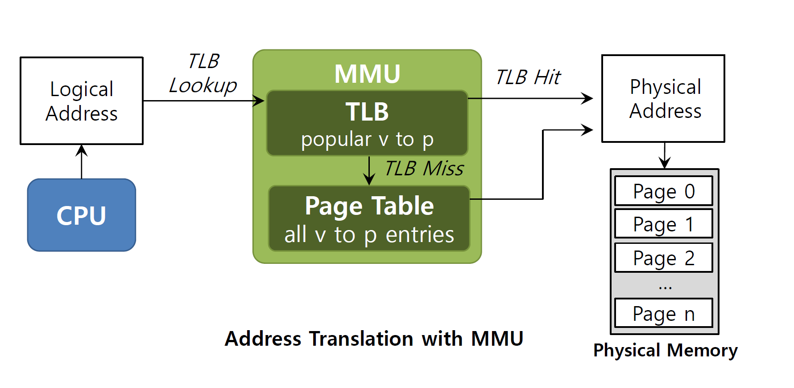

# 12. Hafta

# **Translation Lookaside Buffer (TLB)**

**Translation Lookaside Buffer (TLB)**, **Sanal Adres → Fiziksel Adres** dönüşümünü hızlandırmak için kullanılan bir **donanım önbelleği (cache)** türüdür. TLB, **Memory Management Unit (MMU)** içinde yer alır ve adres çevirisi performansını önemli ölçüde artırır.

---

## **1. TLB Nedir?**

- TLB, **popüler (sık kullanılan)** sanal adreslerin fiziksel adres karşılıklarını önbellekte tutar.
- Bu önbellek sayesinde, her bellek erişimi için **sayfa tablosuna gitmeye gerek kalmaz**.
- **Donanım desteklidir** ve MMU’nun bir parçasıdır.

---

## **2. TLB’nin Çalışma Prensibi**

Bir sanal adrese erişim yapıldığında şu adımlar gerçekleşir:

1. **Adım 1: TLB’yi Kontrol Et:**
    - Sanal adresin **VPN (Virtual Page Number)** kısmı TLB’de aranır.
2. **Adım 2: TLB Hit veya Miss:**
    - **TLB Hit:** Eğer VPN TLB’de bulunursa, adres dönüşümü hızlıca gerçekleştirilir.
    - **TLB Miss:** Eğer VPN TLB’de bulunmazsa:
        - Sayfa tablosundan adres dönüşümü yapılır.
        - TLB güncellenir (VPN → PFN kaydı eklenir).
3. **Adım 3: Fiziksel Adresi Oluştur:**
    - TLB’den alınan **PFN (Physical Frame Number)** ile sayfa içindeki **offset** birleştirilir.
    - Bu birleşim sonucu **fiziksel adres** elde edilir.

---

## **3. TLB’nin Önemi**

- **Performans Artışı:** Sayfa tablosu erişimini büyük ölçüde azaltır.
- **Donanım Hızında Erişim:** TLB, donanım tabanlı bir önbellek olduğu için **çok hızlıdır**.
- **Azaltılmış Gecikme:** Her bellek erişimi için ekstra sayfa tablosu erişimi engellenir.

---

## **4. TLB Hit ve Miss Zamanı**

| **Durum** | **Açıklama** | **Zaman Maliyeti** |
| --- | --- | --- |
| **TLB Hit** | Adres dönüşümü TLB’de bulunur. | **1 bellek erişimi** |
| **TLB Miss** | Sayfa tablosundan dönüşüm yapılır. | **2+ bellek erişimi** |

---

## **5. TLB Nasıl Çalışır? (Örnek Adımlar)**

1. **VPN’yi Çıkart:** Sanal adresten Virtual Page Number (VPN) hesaplanır.
2. **TLB’yi Kontrol Et:** VPN TLB’de aranır.
    - Eğer **bulunursa (Hit)** → PFN alınır.
    - Eğer **bulunmazsa (Miss):** Sayfa tablosundan PFN bulunur ve TLB’ye eklenir.
3. **Fiziksel Adresi Oluştur:** PFN ve Offset birleştirilir.

---

## **6. TLB’nin Özellikleri**

- **Kapasite:** Sınırlı sayıda sayfa girişini tutar (örneğin 64-128 giriş).
- **Donanım Hızı:** Bellek erişimi kadar hızlıdır.
- **Yenileme Politikaları:**
    - **LRU (Least Recently Used):** En az kullanılan giriş TLB’den çıkarılır.
    - **Random Replacement:** Rastgele bir giriş çıkarılır.

---

## **7. Özet**

- **TLB:** Donanım tabanlı, sanal → fiziksel adres dönüşümünü hızlandıran bir önbellektir.
- **Hızlı:** Sayfa tablosu erişimini azaltarak performansı artırır.
- **Çalışma Mekanizması:**
    - TLB **hit** → Adres dönüşümü hızlıdır.
    - TLB **miss** → Sayfa tablosuna erişilir, dönüşüm yapılır ve TLB güncellenir.

TLB, **paging sisteminin performansını optimize etmek için** kritik bir bileşendir.



Bu slayt **MMU (Memory Management Unit)** kullanarak **adres dönüşüm sürecini** ve **TLB (Translation Lookaside Buffer)** rolünü açıklıyor. Şimdi detaylı bir şekilde inceleyelim:

---

## **1. Adres Dönüşüm Süreci (Address Translation)**

### **Adımlar:**

1. **Logical Address (Mantıksal Adres):**
    - CPU tarafından üretilir ve **MMU’ye** gönderilir.
2. **TLB Lookup (TLB Kontrolü):**
    - MMU, **sanal adres** için **TLB’yi** kontrol eder.
    - **TLB (Translation Lookaside Buffer):**
        - Sanal adreslerin fiziksel adreslere çevrilmesini hızlandıran donanım tabanlı bir önbellektir.
        - Popüler **sanal → fiziksel adres çevirilerini** tutar.

---

## **2. TLB Hit ve TLB Miss**

- **TLB Hit:**
    - Eğer sanal adres TLB’de bulunursa, **fiziksel adres** doğrudan elde edilir.
    - **Avantaj:** Sayfa tablosuna gitmeye gerek kalmaz; hızlı bir erişim sağlanır.
- **TLB Miss:**
    - Eğer sanal adres TLB’de bulunmazsa:
        1. MMU, **Page Table**'a erişir.
        2. Page Table'dan **VPN → PFN** çevirisi yapılır.
        3. **TLB güncellenir**: Yeni giriş TLB'ye eklenir.

---

## **3. Page Table (Sayfa Tablosu)**

- **Page Table:**
    - Tüm **sanal sayfalar** (VPN - Virtual Page Number) için **fiziksel sayfa çerçevelerini** (PFN - Physical Frame Number) tutar.
    - TLB Miss durumunda, MMU **sayfa tablosundan** gerekli dönüşümü gerçekleştirir.

---

## **4. Fiziksel Bellek (Physical Memory)**

- Sayfa tablosundan gelen **PFN** ve sanal adresin **offset** kısmı birleştirilerek fiziksel adres oluşturulur.
- Erişim, fiziksel bellekteki doğru sayfa çerçevesine yapılır.

---

## **5. Özet Adımlar: Adres Dönüşümü**

1. CPU bir **mantıksal adres** oluşturur ve MMU’ye gönderir.
2. **MMU** ilk olarak TLB’de arama yapar:
    - **TLB Hit:** Adres hemen fiziksel bellekteki adrese çevrilir.
    - **TLB Miss:** Page Table kontrol edilir ve dönüşüm yapılır.
3. Dönüşüm sonucunda **fiziksel adres** elde edilir.
4. Fiziksel bellekten veriye erişim yapılır.

---

## **6. Önemli Noktalar**

- **TLB:** Hızlı bir adres dönüşümü sağlamak için donanım önbelleğidir.
- **Page Table:** Tüm sanal sayfaların fiziksel bellek eşlemelerini tutar.
- **MMU:** Adres dönüşüm sürecini yöneten birimdir.

---

Bu slayt, **adres dönüşüm sürecinin optimizasyonunu** gösteriyor. TLB sayesinde, bellek erişim hızı önemli ölçüde artırılırken, Page Table gerekli olduğunda devreye giriyor.

---


Bu slayt, **TLB'nin performansı nasıl artırdığını** ve **mekânsal yerellik (spatial locality)** etkisini bir dizi erişim örneği üzerinden açıklıyor. Şimdi detaylı olarak ele alalım:

---

## **1. Problem ve Kod Yapısı**

Kod, bir diziyi sırasıyla dolaşıp toplam hesaplıyor:

```c
int sum = 0;
for (i = 0; i < 10; i++) {
    sum += a[i];
}
```

- **Amaç:** Dizi elemanlarına erişerek toplamı hesaplamak.
- **Bellek Erişimleri:** Bu dizinin elemanları sanal bellekte farklı sayfalarda yer alıyor.

---

## **2. VPN (Virtual Page Number) ve Offset**

- Sanal bellek sayfalara bölünmüş.
- **VPN = 06, 07, 08**: Bu sayfalar dizi elemanlarını barındırıyor.
    - **VPN 06:** `a[0], a[1], a[2]`
    - **VPN 07:** `a[3], a[4], a[5], a[6]`
    - **VPN 08:** `a[7], a[8], a[9]`
- **Offset:** Sayfa içindeki elemanların konumunu belirtir.

---

## **3. TLB'nin Rolü ve Spatial Locality**

- **Spatial Locality (Mekânsal Yerellik):**
    - Bir sayfadan bir elemana erişildiğinde, aynı sayfadaki diğer elemanlara da kısa sürede erişme olasılığı yüksektir.
    - Bu örnekte, **a[0], a[1], a[2]** gibi aynı sayfa içindeki elemanlara ardışık olarak erişiliyor.
- **TLB’nin Rolü:**
    - İlk kez bir sayfaya erişildiğinde **TLB Miss** oluşur ve sayfa tablosundan çeviri yapılır.
    - Sayfa belleğe yüklendiğinde, **VPN → PFN dönüşümü TLB'ye eklenir**.
    - Aynı sayfadaki diğer erişimler **TLB Hit** olur ve adres dönüşümü çok hızlı gerçekleşir.

---

## **4. TLB Performansı ve Hit Rate**

- **Toplam 10 Erişim:**
    - **3 Miss:** İlk erişimlerde TLB boş olduğundan sayfa tablosuna gidilir.
    - **7 Hit:** Aynı sayfada kalan diğer elemanlara erişildiğinde TLB kullanılır.
- **Hit Rate (Başarı Oranı):**
    
    $$
    \text{Hit Rate} = \frac{\text{Hit Sayısı}}{\text{Toplam Erişim Sayısı}} = \frac{7}{10} = 70\%
    $$
    

---

## **5. Özet**

- **TLB:** Sayfa tablosu erişimlerini azaltarak bellek erişimlerini hızlandırır.
- **Spatial Locality:** Bir sayfaya erişim yapıldığında, aynı sayfadaki diğer verilerin erişimi hızlı olur (TLB Hit).
- **Performans:** Bu örnekte **3 Miss** ve **7 Hit** ile **%70 TLB Hit Rate** elde edilmiştir.

Bu slayt, TLB'nin **mekânsal yerellik** sayesinde nasıl performansı iyileştirdiğini net bir şekilde açıklıyor.

---

Bu slayt, **yerellik (locality)** kavramını, **TLB miss** durumlarının nasıl yönetildiğini ve **TLB girişlerinin yapısını** detaylandırıyor. Şimdi bunları tek tek açıklayalım:

---

## **1. Yerellik (Locality) Kavramı**

Yerellik, programların bellek erişiminde belirli kalıplar izlediğini ifade eder. İki ana türü vardır:

### **a. Temporal Locality (Zamansal Yerellik)**

- **Tanım:** Yakın zamanda erişilen bir talimat veya veri öğesine kısa süre içinde yeniden erişme olasılığı yüksektir.
- **Örnek:**Burada `a` değişkenine kısa sürede birden fazla erişim yapılıyor.
    
    ```c
    int a = 5;
    a = a + 1;  // 'a' değişkenine tekrar erişiliyor.
    ```
    

### **b. Spatial Locality (Mekânsal Yerellik)**

- **Tanım:** Bir program bir adresteki belleğe erişirse, kısa süre içinde bu adrese **yakın bellek konumlarına** erişme olasılığı yüksektir.
- **Örnek:**Dizinin elemanları bellekte **ardışık** olarak yer aldığından, mekânsal yerellik oluşur.
    
    ```c
    int array[10];
    for (int i = 0; i < 10; i++) {
        sum += array[i];
    }
    ```
    

---

## **2. TLB Miss Yönetimi**

Bir **TLB Miss** durumunda, adres çevirisinin nasıl yapılacağı **donanım (hardware)** veya **yazılım (software)** tarafından belirlenir.

### **a. Hardware-Managed TLB (Donanım Yönetimli TLB)**

- **CISC Mimarisinde (Örneğin Intel x86):**
    - Donanım, **sayfa tablosunu** (page table) otomatik olarak “gezer” (page table walk).
    - Doğru sayfa tablosu girişini bulur, dönüşümü gerçekleştirir ve **TLB’yi günceller**.
    - Talimatı yeniden çalıştırır.
    - **Avantajı:** Donanım tarafından otomatik olarak yapılır, hızlıdır.

### **b. Software-Managed TLB (Yazılım Yönetimli TLB)**

- **RISC Mimarisinde:**
    - Donanım bir **istisna (trap)** oluşturur ve işletim sistemine bildirim yapar.
    - **Trap Handler:** İşletim sistemi tarafından yazılan özel kod, sayfa tablosunu tarar, dönüşümü yapar ve **TLB’ye** güncelleme ekler.
    - **Avantajı:** Daha esnek ve OS üzerinde daha fazla kontrol sağlar.
    - **Dezavantajı:** Donanım yönetimine göre biraz daha yavaştır.

---

## **3. TLB’nin Yapısı**

### **a. Full Associative Method (Tam Bağlantılı Yöntem)**

- **Tanım:** TLB, **tam bağlantılı bir önbellek** (fully associative cache) olarak çalışır.
- **Detaylar:**
    - Donanım, TLB içindeki **tüm girişleri paralel olarak tarar**.
    - **VPN (Virtual Page Number)** ile eşleşen giriş bulunur ve **PFN (Physical Frame Number)** döner.
- **Tipik TLB Boyutu:**
    - 32, 64 veya 128 giriş içerir.

### **b. TLB Girişindeki Diğer Bitler**

TLB girişinde VPN ve PFN dışında bazı kontrol bitleri yer alır:

1. **Valid Bit:** Girişin geçerli olup olmadığını belirtir.
2. **Protection Bits:** Sayfanın okuma, yazma veya yürütme izinlerini belirtir.
3. **Dirty Bit:** Sayfanın bellekte değiştirilip değiştirilmediğini gösterir.
4. **Address Space Identifier (ASID):** Farklı süreçlerin aynı TLB’yi paylaşmasına olanak sağlar.

---

## **4. Özet**

| **Kavram** | **Açıklama** |
| --- | --- |
| **Temporal Locality** | Yakın zamanda erişilen verilere tekrar erişim olasılığı yüksektir. |
| **Spatial Locality** | Bir adrese erişim sonrası, yakın bellek adreslerine erişim olasılığı yüksektir. |
| **Hardware-Managed TLB** | Donanım, sayfa tablosunu gezer ve TLB’yi otomatik günceller (CISC). |
| **Software-Managed TLB** | Donanım, OS’ye trap oluşturur ve OS dönüşümü yapar (RISC). |
| **TLB Yapısı** | Tam bağlantılı bir önbellek; kontrol bitleri ile yönetilir. |

Bu bilgiler, TLB’nin adres dönüşümü sürecindeki performansını artırmasını ve yerellik kavramını nasıl desteklediğini detaylı olarak açıklıyor.

---


## **1. Context Switching ve TLB**

- **Context Switching (Bağlam Değişimi):** İşletim sistemi, bir işlemden (örneğin, Process A) diğerine (örneğin, Process B) geçiş yaptığında, bellekle ilgili birçok veri, özellikle **TLB**, etkilenir.
- **Sorun:** Her işlem kendi sanal bellek alanına sahiptir. **Process A**'ya ait sanal adresler, **Process B**'ye ait olanlardan farklıdır. Ancak TLB'de her iki sürecin bilgileri aynı anda bulunamaz.

---

## **2. TLB'nin Çalışma Mekanizması**

1. **Process A'nın Bellek Erişimi:**
    - **VPN (Virtual Page Number):** Process A, sanal adres alanındaki bir sayfaya erişir, örneğin `VPN = 10`.
    - **TLB Entry:**
        - Bu VPN, **PFN (Physical Frame Number)** ile eşleştirilir ve TLB’ye eklenir.
        - Örnekte, VPN `10` PFN `100` ile eşleşmiş.
        - **Valid Bit:** `1` (geçerli)
        - **Protection Bits (prot):** `rwx` (okuma, yazma ve yürütme izinleri).
2. **Process B'ye Geçiş (Context Switch):**
    - **Sorun:** Process B’nin sanal adresleri farklı olduğundan, Process A’nın TLB girişleri artık geçersizdir.
    - **Çözüm:**
        - **Flush TLB:** TLB’nin tamamı temizlenir (geçersiz hale getirilir).
        - **ASID (Address Space Identifier):** Bazı sistemlerde kullanılır. Bu, TLB’de farklı süreçlerin girişlerini ayırt etmek için kullanılır ve TLB’nin tamamen temizlenmesini önler.

---

## **3. TLB Sorunları ve Yönetimi**

### **Sorunlar:**

1. **Bağlam Değişimi Maliyeti:**
    - TLB’nin temizlenmesi, adres çevirisinin yavaşlamasına neden olur.
2. **Geçersiz TLB Girişleri:**
    - Bir işlemin TLB girişleri, başka bir işlem için doğru olmayabilir.

### **Çözümler:**

1. **TLB Flush:**
    - Bağlam değişiminde TLB’nin tüm girişleri temizlenir.
    - **Dezavantajı:** Performans kaybına yol açar.
2. **ASID Kullanımı:**
    - TLB girişlerine bir **ASID (Address Space Identifier)** eklenir.
    - Her işlem kendi ASID’sine sahip olduğundan, bağlam değişiminde TLB’yi tamamen temizlemeye gerek kalmaz.

---

## **4. Özet Tablo (TLB Yönetimi ve Çözüm Önerileri)**

| **Sorun** | **Açıklama** | **Çözüm** |
| --- | --- | --- |
| **Geçersiz TLB Girişleri** | Farklı süreçlerin sanal adresleri çakışabilir. | **TLB Flush** veya **ASID** |
| **Bağlam Değişimi Maliyeti** | TLB’nin temizlenmesi performans kaybına neden olur. | **ASID ile TLB paylaşımlı** |

---

## **5. Slaytın Ana Mesajı**

- TLB, adres çevirisi performansını artıran kritik bir donanımdır. Ancak, bağlam değişiminde TLB yönetimi karmaşık bir süreçtir.
- **ASID** gibi mekanizmalar, TLB'nin tamamen temizlenmesini önleyerek performansı artırır.
- TLB’nin uygun yönetimi, modern işletim sistemlerinde verimli bellek erişimi için önemlidir.

---


### **1. TLB ve Context Switching Sorunları**

**Context Switching**, işletim sisteminin bir işlemden (örneğin, **Process A**) diğerine (örneğin, **Process B**) geçiş yaptığı durumdur. Bu geçiş sırasında **TLB** (Translation Lookaside Buffer) kullanımı aşağıdaki sorunlara neden olabilir:

1. **TLB'deki Girişlerin Geçerliliği:**
    - **Process A**'nın sanal bellek alanındaki bir sayfanın (örneğin, `VPN 10`) fiziksel bellekteki çevirisi (örneğin, `PFN 100`), **Process B** için geçerli değildir.
    - Ancak, TLB’de bu giriş hala duruyorsa ve temizlenmediyse, **yanlış bir adres dönüşümü** yapılabilir.
2. **Çözüm Gereksinimi:**
    - İşlem değişimi sırasında, TLB'nin temizlenmesi gerekir (**TLB Flush**). Ancak bu işlem performans kaybına yol açar.
    - Alternatif olarak, **ASID (Address Space Identifier)** gibi mekanizmalar, her girişin hangi işlem için olduğunu belirterek bu sorunu çözebilir.

---

### **2. İlk Slayt (Sorunun Tanımı)**

- **Process A:**
    - `VPN 10` erişimi gerçekleştirir ve bu giriş TLB’ye eklenir (`PFN 100`, valid = 1, prot = rwx).
    - TLB giriş tablosunda bu bilgi saklanır.
- **Process B'ye Geçiş:**
    - **Process B**, aynı `VPN 10` sanal sayfasına erişmek istediğinde, farklı bir fiziksel çeviriye (örneğin, `PFN 170`) ihtiyaç duyar.
    - Bu giriş, TLB’ye eklenir, ancak **Process A’nın TLB girişleri hâlâ mevcutsa** sorun ortaya çıkar.

---

### **3. İkinci Slayt (Sorunun Görselleştirilmesi)**

Bu slaytta, **TLB'nin hangi işlem için olduğunu belirtememesi** sorunu vurgulanmıştır:

- **TLB Sorunu:**
    - TLB, **Process A** için `VPN 10 -> PFN 100` ve **Process B** için `VPN 10 -> PFN 170` girişlerini tutar. Ancak, TLB bu girişlerin hangi işlem için olduğunu ayırt edemez.
    - **Sonuç:** Yanlış bir adres çevirisi yapılabilir.
- **Çözüm:**
    - **TLB Flush:** Context switch sırasında tüm TLB girişlerini temizleyerek bu sorunu önler. Ancak performans kaybına yol açar.
    - **ASID Kullanımı:** TLB girişlerine bir **ASID** ekleyerek, her girişin hangi işlem için olduğunu açıkça belirtir. Böylece TLB temizlenmeden kullanılabilir.

---

### **4. Özet Tablo**

| **Sorun** | **Açıklama** | **Çözüm** |
| --- | --- | --- |
| **Geçersiz TLB Girişleri** | İşlem değişiminde TLB’deki girişler yeni işlem için geçersizdir. | **TLB Flush** veya **ASID** |
| **Hatalı Adres Çevirisi** | TLB, iki farklı işlem için aynı VPN’yi farklı PFN’lerle eşleştirebilir. | **ASID ile TLB girişlerini ayırma** |

---

### **Another Case: Two Processes Sharing a Page**

Bu senaryoda, **iki işlem bir fiziksel sayfayı paylaşıyor.** Bu durum, bellek kullanımını optimize etmek ve fiziksel sayfa kullanımını azaltmak için oldukça faydalıdır. Şimdi bu süreci ve nasıl çalıştığını detaylıca inceleyelim.

---

### **1. Sayfa Paylaşımı Senaryosu**

1. **Durum:**
    - **Process 1 (P1):** 10. sanal sayfasını fiziksel sayfa 101 ile eşleştiriyor.
    - **Process 2 (P2):** 50. sanal sayfasını aynı fiziksel sayfa 101 ile eşleştiriyor.
2. **TLB Tablosu:**
    - **P1 için:**
        - `VPN (Virtual Page Number):` 10
        - `PFN (Physical Frame Number):` 101
        - **ASID (Address Space Identifier):** 1 (P1’e ait olduğunu belirtiyor).
    - **P2 için:**
        - `VPN:` 50
        - `PFN:` 101
        - **ASID:** 2 (P2’ye ait olduğunu belirtiyor).
3. **Avantajlar:**
    - **Fiziksel Bellek Tasarrufu:** İki işlem, aynı fiziksel sayfayı paylaştığı için fiziksel bellekte daha az sayfa kullanılır.
    - **Verimlilik:** Özellikle ortak veri kümeleri veya kod parçaları (örneğin, kütüphaneler) için bu yöntem oldukça kullanışlıdır.
4. **Sorunlar:**
    - **Güvenlik ve İzinler:** Her iki işlem de aynı fiziksel sayfayı paylaştığı için, bellek koruması doğru şekilde uygulanmalıdır. Örneğin, bir işlem yalnızca okuma iznine sahipken diğer işlem yazma iznine sahip olabilir.
    - **TLB Yönetimi:** İki işlem için aynı fiziksel sayfa farklı VPN’lerle eşleştiğinden, TLB’nin doğru ASID’leri kullanarak bu girişleri ayırt etmesi gerekir.

---

### **2. TLB Tablosu ve Çalışması**

| **VPN** | **PFN** | **Valid** | **Protection (prot)** | **ASID** |
| --- | --- | --- | --- | --- |
| 10 | 101 | 1 | rwx | 1 |
| 50 | 101 | 1 | rwx | 2 |
- **ASID Kullanımı:**
    - ASID, her girişin hangi işlem için olduğunu belirtir. Bu, TLB’nin farklı işlemler için aynı fiziksel sayfayı doğru şekilde yönetmesine olanak tanır.

---

### **3. TLB Replacement Policy (Yer Değiştirme Politikası)**

TLB’nin sınırlı giriş kapasitesi nedeniyle, eski veya az kullanılan girişlerin kaldırılması gerekir. Bu noktada bir **yer değiştirme politikası** devreye girer:

1. **LRU (Least Recently Used):**
    - **Kural:** En son kullanılmamış olan giriş çıkarılır.
    - **Avantaj:** Bellek erişimlerinde **yerel erişim ilkesi (locality of reference)** avantajından faydalanır. Bellek erişimleri genelde kısa bir süre boyunca aynı sayfa veya adres etrafında yoğunlaşır.
2. **Diğer Politikalar:**
    - **FIFO (First In, First Out):** İlk eklenen giriş çıkarılır.
    - **Random:** Rastgele bir giriş çıkarılır.

---

### **4. Sayfa Paylaşımı ve TLB Yönetimi Özet**

| **Fayda** | **Açıklama** |
| --- | --- |
| **Bellek Tasarrufu** | Aynı fiziksel sayfa birden fazla işlem tarafından paylaşılarak fiziksel bellekte yer kazanılır. |
| **Performans Artışı** | TLB, paylaşılan sayfaları hızlı bir şekilde çevirebilir. |
| **Yerel Erişim İlkesi (LRU)** | En son kullanılan sayfalara odaklanılarak TLB’nin performansı artırılır. |

---


Bu slayt, **TLB Replacement Policy (Yer Değiştirme Politikası)** ile ilgili olarak **LRU (Least Recently Used)** algoritmasını ve bir örnek üzerinden çalışma mekanizmasını açıklıyor. Şimdi bu slaytı adım adım açıklayalım:

---

### **1. LRU (Least Recently Used) Algoritması**

- **Tanım:** En son kullanılmayan (en az yakın zamanda kullanılan) girdiyi sistemden çıkartır.
- **Amaç:** Bellek referans akışındaki **yerel davranışı (locality)** kullanarak daha iyi performans sağlar.
- **Özellik:** Daha az kullanılan girdilerin yerini daha sık kullanılan girdiler alır.

---

### **2. Örnek: Referans Akışı ve TLB Yer Değiştirme**

- **Referans Satırı (Reference Row):**
    
    `7, 0, 1, 2, 0, 3, 0, 4, 2, 3, 0, 3, 2, 1, 2, 0, 1`
    
    Bu satır, bellek referans akışını (hangi sayfaların erişildiğini) gösterir.
    
- **Page Frame (Sayfa Çerçevesi):**
    
    Bellekte bir anda tutulabilecek sınırlı sayıda sayfa çerçevesi vardır. Örnekte 3 çerçeve kullanılıyor.
    

### Adımlar:

1. **İlk Referans (7):**
    - Çerçeveler boş olduğundan, `7` eklenir. **(TLB miss)**
    - Çerçeve durumu: `[7]`
2. **İkinci Referans (0):**
    - `0`, bellekte bulunmadığı için eklenir. **(TLB miss)**
    - Çerçeve durumu: `[7, 0]`
3. **Üçüncü Referans (1):**
    - `1` de bellekte olmadığından eklenir. **(TLB miss)**
    - Çerçeve durumu: `[7, 0, 1]`
4. **Dördüncü Referans (2):**
    - Çerçeveler dolu olduğundan, en az yakın zamanda kullanılan giriş (`7`) çıkarılır ve yerine `2` eklenir.
    - Çerçeve durumu: `[2, 0, 1]` **(TLB miss)**
5. **Beşinci Referans (0):**
    - `0` bellekte olduğundan, **TLB hit** gerçekleşir.
6. **Altıncı Referans (3):**
    - `3` bellekte olmadığından, en az kullanılan giriş (`1`) çıkarılır ve `3` eklenir.
    - Çerçeve durumu: `[2, 0, 3]` **(TLB miss)**
7. Bu işlem böyle devam eder ve her yeni referans sırasında **TLB hit** veya **TLB miss** değerlendirilir.

---

### **3. Toplam Sonuç**

- **Toplam TLB Miss Sayısı:** 11
- Bu, çerçeveye sığmayan yeni sayfaların belleğe getirilmesi sırasında oluşur.

---

### **4. LRU'nun Avantajları**

- **Yerellik İlkesi:** Daha sık kullanılan sayfalar bellekte tutulur, bu da performansı artırır.
- **Dinamik Çalışma:** En az kullanılan girdilerin kaldırılması sayesinde bellek daha verimli yönetilir.

---


Bu slaytta, **TLB (Translation Lookaside Buffer)** içindeki bir girişin detayları verilmiştir. Bu örnek, **MIPS R4000** işlemcisine ait gerçek bir TLB girişini göstermektedir. Şimdi, slayttaki bilgileri adım adım açıklayalım:

---

### **1. TLB Girişinin Genel Yapısı**

- **64-bit uzunluğundaki TLB girişi**, sanal adresleri fiziksel adreslere çevirmek için kullanılır.
- Bu girişteki alanlar ve işlevleri aşağıda detaylandırılmıştır:

---

### **2. TLB Alanları ve İşlevleri**

| **Alan** | **Uzunluk** | **Açıklama** |
| --- | --- | --- |
| **VPN** | 19 bit | **Virtual Page Number:** Sanal sayfa numarasını tutar. Kernel tarafından ayrılmış bir alan da içerir. |
| **PFN** | 24 bit | **Physical Frame Number:** Fiziksel bellek çerçeve numarasını temsil eder. Bu sistemde 64GB fiziksel belleğe kadar desteklenir. |
| **G (Global)** | 1 bit | **Global Bit:** Sayfaların farklı süreçler tarafından paylaşılabilir olduğunu belirtir. |
| **ASID** | Değişken | **Address Space Identifier:** Farklı süreçlerin adres alanlarını ayırt etmek için kullanılır. |
| **C (Coherence)** | 1 bit | **Coherence Bit:** Sayfanın donanım tarafından nasıl önbelleğe alınacağını belirler. |
| **D (Dirty)** | 1 bit | **Dirty Bit:** Sayfanın yazma işlemi sırasında değiştirilip değiştirilmediğini belirtir. |
| **V (Valid)** | 1 bit | **Valid Bit:** Girişin geçerli bir çeviri içerip içermediğini belirtir. Geçersizse, sayfa tablosundan tekrar kontrol yapılır. |

---

### **3. Alanların Kullanımı ve Önemleri**

1. **VPN (Virtual Page Number):**
    - TLB'nin sanal adres kısmıdır. OS, VPN alanını kullanarak bir sayfanın fiziksel çerçevesini bulur.
    - Kernel'e özel alanlar içerdiği için sistem korumasında kullanılır.
2. **PFN (Physical Frame Number):**
    - Sanal sayfanın eşleştirildiği fiziksel bellek çerçevesinin numarasını ifade eder.
    - Büyük bellek sistemlerinde geniş alan sağlamak için 24 bit olarak ayrılmıştır.
3. **Global Bit (G):**
    - Bir sayfanın süreçler arasında ortak kullanılabileceğini işaretler.
    - Örneğin, paylaşılan kütüphaneler veya kodlar için kullanışlıdır.
4. **ASID (Address Space Identifier):**
    - Farklı süreçlerin aynı VPN değerlerini kullanabilmesini sağlar.
    - TLB'de çakışma olmaması için adres alanlarını ayırır.
5. **Coherence Bit (C):**
    - Donanımın, sayfa için önbellekleme politikasını belirlemesine yardımcı olur.
6. **Dirty Bit (D):**
    - Sayfanın belleğe yazıldığı veya değiştirildiği durumlarda aktif hale gelir.
    - **Yazma gecikmesi (write-back)** politikasında kullanılır.
7. **Valid Bit (V):**
    - Girişin geçerli olup olmadığını belirtir. Geçersizse, OS sayfa tablosuna bakar.

---

### **4. Örnek Kullanım**

- **ASID ile Paylaşım:**
    
    Aynı VPN'yi kullanan iki süreç, ASID'leri ile birbirinden ayırt edilir. Bu, bellek paylaşımlarında karışıklığı önler.
    
- **Global Bit:**
    
    Eğer bir sayfa farklı süreçler tarafından paylaşılıyorsa, bu bit sayesinde tüm süreçlere tek bir TLB girişi ile hizmet verilebilir.
    

---

### **5. Önemli Notlar**

- **Performans Artışı:**
    
    TLB, adres çeviriminde büyük bir hız artışı sağlar, çünkü bellek erişimlerinde her zaman sayfa tablosuna gitmek yerine önbellekte tutulan girişler kullanılır.
    
- **Donanım ve Yazılım Yönetimi:**
    
    Bazı sistemlerde TLB donanım tarafından yönetilirken, bazı sistemlerde (örneğin RISC) yazılım tarafından yönetilir.
    

---

---

---

## Swapping: Mechanisms Slaytı

Bu konu, **Swapping** (Sayfalama) ve **Fiziksel Belleğin Ötesine Geçen Mekanizmalar** hakkındadır. Burada, modern işletim sistemlerinin bellek yönetimini nasıl yaptığı ve disk gibi daha yavaş ama geniş depolama birimlerini fiziksel belleğin bir uzantısı olarak nasıl kullandığını inceliyoruz. Hadi, bu notları detaylıca açıklayalım:

---

### **Swapping Nedir?**

Swapping, işletim sisteminin ana bellekte yeterli alan kalmadığında, bellek adres alanlarının bir kısmını diske taşıyarak yer açmasını sağlayan bir mekanizmadır. Bu mekanizma sayesinde, daha fazla işlem veya veri bellekte işlenebilir hale gelir.

### **Nasıl Çalışır?**

1. **Diskin Bellek Olarak Kullanılması:**
    - İşletim sistemi, fiziksel bellekte (RAM) yer kalmadığında, kullanılmayan adres alanlarını bir **disk alanına** taşır. Bu disk alanı genellikle **swap alanı (swap space)** olarak adlandırılır.
    - Modern sistemlerde bu iş için genelde sabit diskler kullanılır.
2. **Swap Alanı:**
    - Diskte belirli bir alan ayrılır (swap space), burada sayfalar ileri-geri taşınır.
    - Bu alan işletim sistemi tarafından, sayfa boyutunda birimler (page-sized units) olarak yönetilir.

---

### **Bellek Hiyerarşisi**

Modern sistemlerde bellek hiyerarşisi aşağıdaki gibidir:

1. **Registers (Kayıtçılar):**
    - İşlemcinin içindeki en hızlı bellek birimidir. Çok küçük miktarda veri tutar.
2. **Cache:**
    - Daha geniş, ancak biraz daha yavaş. İşlemci ve ana bellek arasındaki hız farkını kapatır.
3. **Main Memory (Ana Bellek/RAM):**
    - Programların ve verilerin büyük çoğunluğu burada çalışır. Çok hızlıdır, ancak kapasitesi sınırlıdır.
4. **Mass Storage (Sabit Disk/Tape):**
    - Çok büyük kapasiteli, ancak yavaştır. Swap alanı genelde burada bulunur.

---

### **Swap Alanının Kullanımı ve Present Bit**

Swap işlemi için işletim sistemi bazı mekanizmalar kullanır:

1. **Present Bit:**
    - Bu, bir sayfanın fiziksel bellekte olup olmadığını belirtmek için kullanılır.
    - **Değerler:**
        - `1`: Sayfa fiziksel bellekte mevcut.
        - `0`: Sayfa fiziksel bellekte değil, disk üzerindeki swap alanında.
2. **Sayfa Tablosu (Page Table):**
    - Donanım ve işletim sistemi, hangi sayfanın nerede olduğunu izlemek için bir "sayfa tablosu" kullanır. Bir sayfa bellekte değilse, bu tablodan sayfanın diskte olduğunu öğrenir.

---

### **Page Fault (Sayfa Hatası)**

- **Sayfa Hatası Nedir?**
    - Bir işlem, fiziksel bellekte olmayan bir sayfaya erişmeye çalıştığında ortaya çıkar.
    - Örneğin, bir sayfa swap alanında ise ve işlem buna erişmek istiyorsa, bir **sayfa hatası** oluşur.
- **Sayfa Hatası Nasıl Çözülür?**
    1. İşletim sistemi, diskteki sayfayı fiziksel belleğe geri taşır.
    2. Eğer fiziksel bellekte yer yoksa, bir sayfa çıkarılarak (swap out) yeni gelen sayfa için yer açılır.

---

### **Page Replacement (Sayfa Değiştirme)**

- **Nedir?**
    - İşletim sistemi, fiziksel belleği verimli kullanmak için bazı sayfaları "dışarı atar" (page out) ve yerine yenilerini getirir (page in).
- **Sayfa Değiştirme Politikaları:**
    - İşletim sistemi, hangi sayfayı çıkarması gerektiğini belirlemek için bir **sayfa değiştirme politikası** uygular.
    - Amaç, sistem performansını maksimumda tutmaktır. Yaygın politikalar şunlardır:
        - **FIFO (First-In, First-Out):** İlk gelen sayfa ilk çıkarılır.
        - **LRU (Least Recently Used):** En uzun süredir kullanılmayan sayfa çıkarılır.
        - **Optimal Policy:** Gelecekte en az kullanılacak sayfa çıkarılır (teorik bir yaklaşımdır).

---

### **Örneklerle Açıklama**

1. **Bellek Hiyerarşisi Örneği:**
    - Bir web tarayıcısı kullanırken:
        - Sık erişilen veri (ör. aktif sekme) **RAM**’de tutulur.
        - Çok sık erişilmeyen eski sekmeler disk üzerindeki **swap alanına** taşınabilir.
2. **Sayfa Hatası Örneği:**
    - Bir oyun oynarken, uzun süredir kullanılmayan bir bölge swap alanına taşınmış olabilir. Bu bölgeye geri döndüğünüzde, işletim sistemi sayfa hatası alır ve ilgili veriyi diske erişerek belleğe geri taşır.
3. **Sayfa Değiştirme Örneği:**
    - Fiziksel bellekte 4 sayfa tutabiliyorsunuz ve LRU politikası kullanılıyor:
        - Sayfalar sırayla 1, 2, 3 ve 4 yüklendi.
        - Sayfa 5’e ihtiyaç duyulduğunda, en uzun süredir kullanılmayan (ör. sayfa 1) bellekten çıkarılır ve sayfa 5 yüklenir.

---

### **Konu Özeti**

- Swapping, fiziksel bellek dolduğunda diski kullanarak yer açmayı sağlar.
- Swap alanı diskte bulunur ve sayfa boyutunda birimler halinde yönetilir.
- Sayfa hataları, bellekte olmayan sayfalara erişim girişiminde oluşur.
- Sayfa değiştirme politikaları, hangi sayfanın çıkarılacağını belirler.

---

### **Sayfa Değiştirme Ne Zaman Yapılır?**

### 1. **Lazy Approach (Tembel Yaklaşım)**

- **Nedir?**
    - İşletim sistemi, bellek tamamen doluncaya kadar sayfa değiştirme yapmaz. Ancak bellek tamamen dolduğunda, yer açmak için bir sayfayı değiştirme işlemini gerçekleştirir.
- **Neden Gerçekçi Değil?**
    - Bu yaklaşımda, sayfa değiştirme işlemleri bellek dolduktan sonra yoğun bir şekilde yapılır ve bu, sistem performansını ciddi şekilde etkileyebilir.
    - Gerçek sistemlerde, **önleyici (proaktif)** yaklaşımlar tercih edilir.

### 2. **Swap Daemon veya Page Daemon**

- **Nedir?**
    - Bir işletim sistemi arka plan sürecidir ve bellek yönetimi için proaktif bir şekilde çalışır.
- **Nasıl Çalışır?**
    - Bellekte kullanılabilir sayfa sayısı bir **düşük eşik değeri (low watermark, LW)** seviyesine indiğinde, bu arka plan süreci çalışır.
    - Bu süreç, bellekten sayfaları **çıkartarak (evict)** yer açar.
    - Yer açma işlemi, kullanılabilir sayfa sayısı bir **yüksek eşik değeri (high watermark, HW)** seviyesine ulaşana kadar devam eder.

---

### **Page Fault (Sayfa Hatası) Kontrol Akışı**

Bir sayfa hatası oluştuğunda işletim sistemi aşağıdaki adımları takip eder:

1. **Sayfa Tablosunu (Page Table Entry, PTE) Kontrol Etme**
    - **PTE (Page Table Entry)**, sayfanın fiziksel bellekte mi yoksa disk üzerinde mi olduğunu belirlemek için kullanılır.
    - PTE, iki ana bilgi içerir:
        - **PFN (Page Frame Number):** Eğer sayfa bellekteyse, fiziksel bellek çerçevesinin numarasını içerir.
        - **Disk Adresi:** Eğer sayfa bellekte değilse, diskteki konumunu belirtir.
2. **Diskten Sayfa Yükleme Talebi**
    - Eğer PTE sayfanın fiziksel bellekte olmadığını (Present Bit = 0) gösteriyorsa, işletim sistemi diske bir talep gönderir.
    - Disk, sayfanın verilerini belleğe taşır.
3. **Sayfa Yerleştirme ve PTE Güncelleme**
    - Sayfa belleğe taşındığında, PTE güncellenir. Artık sayfanın fiziksel bellekte olduğu belirtilir (Present Bit = 1).
    - İşlem kaldığı yerden devam eder.

---

### **Düşük ve Yüksek Eşik Değerleri (LW ve HW)**

- **Low Watermark (LW):**
    - Bu değer, bellekte kullanılabilir sayfa sayısının tehlikeli derecede azaldığını gösterir.
    - LW seviyesine ulaşıldığında, **swap daemon** veya **page daemon** devreye girerek yer açmaya başlar.
- **High Watermark (HW):**
    - Yer açma işlemi, bellekte yeterince kullanılabilir sayfa olduğunda durur. Bu seviye HW ile belirlenir.

---

### **Sayfa Hatası Akışına Örnek**

1. **Senaryo:**
    - Bir program, henüz bellekte olmayan bir sayfaya erişmeye çalışır.
2. **Adımlar:**
    - İşlemci, sayfa tablosuna bakar ve sayfanın bellekte olmadığını görür (Present Bit = 0).
    - Bu bir **sayfa hatası** üretir ve işletim sistemi devreye girer.
    - İşletim sistemi, sayfa tablosundaki diskin adresini kullanarak, diske erişip sayfayı belleğe taşır.
    - Eğer bellekte yer yoksa, bir sayfa çıkarılır (evict) ve yerine yeni sayfa yüklenir.
    - Sayfa tablosu güncellenir ve işlem kaldığı yerden devam eder.

---

### **Örneklerle Açıklama**

1. **Lazy Approach Örneği:**
    - Bir bilgisayarda çalışan bir oyun, bellek tamamen dolana kadar sayfaları bellekte tutuyor. Ancak yeni bir oyun seviyesi yüklenirken bellek dolduğu için eski seviyenin sayfalarını çıkartıyor. Bu, gecikmeye ve performans kaybına yol açabilir.
2. **Swap Daemon Örneği:**
    - Web tarayıcınızda çok fazla sekme açtığınızı düşünün. Bellekte yeterli alan kalmadığında, swap daemon bazı kullanılmayan sekmelerin verilerini diske taşıyarak yer açar.
3. **Page Fault Örneği:**
    - Bir kelime işlemci programı açıyorsunuz ve bir dosya üzerinde çalışıyorsunuz. Dosyanın ilk kısmı bellekteyken, diğer kısmı disktedir. Dosyanın diskteki bir kısmına erişmeye çalıştığınızda sayfa hatası oluşur. İşletim sistemi, diskteki kısmı belleğe yükler ve işlem devam eder.

---

### **Konu Özeti**

- **Lazy Approach:** Belleğin tamamen dolmasını beklemek performans kaybına neden olur.
- **Swap/Page Daemon:** Proaktif olarak çalışan bir arka plan süreci, düşük ve yüksek eşik değerleri arasında bellek yönetimi yapar.
- **Sayfa Hatası Kontrol Akışı:** Sayfanın bellekte olmadığını tespit eder, diske erişir ve sayfayı belleğe taşır.
- **Eşik Değerleri:** LW ve HW seviyeleri, bellek yönetiminin etkinliğini artırır.

---


Bu notlar, bir **sayfa hatası kontrol akışını (Page Fault Control Flow)** detaylandırmaktadır. **Sayfa hataları**, bir işlemcinin fiziksel bellekte bulunmayan bir sayfaya erişmeye çalıştığında nasıl ele alındığını açıklayan bir mekanizmadır. Bu akışın donanım ve yazılım seviyesinde nasıl çalıştığını adım adım inceleyelim.

---

### **Page Fault Control Flow (Sayfa Hatası Kontrol Akışı)**

### **Donanım (Hardware) Aşaması**

1. **VPN Hesaplama (Virtual Page Number):**
    - Sanal adresin (Virtual Address) sayfa numarasını (Virtual Page Number, VPN) hesaplamak için:
        - Sanal adresin belirli bitleri **VPN_MASK** ile maskelenir.
        - Maskelenen sonuç **SHIFT** ile kaydırılır.
        - Örneğin, büyük bir sanal adresi alıp yalnızca gerekli sayfa numarasını ayıklarsınız.
2. **TLB Lookup (Translation Lookaside Buffer Araması):**
    - TLB, sanal adresleri fiziksel adreslere çevirmek için kullanılan bir önbellektir.
    - **TLB_Lookup(VPN)** işlemi VPN'yi TLB'de arar:
        - Eğer VPN, TLB'de bulunursa bu bir **TLB Hit** olur.
        - Eğer bulunmazsa, bu bir **TLB Miss** olur ve bellek tablosuna (Page Table) erişim gerekir.
3. **TLB Hit Durumu:**
    - Eğer **TLB Hit** oluşursa:
        - **ProtectBits** kontrol edilir:
            - Eğer işlem bu sayfaya erişmek için uygun izinlere sahipse:
                - Sayfanın fiziksel adresi (PhysAddr) hesaplanır.
                - Fiziksel bellek erişilir ve gerekli veri alınır.
            - Eğer izinler uygun değilse:
                - **PROTECTION_FAULT** (Koruma Hatası) oluşturulur.
4. **TLB Miss Durumu:**
    - Eğer **TLB Miss** oluşursa:
        - Sayfa Tablosuna (Page Table) erişmek için **PTEAddr** (Page Table Entry Address) hesaplanır:
            - **PTBR (Page Table Base Register)**, sayfa tablosunun başlangıç adresini gösterir.
            - **PTEAddr = PTBR + (VPN * sizeof(PTE))** formülüyle PTE adresi hesaplanır.

### **Sayfa Tablosu (Page Table) Erişimi**

1. **PTE Erişimi:**
    - **PTE (Page Table Entry)** bellekte bulunur ve gerekli bilgiler içerir:
        - Sayfanın geçerli olup olmadığını belirtir (**PTE.Valid**).
        - Sayfanın bellekte olup olmadığını belirtir (**PTE.Present**).
        - Koruma izinlerini gösterir (**PTE.ProtectBits**).
2. **Geçerli Sayfa Kontrolü (PTE.Valid):**
    - Eğer **PTE.Valid == False** ise:
        - Bu bir **SEGMENTATION_FAULT** (Segmentasyon Hatası) oluşturur. Bu, sayfanın geçerli bir bellek alanında bulunmadığı anlamına gelir.
3. **Erişim İzinleri Kontrolü (ProtectBits):**
    - Eğer **ProtectBits** erişim izinlerine uymuyorsa:
        - **PROTECTION_FAULT** oluşturulur.
4. **Bellekte Olup Olmadığını Kontrol Etme (PTE.Present):**
    - Eğer **PTE.Present == True** ise:
        - Sayfa bellekte mevcuttur. Donanım TLB'yi günceller:
            - **TLB_Insert(VPN, PTE.PFN, PTE.ProtectBits)** işlemi yapılır.
        - İşlem yeniden başlatılır (**RetryInstruction**).
    - Eğer **PTE.Present == False** ise:
        - Sayfa bellekte değildir. Bu bir **PAGE_FAULT** (Sayfa Hatası) oluşturur.
        - İşletim sistemi bu durumda diske erişerek sayfayı belleğe yükler.

---

### **Örnek Akış**

### **Durum 1: TLB Hit ve Erişim Başarılı**

- Sanal adres: `0x1234`
- VPN hesaplanır ve TLB'de bulunur (**TLB Hit**).
- Koruma izinleri (**ProtectBits**) kontrol edilir ve erişim izni uygundur.
- Fiziksel adres hesaplanır ve belleğe erişim gerçekleşir.

### **Durum 2: TLB Miss ve Bellekte Sayfa Mevcut**

- VPN hesaplanır, ancak TLB'de bulunmaz (**TLB Miss**).
- Sayfa Tablosu'na erişilir ve **PTE.Present == True** olduğu görülür.
- TLB güncellenir ve işlem yeniden denenir.

### **Durum 3: Page Fault**

- VPN hesaplanır, ancak TLB'de bulunmaz (**TLB Miss**).
- Sayfa Tablosu'na erişilir ve **PTE.Present == False** olduğu görülür.
- Bu durumda işletim sistemi devreye girer:
    - Diske erişerek sayfayı belleğe yükler.
    - TLB güncellenir ve işlem yeniden başlatılır.

### **Durum 4: Segmentation Fault**

- VPN hesaplanır, ancak **PTE.Valid == False** olduğu görülür.
- Bu durumda, işlem geçersiz bir bellek alanına erişmeye çalışmaktadır.
- **SEGMENTATION_FAULT** oluşturulur.

---

### **Konu Özeti**

- **VPN Hesaplama:** Sanal adresin sayfa numarasını bulmak için maskelenir ve kaydırılır.
- **TLB Hit/Miss:** Eğer VPN TLB'de bulunursa hızlı erişim yapılır, bulunmazsa sayfa tablosuna gidilir.
- **Sayfa Tablosu:** Geçerlilik ve izin kontrolleri burada yapılır.
- **Hatalar:**
    - **Segmentation Fault:** Geçersiz bir sayfa erişimi.
    - **Protection Fault:** Erişim izni olmayan bir sayfa erişimi.
    - **Page Fault:** Sayfanın bellekte bulunmaması durumu.

---


Bu notlar, **sayfa hatası kontrol akışının (Page Fault Control Flow)** yazılım seviyesindeki işleyişini açıklıyor. İşletim sisteminin bir sayfa hatası durumunda fiziksel bellek yönetimini nasıl gerçekleştirdiğini ve bu süreçte hangi adımları takip ettiğini detaylandıracağım.

---

### **Page Fault Control Flow (Yazılım Seviyesi)**

### **1. Boş Fiziksel Sayfa Bulma**

- İşletim sistemi, hatalı sayfa için kullanılacak boş bir fiziksel sayfa arar:
`PFN = FindFreePhysicalPage`
    - **PFN (Page Frame Number):** Fiziksel bellekteki sayfa çerçevesinin numarasıdır.
    - Eğer boş bir fiziksel sayfa bulunursa, bu sayfa hatalı sayfa için tahsis edilir.

### **2. Boş Sayfa Bulunamaması Durumu**

- Eğer boş bir fiziksel sayfa bulunamazsa (**PFN == -1**):
`PFN = EvictPage()`
    - **EvictPage():** Sayfa değiştirme algoritmasını çalıştırır.
    - Sayfa değiştirme algoritması, mevcut sayfalardan birini seçer ve bu sayfayı diske yazarak (swap out) yer açar.
    - Bu süreç, **FIFO (First-In, First-Out)** veya **LRU (Least Recently Used)** gibi bir algoritmaya dayanabilir.

### **3. Diske Erişim ve Sayfa Yükleme**

- Yer açıldıktan sonra, işletim sistemi hatalı sayfayı diskteki adresinden okur ve fiziksel belleğe yükler:
`DiskRead(PTE.DiskAddr, PFN)`
    - **DiskRead:** Sayfa tablosunda belirtilen disk adresinden (PTE.DiskAddr) sayfa verisini okur ve fiziksel sayfa çerçevesine (PFN) yükler.
    - Bu işlem sırasında işlemci, **I/O işlemi** tamamlanana kadar bekler (**sleep state**).

### **4. Sayfa Tablosunu Güncelleme**

- Sayfa belleğe yüklendikten sonra, işletim sistemi sayfa tablosunu (Page Table Entry, PTE) günceller:
`PTE.present = True`
    - Sayfanın artık bellekte olduğunu belirtir (**Present Bit = True**).
    `PTE.PFN = PFN`
    - Sayfanın fiziksel çerçeve numarasını (PFN) kaydeder.

### **5. Talimatın Yeniden Çalıştırılması**

- Bellek ve sayfa tablosu güncellendikten sonra, işletim sistemi hata oluşturan talimatı yeniden çalıştırır:
`RetryInstruction()`

---

### **Sayfa Değiştirme (Page Replacement)**

### **Fiziksel Bellek Yönetimi**

- İşletim sistemi, sayfa hatasını çözmek için bellekte bir fiziksel çerçeve (physical frame) bulmak zorundadır.
- Eğer kullanılabilir bir fiziksel çerçeve yoksa, işletim sistemi sayfa değiştirme algoritmasını çalıştırarak bellekten bir sayfayı çıkarır ve yerine yenisini koyar.

### **Sayfa Değiştirme Süreci**

1. **Sayfa Seçimi:**
    - Sayfa değiştirme algoritması, bellekten çıkarılacak bir sayfayı seçer.
    - Örneğin:
        - **FIFO (First-In, First-Out):** İlk gelen sayfa ilk çıkarılır.
        - **LRU (Least Recently Used):** En uzun süredir kullanılmayan sayfa çıkarılır.
2. **Sayfanın Disk Alanına Yazılması:**
    - Bellekten çıkarılan sayfa değiştirme algoritmasına göre diske yazılır (swap out).
3. **Yeni Sayfanın Yüklenmesi:**
    - Diske yazılan sayfanın yerine, hatalı sayfa belleğe yüklenir (swap in).

---

### **Örnek Akış**

### **Senaryo:**

Bir uygulama, fiziksel bellekte bulunmayan bir sayfaya erişmeye çalışıyor ve bir sayfa hatası oluşuyor.

### **Adımlar:**

1. İşletim sistemi, fiziksel bellekte boş bir sayfa arar:
    - **FindFreePhysicalPage** ile boş sayfa bulunamaz.
2. Sayfa değiştirme algoritması devreye girer:
    - **EvictPage()** bir sayfayı seçer ve bu sayfa diske yazılarak (swap out) fiziksel bellekten çıkarılır.
3. Hatalı sayfa diskteki adresinden okunur:
    - **DiskRead(PTE.DiskAddr, PFN)** işlemiyle sayfa belleğe yüklenir.
4. Sayfa tablosu güncellenir:
    - **PTE.present = True**: Sayfa artık bellekte.
    - **PTE.PFN = PFN**: Sayfanın fiziksel çerçeve numarası kaydedilir.
5. İşletim sistemi talimatı yeniden çalıştırır:
    - **RetryInstruction()** ile işlem kaldığı yerden devam eder.

---

### **Hataların ve Sorunların Yönetimi**

### **Fiziksel Bellek Doluluğu:**

- İşletim sistemi, fiziksel bellek dolduğunda otomatik olarak sayfa değiştirme algoritmasıyla yer açar.

### **Performans Kaygıları:**

- Sayfa değiştirme işlemleri disk okuma/yazma içerdiği için yavaştır.
- Bu nedenle, sık kullanılan sayfaları bellekte tutacak algoritmalar tercih edilir (örneğin LRU).

---

### **Konu Özeti**

1. **Page Fault İş Akışı:**
    - Boş bir fiziksel sayfa bulunamazsa, sayfa değiştirme algoritması çalışır.
    - Hatalı sayfa diskteki adresinden belleğe yüklenir.
    - Sayfa tablosu güncellenir ve işlem yeniden çalıştırılır.
2. **Sayfa Değiştirme Algoritmaları:**
    - FIFO, LRU gibi algoritmalar kullanılarak hangi sayfanın çıkarılacağına karar verilir.
3. **Disk İşlemleri:**
    - Sayfa değiştirme, disk erişimi gerektirir ve bu işlemler görece yavaştır. Bu nedenle iyi bir algoritma seçimi performansı etkiler.

---

### **Summary: Swapping ve Present Bit**

1. **Swapping:**
    - Swapping, fiziksel bellek yetersiz olduğunda, diskin bir kısmını bellek olarak kullanma işlemidir.
    - Kullanılmayan sayfalar, fiziksel bellekten diskteki **swap alanına** taşınır.
    - Daha sonra ihtiyaç duyulduklarında tekrar belleğe geri yüklenir (swap in).
2. **Present Bit:**
    - **Present Bit**, bir sayfanın fiziksel bellekte mi yoksa disk üzerinde mi olduğunu belirtmek için kullanılır.
        - **1 (True):** Sayfa fiziksel bellekte mevcut.
        - **0 (False):** Sayfa fiziksel bellekte değil, disktedir.
    - Sayfa tablosu, bu bit üzerinden hangi sayfanın bellek içinde veya dışında olduğunu takip eder.

---

### **Kritik Noktalar:**

- Swapping sayesinde sistem, fiziksel belleği etkili bir şekilde genişleterek birden fazla işlemi destekler.
- **Present Bit**, sayfa hatalarının (Page Fault) yönetimi ve belleğin doğru bir şekilde organize edilmesi için kritik öneme sahiptir.

---