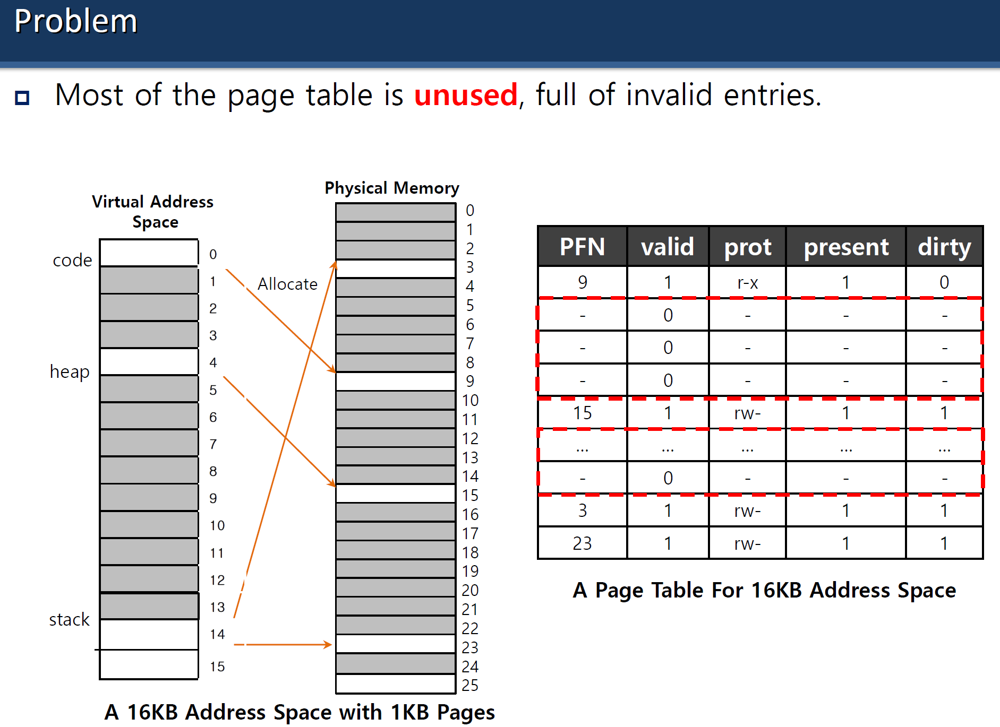

# 13. Hafta

# Advanced Page Tables Slaytı

### **Paging ve Sayfa Tablolarının Temelleri**

### **Paging Nedir?**

- Sayfalama, bellek yönetiminde kullanılan bir yöntemdir. İşletim sistemi, bir işlemin adres alanını küçük sabit boyutlu **sayfalara** böler.
- Bu sayfalar, fiziksel bellekteki **sayfa çerçeveleri** (page frames) ile eşleştirilir.
- **Sayfa Tabloları:** Sanal adresleri fiziksel adreslere çevirmek için kullanılır.

---

### **Lineer Sayfa Tabloları**

1. **Tek Bir Sayfa Tablosu Kullanımı:**
    - Sistem, her işlem için tek bir sayfa tablosu kullanır.
    - **Problem:**
        - 32-bit bir adres alanında 4KB'lik sayfalar ve 4 baytlık her sayfa tablosu girdisi olduğunu varsayalım:
            - Adres alanında toplam 2^32 bayt var.
                
                $$
                2^{32}
                $$
                
            - 4KB'lik sayfalarla, 2^20 sayfa gerekir.
                
                $$
                \frac{2^{32}}{2^{12}} = 2^{20}
                $$
                
            - Her bir girdinin 4 bayt olduğu düşünülürse, sayfa tablosu boyutu:
                
                $$
                2^{20} \times 4 \text{ bayt } = 4 \text{ MB }
                $$
                
            - Her işlem için 4 MB boyutunda bir sayfa tablosu oluşturmak, bellekte ciddi bir yer tüketir.
2. **Daha Büyük Sayfalar:**
    - Eğer sayfa boyutunu 16KB yaparsak:
        - 32-bit adres alanında toplam 2^18 sayfa gerekir.
            
            $$
            \frac{2^{32}}{2^{14}} = 2^{18}
            $$
            
        - Sayfa tablosu boyutu:
        
        $$
        2^{18} \times 4 \text{ bayt } = 1 \text{ MB }
        $$
        
    - **Problem:**
        - Sayfa boyutları büyüdükçe, **içsel parçalanma (internal fragmentation)** problemi ortaya çıkar. Yani, kullanılmayan bellek alanı artar.

---

### **Gelişmiş Sayfa Tabloları ve Çözüm Yolları**

### **1. Çok Seviyeli Sayfa Tabloları**

- Sayfa tablolarının boyutunu küçültmek için **çok seviyeli sayfa tabloları** kullanılır.
- **Nasıl Çalışır?**
    - Tek bir büyük tablodan ziyade, adres alanını bölerek hiyerarşik bir yapı oluşturulur.
    - Örneğin, iki seviyeli bir tablo:
        - İlk seviye, ikinci seviyeye yönlendiren bir tablodur.
        - İkinci seviye, gerçek sayfa çerçevesi numaralarını içerir.
- **Örnek:**
    - İlk seviye tablo: 1KB boyutunda, 256 giriş içerir.
    - İkinci seviye tablo: 256 girişle yalnızca kullanılan kısmı bellekte tutulur.
    - Bu, bellek tüketimini büyük ölçüde azaltır.

### **2. Ters Sayfa Tabloları (Inverted Page Tables)**

- Geleneksel tablolarda her sanal sayfa için bir girdi bulunurken, ters sayfa tablolarında her fiziksel çerçeve için bir girdi bulunur.
- Bu yöntem, belleğin daha verimli kullanılmasını sağlar.

### **3. Segmentasyon ile Birleştirme**

- Segmentasyon ve sayfalama bir arada kullanılabilir. Bu, hem adres alanını mantıksal parçalara ayırır (segmentler) hem de bu segmentleri sayfalara böler.

---

### **Sorunlar ve Çözümler**

### **Sorun 1: Büyük Sayfa Tabloları**

- Lineer tablolar çok büyük bellek alanı tüketir.

**Çözüm:** Çok seviyeli tablolar veya ters sayfa tabloları kullanmak.

### **Sorun 2: Büyük Sayfa Boyutları**

- Büyük sayfa boyutları, **içsel parçalanma** sorununa yol açar.

**Çözüm:** Sayfa boyutlarını dikkatli seçmek ve gerektiğinde küçük sayfalar kullanmak.

---

### **Konu Özeti**

1. **Lineer Sayfa Tabloları:**
    - Her işlem için tek bir büyük tablo oluşturulur, ancak bu yöntem belleği verimsiz kullanır.
2. **Daha Büyük Sayfalar:**
    - Sayfa tablolarının boyutunu küçültür, ancak içsel parçalanma sorununa yol açar.
3. **Gelişmiş Çözümler:**
    - Çok seviyeli sayfa tabloları ve ters sayfa tabloları gibi yöntemler bellek tüketimini optimize eder.



Bu görsel, **sayfa tablosu** problemini açıklıyor ve neden daha verimli mekanizmalara ihtiyaç duyulduğunu gösteriyor. Detaylı bir analiz yapalım:

---

### **Görselin Anlamı**

### **1. Sanal Adres Alanı (Virtual Address Space)**

- Görselde bir **16KB Sanal Adres Alanı** (Virtual Address Space) gösterilmiş.
- **1KB sayfalar (pages)** ile bölünmüş durumda.
- Bu alan, üç farklı bölgeden oluşuyor:
    - **Code (Kod):** Programın yürütülebilir kodunu tutar.
    - **Heap (Yığın):** Dinamik olarak tahsis edilen verileri içerir.
    - **Stack (Yığın):** Fonksiyon çağrıları ve yerel değişkenleri içerir.
- Ancak, tüm sanal adres alanı kullanılmıyor. Örneğin, sadece bazı sayfalar bellekte aktif olarak kullanılıyor (ör. sayfa 0, 1, 5, 9 ve 15).

### **2. Fiziksel Bellek (Physical Memory)**

- **Fiziksel bellek**, sanal bellekte aktif olarak kullanılan sayfaları tutar.
- **PFN (Page Frame Number):**
    - Bu, fiziksel bellekte bir sayfanın konumunu ifade eder.
    - Örneğin, sayfa 0'ın fiziksel bellek çerçevesi 9 numarada tutuluyor.

### **3. Sayfa Tablosu (Page Table)**

- Sayfa tablosu, her bir sanal sayfanın fiziksel bellekteki durumunu izlemek için kullanılır.
- Her giriş (entry) aşağıdaki bilgileri içerir:
    - **PFN (Page Frame Number):** Sayfanın fiziksel bellekteki çerçeve numarası.
    - **Valid (Geçerlilik):** Sayfanın geçerli olup olmadığını belirtir.
        - `1`: Sayfa geçerli.
        - `0`: Sayfa geçersiz.
    - **Prot (Koruma Biti):** Sayfaya erişim izinlerini belirtir (ör. okuma, yazma, yürütme).
    - **Present (Mevcut):** Sayfanın fiziksel bellekte mi yoksa diskte mi olduğunu belirtir.
        - `1`: Fiziksel bellekte.
        - `0`: Fiziksel bellekte değil.
    - **Dirty (Kirli):** Sayfanın değiştirilip değiştirilmediğini belirtir.

---

### **Problem: Sayfa Tablolarının Verimsizliği**

### **Kullanılmayan Girişler (Unused Entries)**

- Görselde görüldüğü gibi, sanal adres alanındaki birçok sayfa kullanılmıyor. Bu, sayfa tablosunda birçok **geçersiz (invalid)** girişe yol açıyor.
- Örneğin:
    - Sayfa 2, 3, 4, 6, 7 gibi girişler geçersizdir (Valid = 0).
    - Ancak bu girişler yine de bellek tüketir.

### **Hafıza İsrafı**

- Sayfa tabloları, sanal adres alanındaki her sayfa için bir giriş tutmak zorundadır.
- Bu durum, özellikle büyük adres alanlarına sahip sistemlerde ciddi bellek israfına neden olur.

### **İçsel Parçalanma (Internal Fragmentation)**

- Daha büyük sayfalar kullanıldığında (ör. 16KB sayfalar), her sayfanın içinde kullanılmayan alanlar olabilir. Bu da içsel parçalanma problemine yol açar.

---

### **Çözüm Önerileri**

### **1. Çok Seviyeli Sayfa Tabloları**

- Sayfa tablolarını hiyerarşik bir yapıda düzenlemek, gereksiz girişleri ortadan kaldırabilir.
- Örneğin:
    - İlk seviye tablo, yalnızca aktif olarak kullanılan sayfaları gösterir.
    - İkinci seviye tablo, yalnızca belirli bir sanal adres alanını izler.

### **2. Ters Sayfa Tabloları**

- Geleneksel tablolardan farklı olarak, ters sayfa tabloları yalnızca fiziksel bellekte bulunan sayfalar için giriş tutar.
- Bu yöntem, bellek kullanımını büyük ölçüde azaltır.

### **3. Talep Üzerine Tahsis (On-Demand Allocation)**

- Bellek ve sayfa tablosu girişleri, yalnızca bir sayfa gerçekten kullanıldığında tahsis edilir.

---

### **Özet**

- **Problem:** Sayfa tablolarının büyük bir kısmı kullanılmayan geçersiz girişlerle doludur, bu da bellek israfına yol açar.
- **Çözüm:** Çok seviyeli sayfa tabloları, ters sayfa tabloları veya talep üzerine tahsis gibi yöntemlerle bellek tüketimini optimize etmek mümkündür.

---

Bu notlar, **Hibrit Yaklaşım (Hybrid Approach: Paging and Segments)** ile **Çok Seviyeli Sayfa Tabloları (Multi-Level Page Tables)** konularını ele alıyor. Her iki yaklaşımı da detaylı bir şekilde açıklayarak avantajlarını, dezavantajlarını ve nasıl çalıştıklarını inceleyelim.

---

## **Hibrit Yaklaşım: Sayfalama ve Segmentasyon**

Hibrit yaklaşım, segmentasyon ve sayfalama mekanizmalarını birleştirerek daha esnek ve organize bir bellek yönetimi sunar.

### **Nasıl Çalışır?**

1. **Segment Tabanlı Sayfa Tabloları:**
    - Her segment için bir **sayfa tablosu** vardır.
    - **Base Register:** Her segmentin sayfa tablosunun fiziksel adresini içerir.
    - **Bound Register:** Sayfa tablosunun sonunu belirtir. Yani, sayfa tablosunun uzunluğunu tanımlar.
2. **Sanal Adres Yapısı:**
    - Sanal adres, 32 bitlik bir alandan oluşur ve şu şekilde bölünür:
        - **Segment Bits (SN):** Segment numarasını belirler. Örneğin:
            - `00`: Kullanılmayan segment.
            - `01`: Kod segmenti.
            - `10`: Heap segmenti.
            - `11`: Stack segmenti.
        - **VPN (Virtual Page Number):** Sayfa numarasını belirtir.
        - **Offset:** Sayfanın içindeki ofseti belirtir.
3. **Adres Çözümleme Süreci:**
    - **Segment Seçimi:**
        - Donanım, **Segment Bits (SN)** kullanarak doğru **Base** ve **Bound Register** çiftini seçer.
    - **Page Table Entry (PTE) Adresi Hesaplama:**
        - PTE adresi şu formülle hesaplanır:
            
            $$
            AddressOfPTE = Base[SN] + (VPN \times sizeof(PTE))
            $$
            
    - Donanım, fiziksel adresi bu hesaplamaları kullanarak elde eder.

---

### **TLB Miss ve Hibrit Yaklaşım**

- Bir **TLB Miss** durumunda (TLB’de sanal adres bulunmazsa), donanım şu adımları izler:
    1. **Segment ve Sayfa Numarasını Ayırma:**
        - **SN (Segment Number):**
        
        $$
        SN = (VirtualAddress \& SEG\_MASK) >> SN\_SHIFT
        $$
        
        - **VPN (Virtual Page Number):**
        
        $$
        VPN = (VirtualAddress \& VPN\_MASK) >> VPN\_SHIFT
        $$
        
    2. **PTE Adresini Hesaplama:**
        - PTE adresi, segment tablosundan alınan **Base[SN]** ve **VPN** kullanılarak hesaplanır.
    3. Sayfa tablosundaki giriş (PTE) kullanılarak fiziksel adres bulunur.

---

### **Hibrit Yaklaşımın Sorunları**

1. **Bellek İsrafı:**
    - Eğer **büyük ama seyrek kullanılan heap** gibi bir segment varsa, yine çok fazla kullanılmayan sayfa tablosu girişleri olabilir.
    - Bu durum, bellek israfına yol açar.
2. **Dışsal Parçalanma:**
    - Segmentasyonun temel sorunlarından biri olan dışsal parçalanma, bu yaklaşımda da ortaya çıkabilir.

---

## **Çok Seviyeli Sayfa Tabloları (Multi-Level Page Tables)**

### **Neden Çok Seviyeli Sayfa Tabloları?**

- Lineer sayfa tabloları büyük adres alanlarında çok fazla bellek tüketir.
- **Çözüm:** Sayfa tablolarını daha küçük parçalara bölmek ve yalnızca gerektiğinde tahsis etmek.

---

### **Çok Seviyeli Sayfa Tablolarının Çalışma Mekanizması**

1. **Ağaç Benzeri Yapı:**
    - Lineer bir sayfa tablosu yerine, sayfa tablosu bir **ağaç yapısı** gibi organize edilir.
    - Örneğin:
        - **Birinci Seviye (Page Directory):** Alt seviyelerdeki sayfa tablolarını işaret eder.
        - **İkinci Seviye (Page Table):** Sayfa çerçeve numaralarını (PFN) içerir.
2. **Geçersiz Sayfaların Optimizasyonu:**
    - Eğer bir sayfa tablosunun tamamı geçersiz (invalid) girişlerden oluşuyorsa, o sayfa tablosu hiç tahsis edilmez.
    - Bu, bellek israfını büyük ölçüde azaltır.
3. **Page Directory:**
    - **Page Directory Entries (PDE):**
        - Her giriş (entry), bir sayfa tablosunu temsil eder.
        - Girişler şu bilgileri içerir:
            - **Valid Bit:** Geçerli olup olmadığını belirtir.
            - **PFN (Page Frame Number):** Sayfa tablosunun fiziksel adresini belirtir.

---

### **Avantajlar**

1. **Bellek Tasarrufu:**
    - Yalnızca kullanılan sayfa tabloları tahsis edilir, böylece bellek israfı önlenir.
2. **Dinamik Büyüme:**
    - Sayfa tabloları, yalnızca ihtiyaç duyulduğunda tahsis edilir veya büyütülür.

---

### **Dezavantajlar**

1. **Zaman-Bellek Takası (Time-Space Trade-Off):**
    - Çok seviyeli tablolar, daha az bellek kullanırken performans açısından ek bir maliyet getirir.
    - Her bellek erişiminde, her seviyeyi tek tek sorgulamak gerekir.
2. **Artan Karmaşıklık:**
    - Çok seviyeli tablolar, daha fazla yazılım ve donanım karmaşıklığına neden olur.

---

### **Özet**

### **Hibrit Yaklaşım: Paging ve Segmentasyon**

- **Avantaj:** Segmentasyonun organizasyon avantajlarını, sayfalamanın esnekliği ile birleştirir.
- **Dezavantaj:** Büyük segmentlerdeki bellek israfı ve dışsal parçalanma sorunları.

### **Çok Seviyeli Sayfa Tabloları**

- **Avantaj:** Yalnızca kullanılan sayfa tablolarını tahsis ederek bellek tasarrufu sağlar.
- **Dezavantaj:** Performans maliyeti ve artan yazılım/donanım karmaşıklığı.

---


Bu iki görsel, **paging** (sayfalama) ile ilgili örnekleri açıklıyor. Birinci görselde segmentlere göre sayfaların dağılımı ve ikinci görselde tek seviyeli sayfalama örneği yer alıyor. Her iki görseli de detaylı bir şekilde analiz edelim:

---

### **1. Görsel: Segmentlere Göre Sayfaların Dağılımı**

### **Segmentlerin Tanımı**

- Adres alanı, segmentlere bölünmüştür:
    - **Kod Segmenti (Code):**
        - Sayfa 0 ve 1 bu segmente aittir.
    - **Heap Segmenti:**
        - Sayfa 4 ve 5 heap segmentine tahsis edilmiştir.
    - **Stack Segmenti:**
        - Sayfa 254 ve 255 stack segmentine aittir.
    - **Boş Sayfalar:**
        - Diğer sayfalar tahsis edilmemiş veya kullanılmamaktadır (free).

### **Sanal Adres Yapısı**

- Sanal adres, segmentleri ve ofseti temsil eder:
    - **Segment Numarası (SN):** Her segmentin hangi sayfalara karşılık geldiğini belirtir.
    - **Offset:** Sayfanın içindeki veriye erişim için kullanılır.

---

### **2. Görsel: Tek Seviyeli Sayfalama Örneği**

### **Adres Alanı Özellikleri**

- **Adres Alanı Boyutu:** 16KB (2^14 bayt).
- **Sayfa Boyutu:** 64 bayt (2^6 bayt).
- **Sanal Adres:** 14 bitlik bir adres alanıdır.
    - **VPN (Virtual Page Number):** İlk 8 bit.
    - **Offset:** Son 6 bit.

### **Sayfa Tablosu Özellikleri**

- **Giriş Sayısı:** 256 giriş (28).
    
    282^8
    
- **Sayfa Tablosu Boyutu:** 256 × 4 bayt = 1KB.
- **Toplam Sayfa Sayısı:** 16 sayfa (1024/64=16).
    
    1024/64=161024/64 = 16
    

---

### **Tek Seviyeli Sayfalama İşleyişi**

1. **VPN ve Offset Ayrıştırma:**
    - Sanal adresin ilk 8 biti **VPN** olarak kullanılır, son 6 bit ise **Offset**'tir.
    - Örneğin, bir sanal adres şu şekilde bölünebilir:
    VPN:00000101Offset:000010
        
        VPN:00000101Offset:000010\text{VPN:} \text{00000101} \quad \text{Offset:} \text{000010}
        
2. **Sayfa Tablosuna Erişim:**
    - VPN, sayfa tablosunda bir girişe karşılık gelir.
    - Her giriş, sayfanın fiziksel bellek çerçevesindeki adresini belirtir.
3. **Fiziksel Adres Hesaplama:**
    - Sayfa tablosundan alınan fiziksel çerçeve numarası (PFN) ile **Offset** birleştirilerek fiziksel adres elde edilir.

---

### **Avantaj ve Dezavantajlar**

### **Avantajlar:**

- **Tek Seviyeli Sayfalama:**
    - Basit bir yapıdır.
    - Sayfa tablosu sabit boyutludur.

### **Dezavantajlar:**

- **Bellek İsrafı:**
    - Boş sayfalar (ör. heap ve stack segmentindeki kullanılmayan sayfalar) bellekte gereksiz yer kaplayabilir.
- **Büyük Adres Alanları:**
    - Daha büyük adres alanlarında, tek seviyeli tablolama çok fazla bellek tüketir.

---

### **Sonuç ve Özet**

1. İlk görsel, segmentasyon ve sayfalamanın birleştirildiği hibrit bir yaklaşımı gösteriyor. Segmentlerin her biri farklı bir işlev için ayrılmış ve yalnızca belirli sayfalar aktif olarak kullanılıyor.
2. İkinci görsel, tek seviyeli sayfa tablosu ile bellek yönetiminin temel bir örneğini sunuyor.

---

Bu notlar, **iki seviyeli sayfa tabloları (two-level paging)**, daha fazla seviyeye sahip sayfa tabloları, ve **ters sayfa tabloları (inverted page tables)** gibi gelişmiş sayfa tabloları mekanizmalarını açıklıyor. Ayrıca, çok seviyeli sayfa tablolarının kontrol akışını detaylı olarak gösteriyor. Aşağıda, bu mekanizmaların detaylı bir şekilde açıklamasını bulabilirsin.

---

### **İki Seviyeli Sayfa Tabloları (Two-Level Paging)**

### **1. Yapısı**

- **Page Directory (Sayfa Dizini):**
    - İlk seviye, **Page Directory** olarak adlandırılır. Her giriş (Page Directory Entry, PDE), bir alt seviye sayfa tablosunu işaret eder.
    - **Örnek:**
        - 16 sayfa tablosundan oluşan bir sistem.
        - **16 PDE** bulunur, her biri 4 bayt olduğundan, toplam 64 baytlık bir **Page Directory** gerekir.
        - Bu **Page Directory**, bir sayfa boyutuna sığabilir.
- **Page Table (Sayfa Tablosu):**
    - İkinci seviyede, fiziksel sayfa çerçevesi numaralarını (PFN) içeren sayfa tabloları bulunur.
    - Her alt sayfa tablosu, belirli bir sanal adres aralığı için fiziksel adres eşlemesini sağlar.

### **2. Adres Çözümleme**

- **Sanal Adres Yapısı (Virtual Address):**
    - **Page Directory Index (PDIndex):** İlk birkaç bit, hangi Page Directory girişinin kullanılacağını belirtir.
    - **Page Table Index (PTIndex):** Sonraki bitler, hangi alt sayfa tablosundaki girişin kullanılacağını belirtir.
    - **Offset:** Son birkaç bit, sayfa içindeki fiziksel adresi belirler.
    - Örnek bir sanal adres yapısı:
        
        ```css
        13   12   11   10   9    8    7    6    5    4    3    2    1    0
        [PDIndex]  [PTIndex]          [Offset]
        ```
        

### **3. Kontrol Akışı**

1. **PDIndex Hesaplama:**
    - `PDIndex = VPN & PD_MASK >> PD_SHIFT`
    - Bu, Page Directory’deki girişe erişir.
2. **PDE Geçerli mi?**
    - Eğer **PDE.Valid == False**, bir **Segmentation Fault** oluşur.
3. **PTIndex Hesaplama:**
    - Eğer geçerli, Page Table’daki girişe erişmek için:
        
        $$
        PTEAddr = (PDE.PFN << SHIFT) + PTIndex \times sizeof(PTE)
        $$
        
4. **PTE Geçerli mi?**
    - Eğer **PTE.Valid == False**, bir **Segmentation Fault** oluşur.
5. **Sonuç:**
    - Geçerli ise fiziksel adres oluşturulur ve TLB güncellenir.

---

### **Daha Fazla Seviyeli Sayfa Tabloları**

### **Neden Daha Fazla Seviye?**

- Daha büyük adres alanları için iki seviyeli tablolar bile çok büyük olabilir.
- Örneğin:
    - 30-bit sanal adres.
    - **Sayfa Boyutu:** 512 bayt.
    - **VPN:** 21 bit.
    - **Offset:** 9 bit.
    - Bu durumda:
        - 2212^{21}221 girişli bir sayfa tablosu gerekir.
        - Her sayfa tablosunda 128 giriş bulunduğundan, 214 (16.384) sayfa tablosu gerekir.
            
            128128
            
            2142^{14}
            

### **Yapısı**

- Daha fazla seviye eklenerek, her seviyede daha az giriş tutulur ve bellek israfı azaltılır.
- Örneğin:
    - İlk seviye: Page Directory (en üst seviye).
    - İkinci seviye: Alt sayfa tabloları.
    - Üçüncü seviye: Alt sayfa tablolarının içindeki girişler.

---

### **Ters Sayfa Tabloları (Inverted Page Tables)**

### **Nedir?**

- Geleneksel sayfa tablolarından farklı olarak, ters sayfa tabloları fiziksel bellek odaklıdır.
- Her fiziksel sayfa çerçevesi için bir giriş içerir.

### **Nasıl Çalışır?**

- Her giriş, aşağıdaki bilgileri içerir:
    - Sayfanın hangi işlem tarafından kullanıldığını.
    - Sanal adresin hangi sayfasına karşılık geldiğini.
- Bu yöntem, büyük adres alanlarında sayfa tablolarının boyutunu önemli ölçüde azaltır.

---

### **Avantajlar ve Dezavantajlar**

### **İki Seviyeli ve Çok Seviyeli Sayfa Tabloları**

**Avantajlar:**

- Daha büyük adres alanlarında bellek kullanımını optimize eder.
- Kullanılmayan sayfa tabloları tahsis edilmez, bu da bellek tasarrufu sağlar.

**Dezavantajlar:**

- Daha fazla seviyeye sahip tablolar, adres çözümleme sürecini yavaşlatabilir (performans maliyeti).
- **TLB Miss:** Seviyelerin artması, TLB’de bulunamayan girişler için daha fazla bellek erişimi gerektirir.

### **Ters Sayfa Tabloları**

**Avantajlar:**

- Sayfa tablosu boyutunu fiziksel bellek boyutuyla sınırlı tutar.
- Çok büyük adres alanlarında verimlidir.

**Dezavantajlar:**

- Adres çözümleme işlemi daha karmaşıktır.
- Arama işlemleri için ek yazılım/donanım desteği gerekebilir.

---

### **Sonuç ve Özet**

1. **İki Seviyeli Sayfa Tabloları:**
    - Sayfa tablolarını iki seviyeye bölerek belleği daha verimli kullanır.
2. **Çok Seviyeli Sayfa Tabloları:**
    - Daha büyük adres alanları için bir çözüm sunar, ancak performans maliyeti vardır.
3. **Ters Sayfa Tabloları:**
    - Fiziksel bellek odaklıdır ve büyük adres alanlarında yerden tasarruf sağlar.
4. **Önemli Sorun:** **TLB Miss**, çok seviyeli yapıların performansını olumsuz etkileyebilir.

---

---

# Swapping: Policies Slaytı

Bu notlar, **swapping politikaları (Swapping Policies)** ve **önbellek yönetimi (Cache Management)** ile ilgili önemli kavramları açıklıyor. Ayrıca, **ortalama bellek erişim süresi (AMAT)** ve **optimal değiştirme politikası (Optimal Replacement Policy)** gibi konuları ele alıyor. Bu konuları detaylıca inceleyelim:

---

### **Swapping ve Cache Management**

### **Önbellek Yönetiminin Amacı**

- Önbellek yönetimi, belleğe erişim sürelerini optimize etmeyi amaçlar.
- İki temel hedef vardır:
    1. **Önbellek Hatalarını Minimize Etmek:** Veri önbellekte bulunamadığında (cache miss) oluşan gecikmeyi azaltmak.
    2. **Ortalama Bellek Erişim Süresini (AMAT) Optimize Etmek:**
        - AMAT, sistem performansını ölçmek için kullanılan bir metriktir.
        - AMAT şu formülle hesaplanır:
            
            $$
            AMAT = P_{Hit} \times T_{M} + (P_{Miss} \times T_{D})
            $$
            

### **Formüldeki Terimler**

- T_{M}: Belleğe erişim maliyeti (Memory Access Time).
- T_{D}: Diske erişim maliyeti (Disk Access Time).
- P_{Hit}: Verinin önbellekte bulunma olasılığı (Hit Probability).
- P_{Miss}: Verinin önbellekte bulunmama olasılığı (Miss Probability).

---

### **Optimal Replacement Policy (En İyi Değiştirme Politikası)**

### **Tanım**

- En iyi değiştirme politikası, önbellek veya bellek yönetiminde **en az hata (miss)** oluşturacak sayfayı değiştirmeyi hedefler.

### **Nasıl Çalışır?**

1. **Gelecek Kullanım:**
    - Değiştirilecek sayfa, en uzak gelecekte kullanılacak olan sayfa olarak seçilir.
    - Bu sayede, diğer sayfalara erişim olasılığı artırılır.
2. **Sonuç:**
    - Bu yöntem, teorik olarak **en az önbellek hatası** ile sonuçlanır.

### **Avantaj ve Dezavantajlar**

- **Avantaj:**
    - En iyi performans için referans noktası sağlar.
- **Dezavantaj:**
    - Gelecekte hangi sayfanın ne zaman erişileceğini bilmek imkansızdır, bu yüzden bu yöntem genellikle yalnızca teorik karşılaştırma için kullanılır.

---

### **Swapping Politikaları ve Bellek Yönetimi**

### **Swapping Politikaları**

Swapping, bellekte yer açmak için sayfaların diske taşınması işlemidir. Bellek yönetiminde kullanılabilecek bazı politikalar şunlardır:

1. **FIFO (First-In, First-Out):**
    - En önce belleğe alınan sayfa ilk önce değiştirilir.
    - Basittir, ancak her zaman en iyi performansı sağlamaz.
2. **LRU (Least Recently Used):**
    - En uzun süredir kullanılmayan sayfa değiştirilir.
    - Daha iyi performans sağlar, ancak izleme maliyeti yüksektir.
3. **Optimal Replacement Policy:**
    - Gelecekte en uzak zamanda kullanılacak olan sayfa değiştirilir.
    - Yalnızca teorik olarak uygulanabilir.

---

### **Ortalama Bellek Erişim Süresi (AMAT) Hesaplama Örneği**

### **Senaryo:**

- **Bellek erişim süresi (TMT_MTM​)**: 100 ns.
- **Disk erişim süresi (TDT_DTD​)**: 10 ms (10,000,000 ns).
- **Önbellek hit oranı (PHitP_{Hit}PHit​)**: 0.9.
- **Önbellek miss oranı (PMissP_{Miss}PMiss​)**: 0.1.

### **Hesaplama:**

$$
AMAT = (P_{Hit} \times T_M) + (P_{Miss} \times T_D)
$$

$$
AMAT = (0.9 \times 100) + (0.1 \times 10,000,000)
$$

$$
AMAT = 90 + 1,000,000 = 1,000,090 \text{ ns}
$$

### **Sonuç:**

- Ortalama bellek erişim süresi 1,000,090 ns’dir. Disk erişim süresi çok yüksek olduğu için önbellek hit oranını artırmak büyük önem taşır.

---

### **Özet**

1. **Swapping ve Cache Management:**
    - Bellek yönetiminde önbellek hatalarını minimize etmek ve AMAT değerini optimize etmek temel amaçtır.
2. **AMAT Formülü:**
    
    $$
    AMAT = P_{Hit} \times T_{M} + (P_{Miss} \times T_{D})
    $$
    
    - Hit oranını artırarak sistem performansı optimize edilebilir.
3. **Optimal Replacement Policy:**
    - En az hata ile sonuçlanan teorik bir yöntemdir, ancak gerçek dünyada uygulanması zordur.
4. **Pratikte Kullanılan Politikalar:**
    - FIFO, LRU gibi politikalar, bellek yönetiminde yaygın olarak kullanılır.


Bu görsel, **Optimal Replacement Policy (En İyi Değiştirme Politikası)** için bir örnek veriyor ve bellekte hangi sayfaların tutulduğunu, hangilerinin atıldığını takip ediyor. Hadi, görseli adım adım analiz edelim.

---

### **Referans Satırı ve Amaç**

- **Reference Row (Referans Satırı):**
    - Belleğin erişmeye çalıştığı sayfaların sırasını gösterir: 0,1,2,0,1,3,0,3,1,2,1.
        
        0,1,2,0,1,3,0,3,1,2,10, 1, 2, 0, 1, 3, 0, 3, 1, 2, 1
        
- **Amaç:**
    - Her bir erişim için, sayfa önbellekte mi (**Hit**) yoksa değil mi (**Miss**) bunu takip etmek.
    - Optimal Replacement Policy kullanılarak hangi sayfanın atılacağını belirlemek.

---

### **Optimal Replacement Policy Nedir?**

- Bu politika, gelecekte **en uzak zamanda kullanılacak olan sayfayı** bellekteki diğer sayfaların yerine koyar.
- **Örnek:**
    - Bellekteki sayfalar 0,1,2 ve yeni bir sayfa 3 gelecekse:
        - Sayfa 2, gelecekte en uzak zamanda kullanılacağı için bellekteki yerini 3'e bırakır.

---

### **Tablo Analizi**

Tablodaki her sütunu açıklayalım:

1. **Access:**
    - Erişilen sayfa numarası.
2. **Hit/Miss:**
    - Erişim sırasında sayfa önbellekteyse **Hit**, değilse **Miss**.
3. **Evict (Atılan Sayfa):**
    - Eğer bir **Miss** varsa ve önbellekte yer kalmamışsa, hangi sayfa atıldı.
4. **Resulting Cache State (Son Olarak Bellekteki Durum):**
    - Erişimden sonra bellekte hangi sayfaların kaldığını gösterir.

---

### **Adım Adım İnceleme**

### **Erişim 0**

- **Miss:** Sayfa 0 bellekte değil, bir hata oluşur.
- **Evict:** Hiçbir sayfa atılmaz (önbellek boş).
- **Bellek Durumu:** [0].

### **Erişim 1**

- **Miss:** Sayfa 1 bellekte değil.
- **Evict:** Hiçbir sayfa atılmaz.
- **Bellek Durumu:** [0,1].

### **Erişim 2**

- **Miss:** Sayfa 2 bellekte değil.
- **Evict:** Hiçbir sayfa atılmaz.
- **Bellek Durumu:** [0,1,2].

### **Erişim 0**

- **Hit:** Sayfa 0 bellekte.
- **Bellek Durumu:** [0,1,2].

### **Erişim 1**

- **Hit:** Sayfa 1 bellekte.
- **Bellek Durumu:** [0,1,2].

### **Erişim 3**

- **Miss:** Sayfa 3 bellekte değil.
- **Evict:** Gelecekte en uzak zamanda kullanılacak sayfa 2, bellekteki yerini 3'e bırakır.
- **Bellek Durumu:** [0,1,3].

### **Erişim 0**

- **Hit:** Sayfa 0 bellekte.
- **Bellek Durumu:** [0,1,3].

### **Erişim 3**

- **Hit:** Sayfa 3 bellekte.
- **Bellek Durumu:** [0,1,3].

### **Erişim 1**

- **Hit:** Sayfa 1 bellekte.
- **Bellek Durumu:** [0,1,3].

### **Erişim 2**

- **Miss:** Sayfa 2 bellekte değil.
- **Evict:** Gelecekte en uzak zamanda kullanılacak sayfa 3, bellekteki yerini 2'ye bırakır.
- **Bellek Durumu:** [0,1,2].

### **Erişim 1**

- **Hit:** Sayfa 1 bellekte.
- **Bellek Durumu:** [0,1,2].

---

### **Hit Oranı (Hit Rate)**

- **Hit:** Bellekte bulunan sayfalara yapılan erişimler (6).
- **Miss:** Bellekte bulunamayan sayfalara yapılan erişimler (5).

$$
Hit Rate = \frac{Hits}{Hits + Misses} = \frac{6}{11} \approx 54.6\%
$$

---

### **Sonuç**

1. **Optimal Replacement Policy:**
    - Gelecekte en uzak zamanda kullanılacak sayfayı değiştirerek en düşük **cache miss** oranını hedefler.
    - Ancak gelecekte hangi sayfanın kullanılacağını bilmek gerçek dünyada mümkün olmadığından, bu yöntem genellikle sadece teorik karşılaştırmalarda kullanılır.
2. **Hit Oranı:**
    - Bu örnekte hit oranı 54.6%'dir.

---

### **FIFO (First-In, First-Out) Sayfa Değiştirme Politikası**

FIFO, bellek yönetiminde kullanılan en temel sayfa değiştirme politikalarından biridir. Bu yöntemde sayfalar, bir **kuyruk** (queue) yapısında tutulur. Politikanın işleyişi ve avantajlarıyla dezavantajları aşağıda açıklanmıştır.

---

### **FIFO Nasıl Çalışır?**

1. **Sayfa Kuyruğu:**
    - Belleğe alınan sayfalar bir kuyruğa eklenir.
    - İlk giren sayfa (head), kuyruğun başında tutulur.
    - En son giren sayfa (tail), kuyruğun sonunda tutulur.
2. **Sayfa Değiştirme (Replacement):**
    - Eğer bellekte boş yer yoksa ve yeni bir sayfa yüklenmek zorundaysa, kuyruğun başındaki sayfa (ilk giren) değiştirilir.
    - Yeni sayfa kuyruğun sonuna eklenir.

### **Örnek: FIFO ile Sayfa Değiştirme**

- **Bellek Kapasitesi:** 3 sayfa.
- **Referans Dizisi:** 0,1,2,0,3,1,4,0.
    
    0,1,2,0,3,1,4,00, 1, 2, 0, 3, 1, 4, 0
    

**Adım Adım İşleyiş:**

1. **Erişim 0:** Bellekte yer yok, sayfa 0 yüklenir → [0].
    
    
2. **Erişim 1:** Bellekte yer var, sayfa 1 yüklenir → [0,1].
    
    
3. **Erişim 2:** Bellekte yer var, sayfa 2 yüklenir → [0,1,2].
    
    
4. **Erişim 0:** Bellekte zaten mevcut → [0,1,2].
    
    
5. **Erişim 3:** Bellek dolu, FIFO’ya göre 0 çıkarılır, 3 yüklenir → [1,2,3].
    
    
6. **Erişim 1:** Bellekte zaten mevcut → [1,2,3].
    
    
7. **Erişim 4:** Bellek dolu, FIFO’ya göre 2 çıkarılır, 4 yüklenir → [1,3,4].
    
    
8. **Erişim 0:** Bellek dolu, FIFO’ya göre 3 çıkarılır, 0 yüklenir → [1,4,0].
    
    

---

### **FIFO'nun Avantajları**

1. **Basitlik:**
    - FIFO, uygulanması en kolay politikalardan biridir.
    - Sayfaların kuyrukta tutulması ve ilk girenin çıkarılması için sadece temel veri yapıları gerekir.
2. **Donanım Gereksinimi Azdır:**
    - Sayfa sıralamasını izlemek için sadece bir kuyruk yapısı yeterlidir.

---

### **FIFO'nun Dezavantajları**

1. **Sayfaların Önemini Belirleyememesi:**
    - FIFO, sayfaların ne kadar sık ya da yakın zamanda kullanıldığını dikkate almaz.
    - Yakın zamanda kullanılan önemli bir sayfa bile sırf önce belleğe alındığı için çıkarılabilir.
2. **Belady's Anomaly (Belady Anomalisi):**
    - FIFO’da, belleğin boyutunu artırmak bazen daha fazla sayfa hatasına neden olabilir.
    - Bu, FIFO'nun performansını öngörülemez hale getirebilir.

---

### **Özet**

- **FIFO Politikası:**
    - Sayfalar belleğe sırayla alınır ve ilk giren ilk çıkar (First-In, First-Out).
    - **Basit**, ancak **verimsiz** olabilir çünkü sayfaların kullanım sıklığı veya yakınlığı dikkate alınmaz.
- **Alternatif Politikalar:**
    - FIFO yerine **LRU (Least Recently Used)** veya **Optimal Replacement** gibi politikalar tercih edilebilir, çünkü bu yöntemler daha iyi performans sağlar.

---


Bu görsel, **FIFO (First-In, First-Out) Politikasının** bir örneğini gösteriyor. Referans satırı boyunca sayfa erişimlerini ve FIFO politikasının nasıl çalıştığını adım adım analiz edeceğiz.

---

### **Referans Satırı**

- **Reference Row (Referans Satırı):** 0,1,2,0,1,3,0,3,1,2,1
    - Bu sıralama, bellekte erişilmeye çalışılan sayfaları temsil eder.

---

### **Tablonun Anlamı**

| **Access** | **Hit/Miss?** | **Evict** | **Resulting Cache State** |
| --- | --- | --- | --- |
| Sayfa numarası | Erişim sırasında önbellekte mi? | Hangi sayfa atıldı? | O erişimden sonra bellekte hangi sayfalar var? |

---

### **Adım Adım FIFO İşleyişi**

1. **Erişim: 0**
    - **Miss:** Sayfa 0 bellekte değil, bir hata oluşur.
    - **Evict:** Bellek boş, sayfa çıkarılmaz.
    - **Cache State:** [0].
        
        
2. **Erişim: 1**
    - **Miss:** Sayfa 1 bellekte değil.
    - **Evict:** Bellek boş, sayfa çıkarılmaz.
    - **Cache State:** [0,1].
        
        
3. **Erişim: 2**
    - **Miss:** Sayfa 2 bellekte değil.
    - **Evict:** Bellek boş, sayfa çıkarılmaz.
    - **Cache State:** [0,1,2].
        
        
4. **Erişim: 0**
    - **Hit:** Sayfa 0 bellekte.
    - **Cache State:** [0,1,2].
        
        
5. **Erişim: 1**
    - **Hit:** Sayfa 1 bellekte.
    - **Cache State:** [0,1,2].
        
        
6. **Erişim: 3**
    - **Miss:** Sayfa 3 bellekte değil.
    - **Evict:** FIFO’ya göre, kuyruğun başındaki 0 çıkarılır.
    - **Cache State:** [1,2,3].
        
        
7. **Erişim: 0**
    - **Miss:** Sayfa 0 artık bellekte değil.
    - **Evict:** FIFO’ya göre 1 çıkarılır.
    - **Cache State:** [2,3,0].
        
        
8. **Erişim: 3**
    - **Hit:** Sayfa 3 bellekte.
    - **Cache State:** [2,3,0].
        
        
9. **Erişim: 1**
    - **Miss:** Sayfa 1 bellekte değil.
    - **Evict:** FIFO’ya göre 2 çıkarılır.
    - **Cache State:** [3,0,1].
        
        
10. **Erişim: 2**
    - **Miss:** Sayfa 2 bellekte değil.
    - **Evict:** FIFO’ya göre 3 çıkarılır.
    - **Cache State:** [0,1,2].
        
        
11. **Erişim: 1**
    - **Hit:** Sayfa 1 bellekte.
    - **Cache State:** [0,1,2].
        
        

---

### **FIFO’nun Performansı**

### **Hit Oranı (Hit Rate):**

$$
Hit Rate = \frac{Hits}{Hits + Misses}
$$

- **Hit Sayısı:** 4
- **Miss Sayısı:** 7
- **Hit Rate:**
    
    $$
    Hit Rate = \frac{4}{4 + 7} = \frac{4}{11} \approx 36.4\%
    $$
    

### **Sonuç:**

- FIFO’nun hit oranı %36.4’tür. Bu oldukça düşük bir performansı gösterir.
- **Problem:** Sayfa 0, sık erişilen bir sayfa olmasına rağmen FIFO politikası gereği çıkarılmıştır.

---

### **FIFO'nun Eksikleri**

1. **Önemli Sayfaları Çıkartabilir:**
    - FIFO, sayfanın yakın zamanda kullanılıp kullanılmadığını dikkate almaz.
    - Örneğin, sayfa 0, sık kullanılmasına rağmen çıkarılmıştır.
2. **Belady’s Anomaly (Belady Anomalisi):**
    - Bellek boyutunu artırmak, bazen daha fazla **miss** oluşmasına neden olabilir.

---

### **Alternatif Politika Önerisi**

- **LRU (Least Recently Used):**
    - Yakın zamanda kullanılmayan sayfayı değiştirir.
    - FIFO’ya göre daha iyi performans sağlar.
- **Optimal Replacement Policy:**
    - Gelecekte en uzak zamanda kullanılacak sayfayı değiştirir (teorik olarak en iyi sonuç).

---

### **Özet**

- FIFO basit bir sayfa değiştirme politikasıdır, ancak performansı düşüktür.
- Hit oranı, sık erişilen sayfaların çıkarılması nedeniyle düşük olabilir.
- Daha iyi sonuçlar için LRU veya Optimal Replacement gibi politikalar tercih edilebilir.

---

### **Belady's Anomaly (Belady Anomalisi)**

### **Tanım:**

- Normalde, önbelleğin (cache) boyutunu artırdığımızda **cache hit rate**'in artması beklenir. Çünkü daha fazla sayfa saklanabilir ve bu da önbellek hatalarını (cache miss) azaltır.
- Ancak **Belady's Anomaly**, **FIFO (First-In, First-Out)** gibi belirli sayfa değiştirme algoritmalarında önbellek boyutu arttıkça **daha fazla cache miss** oluşabileceğini gösterir.

---

### **Belady’s Anomaly’nin Nedenleri**

1. **FIFO'nun Doğası:**
    - FIFO, sayfaların giriş sırasına göre çıkarılmasını sağlar. Bu, bir sayfanın yakın zamanda kullanılıp kullanılmadığını dikkate almaz.
    - Daha büyük bir önbellek, yeni sayfalar eklerken eski sayfaların çıkarılma sırasını değiştirebilir, bu da daha fazla miss oluşmasına neden olabilir.
2. **Sayfa Dizisinin Düzeni:**
    - Sayfa erişim sırası (reference string) ve FIFO'nun işleyişi, bu anomalinin oluşmasına neden olur.

---

### **Belady’s Anomaly Örneği**

### **Referans Dizisi (Reference String):**

1,2,3,4,1,2,5,1,2,3,4,5

### **1. Önbellek Boyutu = 3**

**FIFO İşleyişi:**

| **Access** | **Cache State** | **Hit/Miss** | **Evict** |
| --- | --- | --- | --- |
| 1 | [1] | Miss | - |
| 2 | [1, 2] | Miss | - |
| 3 | [1, 2, 3] | Miss | - |
| 4 | [2, 3, 4] | Miss | 1 |
| 1 | [3, 4, 1] | Miss | 2 |
| 2 | [4, 1, 2] | Miss | 3 |
| 5 | [1, 2, 5] | Miss | 4 |
| 1 | [1, 2, 5] | Hit | - |
| 2 | [1, 2, 5] | Hit | - |
| 3 | [2, 5, 3] | Miss | 1 |
| 4 | [5, 3, 4] | Miss | 2 |
| 5 | [3, 4, 5] | Miss | 1 |
- **Hit Sayısı:** 2
- **Miss Sayısı:** 10

---

### **2. Önbellek Boyutu = 4**

**FIFO İşleyişi:**

| **Access** | **Cache State** | **Hit/Miss** | **Evict** |
| --- | --- | --- | --- |
| 1 | [1] | Miss | - |
| 2 | [1, 2] | Miss | - |
| 3 | [1, 2, 3] | Miss | - |
| 4 | [1, 2, 3, 4] | Miss | - |
| 1 | [2, 3, 4, 1] | Hit | - |
| 2 | [3, 4, 1, 2] | Hit | - |
| 5 | [4, 1, 2, 5] | Miss | 3 |
| 1 | [4, 1, 2, 5] | Hit | - |
| 2 | [4, 1, 2, 5] | Hit | - |
| 3 | [1, 2, 5, 3] | Miss | 4 |
| 4 | [2, 5, 3, 4] | Miss | 1 |
| 5 | [5, 3, 4] | Miss | 2 |
- **Hit Sayısı:** 4
- **Miss Sayısı:** 8

### **Sonuç:**

- Önbellek boyutu 3 olduğunda **10 miss**, 4 olduğunda ise **8 miss** oluştu. **Daha büyük önbellek daha iyi sonuç verdi**.
- Ancak belirli referans dizilerinde, FIFO ile önbellek boyutunun artması **daha fazla miss** ile sonuçlanabilir.

---

### **Belady’s Anomaly’nin Önlenmesi**

1. **LRU (Least Recently Used):**
    - Daha yakın zamanda kullanılmayan sayfayı çıkararak daha iyi performans sağlar.
    - LRU'da Belady’s Anomaly görülmez.
2. **Optimal Replacement Policy:**
    - Gelecekte en uzak zamanda kullanılacak olan sayfayı değiştirerek en iyi sonuç verir (teorik olarak).
3. **FIFO Kullanımının Sınırlanması:**
    - FIFO, sadece basit sistemlerde veya öncelik sırası önemli olmayan durumlarda kullanılmalıdır.

---

### **Özet**

- **Belady’s Anomaly**, FIFO gibi bazı politikaların tahmin edilemeyen performans sorunlarına neden olabileceğini gösterir.
- Daha büyük önbellek boyutu her zaman daha iyi sonuç vermez.
- FIFO yerine **LRU** veya **Optimal Replacement** gibi politikalar tercih edilmelidir.

---


### **Random Sayfa Değiştirme Politikası**

### **Tanım:**

- **Random** sayfa değiştirme politikası, bellekte yer açmak için rastgele bir sayfayı seçip değiştirir.
- Politikanın özelliği, **rastgele seçim** yapmasıdır; hangi sayfanın daha sık veya daha az kullanıldığı dikkate alınmaz.
- **Basit bir yöntemdir**, ancak performansı tamamen rastlantısal seçimlere bağlıdır.

---

### **Random Politikasının İşleyişi**

### **Nasıl Çalışır?**

1. **Bellek Doluluğu:**
    - Bellek dolduğunda, hangi sayfanın değiştirileceğini belirlemek için **rastgele bir seçim** yapılır.
    - Rastgele seçilen sayfa bellekteki yerini yeni gelen sayfaya bırakır.
2. **Sayfa Girişi:**
    - Yeni bir sayfa belleğe alınır ve belleğin mevcut durumu güncellenir.

---

### **Tablo Analizi**

| **Access** | **Hit/Miss?** | **Evict** | **Resulting Cache State** |
| --- | --- | --- | --- |
| 0 | Miss | - | [0] |
| 1 | Miss | - | [0,1] |
| 2 | Miss | - | [0,1,2] |
| 0 | Hit | - | [0,1,2] |
| 1 | Hit | - | [0,1,2] |
| 3 | Miss | 0 | [1,2,3] |
| 0 | Miss | 1 | [2,3,0] |
| 3 | Hit | - | [2,3,0] |
| 1 | Miss | 3 | [2,0,1] |
| 2 | Hit | - | [2,0,1] |
| 1 | Hit | - | [2,0,1] |

### **Tablo Özeti:**

- **Hit/Miss:**
    - **Hit:** 5 kez.
    - **Miss:** 6 kez.
- **Hit Rate (Vuruş Oranı):**
    
    $$
    Hit Rate = \frac{Hits}{Hits + Misses} = \frac{5}{11} \approx 45.45\%
    $$
    

---

### **Random Politikasının Avantajları**

1. **Basitlik:**
    - Uygulanması çok basittir, çünkü rastgele bir seçim yapılır.
    - Karmaşık veri yapılarına veya erişim geçmişi takibine gerek yoktur.
2. **Düşük İşlem Maliyeti:**
    - Rastgele seçim için yalnızca bir rastgele sayı üreteci yeterlidir.
3. **Donanım Gereksinimi Azdır:**
    - Diğer algoritmalara kıyasla çok az ek bilgiye ihtiyaç duyar.

---

### **Random Politikasının Dezavantajları**

1. **Verimsiz Seçim:**
    - Rastgele seçim nedeniyle, yakın zamanda sık kullanılan bir sayfa bile yanlışlıkla çıkarılabilir.
    - Performansı tamamen şansa bağlıdır.
2. **Düşük Hit Oranı:**
    - Rastgele seçim, hit oranının düşük olmasına neden olabilir.
    - FIFO veya LRU gibi algoritmalar genellikle daha iyi sonuç verir.
3. **Belady’s Anomaly:**
    - Random politikası da **Belady’s Anomaly** gösterebilir, ancak bu durum FIFO kadar sık görülmez.

---

### **Random ve FIFO Karşılaştırması**

| **Kriter** | **Random** | **FIFO** |
| --- | --- | --- |
| **Basitlik** | Çok basit | Basit |
| **Performans** | Rastlantısal, şansa bağlı | Sabit, genellikle düşük |
| **Donanım Gereksinimi** | Düşük | Düşük |
| **Verimlilik** | Rastlantısal seçim nedeniyle düşük | Sıra tabanlı, geçmişi dikkate almaz |

---

### **Sonuç ve Öneri**

- **Random Politika:**
    - Basit ve düşük maliyetlidir, ancak performansı şansa bağlıdır.
- **Daha İyi Alternatifler:**
    - **LRU (Least Recently Used):** Daha iyi hit oranı sağlar, çünkü yakın zamanda kullanılmayan sayfaları hedef alır.
    - **Optimal Policy:** Gelecekte kullanılmayacak sayfaları çıkarır (teorik en iyi yöntem).
- **Kullanım Alanı:**
    - Random politika, basitliğin önemli olduğu durumlarda veya sistemin yükünün hafif olduğu uygulamalarda kullanılabilir.

---

### **Random Performansı**

- **Random Sayfa Değiştirme Politikası**, rastgele seçim yapması nedeniyle şansa bağlıdır.
- **Bazı Durumlarda Optimal Kadar İyi Olabilir:**
    - Örneğin, bazı referans dizilerinde rastgele seçim şansa bağlı olarak en iyi sonuçları verebilir.
    - Verilen örnek izinde, **6 hit** ile optimal performansa eşit sonuç alınmıştır.
    - Ancak bu, her zaman gerçekleşmez. Performans genellikle referans dizisinin düzenine bağlıdır.

---

### **Geçmişten Öğrenme (Using History)**

### **Tarihi Bilgiler (Historical Information)**

Bellek yönetiminde, geçmiş erişim bilgilerini kullanmak daha iyi kararlar almayı sağlar. İki tür tarihi bilgi önemlidir:

| **Bilgi Türü** | **Anlamı** | **Algoritmalar** |
| --- | --- | --- |
| **Recency** | Bir sayfa yakın zamanda erişildiyse, tekrar erişilme olasılığı yüksektir. | **LRU** |
| **Frequency** | Bir sayfa sıkça erişilmişse, değeri yüksek olabilir ve çıkarılmamalıdır. | **LFU** |

---

### **LRU (Least Recently Used) Politikasının Kullanımı**

### **Nasıl Çalışır?**

- **LRU**, en uzun süredir kullanılmayan sayfayı çıkarır.
- **Tarihsel Recency Bilgisi:** Yakın zamanda kullanılan sayfalar, tekrar erişilme ihtimali yüksek olduğu için bellekte tutulur.

---

### **LRU Tablosu Analizi**

### **Referans Dizisi:**

0,1,2,0,1,3,0,3,1,2,10, 1, 2, 0, 1, 3, 0, 3, 1, 2, 10,1,2,0,1,3,0,3,1,2,1

| **Access** | **Hit/Miss?** | **Evict** | **Resulting Cache State** |
| --- | --- | --- | --- |
| 0 | Miss | - | [0] |
| 1 | Miss | - | [0,1] |
| 2 | Miss | - | [0,1,2] |
| 0 | Hit | - | [1,2,0] |
| 1 | Hit | - | [2,0,1] |
| 3 | Miss | 2 | [0,1,3] |
| 0 | Hit | - | [1,3,0] |
| 3 | Hit | - | [1,0,3] |
| 1 | Hit | - | [0,3,1] |
| 2 | Miss | 0 | [3,1,2] |
| 1 | Hit | - | [3,2,1] |

### **Sonuçlar:**

- **Hit Sayısı:** 7
- **Miss Sayısı:** 4
- **Hit Rate (Vuruş Oranı):**
    
    $$
    Hit Rate = \frac{Hits}{Hits + Misses} = \frac{7}{11} \approx 63.6\%
    $$
    

---

### **LRU’nun Avantajları ve Dezavantajları**

### **Avantajlar:**

1. **Recency'ye Dayalı:**
    - Yakın zamanda kullanılan sayfaların tekrar erişilme ihtimali yüksektir.
    - Bu, daha iyi bir hit oranı sağlar.
2. **Optimal’e Yakın:**
    - Geleceği tahmin edemeyen algoritmalar arasında, genellikle **optimal performansa en yakın olanıdır**.

### **Dezavantajlar:**

1. **İzleme Maliyeti:**
    - LRU, her sayfa erişimini takip etmek için ekstra veri yapıları (ör. yığınlar, bağlantılı listeler) gerektirir.
    - Bu da hem bellek hem de işlemci yükü getirir.
2. **Karmaşıklık:**
    - FIFO gibi daha basit algoritmalara kıyasla uygulaması daha karmaşıktır.

---

### **Random ve LRU Karşılaştırması**

| **Kriter** | **Random** | **LRU** |
| --- | --- | --- |
| **Basitlik** | Çok basit | Daha karmaşık |
| **Performans** | Rastlantısal, şansa bağlı | Genellikle daha yüksek |
| **Tarih Bilgisi** | Hiç kullanmaz | Recency bilgisine dayanır |
| **Kullanım Alanı** | Basit sistemler | Performans odaklı uygulamalar |

---

### **Sonuç**

- **Random Politika:**
    - Şansa bağlı bir performans sağlar. Bazen optimal kadar iyi olabilir, ancak genellikle yetersizdir.
- **LRU Politika:**
    - Daha yüksek hit oranı sunar ve genellikle **recency** bilgisine dayanarak daha iyi sonuç verir.
- **Öneri:**
    - Performansın kritik olduğu sistemlerde **LRU** gibi algoritmalar tercih edilmelidir.

---

Bu notlar, bellek yönetimi ve sayfa değiştirme politikalarıyla ilgili üç farklı **iş yükü senaryosu (workload example)**, **Clock Algoritması**, ve **Dirty Bit** kullanımını açıklıyor. Aşağıda, her konuyu detaylı bir şekilde açıklayacağım.

---

## **1. İş Yükü Örnekleri (Workload Examples)**

### **No Locality Workload**

- **Tanım:**
    - Her erişim, rastgele seçilen bir sayfaya yapılır.
    - Erişimlerde hiçbir yerel davranış (locality) sergilenmez.
    - Örneğin: 100 farklı sayfa erişilebilir ve erişilecek sayfa rastgele seçilir.
- **Sonuçlar:**
    - **Politikaların Etkisi:**
        - Önbellek tüm iş yükünü (100 sayfayı) saklayabilecek kadar büyük olduğunda, kullanılan politika fark etmez (hepsi aynı sonucu verir).
        - Önbellek yetersiz olduğunda, rastgele erişim nedeniyle **Random**, **FIFO**, ve **LRU** performans açısından çok yakın olur.
    - **Hit Rate Eğrisi:**
        - Önbellek boyutu arttıkça hit oranı da artar, ancak erişim davranışının rastgele olması nedeniyle politikalar arasındaki fark küçüktür.

---

### **80/20 Workload**

- **Tanım:**
    - Yerellik (locality) sergileyen bir iş yüküdür:
        - Erişimlerin **%80'i**, sayfaların yalnızca **%20'sine** yapılır.
        - Geriye kalan **%20 erişim**, kalan **%80 sayfaya** dağılır.
- **Sonuçlar:**
    - **LRU’nin Avantajı:**
        - **Hot Pages (Sık Kullanılan Sayfalar):**
            - LRU, yakın zamanda kullanılan sayfaları önbellekte tutma eğiliminde olduğu için, sık erişilen sayfaları bellekte saklayarak daha yüksek bir hit oranı sağlar.
    - **FIFO ve Random’un Dezavantajı:**
        - FIFO ve Random, sık kullanılan sayfaları rastgele çıkartabileceği için performans düşer.
    - **Hit Rate Eğrisi:**
        - Önbellek boyutu küçükken LRU en iyi sonucu verir.
        - Önbellek büyüdükçe diğer politikalarla arasındaki fark azalır.

---

### **Looping Sequential Workload**

- **Tanım:**
    - Erişimler sıralıdır ve tekrarlıdır:
        - 0’dan 49’a kadar 50 sayfa sırasıyla erişilir.
        - Ardından döngü tekrar başlar ve bu işlem toplamda 10.000 erişime kadar sürer.
    - Örnek:
        
        $$
        0, 1, 2, \dots, 49, 0, 1, \dots
        $$
        
- **Sonuçlar:**
    - Önbellek boyutu, **döngüdeki sayfa sayısından (50)** küçükse, FIFO ve LRU farklı davranışlar sergiler:
        - **FIFO:** Sayfa değiştirme sırasında döngüdeki eski sayfaları çıkarır, bu nedenle performans düşer.
        - **LRU:** Daha önceki erişim sıklığını takip ettiği için daha yüksek hit oranı sağlar.
    - **Hit Rate Eğrisi:**
        - Önbellek 50 sayfayı tamamen saklayabilecek kadar büyük olduğunda, tüm politikalar aynı sonucu verir.

---

## **2. Clock Algoritması**

### **Tanım:**

- **Clock Algoritması**, LRU algoritmasının bir **yaklaşımıdır**.
- Donanımda bir **Use Bit** kullanarak sayfaların yakın zamanda erişilip erişilmediğini belirler.

### **Nasıl Çalışır?**

1. **Sayfaların Çember Yapısında Düzenlenmesi:**
    - Bellekteki tüm sayfalar bir dairesel liste (circular list) içinde düzenlenir.
    - **Saat İbresi:** Çember üzerinde bir gösterge, hangi sayfanın değerlendirileceğini gösterir.
2. **Use Bit Kullanımı:**
    - Her sayfa için bir **Use Bit** vardır:
        - **1:** Sayfa yakın zamanda kullanılmıştır.
        - **0:** Sayfa yakın zamanda kullanılmamıştır.
    - Donanım, sayfa kullanıldığında **Use Bit'i 1** yapar. İşletim sistemi, bu biti sıfırlayabilir.
3. **Çalışma Akışı:**
    - Saat ibresi sırayla tüm sayfaları kontrol eder:
        - **Use Bit = 0:** Sayfa yakın zamanda kullanılmadıysa, bu sayfa çıkarılır.
        - **Use Bit = 1:** İşletim sistemi, bit'i sıfırlar ve ibreyi bir sonraki sayfaya ilerletir.
    - Bu işlem, uygun bir sayfa bulana kadar devam eder.

### **Clock Algoritmasının Performansı**

- **Optimal LRU’dan Daha Kötü:**
    - Clock algoritması, tam anlamıyla LRU değildir. Ancak geçmiş erişim bilgilerini dikkate alır, bu nedenle FIFO veya Random’a göre daha iyidir.
- **Karmaşıklık ve Maliyet:**
    - Donanım desteği (Use Bit) ve işletim sistemi müdahalesi gerektirir.

---

## **3. Dirty Pages ve Modified Bit**

### **Dirty Bit Nedir?**

- Donanım, her sayfa için bir **Modified Bit (Dirty Bit)** içerir:
    - **1 (Dirty):** Sayfa bellekte değiştirilmiş, ancak henüz diske yazılmamıştır.
    - **0 (Clean):** Sayfa değiştirilmeyip bellekte olduğu gibi durmaktadır.

### **Dirty Bit Kullanımı:**

- **Sayfa Değiştirme Sırasında:**
    - Eğer bir sayfa **Dirty** ise, bu sayfa çıkarılmadan önce diske yazılması gerekir.
    - Eğer sayfa **Clean** ise, diske yazmaya gerek yoktur ve çıkarma işlemi hızlıdır.

### **Sonuçlar:**

- **Dirty Sayfalar:**
    - Sayfanın diske yazılması gerektiği için, değiştirme işlemi daha yavaş olur.
- **Clean Sayfalar:**
    - Değiştirme işlemi daha hızlıdır, çünkü diske yazma gerekmez.

---

## **Sonuç ve Kıyaslama**

### **İş Yükü Türlerine Göre Algoritmaların Performansı**

| **İş Yükü Türü** | **FIFO** | **LRU** | **Random** | **Optimal (Teorik)** |
| --- | --- | --- | --- | --- |
| **No Locality Workload** | Ortalama | Ortalama | Ortalama | En iyi |
| **80/20 Workload** | Kötü | En iyi | Ortalama | En iyi |
| **Looping Sequential** | Kötü | İyi | Kötü | En iyi |

### **Clock Algoritması ve Dirty Bit Kullanımı**

- **Clock Algoritması:**
    - LRU'ya yakın performans sağlar, ancak tam anlamıyla LRU değildir.
- **Dirty Bit:**
    - Bellek yönetiminde disk erişim maliyetlerini azaltmak için kullanılır.

---


### **Prefetching Nedir?**

**Prefetching**, işletim sisteminin (OS), bir sayfanın **yakında kullanılacağını tahmin ederek** bu sayfayı önceden belleğe yükleme işlemini ifade eder. Bu yöntem, bellek erişim sürelerini optimize etmek için kullanılan proaktif bir yaklaşımdır.

---

### **Prefetching Nasıl Çalışır?**

1. **Tahmin Mekanizması:**
    - İşletim sistemi veya donanım, erişim modeline bakarak hangi sayfanın yakında erişileceğini tahmin eder.
    - Örneğin:
        - Sayfa 1 belleğe yüklendiyse ve erişim sıralı ilerliyorsa, **Sayfa 2’nin** yakında kullanılacağı tahmin edilir.
2. **Önceden Yükleme:**
    - Tahmin edilen sayfa, önceden belleğe yüklenir (secondary storage'dan physical memory'e taşınır).
    - Bu işlem, o sayfaya erişim gerçekleşmeden yapılır.
3. **Performans İyileştirmesi:**
    - Sayfa önceden belleğe yüklendiği için, erişim sırasında **page fault** oluşmaz ve bu da performansı artırır.

---

### **Örnek: Prefetching ile Çalışma**

### **Senaryo:**

- Bellekte sadece **Page 1** bulunmaktadır.
- Diskte (Secondary Storage) **Page 2, 3, 4** gibi sayfalar yer alır.
- İşletim sistemi, **Page 1**'den sonra **Page 2**'nin kullanılacağını tahmin eder ve önceden belleğe yükler.

### **Sonuç:**

- **Page 2**'ye erişim gerçekleştiğinde, sayfa zaten bellekte bulunduğu için **page fault** oluşmaz.

---

### **Prefetching’in Avantajları**

1. **Daha Az Page Fault:**
    - Tahmin doğruysa, sayfaya erişim sırasında **page fault** oluşmaz ve disk erişimi maliyeti ortadan kalkar.
2. **Yüksek Performans:**
    - Daha az kesinti (page fault) ve daha hızlı erişim, genel sistem performansını artırır.
3. **Yerel (Locality) İş Yüklerine Uygun:**
    - Sıralı veya döngüsel erişim modellerinde (ör. Looping Sequential Workload) tahminler genellikle doğrudur.

---

### **Prefetching’in Dezavantajları**

1. **Yanlış Tahminler:**
    - Eğer tahmin yanlışsa, gereksiz yere bir sayfa belleğe yüklenir ve bu da bellek kaynaklarının verimsiz kullanılmasına yol açar.
2. **Disk ve Bellek İşlemleri:**
    - Yanlış tahminler, gereksiz disk ve bellek işlemleri oluşturabilir, bu da performansı düşürebilir.
3. **Donanım ve Yazılım Desteği:**
    - Prefetching için ek donanım veya yazılım desteği gerekebilir.

---

### **Prefetching ve Workload Türleri**

- **No Locality Workload:**
    - Prefetching, bu iş yükünde genellikle etkisizdir çünkü erişimler rastgele olduğundan tahmin yapılamaz.
- **80/20 Workload:**
    - Prefetching, erişimlerin yoğun olduğu **hot pages** üzerinde etkili olabilir.
- **Looping Sequential Workload:**
    - Sıralı ve döngüsel erişimlerde, prefetching genellikle doğru tahminler yapar ve performansı artırır.

---

### **Prefetching ve Sayfa Değiştirme Politikaları**

- Prefetching, **Optimal Replacement Policy** ile birleştiğinde teorik olarak en iyi sonuçları verebilir.
- FIFO veya Random gibi politikalarla kullanıldığında tahmin hataları daha fazla oluşabilir.

---

### **Sonuç**

**Prefetching**, bellek yönetiminde proaktif bir yaklaşımdır ve doğru tahminlerle **page fault** oranını düşürerek performansı artırabilir. Ancak, bu yöntem yalnızca sıralı veya öngörülebilir erişim modellerinde etkili olur. Yanlış tahminler durumunda, sistem kaynaklarının gereksiz yere tüketilmesine neden olabilir.

---


### **Clustering (Gruplama) ve Grouping (Gruplama) Nedir?**

**Clustering** veya **Grouping**, bellek yönetiminde disk yazma işlemlerinin performansını artırmak için kullanılan bir tekniktir. Bu yaklaşımda, birçok küçük yazma işlemi birleştirilerek tek bir büyük yazma işlemi gerçekleştirilir. Bu, disk yazma maliyetlerini azaltır ve daha verimli bir I/O performansı sağlar.

---

### **Nasıl Çalışır?**

1. **Pending Writes (Bekleyen Yazmalar):**
    - Bellekte, değiştirilmiş ancak henüz diske yazılmamış sayfalar tutulur. Bu sayfalar, genellikle **Dirty Bit** kullanılarak işaretlenir.
    - Örneğin, **Page 1**, **Page 2**, **Page 3**, ve **Page 4** değiştirilmiş sayfalardır ve diske yazılmayı bekler.
2. **Tek Bir Büyük Yazma İşlemi:**
    - Tüm bekleyen yazmalar (örneğin, Page 1–4) birleştirilir ve diske **tek bir büyük yazma işlemi** ile aktarılır.
    - Bu işlem, disk erişim sürelerini ve toplam yazma maliyetini önemli ölçüde azaltır.

---

### **Avantajları**

1. **Daha Verimli Disk Yazma:**
    - Diskler, büyük veri bloklarını tek seferde yazarken daha verimli çalışır.
    - Birden fazla küçük yazma yerine tek bir büyük yazma, disk performansını artırır.
2. **I/O Gecikmesini Azaltır:**
    - Disk erişim gecikmesi, birçok küçük işlem yerine tek bir işlemle azaltılır.
3. **Enerji ve Kaynak Tasarrufu:**
    - Daha az sayıda yazma işlemi, disk üzerindeki fiziksel aşınmayı azaltır ve enerji tüketimini düşürür.

---

### **Dezavantajları**

1. **Veri Kaybı Riski:**
    - Eğer sistem, bekleyen yazmalar diske yazılmadan önce kapanırsa, bellek içindeki veriler kaybolabilir.
    - Bu durum, özellikle kritik veriler için bir risk oluşturur.
2. **İlk Gecikme:**
    - Yazma işlemleri birikene kadar diske yazma gerçekleşmez, bu da kısa vadede gecikmeye neden olabilir.
3. **Donanım ve Yazılım Gereksinimi:**
    - Bekleyen yazmaları organize etmek ve birleştirmek için ek donanım ve yazılım mekanizmaları gerekebilir.

---

### **Clustering ve Workload (İş Yükü) Türleri**

- **Sequential Workload:**
    - Sıralı erişim modellerinde, clustering çok etkili bir yöntemdir.
    - Örneğin, döngüsel bir erişim sırasında sayfalar birikerek tek seferde yazılabilir.
- **Random Workload:**
    - Rastgele erişimlerde clustering'in etkisi sınırlı olabilir, çünkü sayfalar arasındaki ilişki zayıf olabilir.

---

### **Clustering ve Disk I/O Yönetimi**

- **Write Back Policy ile Kullanım:**
    - Clustering genellikle **write-back** politikasıyla birleştirilir.
    - Sayfalar, diske yazılmadan önce bellek içinde toplanır ve uygun bir zaman geldiğinde diske aktarılır.
- **Dirty Bit:**
    - Sayfanın değiştirilip değiştirilmediğini takip eden **Dirty Bit**, hangi sayfaların yazılması gerektiğini belirlemede kullanılır.

---

### **Özet**

1. **Clustering Tanımı:**
    - Birden fazla küçük yazma işlemini birleştirerek tek bir büyük yazma işlemi yapmak.
2. **Avantajlar:**
    - Daha hızlı ve verimli disk yazma.
    - Daha az I/O gecikmesi.
3. **Dezavantajlar:**
    - Veri kaybı riski.
    - Yazma gecikmesi.

Clustering, özellikle sıralı erişimlerde disk yazma performansını artıran önemli bir tekniktir.

---


### **Thrashing Nedir?**

**Thrashing**, sistemde çalışan süreçlerin toplam bellek taleplerinin mevcut fiziksel bellek kapasitesini aştığı bir durumdur. Bu durum, sistemde aşırı disk erişimine (page faults) neden olur ve CPU’nun verimli bir şekilde kullanılmasını engeller.

---

### **Görsel Açıklaması**

1. **Grafik Ekseni:**
    - **Y Ekseni (CPU Utilization):** CPU kullanım oranını gösterir. Yani, CPU'nun aktif olarak ne kadar verimli çalıştığını temsil eder.
    - **X Ekseni (Degree of Multiprogramming):** Sistemde çalışan süreçlerin sayısını ifade eder.
2. **Grafik Eğrisi:**
    - İlk başta, sistemdeki süreç sayısı arttıkça CPU kullanımı artar. Bunun nedeni, CPU’nun daha fazla işi işlemesi ve sistemin verimli çalışmasıdır.
    - Ancak, **Thrashing Noktası**'ndan sonra süreç sayısı arttığında, CPU kullanımı düşmeye başlar. Bunun nedeni, bellek yetersizliği nedeniyle sistemin büyük bir kısmının sürekli olarak diskten sayfa yüklemeye harcanmasıdır.
3. **Thrashing Bölgesi:**
    - Belleğin yetersiz olduğu ve süreçlerin birbirlerinin bellek gereksinimlerini karşılamak için sürekli olarak sayfa değiştirdiği (paging) alandır.
    - Bu durumda CPU, disk erişimlerini beklemek zorunda kalır ve verimli çalışamaz.

---

### **Thrashing’in Nedenleri**

1. **Bellek Aşırı Kullanımı:**
    - Sistemdeki süreçlerin toplam çalışma setleri (working set) fiziksel bellekten daha büyükse, bellek yetersiz kalır.
2. **Aşırı Sayfa Hataları (Page Faults):**
    - Her süreç çalışmaya başladığında, ihtiyaç duyduğu sayfaları bellekten bulamaz ve diske erişir. Bu sürekli disk erişimi, sistemi yavaşlatır.
3. **Multiprogramming’in Fazla Artması:**
    - Aynı anda çalışan süreç sayısı arttıkça bellek talebi de artar. Bellek kapasitesi aşılırsa, Thrashing meydana gelir.

---

### **Thrashing’in Çözümü**

1. **Süreç Sayısını Azaltmak:**
    - **Çözüm:** Sistemdeki süreçlerin sayısını azaltarak, bellek kullanımını düşürmek. Bu, süreçlerin çalışma setlerinin fiziksel belleğe sığmasını sağlar.
2. **Working Set Algoritması:**
    - Her sürecin çalışma setini izleyerek, sadece o an ihtiyaç duyulan sayfaların bellekte tutulmasını sağlamak.
3. **Yeterli Bellek Sağlamak:**
    - Fiziksel belleği artırmak veya bellek gereksinimlerini optimize etmek.
4. **Swapping Politikaları:**
    - Bazı süreçleri tamamen belleğin dışına çıkarmak (swap out) ve kalan süreçlerin bellek taleplerini karşılamak.

---

### **Thrashing’in Sonuçları**

1. **Düşük CPU Kullanımı:**
    - CPU, sürekli disk erişimlerini beklemek zorunda kaldığı için kullanım oranı düşer.
2. **Sistemin Yavaşlaması:**
    - Disk erişimi bellek erişiminden çok daha yavaş olduğundan, sistem genel performansı düşer.
3. **Enerji ve Kaynak İsrafı:**
    - Diskin sürekli kullanılması, enerji tüketimini ve donanım aşınmasını artırır.

---

### **Özet**

- **Thrashing**, sistemdeki süreçlerin bellek talebinin mevcut fiziksel bellek kapasitesini aşması durumunda ortaya çıkar.
- Çözüm, süreç sayısını azaltmak veya bellek kullanımını optimize etmektir.
- Görseldeki grafik, süreç sayısının artışı ile CPU kullanımının nasıl değiştiğini ve Thrashing bölgesinde sistem performansının düştüğünü açıkça göstermektedir.

---

### **Summary (Özet)**

Bu özet, bellek yönetimi ve sayfa değiştirme algoritmalarıyla ilgili temel kavramları ve teknikleri içerir. Aşağıda her birini detaylı bir şekilde açıklıyorum:

---

### **1. Swapping**

- **Tanım:**
    - Fiziksel belleğin yetersiz olduğu durumlarda, diskin bir kısmını sanal bellek olarak kullanma yöntemidir.
    - Bellekte yer açmak için kullanılmayan sayfalar diske taşınır, ihtiyaç duyulduğunda tekrar belleğe getirilir.
- **Avantaj:**
    - Daha fazla sürecin aynı anda çalışmasını sağlar.
- **Dezavantaj:**
    - Disk erişim süresi bellek erişiminden çok daha yavaştır, bu da performansı düşürebilir.

---

### **2. Sayfa Değiştirme Algoritmaları**

Sayfa değiştirme, bellekte yer açmak için hangi sayfanın çıkarılacağını belirler. İşte yaygın algoritmalar:

1. **LRU (Least Recently Used):**
    - **En son en uzun süre önce kullanılan** sayfa değiştirilir.
    - **Avantaj:** Genellikle yüksek hit oranı sağlar.
    - **Dezavantaj:** İzleme maliyeti yüksektir.
2. **LFU (Least Frequently Used):**
    - **En az kullanılan** sayfa değiştirilir.
    - **Avantaj:** Çok sık kullanılan sayfaları bellekte tutar.
    - **Dezavantaj:** Eski ama sık kullanılan sayfaları göz ardı edebilir.
3. **RANDOM:**
    - Rastgele bir sayfa seçilir.
    - **Avantaj:** Basit ve düşük maliyetlidir.
    - **Dezavantaj:** Performansı tamamen şansa bağlıdır.
4. **FIFO (First-In, First-Out):**
    - **İlk giren ilk çıkar.**
    - **Avantaj:** Uygulaması basittir.
    - **Dezavantaj:** Sayfanın yakın zamanda kullanılıp kullanılmadığını dikkate almaz.

---

### **3. Approximation to LRU: Clock Algorithm**

- **Clock Algoritması:**
    - LRU’nun daha basit bir yaklaşımdır.
    - **Use Bit** kullanılarak yakın zamanda kullanılmayan sayfalar bulunur ve değiştirilir.
- **Nasıl Çalışır:**
    - Sayfalar dairesel bir liste içinde düzenlenir, bir "saat ibresi" hangi sayfanın kontrol edileceğini gösterir.
    - Eğer sayfanın **Use Bit’i 0** ise, bu sayfa değiştirilir; aksi halde bit sıfırlanır ve ibre ilerletilir.
- **Avantaj:**
    - Daha az maliyetle LRU'ya yakın performans sağlar.
- **Dezavantaj:**
    - LRU kadar etkili değildir.

---

### **4. Disk I/O’yu Daha Verimli Hale Getirme**

Disk giriş-çıkış operasyonlarını optimize etmek için kullanılan yöntemler:

1. **Clustering:**
    - Birden fazla küçük yazma işlemini birleştirerek **tek bir büyük yazma işlemi** yapar.
    - **Avantaj:** Disk yazma maliyetini ve gecikmeyi azaltır.
2. **Grouping:**
    - Benzer şekilde, bellek içindeki bekleyen yazma işlemlerini gruplar ve topluca diske yazar.
    - **Avantaj:** Büyük bloklarla çalıştığı için disk performansını artırır.
3. **Prefetching:**
    - İşletim sistemi, gelecekte erişilecek sayfaları tahmin ederek belleğe önceden yükler.
    - **Avantaj:** Page fault oranını azaltır ve performansı artırır.
    - **Dezavantaj:** Yanlış tahminlerde bellek israfına neden olabilir.

---

### **Sonuç**

- **Swapping:** Bellekte yer açmak için diski sanal bellek olarak kullanma.
- **Sayfa Değiştirme Algoritmaları:**
    - **LRU, LFU, RANDOM, FIFO** gibi algoritmalar, bellek yönetiminin temelini oluşturur.
- **LRU Yaklaşımı:** Clock algoritması, LRU’ya yakın bir performans sunar.
- **Disk Optimizasyon Teknikleri:**
    - **Clustering, Grouping, Prefetching** gibi yöntemler, disk I/O işlemlerini daha verimli hale getirir.

---

---

---

---

[Concurrency](https://www.notion.so/Concurrency-166e67fac61d80af8986f1a44a6dc2b4?pvs=21)